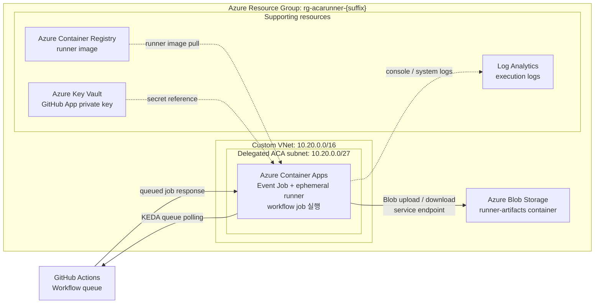

# Azure Container Apps GitHub Actions Runner 워크숍

> Azure Portal Cloud Shell Bash와 GitHub 웹 UI로 `Private repository` 전용 **repository-scoped ephemeral runner**를 구성하는 **약 150분** 핸즈온 워크숍입니다. Azure Container Apps Event Job과 KEDA의 **0 → N → 0** 확장, 병렬 workflow, Log Analytics, Managed Identity 기반 Blob 배포와 cleanup을 순서대로 실습합니다.

---

## 두 GitHub 저장소 구분

| Repository | 역할 | 생성 주체 | 사용 위치 |
|---|---|---|---|
| `aca-github-runner-workshop-private` | 워크숍 문서, runner source, samples, tests | 워크숍 운영자 | source clone, 문서 확인, runner image 빌드 |
| `aca-runner-lab` | 참가자 소유 Private lab repository | 참가자(Module 01) | workflow queue, KEDA 감시, ephemeral runner 등록 |

이 워크숍은 Fine-grained PAT를 사용하지 않습니다. GitHub App installation token으로 runner registration 및 removal token을 발급하며, private key PEM은 Azure Key Vault secret reference를 통해 ACA Job에 전달합니다. 이 구분은 [Module 01](docs/01-prerequisites-github.md)에서 자세히 설명합니다.

---

## 아키텍처

실선은 workflow와 Blob data-plane의 주 실행 흐름이고, 점선은 runner image, secret, log를 제공하는 보조 리소스 연결입니다.

이 워크숍의 네트워크 계약은 다음과 같습니다.

- **Custom VNet 통합 ACA Environment**는 External 타입으로 배포되지만 runner Job은 inbound endpoint를 노출하지 않습니다.
- **ACA Event Job은 ingress를 지원하지 않습니다.** 따라서 External Environment를 사용해도 Job에 public URL이나 participant-facing ingress가 생기지 않습니다.
- Storage와 Key Vault의 표준 DNS 이름은 public service IP로 해석됩니다.
- public service endpoint는 유지되지만 `defaultAction=Deny`, `bypass=None`, ACA subnet rule로 data-plane 접근을 제한합니다.
- service endpoint는 Private Link가 아니며 private IP를 만들지 않습니다.
- runner UAMI에는 Storage account scope의 **Storage Blob Data Contributor**와 Key Vault scope의 **Key Vault Secrets User** 역할만 부여합니다.
- KEDA scaler와 runner bootstrap은 organization-owned GitHub App의 App ID·Installation ID를 사용하고, private key는 Key Vault secret reference(`keyvaultref:`)로 전달합니다.
- GitHub, ARM, Entra ID, Azure Monitor와 Basic ACR은 public outbound를 사용합니다.
- 이 워크숍에는 Storage/Key Vault Private Link, Private DNS, ACR Private Endpoint, UDR, NSG, Azure Firewall, forced tunneling, NAT Gateway, VNet-isolated Cloud Shell이 포함되지 않으며 모두 production extension입니다.

이 워크숍의 코어 설정은 다음 값으로 고정합니다.

- Runner scope: `repo`
- Labels: `aca-runner`
- `min-executions=0`
- `max-executions=5`
- `polling-interval=30`
- `targetWorkflowQueueLength=1`
- `noDefaultLabels=true`

---

## 학습 목표

이 워크숍을 완료하면 다음을 할 수 있습니다.

1. GitHub와 Azure 실습 준비를 Cloud Shell 기준으로 점검할 수 있습니다.
2. organization-owned GitHub App을 설치하고, GitHub App installation token 흐름과 trusted workflow 경계를 이해할 수 있습니다.
3. root wrapper/non-root runner 구조와 권한 제한이 적용된 self-hosted runner image를 빌드할 수 있습니다.
4. Custom VNet 통합 ACA Environment, Storage·Key Vault service endpoint와 runtime RBAC 기반 Azure Container Apps Event Job foundation을 배포할 수 있습니다.
5. KEDA `github-runner` scaler를 GitHub App metadata와 Key Vault secret reference로 구성할 수 있습니다.
6. 네 개의 병렬 workflow Job으로 scale-out 동작을 검증할 수 있습니다.
7. Log Analytics와 CLI로 로그를 확인하고 트러블슈팅할 수 있습니다.
8. Custom VNet에 통합된 ACA Job에서 VNet 제한 Blob에 artifact를 배포하고, Managed Identity data-plane RBAC·upload/download checksum을 검증할 수 있습니다.
9. 실습 리소스를 정리하고 보안·제약 사항을 점검할 수 있습니다.

---

## 사전 요구사항

| 항목 | 설명 |
|------|------|
| Azure Contributor | 실습용 Azure 리소스를 만들고 관리할 수 있어야 합니다. |
| Azure RBAC 역할 할당 권한 | workshop Resource Group 또는 상위 범위에서 `Microsoft.Authorization/roleAssignments/write`가 필요합니다. ACR 범위의 `AcrPull`, Storage account 범위의 `Storage Blob Data Contributor`, Key Vault 범위의 `Key Vault Secrets User`를 모두 할당할 수 있어야 합니다. |
| Azure Portal Cloud Shell Bash | 모든 필수 명령은 Cloud Shell에서 실행합니다. Module 01에서는 **Manage files → Upload**로 PEM을 일시적으로 올리고 Key Vault 저장 직후 자동 삭제합니다. |
| GitHub account | GitHub Actions와 self-hosted runner 등록에 사용할 계정이 필요합니다. |
| GitHub organization owner 권한 | organization-owned GitHub App을 만들고 설치하려면 organization owner 권한이 필요합니다. |
| Private repository 권한 | 새 `Private repository`를 만들거나 실습용 저장소에 접근할 수 있어야 합니다. |
| 워크숍 source 접근 | Public workshop source repository에 HTTPS로 접근할 수 있어야 합니다. |
| Lab repository | 참가자 소유 Private `aca-runner-lab` repository를 만들거나 사용할 수 있어야 합니다. |
| 기본 지식 | Azure 리소스 그룹, 컨테이너 image, GitHub Actions 기본 흐름을 알고 있으면 수월합니다. |

> ⚠️ **주의**
> - 이 실습은 **Private repository에서만** 진행합니다. Public repository에 self-hosted runner를 연결하면 신뢰하지 않는 코드가 실행될 수 있습니다.
> - base image에는 Docker CLI와 buildx가 포함되지만 ACA Jobs에는 Docker daemon과 socket이 없습니다. 따라서 **Docker-in-Docker**, `docker build`, Docker service container 의존 단계는 동작하지 않습니다.
> - runner는 `sudo`와 `docker` 그룹에서 제거되며 entrypoint는 root 소유의 읽기·실행 전용 파일로 보호됩니다. GitHub App installation token은 workflow가 시작되기 전에 단기 registration/removal token으로 교환한 뒤 제거합니다.
> - untrusted fork PR은 이 워크숍의 **trusted workflow** 경계를 벗어나므로 절대 실행하지 않습니다.

---

## 진행 전 확인

- Cloud Shell에서 VNet 제한 Blob에 직접 접근할 때 발생하는 `403`은 예상된 결과입니다. Module 06에서 runner의 upload/download와 checksum 성공 여부를 확인합니다.
- Module 04의 Key Vault secret reference는 workshop delivery 전에 운영자가 live rehearsal로 검증해야 합니다. 실패하면 firewall을 완화하거나 fallback을 추가하지 말고 환경별 platform path를 조사합니다.
- GitHub App installation 또는 권한 변경은 organization 보안 정책에 따라 owner 승인 또는 재승인이 필요할 수 있습니다.
- 리소스 그룹 삭제 요청은 전체 150분에 포함되지만 ACA managed environment 삭제는 워크숍 종료 후까지 이어질 수 있습니다.

---

## 모듈 목차

필수 경로는 Module 01 → 07 순서로 진행합니다. Module 06의 VNet 제한 Blob 배포와 결과 확인까지 완료한 뒤 Module 07에서 보안 검토와 cleanup을 수행합니다.

| # | 모듈 | 한 줄 설명 | 시간 |
|---|------|------------|---:|
| 00 | (현재 문서) | 전체 개요, 아키텍처, 목표, 비용, 이동 경로 | 5분 |
| 01 | [GitHub 사전 준비](docs/01-prerequisites-github.md) | GitHub App 설치, Azure Portal Cloud Shell file upload와 installation 범위 검증 | 30분 |
| 02 | [Azure 기반 리소스 준비](docs/02-azure-foundation.md) | Custom VNet ACA Environment, Storage·Key Vault service endpoint와 runtime RBAC | 30분 |
| 03 | [Runner image 빌드](docs/03-runner-image.md) | root wrapper·non-root runner, App key 배포·권한 제한과 ACR image 빌드 | 15분 |
| 04 | [Event Job + KEDA 구성](docs/04-event-job-keda.md) | GitHub App scaler metadata·auth, Key Vault secret reference와 Event Job 배포 | 15분 |
| 05 | [병렬 실행과 스케일 검증](docs/05-parallel-scale-validation.md) | matrix 4개 Job의 `0 → N → 0`과 `JobName` 기반 Log Analytics 검증 | 20분 |
| 06 | [VNet 제한 Blob 배포와 결과 확인](docs/06-azure-sample-deployment.md) | control-plane 사전 확인과 Managed Identity 기반 Blob checksum 검증 | 20분 |
| 07 | [보안·제약·정리](docs/07-security-limitations-cleanup.md) | trusted private workflow 경계, App 제거, 보안 검토와 확인된 cleanup | 15분 |
|  | **워크숍 합계** |  | **150분** |

Module 05는 로그 수집이 늦을 때 최대 10분 동안 30초 간격으로 실제 유입을 확인합니다.

---

## 세션이 끊겼을 때

Cloud Shell의 shell 변수는 새 세션에 유지되지 않습니다. 기존 리소스로 계속 진행하려면 원래 `SUFFIX`, 실제 `ACR` 이름, 원래 subscription ID를 보관해야 합니다. Module 06을 이어가려면 저장해 둔 실제 Storage account 이름과 subscription ID도 필요할 수 있습니다.

Modules 03~07에는 `0. 세션 재연결 시 변수 복구 (선택)` 영역이 있습니다. 복구가 필요할 때만 접힌 상세 내용을 펼쳐 명령을 실행하세요. 기존 실습을 이어갈 때는 새 suffix를 만들지 마세요. 새 이름은 이미 만든 리소스와 연결되지 않습니다. Module 06 완료 후 Module 07 cleanup도 반드시 수행합니다.

---

## 비용 개요

> 실습이 끝나면 반드시 [docs/07-security-limitations-cleanup.md](docs/07-security-limitations-cleanup.md) 모듈의 정리 절차를 수행하세요. 정확한 통화 금액은 구독, 리전, 실행 시간, 로그 수집량에 따라 달라지므로 이 문서에서는 고정 비용을 약속하지 않습니다.

| 리소스 | 과금 기준 | 실습 관점 메모 |
|--------|-----------|----------------|
| ACA Consumption Event Job | Job execution 동안의 vCPU/메모리 사용 시간 | queued Job이 없을 때는 `min-executions=0`으로 active execution이 없습니다. |
| Azure Container Registry Basic | 저장 용량 + build 실행 시간 | runner image 보관과 `az acr build` 사용량이 포함됩니다. |
| Custom VNet | VNet과 delegated subnet 리소스 사용량 | ACA Environment와 service endpoint가 붙는 subnet 하나를 사용합니다. |
| Virtual network service endpoint | 추가 요금 없음 | Storage와 Key Vault는 ACA subnet의 service endpoint와 firewall rule로 제한합니다. |
| Azure Storage Standard LRS | 저장 용량 + 트랜잭션 | artifact container와 checksum 검증에 사용됩니다. |
| Azure Key Vault | Key Vault 리소스 사용량 + secret 버전 저장 | GitHub App private key PEM을 secret으로 보관합니다. |
| Log Analytics | 로그 수집량(ingestion) | 실습 로그 확인에 필요하며, 오래 보관할수록 추가 비용이 늘 수 있습니다. |

> 이 워크숍 비용 표에는 **Storage/Key Vault Private Link**, **Private DNS**, **ACR Private Endpoint**, **Azure Firewall**, NAT Gateway, 사용자 지정 UDR/NSG 같은 production 확장 리소스가 포함되지 않습니다. 워크숍은 service endpoint + firewall rule을 사용하고, 그 외 runner 운영 경로는 public outbound를 유지합니다.

---

## 태깅 범례

이 워크숍의 모든 문서는 아래 태그를 공통으로 사용합니다.

| 태그 | 의미 |
|------|------|
| 🟢 **실행** | 참가자가 직접 입력하거나 수행해야 하는 단계 |
| 👁️ **설명** | 개념 설명 또는 읽기 전용 안내 |
| 📋 **예상 출력** | 실행 결과와 비교할 기준 출력 |
| ⚠️ **주의** | 보안, 비용, 제약 사항 안내 |

---

## 트러블슈팅 색인

| 단계 | 주요 증상 | 바로 가기 |
|------|-----------|-----------|
| Module 01 | source clone, GitHub App 생성·설치, JWT 또는 PEM 저장 실패 | [GitHub 사전 준비 트러블슈팅](docs/01-prerequisites-github.md#트러블슈팅) |
| Module 02 | ACR·Storage·Key Vault 이름 충돌, 권한 또는 foundation 배포 실패 | [Azure 기반 리소스 트러블슈팅](docs/02-azure-foundation.md#트러블슈팅) |
| Module 03 | runner 정적 검사, ACR Tasks build 또는 image 검증 실패 | [Runner image 트러블슈팅](docs/03-runner-image.md#트러블슈팅) |
| Module 04 | workflow queued, KEDA·secret reference·registration 또는 image pull 실패 | [Event Job + KEDA 트러블슈팅](docs/04-event-job-keda.md#트러블슈팅) |
| Module 05 | execution timeout, runner 로그 누락 또는 scale-in 확인 실패 | [병렬 실행 트러블슈팅](docs/05-parallel-scale-validation.md#트러블슈팅) |
| Module 06 | Blob `403`·timeout, RBAC 오류 또는 checksum 실패 | [Blob 배포 트러블슈팅](docs/06-azure-sample-deployment.md#트러블슈팅) |
| Module 07 | Docker 제약, runner 잔존 또는 Azure cleanup 지연·실패 | [보안·정리 트러블슈팅](docs/07-security-limitations-cleanup.md#트러블슈팅) |

---

## 참고 자료

- [Tutorial: Run GitHub Actions runners with Azure Container Apps jobs](https://learn.microsoft.com/azure/container-apps/tutorial-ci-cd-runners-jobs?pivots=container-apps-jobs-self-hosted-ci-cd-github-actions)
- [Jobs in Azure Container Apps](https://learn.microsoft.com/azure/container-apps/jobs)
- [Azure Container Apps networking](https://learn.microsoft.com/azure/container-apps/networking)
- [Virtual network configuration in Azure Container Apps environment](https://learn.microsoft.com/azure/container-apps/custom-virtual-networks)
- [Azure Storage network security](https://learn.microsoft.com/azure/storage/common/storage-network-security)
- [Virtual network service endpoints for Azure Storage](https://learn.microsoft.com/azure/storage/common/storage-network-security?tabs=azure-portal#grant-access-from-a-virtual-network)
- [Network security for Azure Key Vault](https://learn.microsoft.com/azure/key-vault/general/network-security)
- [Assign an Azure role for blob data access](https://learn.microsoft.com/azure/storage/blobs/assign-azure-role-data-access)
- [KEDA GitHub Runner scaler](https://keda.sh/docs/latest/scalers/github-runner/)
- [Security hardening for GitHub Actions — hardening for self-hosted runners](https://docs.github.com/en/actions/security-for-github-actions/security-guides/security-hardening-for-self-hosted-runners)
