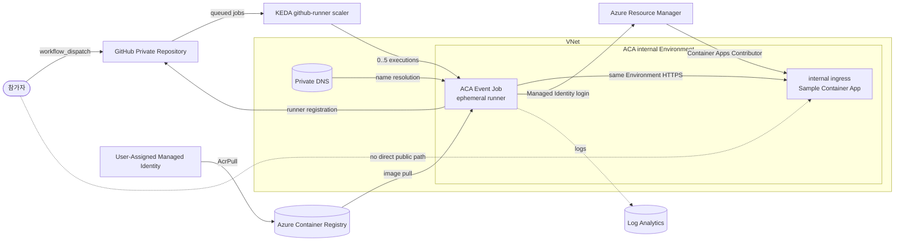

# Azure Container Apps GitHub Actions Runner 워크숍

> Azure Cloud Shell Bash와 GitHub 웹 UI를 사용해 **약 120분** 안에 `Private repository` 전용 **repository-scoped ephemeral runner**를 만들고, Azure Container Apps Event Job과 KEDA `github-runner` scaler로 **0 → N → 0** active executions를 관찰하는 핸즈온 워크숍입니다. 참가자는 runner image 빌드, **VNet 통합 internal Environment**와 **Private DNS** 기반 Event Job 배포, 병렬 workflow와 Log Analytics 검증, Managed Identity 기반 internal ingress 샘플 배포, 리소스 정리까지 한 흐름으로 완료합니다.

---

## 빠른 시작

1. Azure Portal에서 **Cloud Shell Bash**를 엽니다.
2. 다음 명령으로 Public workshop source를 고정 경로에 clone합니다. Public workshop source는 GitHub CLI 로그인 없이 clone할 수 있습니다.

```bash
git clone https://github.com/freeman9844/aca-github-runner-workshop-private.git ~/aca-github-runner-workshop
cd ~/aca-github-runner-workshop
```

3. [Module 01: GitHub 사전 준비](docs/01-prerequisites-github.md)를 엽니다. 위 Quick Start에서 clone했으므로 Module 01의 4단계는 이미 완료되었으며 반드시 건너뜁니다. 그 외 Module 01 단계와 Module 02~07은 순서대로 모두 진행합니다. Module 07은 필수 cleanup입니다.

상세 변수 설정, 예상 출력, 오류 해결 명령은 각 모듈에서 안내합니다.

---

## 두 GitHub 저장소 구분

| Repository | 역할 | 생성 주체 | 사용 위치 |
|---|---|---|---|
| `aca-github-runner-workshop-private` | 워크숍 문서, runner source, samples, tests | 워크숍 운영자 | source clone, 문서 확인, runner image 빌드 |
| `aca-runner-lab` | 참가자 소유 Private lab repository | 참가자(Module 01) | workflow queue, KEDA 감시, ephemeral runner 등록 |

Fine-grained PAT는 워크숍 소스 저장소가 아니라 `aca-runner-lab`에만 scope합니다.
워크숍은 Fine-grained PAT를 사용하지만 실제 운영 환경에서는 단기 installation token을 사용하는 GitHub App 방식을 권장합니다. 이 구분은 [Module 01](docs/01-prerequisites-github.md)에서 자세히 설명합니다.

---

## 아키텍처



이 워크숍의 네트워크 계약은 다음과 같습니다.

- Task 1에서 만든 ACA Environment의 `network type`은 internal이며 생성 후 바꿀 수 없습니다.
- internal Environment는 inbound를 제한하지만 outbound 인터넷을 끄지 않습니다. 따라서 워크숍 runner와 KEDA는 public outbound로 GitHub API, ACR, Azure identity, ARM, Azure Monitor에 도달합니다.
- sample app의 internal-ingress FQDN은 same Environment runner에서만 직접 검증합니다.
- standard Cloud Shell은 sample app의 internal-ingress FQDN에 직접 도달하지 못합니다.
- 이 워크숍에는 ACR Private Endpoint, UDR, NSG, Azure Firewall, forced tunneling, VNet-isolated Cloud Shell, NAT Gateway가 포함되지 않으며 모두 production extension입니다.

이 워크숍의 코어 설정은 다음 값으로 고정합니다.

- Runner scope: `repo`
- Labels: `aca-runner`
- `min-executions=0`
- `max-executions=5`
- `polling-interval=30`
- `targetWorkflowQueueLength=1`
- `noDefaultLabels=true`

---

## 학습 목표

이 워크숍을 완료하면 다음을 할 수 있습니다.

1. GitHub와 Azure 실습 준비를 Cloud Shell 기준으로 점검할 수 있다.
2. PAT 격리, non-root 실행, 권한 제한이 적용된 self-hosted runner image를 이해하고 빌드할 수 있다.
3. VNet 통합 internal Environment와 Private DNS 기반 Azure Container Apps Event Job을 배포할 수 있다.
4. KEDA `github-runner` scaler를 repository 범위로 구성할 수 있다.
5. 네 개의 병렬 workflow Job으로 scale-out 동작을 검증할 수 있다.
6. Log Analytics와 CLI로 로그를 확인하고 트러블슈팅할 수 있다.
7. Module 06에서 Managed Identity 로그인으로 internal ingress 샘플 Container App을 배포하고 same Environment runner 경로에서 HTTPS 결과를 검증할 수 있다.
8. 실습 리소스를 정리하고 보안·제약 사항을 점검할 수 있다.

---

## 사전 요구사항

| 항목 | 설명 |
|------|------|
| Azure Contributor | 실습용 Azure 리소스를 만들고 관리할 수 있어야 합니다. |
| Azure RBAC 역할 할당 권한 | workshop Resource Group 또는 상위 범위에서 `Microsoft.Authorization/roleAssignments/write`가 필요합니다. ACR 범위의 `AcrPull`과 Resource Group 범위의 `Container Apps Contributor`를 모두 할당할 수 있어야 합니다. |
| Cloud Shell Bash | 모든 필수 단계는 Azure Cloud Shell Bash 기준으로 진행합니다. |
| GitHub account | GitHub Actions와 self-hosted runner 등록에 사용할 계정이 필요합니다. |
| Private repository 권한 | 새 `Private repository`를 만들거나 실습용 저장소에 접근할 수 있어야 합니다. |
| Fine-grained PAT 생성·승인 | lab repository만 선택한 Fine-grained PAT를 만들 수 있어야 하며, organization 정책이 요구하면 승인을 받아야 합니다. |
| 워크숍 source 접근 | Public workshop source repository에 HTTPS로 접근할 수 있어야 합니다. |
| Lab repository | 참가자 소유 Private `aca-runner-lab` repository를 만들거나 사용할 수 있어야 합니다. |
| 기본 지식 | Azure 리소스 그룹, 컨테이너 image, GitHub Actions 기본 흐름을 알고 있으면 수월합니다. |

> Enterprise Managed User 또는 organization 정책에 따라 Fine-grained PAT 승인이 필요할 수 있습니다. Azure 리소스 생성 권한과 `Microsoft.Authorization/roleAssignments/write` 권한은 별도 요구사항입니다.

> ⚠️ **주의**
> - 이 실습은 **Private repository에서만** 진행합니다. Public repository에 self-hosted runner를 연결하면 신뢰하지 않는 코드가 실행될 수 있습니다.
> - base image에는 Docker CLI와 buildx가 포함되지만 ACA Jobs에는 Docker daemon과 socket이 없습니다. 따라서 **Docker-in-Docker**, `docker build`, Docker service container 의존 단계는 동작하지 않습니다.
> - runner는 `sudo`와 `docker` 그룹에서 제거되며 entrypoint는 root 소유의 읽기·실행 전용 파일로 보호됩니다. PAT는 workflow가 시작되기 전에 단기 registration/removal token으로 교환한 뒤 제거합니다.

---

## 모듈 목차

필수 경로는 Module 01 → 07 순서로 진행합니다. Module 06의 Azure 샘플 배포와 결과 확인까지 완료한 뒤 Module 07에서 보안 검토와 cleanup을 수행합니다.

| # | 모듈 | 한 줄 설명 | 시간 |
|---|------|------------|---:|
| 00 | (현재 문서) | 전체 개요, 아키텍처, 목표, 비용, 이동 경로 | 5분 |
| 01 | [GitHub 사전 준비](docs/01-prerequisites-github.md) | private lab repository, Fine-grained PAT 실습과 운영용 GitHub App 권장 사항 | 15분 |
| 02 | [Azure 기반 리소스 준비](docs/02-azure-foundation.md) | VNet 통합 internal Environment, Private DNS, 저장한 `SUFFIX`, 실제 `ACR` 이름, 원래 subscription ID | 25분 |
| 03 | [Runner image 빌드](docs/03-runner-image.md) | PAT 격리와 권한 제한을 적용해 ACR에 빌드한 runner image | 10분 |
| 04 | [Event Job + KEDA 구성](docs/04-event-job-keda.md) | repository-scoped ACA Event Job과 KEDA rule | 15분 |
| 05 | [병렬 실행과 스케일 검증](docs/05-parallel-scale-validation.md) | matrix 4개 Job과 `0 → N → 0` 증거 | 20분 |
| 06 | [Azure 샘플 배포와 결과 확인](docs/06-azure-sample-deployment.md) | Managed Identity 기반 internal ingress sample app과 runner-internal HTTPS verification | 20분 |
| 07 | [보안·제약·정리](docs/07-security-limitations-cleanup.md) | 보안 검토와 확인된 cleanup | 10분 |
|  | **워크숍 합계** |  | **120분** |

---

## 세션이 끊겼을 때

Cloud Shell의 shell 변수는 새 세션에 유지되지 않습니다. 기존 리소스로 계속 진행하려면 원래 `SUFFIX`, 실제 `ACR` 이름, 원래 subscription ID를 보관해야 합니다. Module 06을 이어가려면 저장해 둔 원래 subscription ID가 필요합니다.

Modules 03~07에는 `0. 세션 재연결 시 변수 복구 (선택)` 영역이 있습니다. 복구가 필요할 때만 접힌 상세 내용을 펼쳐 명령을 실행하세요. 기존 실습을 이어갈 때는 새 suffix를 만들지 마세요. 새 이름은 이미 만든 리소스와 연결되지 않습니다. Module 06 완료 후 Module 07 cleanup도 반드시 수행합니다.

---

## 완료 기준

- [ ] ACR에 runner image tag가 존재합니다.
- [ ] ACA Event Job이 예상한 image와 repository-scoped KEDA rule을 사용합니다.
- [ ] matrix 4개 Job이 모두 성공합니다.
- [ ] active execution이 `0 → N → 0`으로 돌아옵니다.
- [ ] runner lifecycle marker가 CLI 또는 Log Analytics에 나타납니다.
- [ ] self-hosted runner가 Managed Identity로 Azure Container App을 배포합니다.
- [ ] ACA Environment가 internal 상태입니다.
- [ ] sample Container App이 `externalIngress=false` 상태입니다.
- [ ] same Environment runner에서 runner-internal HTTP success와 HTTPS 검증이 확인됩니다.
- [ ] standard Cloud Shell은 sample app의 internal-ingress FQDN에 직접 도달하지 못합니다.
- [ ] GitHub에 permanent online ephemeral runner가 남지 않습니다.
- [ ] Azure cleanup 후 조회 결과가 `ResourceGroupNotFound`에 도달합니다.
- [ ] 안내에 따라 lab Fine-grained PAT와 GitHub lab artifact를 정리합니다.

---

## 시간표

| 구간 | 내용 | 예상 시간 |
|------|------|-----------|
| 시작 | 개요 및 실습 범위 확인 | 5분 |
| 1부 | GitHub 준비 + Azure 기반 리소스 준비 | 40분 |
| 2부 | runner image 빌드 + Event Job/KEDA 구성 | 25분 |
| 3부 | 병렬 workflow 검증 + 로그 확인 | 20분 |
| 4부 | Azure 샘플 배포 + same Environment HTTPS 확인 | 20분 |
| 마무리 | 보안·제약 정리 + 리소스 삭제 | 10분 |
| 합계 | 전체 워크숍 | 120분 |

> 리소스 그룹 삭제 요청은 120분 일정에 포함되지만, ACA managed environment의
> 비동기 삭제 완료는 워크숍 종료 후까지 이어질 수 있습니다.

> ✅ **검증된 범위와 남은 전제** — 체크인된 자동 검증은 README/문서 계약과 스크립트 인터페이스를 확인합니다.
> 이 저장소는 `koreacentral`, runner `2.336.0`, matrix 4개 Job, 이미지 pull,
> KEDA `0 → 4 → 0` 확장, ephemeral runner 종료, Log Analytics 수집,
> 리소스 그룹 삭제 계약을 기준으로 문서와 스크립트를 유지합니다. same Environment
> private-network 검증은 참가자 구독의 VNet, Private DNS, internal ingress 상태에
> 따라 Module 06 절차를 직접 재실행해야 하며, 이 README는 별도의 라이브 Azure/GitHub
> private-network rehearsal을 주장하지 않습니다. Fine-grained PAT의 organization 승인과 최소 권한 동작은 참가자의 GitHub enterprise/organization 정책에 따라 달라집니다.

---

## 비용 개요

> 실습이 끝나면 반드시 [docs/07-security-limitations-cleanup.md](docs/07-security-limitations-cleanup.md) 모듈의 정리 절차를 수행하세요. 정확한 통화 금액은 구독, 리전, 실행 시간, 로그 수집량에 따라 달라지므로 이 문서에서는 고정 비용을 약속하지 않습니다.

| 리소스 | 과금 기준 | 실습 관점 메모 |
|--------|-----------|----------------|
| ACA Consumption Event Job | Job execution 동안의 vCPU/메모리 사용 시간 | queued Job이 없을 때는 `min-executions=0`으로 active execution이 없습니다. |
| Azure Container Registry Basic | 저장 용량 + build 실행 시간 | runner image 보관과 `az acr build` 사용량이 포함됩니다. |
| Virtual Network + Private DNS | VNet, subnet, DNS zone/link 리소스 사용량 | internal Environment inbound 경로를 위해 필요하며, sample app FQDN은 Private DNS에 의존합니다. |
| Log Analytics | 로그 수집량(ingestion) | 실습 로그 확인에 필요하며, 오래 보관할수록 추가 비용이 늘 수 있습니다. |

> 이 워크숍 비용 표에는 **ACR Private Endpoint**, **Azure Firewall**, NAT Gateway, 사용자 지정 UDR/NSG 같은 production 확장 리소스가 포함되지 않습니다. 워크숍은 inbound만 internal로 제한하고 outbound는 public outbound로 유지합니다.

---

## 태깅 범례

이 워크숍의 모든 문서는 아래 태그를 공통으로 사용합니다.

| 태그 | 의미 |
|------|------|
| 🟢 **실행** | 참가자가 직접 입력하거나 수행해야 하는 단계 |
| 👁️ **설명** | 개념 설명 또는 읽기 전용 안내 |
| 📋 **예상 출력** | 실행 결과와 비교할 기준 출력 |
| ⚠️ **주의** | 보안, 비용, 제약 사항 안내 |

---

## 트러블슈팅 색인

| 증상 | 바로 갈 모듈 |
|------|----------------|
| workshop source clone 네트워크·URL 오류 또는 잘못된 clone 경로 | [docs/01-prerequisites-github.md#트러블슈팅](docs/01-prerequisites-github.md#트러블슈팅) |
| Fine-grained PAT가 비어 있거나 만료·미승인 상태이거나 GitHub API가 401/403을 반환함 | [docs/01-prerequisites-github.md#트러블슈팅](docs/01-prerequisites-github.md#트러블슈팅) |
| ACR 이름이 이미 사용 중임 | [docs/02-azure-foundation.md#트러블슈팅](docs/02-azure-foundation.md#트러블슈팅) |
| workflow가 계속 queued 상태로 남음 | [docs/04-event-job-keda.md#트러블슈팅](docs/04-event-job-keda.md#트러블슈팅) |
| image pull 실패 | [docs/02-azure-foundation.md#트러블슈팅](docs/02-azure-foundation.md#트러블슈팅) |
| 동일 repository와 label을 감시하는 Event Job이 이미 있음 | [docs/04-event-job-keda.md#트러블슈팅](docs/04-event-job-keda.md#트러블슈팅) |
| Event Job secret 또는 PAT 오류 | [docs/04-event-job-keda.md#트러블슈팅](docs/04-event-job-keda.md#트러블슈팅) |
| Job execution이 생성되지 않음 | [docs/04-event-job-keda.md#트러블슈팅](docs/04-event-job-keda.md#트러블슈팅) |
| execution timeout 발생 | [docs/05-parallel-scale-validation.md#트러블슈팅](docs/05-parallel-scale-validation.md#트러블슈팅) |
| `AuthorizationFailed` 또는 `HTTP verification failed after`가 배포 workflow에서 발생함 | [docs/06-azure-sample-deployment.md#트러블슈팅](docs/06-azure-sample-deployment.md#트러블슈팅) |
| standard Cloud Shell에서 sample app의 internal-ingress FQDN에 접근할 수 없음 | [docs/06-azure-sample-deployment.md#트러블슈팅](docs/06-azure-sample-deployment.md#트러블슈팅) |
| 사용자 지정 NSG/UDR/Firewall 뒤에 GitHub API·ACR·Azure Monitor 접근이 막힘 | [docs/04-event-job-keda.md#트러블슈팅](docs/04-event-job-keda.md#트러블슈팅) |
| CLI 또는 Log Analytics에서 runner 로그를 찾을 수 없음 | [docs/05-parallel-scale-validation.md#트러블슈팅](docs/05-parallel-scale-validation.md#트러블슈팅) |
| workflow의 Docker 단계가 실패함 | [docs/07-security-limitations-cleanup.md#트러블슈팅](docs/07-security-limitations-cleanup.md#트러블슈팅) |
| runner가 GitHub에 남아 있음 | [docs/07-security-limitations-cleanup.md#트러블슈팅](docs/07-security-limitations-cleanup.md#트러블슈팅) |
| 리소스 삭제가 끝나지 않거나 실패함 | [docs/07-security-limitations-cleanup.md#트러블슈팅](docs/07-security-limitations-cleanup.md#트러블슈팅) |

---

## 참고 자료

- [Running GitHub Actions Runners on Azure Container Apps with KEDA Autoscaling](https://techcommunity.microsoft.com/blog/azureinfrastructureblog/running-github-actions-runners-on-azure-container-apps-with-keda-autoscaling/4512980)
- [Tutorial: Run GitHub Actions runners with Azure Container Apps jobs](https://learn.microsoft.com/azure/container-apps/tutorial-ci-cd-runners-jobs?pivots=container-apps-jobs-self-hosted-ci-cd-github-actions)
- [Jobs in Azure Container Apps](https://learn.microsoft.com/azure/container-apps/jobs)
- [Virtual network configuration in Azure Container Apps environment](https://learn.microsoft.com/azure/container-apps/custom-virtual-networks)
- [Ingress in Azure Container Apps](https://learn.microsoft.com/azure/container-apps/ingress-overview)
- [KEDA GitHub Runner scaler](https://keda.sh/docs/latest/scalers/github-runner/)
- [Security hardening for GitHub Actions — hardening for self-hosted runners](https://docs.github.com/en/actions/security-for-github-actions/security-guides/security-hardening-for-github-actions#hardening-for-self-hosted-runners)
- [참고 문서 스타일: ms-aca-basic-workshop01](https://github.com/freeman9844/ms-aca-basic-workshop01)
