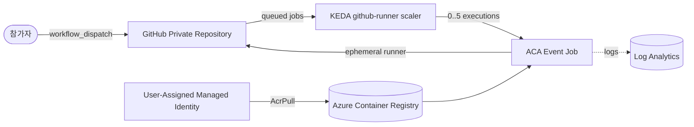

# Azure Container Apps GitHub Actions Runner 워크숍

> Azure Cloud Shell만 사용해 **약 90분** 안에 `Private repository` 전용 **repository-scoped ephemeral runner**를 만들고, Azure Container Apps Event Job과 KEDA `github-runner` scaler로 **0 → N → 0** active executions를 관찰하는 핸즈온 워크숍입니다. 참가자는 runner image 빌드, Event Job 배포, 병렬 workflow 검증, Log Analytics 확인, 리소스 정리까지 한 흐름으로 완료합니다.

---

## 아키텍처

이 워크숍의 코어 설정은 다음 값으로 고정합니다.

- Runner scope: `repo`
- Labels: `aca-runner`
- `min-executions=0`
- `max-executions=5`
- `polling-interval=30`
- `targetWorkflowQueueLength=1`

---

## 학습 목표

이 워크숍을 완료하면 다음을 할 수 있습니다.

1. GitHub와 Azure 실습 준비를 Cloud Shell 기준으로 점검할 수 있다.
2. self-hosted runner image를 이해하고 빌드할 수 있다.
3. Azure Container Apps Event Job을 배포할 수 있다.
4. KEDA `github-runner` scaler를 repository 범위로 구성할 수 있다.
5. 네 개의 병렬 workflow Job으로 scale-out 동작을 검증할 수 있다.
6. Log Analytics와 CLI로 로그를 확인하고 트러블슈팅할 수 있다.
7. 실습 리소스를 정리하고 보안·제약 사항을 점검할 수 있다.

---

## 사전 요구사항

| 항목 | 설명 |
|------|------|
| Azure Contributor | 실습용 Azure 리소스를 만들고 관리할 수 있어야 합니다. |
| Azure RBAC 역할 할당 권한 | ACR 범위에 `AcrPull`을 할당할 수 있도록 `Microsoft.Authorization/roleAssignments/write`가 필요합니다. `Role Based Access Control Administrator`, `User Access Administrator`, `Owner` 등이 해당합니다. |
| Cloud Shell Bash | 모든 필수 단계는 Azure Cloud Shell Bash 기준으로 진행합니다. |
| GitHub account | GitHub Actions와 self-hosted runner 등록에 사용할 계정이 필요합니다. |
| Private repository 권한 | 새 `Private repository`를 만들거나 실습용 저장소에 접근할 수 있어야 합니다. |
| Fine-grained PAT 생성·승인 | lab repository만 선택한 Fine-grained PAT를 만들 수 있어야 하며, organization 정책이 요구하면 승인을 받아야 합니다. |
| 기본 지식 | Azure 리소스 그룹, 컨테이너 image, GitHub Actions 기본 흐름을 알고 있으면 수월합니다. |

> ⚠️ **주의**
> - 이 실습은 **Private repository에서만** 진행합니다. Public repository에 self-hosted runner를 연결하면 신뢰하지 않는 코드가 실행될 수 있습니다.
> - Azure Container Apps Jobs는 **Docker-in-Docker**를 지원하지 않습니다. 따라서 workflow에서 `docker build`, Docker daemon, Docker service container 의존 단계를 사용하지 않습니다.

---

## 모듈 목차

순서대로 진행하세요. 각 모듈의 산출물이 다음 모듈의 입력이 됩니다.

| # | 모듈 | 한 줄 설명 | 시간 |
|---|------|------------|---:|
| 00 | (현재 문서) | 전체 개요, 아키텍처, 목표, 비용, 이동 경로 | 5분 |
| 01 | [GitHub 사전 준비](docs/01-prerequisites-github.md) | Cloud Shell 변수, `Private repository`, Fine-grained PAT 준비 | 15분 |
| 02 | [Azure 기반 리소스 준비](docs/02-azure-foundation.md) | RG, Log Analytics, ACA environment, ACR, UAMI, `AcrPull` 구성 | 15분 |
| 03 | [Runner image 빌드](docs/03-runner-image.md) | runner/entrypoint 이해와 ACR Tasks 빌드 | 10분 |
| 04 | [Event Job + KEDA 구성](docs/04-event-job-keda.md) | ACA Event Job, secret, KEDA `github-runner` rule 설정 | 15분 |
| 05 | [병렬 실행과 스케일 검증](docs/05-parallel-scale-validation.md) | matrix 4 Job, 0 → N → 0, GitHub·CLI·로그 확인 | 20분 |
| 06 | [보안·제약·정리](docs/06-security-limitations-cleanup.md) | 보안 주의사항, 한계, 리소스 삭제와 최종 확인 | 10분 |
|  | **합계** |  | **90분** |

---

## 시간표

| 구간 | 내용 | 예상 시간 |
|------|------|-----------|
| 시작 | 개요 및 실습 범위 확인 | 5분 |
| 1부 | GitHub 준비 + Azure 기반 리소스 준비 | 30분 |
| 2부 | runner image 빌드 + Event Job/KEDA 구성 | 25분 |
| 3부 | 병렬 workflow 검증 + 로그 확인 | 20분 |
| 마무리 | 보안·제약 정리 + 리소스 삭제 | 10분 |
| 합계 | 코어 워크숍 | 90분 |

> 리소스 그룹 삭제 요청은 90분 일정에 포함되지만, ACA managed environment의
> 비동기 삭제 완료는 워크숍 종료 후까지 이어질 수 있습니다.

> ✅ **검증 범위 안내** — 체크인된 자동 검증은 README/문서 계약과 스크립트 인터페이스를 확인합니다.
> 라이브 Azure/GitHub 실행에서 `koreacentral`, runner `2.336.0`, matrix 4개 Job,
> 이미지 pull, KEDA `0 → 4 → 0` 확장, ephemeral runner 종료, Log Analytics 수집,
> 리소스 그룹 삭제를 확인했습니다. 이 실행은 기존 GitHub OAuth credential을
> 사용했으므로 Fine-grained PAT의 최소권한·승인 경로는 아직 별도로 검증하지 않았습니다.

---

## 비용 개요

> 실습이 끝나면 반드시 [docs/06-security-limitations-cleanup.md](docs/06-security-limitations-cleanup.md) 모듈의 정리 절차를 수행하세요. 정확한 통화 금액은 구독, 리전, 실행 시간, 로그 수집량에 따라 달라지므로 이 문서에서는 고정 비용을 약속하지 않습니다.

| 리소스 | 과금 기준 | 실습 관점 메모 |
|--------|-----------|----------------|
| ACA Consumption Event Job | Job execution 동안의 vCPU/메모리 사용 시간 | queued Job이 없을 때는 `min-executions=0`으로 active execution이 없습니다. |
| Azure Container Registry Basic | 저장 용량 + build 실행 시간 | runner image 보관과 `az acr build` 사용량이 포함됩니다. |
| Log Analytics | 로그 수집량(ingestion) | 실습 로그 확인에 필요하며, 오래 보관할수록 추가 비용이 늘 수 있습니다. |

---

## 태깅 범례

이 워크숍의 모든 문서는 아래 태그를 공통으로 사용합니다.

| 태그 | 의미 |
|------|------|
| 🟢 **실행** | 참가자가 직접 입력하거나 수행해야 하는 단계 |
| 👁️ **설명** | 개념 설명 또는 읽기 전용 안내 |
| 📋 **예상 출력** | 실행 결과와 비교할 기준 출력 |
| ⚠️ **주의** | 보안, 비용, 제약 사항 안내 |

---

## 트러블슈팅 색인

| 증상 | 바로 갈 모듈 |
|------|----------------|
| workflow가 계속 queued 상태로 남음 | [docs/04-event-job-keda.md#트러블슈팅](docs/04-event-job-keda.md#트러블슈팅) |
| GitHub API가 401/403을 반환함 | [docs/01-prerequisites-github.md#트러블슈팅](docs/01-prerequisites-github.md#트러블슈팅) |
| image pull 실패 | [docs/02-azure-foundation.md#트러블슈팅](docs/02-azure-foundation.md#트러블슈팅) |
| Job execution이 생성되지 않음 | [docs/04-event-job-keda.md#트러블슈팅](docs/04-event-job-keda.md#트러블슈팅) |
| execution timeout 발생 | [docs/05-parallel-scale-validation.md#트러블슈팅](docs/05-parallel-scale-validation.md#트러블슈팅) |
| workflow의 Docker 단계가 실패함 | [docs/06-security-limitations-cleanup.md#트러블슈팅](docs/06-security-limitations-cleanup.md#트러블슈팅) |
| runner가 GitHub에 남아 있음 | [docs/06-security-limitations-cleanup.md#트러블슈팅](docs/06-security-limitations-cleanup.md#트러블슈팅) |
| 리소스 삭제가 끝나지 않거나 실패함 | [docs/06-security-limitations-cleanup.md#트러블슈팅](docs/06-security-limitations-cleanup.md#트러블슈팅) |

---

## 참고 자료

- [Running GitHub Actions Runners on Azure Container Apps with KEDA Autoscaling](https://techcommunity.microsoft.com/blog/azureinfrastructureblog/running-github-actions-runners-on-azure-container-apps-with-keda-autoscaling/4512980)
- [Tutorial: Run GitHub Actions runners with Azure Container Apps jobs](https://learn.microsoft.com/azure/container-apps/tutorial-ci-cd-runners-jobs?pivots=container-apps-jobs-self-hosted-ci-cd-github-actions)
- [Jobs in Azure Container Apps](https://learn.microsoft.com/azure/container-apps/jobs)
- [KEDA GitHub Runner scaler](https://keda.sh/docs/latest/scalers/github-runner/)
- [Security hardening for GitHub Actions — hardening for self-hosted runners](https://docs.github.com/en/actions/security-for-github-actions/security-guides/security-hardening-for-github-actions#hardening-for-self-hosted-runners)
- [참고 문서 스타일: ms-aca-basic-workshop01](https://github.com/freeman9844/ms-aca-basic-workshop01)
