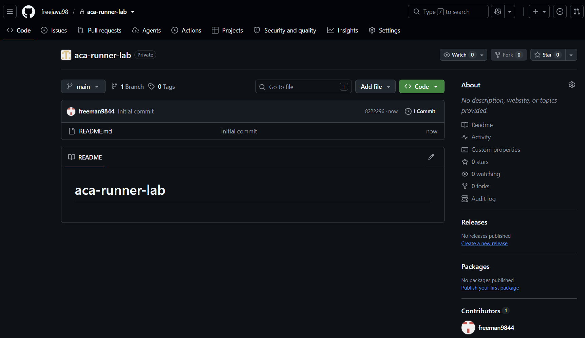
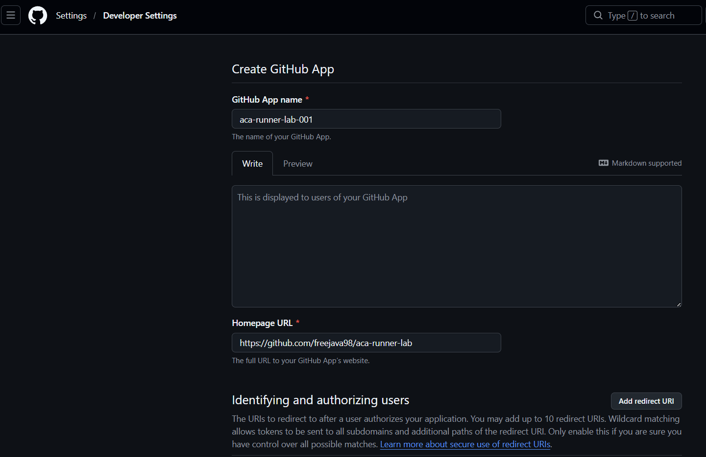
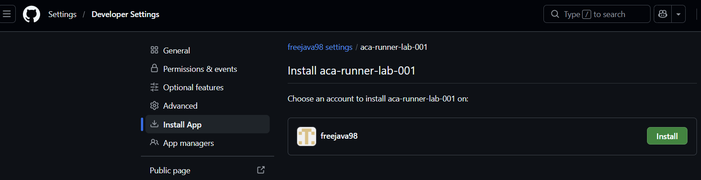
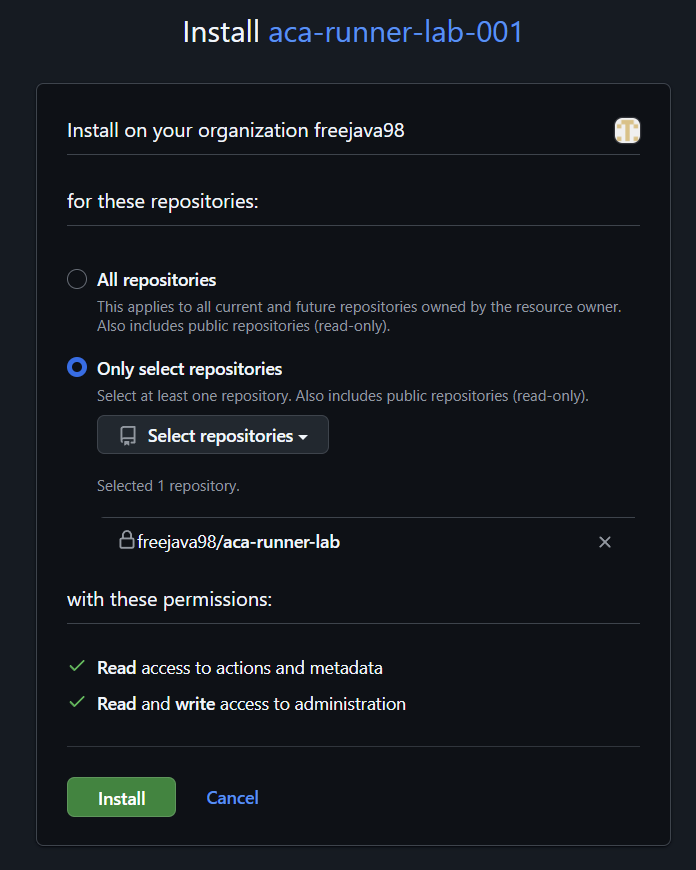

# 01. GitHub 사전 준비

> Azure Cloud Shell Bash에서 구독, 조직이 소유한 GitHub `Private repository`, organization GitHub App 식별자를 준비하고, GitHub App private key를 Azure Key Vault에 업로드한 뒤 Key Vault secret으로 다음 모듈에서 재사용할 App 설치 연결을 검증합니다.

## 목표

이 모듈을 완료하면 다음을 할 수 있습니다.

- Cloud Shell을 Bash와 영구 스토리지로 처음 설정한다.
- Cloud Shell에서 실습에 사용할 Azure 구독을 선택한다.
- Azure Container Apps 관련 CLI extension과 provider 등록 상태를 맞춘다.
- 조직이 소유한 `aca-runner-lab` 이름의 `Private repository`를 준비한다.
- `aca-runner-lab` 하나에만 설치된 organization GitHub App을 준비한다.
- `GITHUB_OWNER`, `GITHUB_REPO`, `GITHUB_APP_ID`, `GITHUB_APP_INSTALLATION_ID`를 Cloud Shell에 안전하게 로드하고, private key PEM 파일은 로컬 워크스테이션에만 보관한다.
- GitHub App private key를 Azure Key Vault에 업로드한다.
- Key Vault에 저장된 private key로 App ID와 Installation ID의 실제 연결을 인증한다.

## 태그 범례

| 태그 | 의미 |
|------|------|
| 🟢 **실행** | 참가자가 직접 입력하거나 수행해야 하는 단계 |
| 👁️ **설명** | 개념 설명 또는 읽기 전용 안내 |
| 📋 **예상 출력** | 실행 결과와 비교할 기준 출력 |
| ⚠️ **주의** | 보안, 비용, 제약 사항 안내 |

## Cloud Shell 최초 준비

Azure Portal에서 Cloud Shell을 처음 실행한다면 **Bash**와 영구 스토리지를
먼저 준비합니다. 스토리지를 연결하면 Cloud Shell 세션이 다시 만들어져도
홈 디렉터리에 clone한 워크숍 파일을 유지할 수 있습니다.

⚠️ **주의**

이 워크숍에서는 **Mount storage account**를 권장합니다.
**No storage account required**는 ephemeral session을 사용하므로 Cloud Shell
세션이 종료되면 clone한 파일이 유지되지 않을 수 있습니다.

1. [Azure Portal](https://portal.azure.com) 상단의 Cloud Shell(`>_`) 아이콘을
   선택하고 **Bash**를 선택합니다.

   

2. **Getting started** 화면에서 **Mount storage account**를 선택합니다.
   **Storage account subscription**에서 실습에 사용할 구독을 선택한 뒤
   **Apply**를 선택합니다.

   

3. **Mount storage account** 화면에서
   **We will create a storage account for you**를 선택하고 **Next**를
   선택합니다. 대상 구독에 리소스를 만들 수 있는 권한이 필요합니다.

   

4. `Requesting a Cloud Shell.Succeeded.` 메시지 뒤에 Bash 프롬프트가
   나타나면 준비가 완료된 것입니다.

   

이미 ephemeral session을 선택했다면 Cloud Shell의
**Settings(⚙️) → Reset User Settings**를 선택한 후 Cloud Shell을 다시 열어
위 절차를 진행합니다.

## 1. Cloud Shell에서 Azure 구독 선택

👁️ **설명**

Cloud Shell을 열면 여러 구독이 보일 수 있습니다. 실습 리소스를 만들 구독을 먼저 고정해야 이후 명령이 의도한 구독에 배포됩니다.

🟢 **실행**

```bash
# 사용 가능한 Azure subscription을 확인하고 workshop 리소스를 만들 대상을 선택합니다.
az account list --query "[].{Name:name,SubscriptionId:id,State:state}" -o table
# 이후 모든 Azure CLI 명령이 선택한 subscription을 사용하도록 active context를 바꿉니다.
read -rp "Azure subscription ID: " SUBSCRIPTION_ID
az account set --subscription "$SUBSCRIPTION_ID"
# 잘못된 subscription에 배포하지 않도록 최종 active context를 확인합니다.
az account show --query "{Name:name,SubscriptionId:id,State:state}" -o table
```

📋 **예상 출력**

- 첫 번째 표에는 현재 로그인한 구독 목록이 보입니다.
- 마지막 표에는 방금 선택한 구독 1개만 표시되고 `State`가 `Enabled`여야 합니다.

## 2. Azure CLI extension 및 provider 준비

👁️ **설명**

이 워크숍은 Azure Container Apps Job, Azure Container Registry, Azure Monitor,
Log Analytics뿐 아니라 External ACA Environment용 Virtual Network,
delegated subnet, Blob Private Endpoint, Private DNS, Storage Account, Key Vault를 함께
사용합니다. 따라서 Cloud Shell에서 필요한 extension과 resource provider를
먼저 준비합니다. `Microsoft.Network`는 VNet, subnet, Private Endpoint,
Private DNS를 위해 필요하고, `Microsoft.ContainerService`는 ACA custom VNet
infrastructure provisioning에, `Microsoft.Storage`는 Storage Account와 Blob
Private Endpoint 생성에, `Microsoft.KeyVault`는 GitHub App private key를 보관할 Key Vault 생성에 필요합니다. `--upgrade`를 함께 지정해야 이전 버전의
`containerapp` extension이 이미 설치된 Cloud Shell에서도 워크숍 기준 버전
`0.3.55`로 실제 교체됩니다.

🟢 **실행**

```bash
# ACA 명령 형식을 workshop 기준에 맞추기 위해 containerapp extension 버전을 고정합니다.
az extension add --name containerapp --upgrade --version 0.3.55 --only-show-errors
# VNet, ACA, ACR, Storage, Key Vault, Log Analytics와 diagnostic setting 생성에 필요한 provider를 등록합니다.
az provider register -n Microsoft.Network --wait
az provider register -n Microsoft.App --wait
az provider register -n Microsoft.ContainerService --wait
az provider register -n Microsoft.ContainerRegistry --wait
az provider register -n Microsoft.Storage --wait
az provider register -n Microsoft.KeyVault --wait
az provider register -n Microsoft.OperationalInsights --wait
az provider register -n Microsoft.Insights --wait
```

📋 **예상 출력**

- 여덟 provider 등록 명령과 extension 갱신이 오류 없이 종료됩니다.
- `--wait`를 사용했으므로 provider 상태가 `Registered`가 될 때까지 반환하지 않습니다.
- Storage Account, Private Endpoint 또는 Key Vault 생성에서 `MissingSubscriptionRegistration`이 발생하면 `Microsoft.Storage`와 `Microsoft.KeyVault` 등록 상태를 확인합니다.

## 3. GitHub에서 조직 소유 실습용 `Private repository` 만들기

👁️ **설명**

이 실습은 queued workflow Job을 self-hosted runner가 처리하므로 반드시 `Private repository`에서만 진행합니다. Public repository는 신뢰하지 않는 코드 실행 위험이 있으므로 사용하지 않습니다.

이 모듈의 전제는 **조직이 소유한 `aca-runner-lab` private repository와 해당 조직이 소유한 GitHub App**입니다. 개인 계정 저장소가 아니라 GitHub organization 아래에 lab 저장소를 만들고, 같은 organization에서 App을 생성·설치·삭제할 수 있는 계정을 사용해야 합니다.

`aca-runner-lab`은 미리 존재하는 저장소가 아니라 이 단계에서 참가자가 새로 만드는 **실습용 repository**입니다. 워크숍 문서와 runner 소스가 들어 있는 workshop repository와는 별개의 저장소이며, 이후 workflow 실행, KEDA queue 감시, self-hosted runner 등록 대상은 모두 `aca-runner-lab`입니다.

🟢 **실행**

GitHub 웹 UI에서 organization 아래에 새 저장소를 만들고 아래 값을 사용합니다.

| 설정 | 값 |
|------|----|
| Owner | GitHub organization (`Organization owner` 권한 필요) |
| Repository name | `aca-runner-lab` |
| Visibility | **Private** |
| Initialize this repository with | `README` 파일 생성 |

⚠️ **주의**

- 이 단계는 organization에 App을 설치할 수 있는 계정이 필요합니다. 저장소 생성자에게 최소한 `Organization owner` 또는 동등한 App 관리 권한이 있어야 합니다.
- 실습 중 runner를 연결할 저장소는 이 `Private repository` 하나만 선택하세요.
- 이후 단계에서 `GITHUB_OWNER`에는 organization 이름을 입력합니다.

> **참고 화면:** 아래 이미지는 `freejava98` organization 아래에
> Private `aca-runner-lab` 저장소를 만들고 README로 초기화한 예시입니다.



## 4. 워크숍 소스 저장소 clone

👁️ **설명**

문서, 샘플 workflow, runner 이미지 파일이 들어 있는 워크숍 소스
저장소를 지정된 경로에 clone합니다.

이름에 `private`가 포함되어 있지만 저장소 visibility는 **Public**입니다.
따라서 Public workshop source는 GitHub CLI login 없이 clone할 수 있습니다.

🟢 **실행**

```bash
# public workshop source를 이후 모듈이 기대하는 Cloud Shell 고정 경로에 clone합니다.
git clone https://github.com/freeman9844/aca-github-runner-workshop-private.git ~/aca-github-runner-workshop
# 상대 경로 기반 문서·runner·sample 명령이 동작하도록 clone directory로 이동합니다.
cd ~/aca-github-runner-workshop
ls
```

Public workshop source clone과 organization GitHub App 준비는 서로 다른 흐름입니다.
5단계에서 생성하는 App은 Public source clone에 사용하지 않고, `aca-runner-lab` queue
감시와 runner 등록에만 사용합니다.

📋 **예상 출력**

`ls` 결과에 최소한 다음 항목이 보여야 합니다.

- `README.md`
- `docs`
- `runner`
- `samples`
- `tests`

## 5. 조직 GitHub App 만들기

### 일반 GitHub 무료 계정 사용자의 경우

개인 GitHub Free 계정만 있어도 실습은 가능하지만, 이 워크숍은 개인 계정 저장소가 아니라
**Organization 소유 Private repository**와 **Organization 소유 GitHub App**을 전제로 합니다.

따라서 Organization이 없다면 먼저 무료 Organization을 생성합니다.

1. GitHub 우측 상단 프로필 → **Your organizations** → **New organization**을 선택합니다.
2. 무료 플랜을 선택합니다.
3. Organization 이름을 정합니다. 예: `my-aca-runner-lab`
4. 본인을 Organization owner로 유지합니다.
5. 이후 3단계의 `aca-runner-lab` 저장소를 개인 계정이 아니라 이 Organization 아래에 생성합니다.

이후 GitHub App 생성 시에도 **App owner**를 개인 계정이 아니라 방금 만든 Organization으로 선택해야 합니다.

| 설정 | 값 |
|---|---|
| App owner | 개인 계정이 아닌 GitHub Organization |
| Repository access | Only select repositories |
| Selected repository | `aca-runner-lab` |

⚠️ 개인 계정 아래에 만든 GitHub App 또는 개인 계정 Private repository로 진행하면 이 워크숍의 조직 runner/App 설치 흐름과 맞지 않을 수 있습니다.

👁️ **설명**

이 워크숍은 개인 사용자 토큰 대신 organization GitHub App 설치를 사용합니다.
다음 모듈에서는 Cloud Shell의 비밀이 아닌 식별자와 로컬 워크스테이션에만 남겨 둔
private key PEM 파일을 조합해 installation access token을 발급합니다.

🟢 **실행**

개인 계정 Settings가 아니라 `aca-runner-lab` 저장소를 소유한 organization의
Settings로 이동해야 합니다.

1. GitHub 우측 상단의 프로필 사진을 선택합니다.
2. 프로필 사진 → **Your organizations** → 대상 organization의 **Settings** → **Developer settings** → **GitHub Apps** → **New GitHub App** 순서로 이동합니다.
3. 아래 값을 사용해 organization-owned App을 만듭니다.

개인 계정의 **Settings → Applications → Authorized GitHub Apps** 화면에서는 organization-owned App을 만들 수 없습니다. 이 화면이 보이면 **Your organizations**로 돌아가 대상 organization의 Settings에서 다시 시작하세요.

| 설정 | 값 |
|------|----|
| App owner | `aca-runner-lab` 저장소를 소유한 동일한 organization |
| GitHub App name | `aca-runner-lab-<unique-suffix>` |
| Homepage URL | `https://github.com/<organization>/aca-runner-lab` |
| Callback URL | 비워 둠 |
| Webhook | 비활성화 |
| User authorization callback URL | 비워 둠 |
| Request user authorization (OAuth) | 비활성화 |

다음으로 **Repository permissions**를 정확히 아래 표와 같이 설정합니다.

| Permission | Access |
|---|---|
| Metadata | Read-only |
| Actions | Read-only |
| Administration | Read and write |

그다음 App을 설치할 때 아래 값을 사용합니다.

| 설정 | 값 |
|---|---|
| Install target | `aca-runner-lab` 저장소를 소유한 organization |
| Repository access | **Only select repositories** |
| Selected repository | `aca-runner-lab` |

App 생성이 끝나면 먼저 아래 값을 기록합니다.

1. **App settings** 페이지에서 `App ID`를 기록합니다.
2. **Generate a private key**를 한 번만 실행해 PEM 파일을 다운로드합니다.
3. 다운로드된 PEM 파일의 로컬 경로를 기록하되, 다음 모듈 전까지 Cloud Shell로 복사하지 않습니다.

⚠️ **주의**

- Homepage URL은 반드시 private lab repository URL인 `https://github.com/<organization>/aca-runner-lab`이어야 합니다.
- `Only select repositories`를 유지하고 반드시 `aca-runner-lab` 하나만 선택합니다.
- private key PEM 파일은 로컬 워크스테이션에만 보관하고 Cloud Shell에 업로드하거나 Git에 commit하지 않습니다.
- PEM 파일은 다음 모듈에서 `로컬 Azure CLI` 세션이 JWT 서명에 사용할 비밀입니다.
- PEM 파일의 로컬 경로는 참가자 메모로만 유지하고 Cloud Shell 환경 변수로 추가하지 않습니다.

> **참고 화면:** 아래 이미지는 `freejava98` organization에서
> GitHub App 이름을 `aca-runner-lab-001`, Homepage URL을
> `https://github.com/freejava98/aca-runner-lab`로 입력한 예시입니다.



### GitHub App 설치와 Installation ID 확인

Installation ID는 App을 생성한 시점에는 확인할 수 없으며, 만들어진 GitHub App을 Organization에 설치해야 생성됩니다. 설치 과정에서 App이 접근할 repository도 선택합니다.

1. 생성한 GitHub App의 설정 화면 왼쪽 메뉴에서 **Install App**을 선택합니다.
2. 설치 대상 Organization 옆의 **Install**을 선택합니다.



3. **Repository access**에서 **Only select repositories**를 선택합니다.
4. **Select repositories**에서 `aca-runner-lab` 하나를 선택합니다.
5. 페이지 아래의 **Install**을 선택해 설치를 완료합니다.



설치가 완료되면 브라우저 주소가 `/settings/installations/<installation-id>` 형식으로 표시됩니다. 마지막 숫자가 **Installation ID**이므로 이후 단계에서 사용할 수 있도록 기록합니다.

예를 들어 URL이 `https://github.com/organizations/freejava98/settings/installations/155640565`라면 마지막 숫자인 `155640565`가 Installation ID입니다.

## 6. Cloud Shell 변수로 GitHub App 식별자만 로드

👁️ **설명**

다음 모듈에서는 owner, repository, App ID, Installation ID를 Cloud Shell에서 그대로 재사용합니다.
이 단계에서는 비밀이 아닌 식별자만 입력합니다. PEM 파일 경로와 파일 내용은 Cloud Shell에 복사하지 않습니다.

🟢 **실행**

```bash
# 다음 모듈에서 사용할 GitHub App의 비밀이 아닌 식별자를 입력합니다.
read -rp "GitHub organization: " GITHUB_OWNER
read -rp "Private repository name: " GITHUB_REPO
read -rp "GitHub App ID: " GITHUB_APP_ID
read -rp "GitHub App Installation ID: " GITHUB_APP_INSTALLATION_ID
printf 'GITHUB_OWNER=%s\nGITHUB_REPO=%s\nGITHUB_APP_ID=%s\nGITHUB_APP_INSTALLATION_ID=%s\n' \
  "$GITHUB_OWNER" "$GITHUB_REPO" "$GITHUB_APP_ID" "$GITHUB_APP_INSTALLATION_ID"
```

📋 **예상 출력**

```text
GitHub organization: contoso
Private repository name: aca-runner-lab
GitHub App ID: 1234567
GitHub App Installation ID: 98765432
GITHUB_OWNER=contoso
GITHUB_REPO=aca-runner-lab
GITHUB_APP_ID=1234567
GITHUB_APP_INSTALLATION_ID=98765432
```

- `GITHUB_OWNER`는 개인 계정이 아니라 organization 이름이어야 합니다.
- 이 단계에서는 PEM 원문이나 경로를 출력하지 않습니다.
- 이후 같은 Cloud Shell 세션에서 네 변수를 그대로 재사용할 수 있습니다.

## 7. Key Vault 만들기와 GitHub App private key 업로드

👁️ **설명**

이 단계에서는 Module 01과 이후 Azure 모듈이 함께 사용할 Resource Group, Key Vault,
비밀 이름을 준비합니다. Cloud Shell에서는 공유 Azure 식별자와 Key Vault를 만들고,
방화벽은 로컬 워크스테이션의 public IPv4 CIDR 하나만 허용합니다.

### 7-C. Cloud Shell: Key Vault bootstrap

🟢 **실행**

```bash
# Module 01과 이후 Azure 모듈이 함께 사용할 Resource Group과 Key Vault를 준비합니다.
SUFFIX="${SUFFIX:-$(openssl rand -hex 3)}"
LOC="${LOC:-koreacentral}"
RG="${RG:-rg-acarunner-$SUFFIX}"
KEY_VAULT="${KEY_VAULT:-kvacarunner$SUFFIX}"
GITHUB_APP_KEY_SECRET="${GITHUB_APP_KEY_SECRET:-github-app-private-key}"

az group create \
  --name "$RG" \
  --location "$LOC" \
  --output none

az keyvault create \
  --resource-group "$RG" \
  --name "$KEY_VAULT" \
  --location "$LOC" \
  --enable-rbac-authorization true \
  --retention-days 7 \
  --enable-purge-protection false \
  --public-network-access Enabled \
  --default-action Deny \
  --bypass None \
  --output none

KEY_VAULT_ID=$(az keyvault show \
  --resource-group "$RG" \
  --name "$KEY_VAULT" \
  --query id \
  --output tsv)
KEY_VAULT_BOOTSTRAP_PRINCIPAL_ID=$(az ad signed-in-user show \
  --query id \
  --output tsv)
read -rp "Local workstation public IPv4 CIDR (for example 203.0.113.10/32): " \
  KEY_VAULT_BOOTSTRAP_CIDR

az keyvault network-rule add \
  --name "$KEY_VAULT" \
  --ip-address "$KEY_VAULT_BOOTSTRAP_CIDR" \
  --output none

az role assignment create \
  --assignee-object-id "$KEY_VAULT_BOOTSTRAP_PRINCIPAL_ID" \
  --assignee-principal-type User \
  --role "Key Vault Secrets Officer" \
  --scope "$KEY_VAULT_ID" \
  --output none

printf '다음 값을 저장하세요: SUFFIX=%s RG=%s KEY_VAULT=%s\n' \
  "$SUFFIX" "$RG" "$KEY_VAULT"
printf 'KEY_VAULT_BOOTSTRAP_CIDR=%s\nKEY_VAULT_BOOTSTRAP_PRINCIPAL_ID=%s\n' \
  "$KEY_VAULT_BOOTSTRAP_CIDR" "$KEY_VAULT_BOOTSTRAP_PRINCIPAL_ID"
```

📋 **예상 출력**

```text
Local workstation public IPv4 CIDR (for example 203.0.113.10/32): 203.0.113.10/32
다음 값을 저장하세요: SUFFIX=a1b2c3 RG=rg-acarunner-a1b2c3 KEY_VAULT=kvacarunnera1b2c3
KEY_VAULT_BOOTSTRAP_CIDR=203.0.113.10/32
KEY_VAULT_BOOTSTRAP_PRINCIPAL_ID=11111111-2222-3333-4444-555555555555
```

출력된 값은 모두 참가자 메모에 저장하세요. 같은 Cloud Shell 세션에는 `LOC`,
`GITHUB_APP_KEY_SECRET`, `KEY_VAULT_ID`도 남아 있으므로 Module 02에서 그대로 재사용할 수 있습니다.
`Key Vault Secrets Officer` RBAC 전파에는 최대 2분이 걸릴 수 있습니다.

### 7-L. Local workstation: GitHub App PEM 업로드

🟢 **실행**

```bash
# 로컬 PEM 파일을 화면에 출력하지 않고 Module 01에서 만든 Key Vault에 업로드합니다.
set -euo pipefail
az login
read -rp "Azure subscription ID: " SUBSCRIPTION_ID
read -rp "Key Vault name: " KEY_VAULT
read -rp "GitHub App PEM file path: " GITHUB_APP_PRIVATE_KEY_FILE
GITHUB_APP_KEY_SECRET="github-app-private-key"

az account set --subscription "$SUBSCRIPTION_ID"
test -f "$GITHUB_APP_PRIVATE_KEY_FILE"
chmod 600 "$GITHUB_APP_PRIVATE_KEY_FILE"

az keyvault secret set \
  --vault-name "$KEY_VAULT" \
  --name "$GITHUB_APP_KEY_SECRET" \
  --file "$GITHUB_APP_PRIVATE_KEY_FILE" \
  --encoding utf-8 \
  --query "{id:id,enabled:attributes.enabled}" \
  --output yaml
```

📋 **예상 출력**

```yaml
enabled: true
id: https://kvacarunnera1b2c3.vault.azure.net/secrets/github-app-private-key/0123456789abcdef0123456789abcdef
```

명령은 secret 메타데이터만 출력하며 PEM 원문은 출력하지 않습니다. Module 02에서
private-access 검증이 끝날 때까지 source PEM 파일은 로컬 워크스테이션에 그대로 보관하세요.

## 8. Key Vault secret으로 GitHub App 설치 연결 검증

👁️ **설명**

이 단계는 Key Vault에 업로드한 secret, App ID, Installation ID가 하나의 실제
GitHub App 설치를 가리키는지 확인합니다. 인증에는 **로컬 워크스테이션 Bash**에서
Key Vault로부터 임시 파일로 내려받은 private key만 사용하며 source PEM 파일은 여기서
삭제하지 않습니다.

🟢 **실행**

```bash
# Key Vault에 업로드한 private key로 App ID와 Installation ID의 실제 연결을 검증합니다.
verify_key_vault_app_installation() (
  set -euo pipefail

  local SUBSCRIPTION_ID KEY_VAULT GITHUB_APP_KEY_SECRET
  local GITHUB_APP_ID GITHUB_APP_INSTALLATION_ID
  local TEMP_PRIVATE_KEY_FILE now_epoch payload_json signing_input
  local app_jwt installation_owner required_command

  for required_command in az openssl curl jq; do
    if ! command -v "$required_command" >/dev/null 2>&1; then
      printf 'ERROR: required command not found: %s\n' "$required_command" >&2
      return 1
    fi
  done

  read -rp "Azure subscription ID: " SUBSCRIPTION_ID
  read -rp "Key Vault name: " KEY_VAULT
  read -rp "GitHub App ID: " GITHUB_APP_ID
  read -rp "GitHub App Installation ID: " GITHUB_APP_INSTALLATION_ID
  GITHUB_APP_KEY_SECRET="github-app-private-key"

  if [[ ! "$GITHUB_APP_ID" =~ ^[1-9][0-9]*$ ]] ||
    [[ ! "$GITHUB_APP_INSTALLATION_ID" =~ ^[1-9][0-9]*$ ]]; then
    printf 'ERROR: App ID and Installation ID must be positive integers.\n' >&2
    return 1
  fi

  az account set --subscription "$SUBSCRIPTION_ID"
  TEMP_PRIVATE_KEY_FILE="$(mktemp)"
  cleanup() {
    rm -f -- "$TEMP_PRIVATE_KEY_FILE"
    unset app_jwt
  }
  trap cleanup EXIT

  az keyvault secret download \
    --vault-name "$KEY_VAULT" \
    --name "$GITHUB_APP_KEY_SECRET" \
    --file "$TEMP_PRIVATE_KEY_FILE" \
    --encoding utf-8 \
    --output none
  chmod 600 "$TEMP_PRIVATE_KEY_FILE"

  base64url_encode() {
    openssl base64 -A | tr '+/' '-_' | tr -d '='
  }

  now_epoch="$(date +%s)"
  printf -v payload_json '{"iat":%s,"exp":%s,"iss":%s}' \
    "$((now_epoch - 60))" "$((now_epoch + 540))" "$GITHUB_APP_ID"
  signing_input="$(
    printf '%s' '{"alg":"RS256","typ":"JWT"}' | base64url_encode
  ).$(
    printf '%s' "$payload_json" | base64url_encode
  )"
  app_jwt="${signing_input}.$(
    printf '%s' "$signing_input" |
      openssl dgst -binary -sha256 -sign "$TEMP_PRIVATE_KEY_FILE" |
      base64url_encode
  )"

  if ! installation_owner="$(
    curl -fsSL \
        -H "Accept: application/vnd.github+json" \
        -H "Authorization: ******" \
        -H "X-GitHub-Api-Version: 2022-11-28" \
        "https://api.github.com/app/installations/$GITHUB_APP_INSTALLATION_ID" |
      jq -er --argjson app_id "$GITHUB_APP_ID" \
        'select(.app_id == $app_id) | .account.login'
  )"; then
    printf 'ERROR: Key Vault secret, App ID, or Installation ID does not match.\n' >&2
    return 1
  fi

  printf 'PASS: Key Vault secret으로 App ID와 Installation ID 연결 확인: App %s, Installation %s, Owner %s\n' \
    "$GITHUB_APP_ID" "$GITHUB_APP_INSTALLATION_ID" "$installation_owner"
)

verify_key_vault_app_installation &&
  unset -f verify_key_vault_app_installation
```

📋 **예상 출력**

```text
Azure subscription ID: 00000000-1111-2222-3333-444444444444
Key Vault name: kvacarunnera1b2c3
GitHub App ID: 1234567
GitHub App Installation ID: 155640565
PASS: Key Vault secret으로 App ID와 Installation ID 연결 확인: App 1234567, Installation 155640565, Owner freejava98
```

`PASS`가 출력되면 업로드한 Key Vault secret, App ID, Installation ID가 같은 GitHub App의
실제 설치를 가리킨다는 뜻입니다. `ERROR`가 출력되면 5단계 App settings와 installation URL,
그리고 7-L에서 업로드한 PEM이 모두 같은 App에 속하는지 다시 확인한 후 재실행합니다.


## 트러블슈팅

| 증상 | 주요 원인 | 해결 방법 |
|------|-----------|-----------|
| Public workshop source clone 네트워크 또는 URL 오류 | Cloud Shell의 GitHub 연결이 차단되었거나 clone URL 대신 브라우저 URL을 사용함. | 브라우저에서 `https://github.com/freeman9844/aca-github-runner-workshop-private/tree/master` 접근 여부를 확인합니다. 브라우저의 `/tree/master` URL은 접근 확인용이며 clone URL이 아닙니다. clone에는 `https://github.com/freeman9844/aca-github-runner-workshop-private.git`을 사용합니다. organization 방화벽이나 proxy가 `github.com` HTTPS 연결을 차단한다면 네트워크 정책을 먼저 확인합니다. |
| App 생성 또는 설치 메뉴가 보이지 않음 | 현재 계정에 organization App 생성 권한이 없음 | organization의 `Organization owner` 또는 GitHub App 관리 권한이 있는 계정으로 다시 로그인하거나, 권한을 위임받은 뒤 5단계를 다시 진행합니다. |
| Installation approval pending | organization 정책상 새 App 설치에 승인이 필요함 | organization 관리자가 App 설치를 승인할 때까지 기다린 뒤 설치 상태를 다시 확인합니다. |
| 잘못된 저장소 범위에 App을 설치함 | `Only select repositories` 대신 전체 organization 또는 다른 저장소를 선택함 | App 설치 페이지로 돌아가 `Only select repositories`를 다시 선택하고 `aca-runner-lab` 하나만 남기도록 재설치하거나 설치 범위를 수정합니다. |
| runner registration 단계에서 권한 부족 오류가 발생함 | App에 `Administration` 권한이 `Read and write`로 설정되지 않음 | App의 **Repository permissions**에서 `Administration`을 `Read and write`로 수정한 뒤 설치를 새로 고치고 다음 모듈을 다시 진행합니다. |
| Enterprise Managed User 계정에서 App 설치가 차단됨 | organization 또는 enterprise 정책이 사용자 주도 App 설치를 막음 | 설치 화면에 `Install is prohibited`가 표시되면 organization 관리자에게 App 설치 또는 승인 절차를 요청합니다. |
| App ID 또는 Installation ID가 일치하지 않음 | 다른 organization, 다른 App, 다른 설치 URL을 참고함 | App settings 페이지의 `App ID`와 설치 상세 URL의 `/settings/installations/<installation-id>` 숫자를 다시 확인하고 6단계 입력 블록을 다시 실행합니다. |
| PEM 파일을 Cloud Shell에 올렸거나 저장소에 추가하려고 함 | 비밀 저장 위치를 잘못 선택함 | Cloud Shell 업로드와 commit을 즉시 중단하고, 로컬 워크스테이션에만 새 private key를 다시 생성합니다. 이전 파일은 안전하게 폐기하고 Git staging area와 히스토리에 남지 않았는지 확인합니다. |
| `az keyvault create`가 이름 중복 오류를 반환함 | `KEY_VAULT` 이름은 전역 고유인데 이미 사용 중 | `KEY_VAULT="kvacarunner$(openssl rand -hex 5)"`로 vault 이름만 바꾸고 7-C를 다시 실행한 뒤 실제 이름을 저장합니다. |
| local PEM 업로드 또는 step 8 secret download가 `403 Forbidden`으로 실패함 | workstation CIDR이 다르거나 `Key Vault Secrets Officer` RBAC가 아직 전파되지 않음 | 로컬에서 `curl -s https://ifconfig.me`를 확인하고 firewall CIDR을 수정하거나 최대 2분 기다린 뒤 다시 실행합니다. |
| step 8이 GitHub `401` 또는 `404`로 실패함 | App ID, Installation ID, 또는 Key Vault에 저장된 PEM이 서로 다른 GitHub App에 속함 | 5단계 App settings와 installation URL을 다시 확인하고 같은 App의 PEM을 7-L에서 다시 업로드합니다. |
| Storage Account, Private Endpoint 또는 Key Vault 생성에서 `MissingSubscriptionRegistration`이 발생함 | `Microsoft.Storage` 또는 `Microsoft.KeyVault` provider가 아직 등록되지 않음 | 2단계의 `az provider register -n Microsoft.Storage --wait`와 `az provider register -n Microsoft.KeyVault --wait`를 다시 실행하고 등록 완료 후 다시 시도합니다. |

Key Vault 이름 충돌이 났다면 `SUFFIX`, `RG`, 다른 리소스 이름은 그대로 두고 vault 이름만 바꿉니다.

```bash
# Key Vault 이름 충돌이 발생한 경우 vault 이름만 새 전역 고유 값으로 바꿉니다.
KEY_VAULT="kvacarunner$(openssl rand -hex 5)"
printf '새 Key Vault 이름을 저장하세요: %s\n' "$KEY_VAULT"
```

---

[← 이전: 워크숍 개요](../README.md) | [다음: Azure 기반 리소스 준비 →](02-azure-foundation.md)
