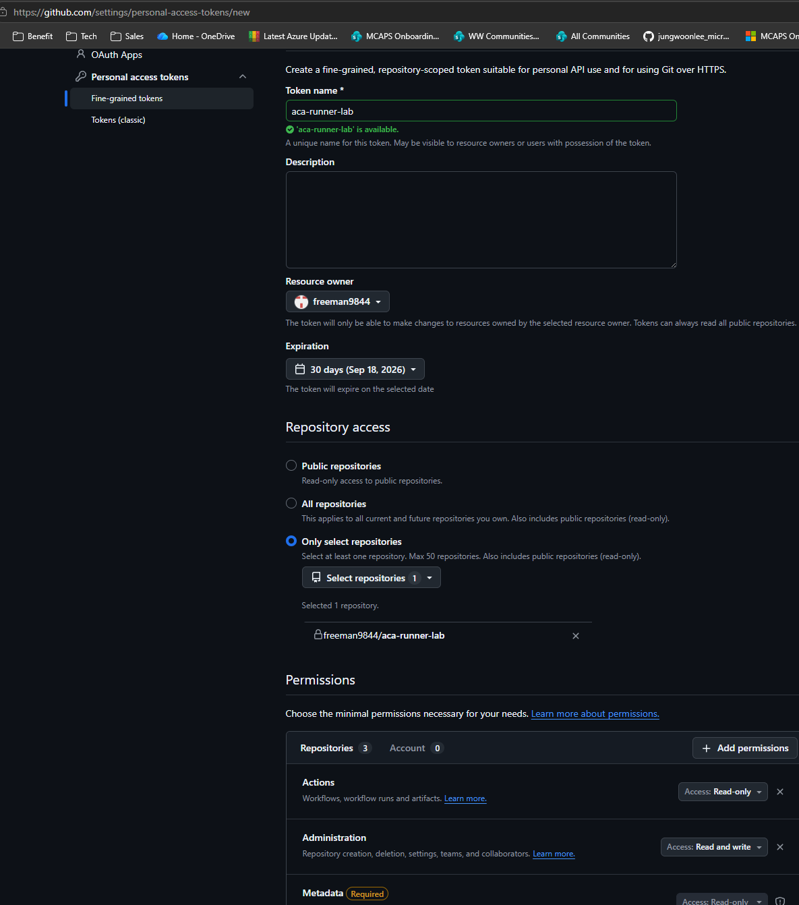

# 01. GitHub 사전 준비

> Azure Cloud Shell Bash에서 구독, GitHub `Private repository`, Fine-grained personal access token을 준비하고 다음 모듈에서 재사용할 `GITHUB_OWNER`, `GITHUB_REPO`, `GITHUB_PAT`를 검증합니다.

## 목표

이 모듈을 완료하면 다음을 할 수 있습니다.

- Cloud Shell을 Bash와 영구 스토리지로 처음 설정한다.
- Cloud Shell에서 실습에 사용할 Azure 구독을 선택한다.
- Azure Container Apps 관련 CLI extension과 provider 등록 상태를 맞춘다.
- `aca-runner-lab` 이름의 `Private repository`를 준비한다.
- `aca-runner-lab`에만 접근 가능한 Fine-grained personal access token을 준비한다.
- `GITHUB_OWNER`, `GITHUB_REPO`, `GITHUB_PAT`를 안전하게 로드하고 GitHub API로 검증한다.

## 태그 범례

| 태그 | 의미 |
|------|------|
| 🟢 **실행** | 참가자가 직접 입력하거나 수행해야 하는 단계 |
| 👁️ **설명** | 개념 설명 또는 읽기 전용 안내 |
| 📋 **예상 출력** | 실행 결과와 비교할 기준 출력 |
| ⚠️ **주의** | 보안, 비용, 제약 사항 안내 |

## Cloud Shell 최초 준비

Azure Portal에서 Cloud Shell을 처음 실행한다면 **Bash**와 영구 스토리지를
먼저 준비합니다. 스토리지를 연결하면 Cloud Shell 세션이 다시 만들어져도
홈 디렉터리에 clone한 워크숍 파일을 유지할 수 있습니다.

⚠️ **주의**

이 워크숍에서는 **Mount storage account**를 권장합니다.
**No storage account required**는 ephemeral session을 사용하므로 Cloud Shell
세션이 종료되면 clone한 파일이 유지되지 않을 수 있습니다.

1. [Azure Portal](https://portal.azure.com) 상단의 Cloud Shell(`>_`) 아이콘을
   선택하고 **Bash**를 선택합니다.

   

2. **Getting started** 화면에서 **Mount storage account**를 선택합니다.
   **Storage account subscription**에서 실습에 사용할 구독을 선택한 뒤
   **Apply**를 선택합니다.

   

3. **Mount storage account** 화면에서
   **We will create a storage account for you**를 선택하고 **Next**를
   선택합니다. 대상 구독에 리소스를 만들 수 있는 권한이 필요합니다.

   

4. `Requesting a Cloud Shell.Succeeded.` 메시지 뒤에 Bash 프롬프트가
   나타나면 준비가 완료된 것입니다.

   

이미 ephemeral session을 선택했다면 Cloud Shell의
**Settings(⚙️) → Reset User Settings**를 선택한 후 Cloud Shell을 다시 열어
위 절차를 진행합니다.

## 1. Cloud Shell에서 Azure 구독 선택

👁️ **설명**

Cloud Shell을 열면 여러 구독이 보일 수 있습니다. 실습 리소스를 만들 구독을 먼저 고정해야 이후 명령이 의도한 구독에 배포됩니다.

🟢 **실행**

```bash
az account list --query "[].{Name:name,SubscriptionId:id,State:state}" -o table
read -rp "Azure subscription ID: " SUBSCRIPTION_ID
az account set --subscription "$SUBSCRIPTION_ID"
az account show --query "{Name:name,SubscriptionId:id,State:state}" -o table
```

📋 **예상 출력**

- 첫 번째 표에는 현재 로그인한 구독 목록이 보입니다.
- 마지막 표에는 방금 선택한 구독 1개만 표시되고 `State`가 `Enabled`여야 합니다.

## 2. Azure CLI extension 및 provider 준비

👁️ **설명**

이 워크숍은 Azure Container Apps Job, Azure Container Registry, Azure Monitor,
Log Analytics를 사용합니다. Cloud Shell에서 필요한 extension과 resource
provider를 먼저 준비합니다.

🟢 **실행**

```bash
az extension add --name containerapp --upgrade --only-show-errors
az provider register -n Microsoft.App --wait
az provider register -n Microsoft.ContainerRegistry --wait
az provider register -n Microsoft.OperationalInsights --wait
az provider register -n Microsoft.Insights --wait
```

📋 **예상 출력**

- 다섯 명령 모두 오류 없이 종료됩니다.
- `--wait`를 사용했으므로 provider 상태가 `Registered`가 될 때까지 반환하지 않습니다.

## 3. GitHub에서 실습용 `Private repository` 만들기

👁️ **설명**

이 실습은 queued workflow Job을 self-hosted runner가 처리하므로 반드시 `Private repository`에서만 진행합니다. Public repository는 신뢰하지 않는 코드 실행 위험이 있으므로 사용하지 않습니다.

`aca-runner-lab`은 미리 존재하는 저장소가 아니라 이 단계에서 참가자가 새로 만드는 **실습용 repository**입니다. 워크숍 문서와 runner 소스가 들어 있는 workshop repository와는 별개의 저장소이며, 이후 workflow 실행, KEDA queue 감시, self-hosted runner 등록 대상은 모두 `aca-runner-lab`입니다.

🟢 **실행**

GitHub 웹 UI에서 새 저장소를 만들고 아래 값을 사용합니다.

| 설정 | 값 |
|------|----|
| Repository name | `aca-runner-lab` |
| Visibility | **Private** |
| Initialize this repository with | `README` 파일 생성 |

⚠️ **주의**

- 실습 저장소는 개인 계정 또는 조직 어느 쪽에 만들어도 되지만, 이후 단계에서 `GITHUB_OWNER`를 직접 입력하므로 특정 owner 이름을 문서에 하드코딩하지 않습니다.
- 실습 중 runner를 연결할 저장소는 이 `Private repository` 하나만 선택하세요.

## 4. 워크숍 소스 저장소 clone

👁️ **설명**

문서, 샘플 workflow, runner 이미지 파일이 들어 있는 워크숍 소스
저장소를 지정된 경로에 clone합니다.

먼저 GitHub CLI의 browser login으로 private source 접근 계정을 인증하고,
HTTPS Git credential helper를 설정합니다.

🟢 **실행**

```bash
gh auth login --hostname github.com --git-protocol https --web
gh auth setup-git
gh auth status --hostname github.com

git clone https://github.com/freeman9844/aca-github-runner-workshop-private.git ~/aca-github-runner-workshop
cd ~/aca-github-runner-workshop
ls
```

워크숍 source 인증과 lab Fine-grained PAT는 서로 다른 용도입니다. 위 GitHub
CLI 인증은 `aca-github-runner-workshop-private`를 clone하기 위한 사용자
credential이고, 5단계의 PAT는 `aca-runner-lab` queue 감시와 runner 등록에만
사용합니다.

📋 **예상 출력**

`ls` 결과에 최소한 다음 항목이 보여야 합니다.

- `README.md`
- `docs`
- `runner`
- `samples`
- `tests`

## 5. Fine-grained PAT 만들기

👁️ **설명**

Fine-grained personal access token (PAT)을 사용해 GitHub App 설치 없이
repository-scoped 인증을 구성합니다.

GitHub에서 **Settings → Developer settings → Personal access tokens →
Fine-grained tokens → Generate new token**으로 이동합니다.

| 항목 | 값 |
|---|---|
| Token name | `aca-runner-lab` |
| Resource owner | `aca-runner-lab`을 소유한 user 또는 organization |
| Expiration | **30 days** |
| Repository access | **Only select repositories** |
| Selected repository | `aca-runner-lab` |

| Permission | Access |
|---|---|
| Actions | Read-only |
| Administration | Read and write |
| Metadata | Read-only |

아래 GitHub 설정 화면처럼 **Only select repositories**에서 실습용
`aca-runner-lab` 저장소만 선택하고, 표에 명시된 최소 권한을 설정합니다.
화면의 Resource owner와 계정 이름은 예시이므로 자신의 GitHub 사용자 또는
organization을 선택하세요.



- Enterprise Managed User는 개인 계정 GitHub App 설치가 금지될 수 있으므로
  이 워크숍은 App 설치를 요구하지 않습니다.
- organization 정책이 Fine-grained PAT 승인을 요구하면 승인 완료 후 다음
  단계로 진행합니다.
- enterprise 정책이 PAT 생성을 금지하면 관리자의 정책 변경 또는 승인 없이
  이 인증 경로를 진행할 수 없습니다.

## 6. Cloud Shell 변수로 PAT 안전하게 로드

👁️ **설명**

다음 모듈에서는 owner, repository, PAT를 그대로 재사용합니다. PAT 입력
프롬프트는 화면에 값을 에코하지 않고, 셸 히스토리에는 사용자가 실행한
명령문 자체만 남습니다. 토큰은 명령행 텍스트, 로그, 스크린샷, 파일에
붙여넣지 마세요.

🟢 **실행**

```bash
read -rp "GitHub owner: " GITHUB_OWNER
read -rp "Private repository name: " GITHUB_REPO

GITHUB_PAT=
until [[ -n "$GITHUB_PAT" ]]; do
  read -rsp "Fine-grained PAT: " GITHUB_PAT
  printf '\n'
  [[ -n "$GITHUB_PAT" ]] ||
    printf 'ERROR: Fine-grained PAT cannot be empty. Try again.\n' >&2
done

printf 'GITHUB_OWNER=%s\nGITHUB_REPO=%s\nGITHUB_PAT=%s\n' \
  "$GITHUB_OWNER" \
  "$GITHUB_REPO" \
  "${GITHUB_PAT:+SET}"
```

📋 **예상 출력**

```text
GitHub owner: freeman9844
Private repository name: aca-runner-lab
Fine-grained PAT:
GITHUB_OWNER=freeman9844
GITHUB_REPO=aca-runner-lab
GITHUB_PAT=SET
```

- PAT 원문은 출력하지 않고 `GITHUB_PAT=SET`만 보여야 합니다.
- 이후 같은 Cloud Shell 세션에서 세 변수를 그대로 재사용할 수 있습니다.

## 7. 저장소·Actions·runner administration 권한 검증

👁️ **설명**

저장소 메타데이터 읽기, GitHub Actions 읽기, self-hosted runner 등록 토큰
생성 권한을 순서대로 확인합니다. 검증 과정에서 발급되는 짧은 수명의 runner
registration token은 화면에 출력하지 않고 바로 폐기하며, `GITHUB_PAT`는
module 04에서 재사용할 수 있도록 현재 Cloud Shell 세션에 그대로 유지합니다.

🟢 **실행**

```bash
printf -v PAT_AUTH_HEADER '%s: %s %s' \
  'Authorization' 'Bearer' "$GITHUB_PAT"

curl --fail --silent --show-error \
  --header 'Accept: application/vnd.github+json' \
  --header "$PAT_AUTH_HEADER" \
  --header 'X-GitHub-Api-Version: 2026-03-10' \
  "https://api.github.com/repos/$GITHUB_OWNER/$GITHUB_REPO" |
  jq --exit-status '.private == true' >/dev/null
printf 'Repository access: OK\n'

curl --fail --silent --show-error \
  --header 'Accept: application/vnd.github+json' \
  --header "$PAT_AUTH_HEADER" \
  --header 'X-GitHub-Api-Version: 2026-03-10' \
  "https://api.github.com/repos/$GITHUB_OWNER/$GITHUB_REPO/actions/runs?per_page=1" |
  jq --exit-status '.total_count >= 0' >/dev/null
printf 'Actions read: OK\n'

curl --fail --silent --show-error --request POST \
  --header 'Accept: application/vnd.github+json' \
  --header "$PAT_AUTH_HEADER" \
  --header 'X-GitHub-Api-Version: 2026-03-10' \
  "https://api.github.com/repos/$GITHUB_OWNER/$GITHUB_REPO/actions/runners/registration-token" |
  jq --exit-status '.token | type == "string" and length > 0' >/dev/null
printf 'Runner administration: OK\n'

unset PAT_AUTH_HEADER
```

📋 **예상 출력**

```text
Repository access: OK
Actions read: OK
Runner administration: OK
```

- 첫 번째 GET은 private repository 메타데이터 접근을 검증합니다.
- 두 번째 GET은 GitHub Actions 읽기 권한을 검증합니다.
- 마지막 POST는 runner registration token 생성 권한만 확인하고, 반환된 token은
  표시하지 않은 채 버립니다.
- 검증 뒤 `PAT_AUTH_HEADER`는 `unset`하고 `GITHUB_PAT`만 현재 세션에 남깁니다.

## 트러블슈팅

| 증상 | 주요 원인 | 해결 방법 |
|------|-----------|-----------|
| Private workshop source HTTPS 인증·권한 또는 SSO authorization 실패 | private source 접근 권한, GitHub CLI HTTPS 인증, 또는 organization SSO 승인이 없거나 만료됨. | `gh auth status --hostname github.com`으로 현재 계정을 확인하고 필요하면 `gh auth login --hostname github.com --git-protocol https --web`와 `gh auth setup-git`을 다시 실행합니다. 브라우저에서 `https://github.com/freeman9844/aca-github-runner-workshop-private/tree/master` 접근과 organization SSO authorization 상태도 확인합니다. 브라우저의 `/tree/master` URL은 접근 확인용이며 clone URL이 아닙니다. clone에는 `https://github.com/freeman9844/aca-github-runner-workshop-private.git`을 사용합니다. |
| 목적지 `~/aca-github-runner-workshop`이 이미 존재하거나 예상과 다른 clone destination | 고정 목적지에 기존 디렉터리가 있거나 workshop source를 다른 경로에 clone함. | 기존 디렉터리는 삭제하지 마세요. 올바른 workshop clone이면 `cd ~/aca-github-runner-workshop`으로 계속합니다. 다른 내용이면 별도 이름이나 위치로 옮겨 보존한 뒤, 4단계의 `.git` clone URL과 정확한 목적지 `~/aca-github-runner-workshop`을 사용해 다시 clone합니다. |
| `401 Unauthorized` | copied token is wrong, expired, or revoked. | GitHub에서 토큰 값을 다시 복사하거나 새 Fine-grained PAT를 발급한 뒤 6단계 입력 블록을 다시 실행합니다. |
| `403 Forbidden` | organization approval is pending or enterprise policy blocks Fine-grained PAT use. | organization approval 상태를 확인하고, enterprise 정책 제한이 있으면 관리자 승인 또는 정책 변경 후 다시 시도합니다. |
| Repository check failure | wrong resource owner or selected repository. | Token의 Resource owner와 Selected repository가 `aca-runner-lab`인지 다시 확인하고, `GITHUB_OWNER`와 `GITHUB_REPO` 입력값도 함께 점검합니다. |
| Actions check failure | Actions permission is not read-only or higher. | Fine-grained PAT permission에서 Actions를 `Read-only` 이상으로 수정한 뒤 다시 검증합니다. |
| Runner administration failure | Administration is not read and write. | Fine-grained PAT permission에서 Administration을 `Read and write`로 수정한 뒤 다시 검증합니다. |
| Empty variable after reconnect | rerun the non-echoing input block. | Cloud Shell 세션이 바뀌면 export가 유지되지 않으므로 6단계의 non-echoing 입력 블록을 다시 실행합니다. |

---

[← 이전: 워크숍 개요](../README.md) | [다음: Azure 기반 리소스 준비 →](02-azure-foundation.md)
