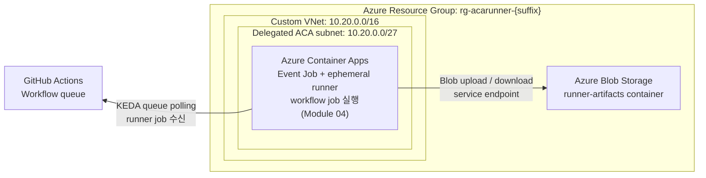
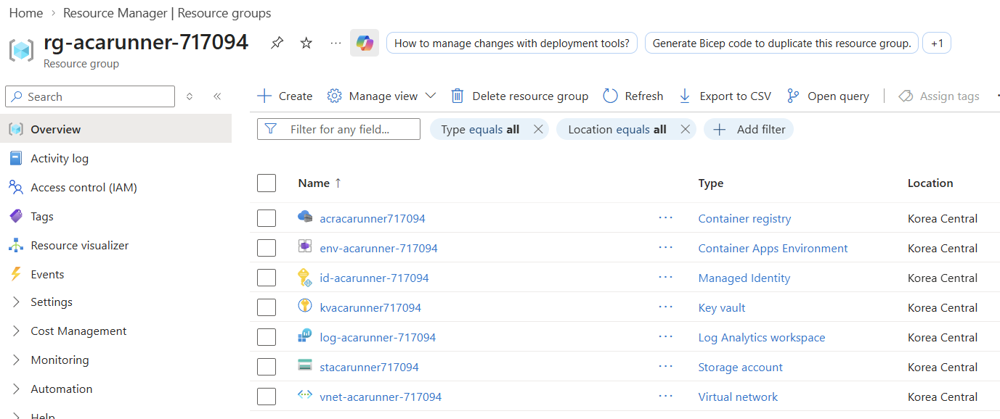

# 02. Azure 기반 리소스 준비

> Azure Cloud Shell Bash에서 Module 01 Resource Group과 Key Vault를 재사용하면서 Log Analytics workspace, custom Virtual Network, External Azure Container Apps Environment, Storage·Key Vault service endpoint, Azure Container Registry, User-Assigned Managed Identity, least-privilege RBAC를 완성합니다.

## 아키텍처 참고

아래 다이어그램은 전체 워크숍의 실제 호출 흐름을 리소스 관점으로 단순화한 것입니다. Module 02에서는 ACA Environment와 Blob Storage 기반을 준비하고, ACA Event Job과 ephemeral runner는 Module 04에서 추가합니다.



- GitHub Actions에 workflow가 queued되면 ACA Event Job의 KEDA scaler가 GitHub API를 outbound polling하고 ephemeral runner execution을 시작합니다.
- runner는 workflow job을 실행하면서 ACA subnet의 service endpoint 경로로 Azure Blob Storage에 artifact를 upload/download합니다.
- 이 그림은 runtime 호출 흐름만 보여줍니다. 방화벽, 인증, image pull, secret, logging의 상세 설정은 Module 02~06의 실행 단계에서 다룹니다.

## 목표

이 모듈을 완료하면 다음을 할 수 있습니다.

- Module 01에서 저장한 `SUFFIX`, 원래 `SUBSCRIPTION_ID`, bootstrap 접근 정보와 Resource Group의 실제 Key Vault로 공통 이름 변수를 복원한다.
- External ACA Environment용 custom VNet, delegated ACA subnet, Storage·Key Vault service endpoint를 준비한다.
- Azure Monitor 로그 대상으로 ACA Environment를 연결한다.
- ACR을 관리자 계정 없이 만들고 ARM authentication을 활성화한다.
- Storage Account를 `publicNetworkAccess=Enabled`, `defaultAction=Deny`, `allowSharedKeyAccess=false` 상태로 만들고 Blob container를 management plane으로 생성한다.
- Module 01에서 만든 Key Vault를 재사용한다.
- ACA subnet rule과 runtime RBAC를 완성한다.
- 다음 모듈에서 사용할 `SUBSCRIPTION_ID`, `RG_ID`, `LOG_ID`, `LOG_RID`, `VNET_ID`, `SUBNET_ID`, `ENV_ID`, `ACR_SERVER`, `ACR_ID`, `STORAGE`, `STORAGE_ID`, `STORAGE_CONTAINER`, `UAMI_RID`, `UAMI_PID`, `UAMI_CLIENT_ID`, `KEY_VAULT`, `KEY_VAULT_ID`, `KEY_VAULT_SECRET_URI`를 확보한다.
- 이후 세션 재연결이 필요할 때 사용할 수 있도록 `SUFFIX`, 실제 `ACR` 이름, 원래 `SUBSCRIPTION_ID`를 각각 별도 값으로 저장한다. Storage 이름은 충돌 복구가 있었을 때만 실제 값을 추가로 저장한다.

> ⚠️ **중요**
> 이 문서는 **새 foundation** 기준입니다. 이전 버전에서 ACA subnet 외 별도 subnet, Private Endpoint, Private DNS link를 이미 만들었다면 기존 리소스에 service endpoint 계약을 섞지 말고 [Module 07](07-security-limitations-cleanup.md) cleanup을 완료한 뒤 **새 suffix**로 처음부터 다시 시작하세요.

## 1. Module 01 공통 변수 복원

👁️ **설명**

Module 02는 Module 01에서 이미 만든 Resource Group과 Key Vault를 그대로 이어받습니다. Module 01에서 저장한 `SUFFIX`, 원래 `SUBSCRIPTION_ID`, bootstrap principal object ID를 복원한 뒤 같은 subscription으로 돌아갑니다. `KEY_VAULT`는 이전 shell의 값을 신뢰하지 않고 해당 Resource Group에 실제로 존재하는 vault를 자동 조회합니다.

Resource Group에서 Key Vault를 정확히 하나 찾지 못하면 먼저 활성 subscription과 `SUFFIX`가 Module 01에서 저장한 값과 같은지 확인하세요. 새 suffix나 두 번째 Key Vault를 만들지 말고 같은 workshop 상태를 복원한 뒤 다시 실행합니다.

🟢 **실행**

```bash
# Module 01에서 저장한 식별자를 복원하고 나머지 Azure 리소스 이름을 같은 suffix에서 파생합니다.
if [[ -z "${SUFFIX:-}" ]]; then
  read -rp "Saved SUFFIX: " SUFFIX
fi
if [[ -z "${SUBSCRIPTION_ID:-}" ]]; then
  read -rp "Saved subscription ID: " SUBSCRIPTION_ID
fi
if [[ -z "${KEY_VAULT_BOOTSTRAP_PRINCIPAL_ID:-}" ]]; then
  read -rp "Saved Key Vault bootstrap principal object ID: " \
    KEY_VAULT_BOOTSTRAP_PRINCIPAL_ID
fi

LOC=koreacentral
RG="rg-acarunner-$SUFFIX"
LOG="log-acarunner-$SUFFIX"
ENV="env-acarunner-$SUFFIX"
VNET="vnet-acarunner-$SUFFIX"
INFRA_SUBNET="snet-aca-infra"
ACR="acracarunner$SUFFIX"
STORAGE="stacarunner$SUFFIX"
STORAGE_CONTAINER="runner-artifacts"
UAMI="id-acarunner-$SUFFIX"
GITHUB_APP_KEY_SECRET="github-app-private-key"

az account set --subscription "$SUBSCRIPTION_ID"
vault_names_output="$(
  az keyvault list \
    --resource-group "$RG" \
    --query "[].name" \
    --output tsv
)"
VAULT_NAMES=()
while IFS= read -r vault_name; do
  [[ -n "$vault_name" ]] && VAULT_NAMES+=("$vault_name")
done <<<"$vault_names_output"

if [[ "${#VAULT_NAMES[@]}" -ne 1 ]]; then
  printf 'ERROR: Resource Group에서 실제 Key Vault를 정확히 하나 찾지 못했습니다: %s\n' \
    "$RG" >&2
  printf '발견한 Key Vault 수: %s\n' "${#VAULT_NAMES[@]}" >&2
  false
else
  KEY_VAULT="${VAULT_NAMES[0]}"
  export KEY_VAULT
  KEY_VAULT_ID=$(az keyvault show \
    --resource-group "$RG" \
    --name "$KEY_VAULT" \
    --query id \
    --output tsv)

  printf 'SUFFIX=%s RG=%s ACR=%s STORAGE=%s KEY_VAULT=%s\n' \
    "$SUFFIX" "$RG" "$ACR" "$STORAGE" "$KEY_VAULT"
fi
```

📋 **예상 출력**

```text
SUFFIX=a1b2c3 RG=rg-acarunner-a1b2c3 ACR=acracarunnera1b2c3 STORAGE=stacarunnera1b2c3 KEY_VAULT=kvacarunnera1b2c3
```

⚠️ **주의**

- `SUFFIX`, `SUBSCRIPTION_ID`, `KEY_VAULT_BOOTSTRAP_PRINCIPAL_ID`에는 반드시 Module 01에서 저장한 값을 넣으세요.
- `KEY_VAULT`는 직접 입력하지 않습니다. 현재 shell에 다른 값이 남아 있어도 `$RG`의 실제 vault 이름으로 교체합니다.
- 실제 Key Vault 조회가 실패하면 `SUBSCRIPTION_ID`와 `SUFFIX`를 다시 확인하세요. 새 `SUFFIX`를 만들거나 다른 `KEY_VAULT` 이름으로 우회하지 마세요.

## 2. Resource Group 확인과 Log Analytics workspace 만들기

👁️ **설명**

Module 01이 Key Vault를 만들면서 같은 workshop suffix의 Resource Group도 이미 만들었습니다. Module 02는 그 Resource Group을 다시 만들지 않고 확인만 한 뒤, 이후 foundation 리소스에 필요한 Log Analytics workspace를 추가합니다.

🟢 **실행**

```bash
# Module 01에서 만든 Resource Group을 확인하고 이후 조회에 사용할 ID를 저장합니다.
SUBSCRIPTION_ID=$(az account show --query id --output tsv)
RG_ID=$(az group show \
  --name "$RG" \
  --query id \
  --output tsv)

# ACA environment의 시스템 로그를 수집할 Log Analytics workspace를 만듭니다.
az monitor log-analytics workspace create \
  --resource-group "$RG" \
  --workspace-name "$LOG" \
  --location "$LOC" \
  --output none

# customer ID는 workspace 식별에, resource ID는 diagnostic setting 연결에 사용합니다.
LOG_ID=$(az monitor log-analytics workspace show \
  --resource-group "$RG" \
  --workspace-name "$LOG" \
  --query customerId \
  --output tsv)
LOG_RID=$(az monitor log-analytics workspace show \
  --resource-group "$RG" \
  --workspace-name "$LOG" \
  --query id \
  --output tsv)

# 다음 Cloud Shell 세션에서도 같은 workshop 리소스를 복원할 수 있도록 세 값을 기록합니다.
printf '다음 값을 저장하세요: SUFFIX=%s ACR=%s SUBSCRIPTION_ID=%s\n' \
  "$SUFFIX" "$ACR" "$SUBSCRIPTION_ID"
```

## 3. VNet과 ACA subnet 만들기

👁️ **설명**

custom VNet 기반 ACA Environment는 environment 전용 infrastructure subnet이 필요합니다. 이 subnet을 `Microsoft.App/environments`에 위임하면 ACA가 사용자 VNet 안에 environment infrastructure를 배치하고 관리합니다. 이번 foundation은 ACA subnet 하나에 Storage와 Key Vault service endpoint를 함께 구성하고, 별도 private IP 리소스는 만들지 않습니다.

🟢 **실행**

```bash
# ACA Environment 전용 VNet과 /27 infrastructure subnet을 만듭니다.
az network vnet create \
  --resource-group "$RG" \
  --name "$VNET" \
  --location "$LOC" \
  --address-prefixes 10.20.0.0/16 \
  --output none

az network vnet subnet create \
  --resource-group "$RG" \
  --vnet-name "$VNET" \
  --name "$INFRA_SUBNET" \
  --address-prefixes 10.20.0.0/27 \
  --output none

# ACA가 infrastructure subnet을 관리할 수 있도록 delegation을 먼저 적용합니다.
az network vnet subnet update \
  --resource-group "$RG" \
  --vnet-name "$VNET" \
  --name "$INFRA_SUBNET" \
  --delegations Microsoft.App/environments \
  --output none

# delegation과 별도 명령으로 Storage와 Key Vault service endpoint를 적용합니다.
az network vnet subnet update \
  --resource-group "$RG" \
  --vnet-name "$VNET" \
  --name "$INFRA_SUBNET" \
  --service-endpoints Microsoft.Storage Microsoft.KeyVault \
  --output none

# 이후 단계에서 재사용할 VNet과 subnet resource ID를 저장합니다.
VNET_ID=$(az network vnet show \
  --resource-group "$RG" \
  --name "$VNET" \
  --query id \
  --output tsv)
SUBNET_ID=$(az network vnet subnet show \
  --resource-group "$RG" \
  --vnet-name "$VNET" \
  --name "$INFRA_SUBNET" \
  --query id \
  --output tsv)
```

service endpoint는 private IP를 만들지 않으므로 subnet 자체의 delegation과 endpoint 플래그만 확인합니다.

```bash
# subnet delegation과 service endpoint 구성이 예상대로 반영되었는지 확인합니다.
az network vnet subnet show \
  --resource-group "$RG" \
  --vnet-name "$VNET" \
  --name "$INFRA_SUBNET" \
  --query "{delegation:delegations[].serviceName,serviceEndpoints:serviceEndpoints[].service,id:id}" \
  --output json
```

## 4. External custom VNet ACA Environment 만들기

👁️ **설명**

이 워크숍은 Log Analytics Shared Key를 쓰지 않고, ACA Environment 자체를 Azure Monitor에 연결한 뒤 resource-based diagnostic setting으로 로그를 보냅니다. Diagnostic setting은 Module 05의 KQL과 일치하도록 resource-specific `ContainerAppConsoleLogs`와 `ContainerAppSystemLogs` table을 사용합니다. Task 1의 foundation은 `internal=false`인 **External custom VNet Environment**입니다.

이 워크숍을 처음 실행하는 경우에는 아래 명령으로 새 External custom VNet Environment를 만듭니다.
이전 버전의 워크숍에서 만든 기본 네트워크 또는 internal environment가 있는 경우에만 해당합니다.
해당 Environment는 현재 service endpoint foundation으로 변환할 수 없으므로, 이전 버전에서 이어오는 경우에는 Module 07 cleanup을 완료한 뒤 새 workshop suffix로 다시 만듭니다.

🟢 **실행**

```bash
# delegated subnet을 연결한 External ACA Environment와 diagnostic setting을 만듭니다.
az containerapp env create \
  --resource-group "$RG" \
  --name "$ENV" \
  --location "$LOC" \
  --infrastructure-subnet-resource-id "$SUBNET_ID" \
  --logs-destination azure-monitor \
  --output none

ENV_ID=$(az containerapp env show \
  --resource-group "$RG" \
  --name "$ENV" \
  --query id \
  --output tsv)

# ACA 시스템 로그를 앞 단계에서 만든 Log Analytics workspace로 보냅니다.
az monitor diagnostic-settings create \
  --name aca-runner-logs \
  --resource "$ENV_ID" \
  --workspace "$LOG_RID" \
  --export-to-resource-specific true \
  --logs '[{"categoryGroup":"allLogs","enabled":true}]' \
  --output none
```

```bash
# ACA Environment가 external mode와 올바른 subnet으로 생성되었는지 확인합니다.
az containerapp env show \
  --resource-group "$RG" \
  --name "$ENV" \
  --query "{internal:properties.vnetConfiguration.internal,infrastructureSubnetId:properties.vnetConfiguration.infrastructureSubnetId,defaultDomain:properties.defaultDomain}" \
  --output json
```

## 5. ACR 만들기와 ARM authentication 활성화

👁️ **설명**

runner image는 ACR에 저장하고, Job은 관리자 계정이 아니라 UAMI + RBAC로 이미지를 pull합니다. 따라서 `--admin-enabled false`를 유지하고 ARM authentication을 켭니다.

🟢 **실행**

```bash
# runner image 저장소로 사용할 ACR을 만들고 ARM authentication을 활성화합니다.
az acr create \
  --resource-group "$RG" \
  --name "$ACR" \
  --location "$LOC" \
  --sku Basic \
  --admin-enabled false \
  --output none

az acr config authentication-as-arm update \
  --registry "$ACR" \
  --status enabled \
  --output none

ACR_SERVER=$(az acr show --name "$ACR" --query loginServer --output tsv)
ACR_ID=$(az acr show --name "$ACR" --query id --output tsv)
```

```bash
# ACR 관리자 계정이 꺼져 있고 ARM authentication이 켜졌는지 확인합니다.
az acr show \
  --name "$ACR" \
  --query "{loginServer:loginServer,adminUserEnabled:adminUserEnabled}" \
  --output json

az acr config authentication-as-arm show \
  --registry "$ACR" \
  --query status \
  --output tsv
```

## 6. Storage Account와 Blob container 만들기

👁️ **설명**

Storage는 public endpoint를 유지하지만 `defaultAction=Deny`, `bypass=None`, ACA subnet rule로 data-plane을 제한합니다. container는 shared key 없이도 동작하는 management plane 명령으로 만듭니다.

🟢 **실행**

```bash
# ACA Environment 생성 후에도 Storage와 Key Vault service endpoint가 유지되도록 다시 적용합니다.
az network vnet subnet update \
  --resource-group "$RG" \
  --vnet-name "$VNET" \
  --name "$INFRA_SUBNET" \
  --service-endpoints Microsoft.Storage Microsoft.KeyVault \
  --output none

# Storage firewall rule을 추가하기 전에 두 service endpoint의 현재 상태를 확인합니다.
az network vnet subnet show \
  --resource-group "$RG" \
  --vnet-name "$VNET" \
  --name "$INFRA_SUBNET" \
  --query "{delegation:delegations[].serviceName,serviceEndpoints:serviceEndpoints[].service}" \
  --output json

# public endpoint는 유지하되 기본 차단 상태인 Storage account를 만듭니다.
az storage account create \
  --resource-group "$RG" \
  --name "$STORAGE" \
  --location "$LOC" \
  --sku Standard_LRS \
  --kind StorageV2 \
  --min-tls-version TLS1_2 \
  --allow-blob-public-access false \
  --allow-shared-key-access false \
  --public-network-access Enabled \
  --default-action Deny \
  --bypass None \
  --output none

# RBAC scope와 다음 모듈에서 사용할 Storage resource ID를 저장합니다.
STORAGE_ID=$(az storage account show \
  --resource-group "$RG" \
  --name "$STORAGE" \
  --query id \
  --output tsv)

# shared key 없이 management plane으로 private Blob container를 만듭니다.
az storage container-rm create \
  --resource-group "$RG" \
  --storage-account "$STORAGE" \
  --name "$STORAGE_CONTAINER" \
  --public-access off \
  --output none

# Storage data-plane 접근을 ACA infrastructure subnet에서만 허용합니다.
az storage account network-rule add \
  --resource-group "$RG" \
  --account-name "$STORAGE" \
  --subnet "$SUBNET_ID" \
  --output none
```

```bash
# Storage의 public access, 기본 차단, subnet rule, shared key 차단 상태를 확인합니다.
az storage account show \
  --resource-group "$RG" \
  --name "$STORAGE" \
  --query "{publicNetworkAccess:publicNetworkAccess,defaultAction:networkRuleSet.defaultAction,bypass:networkRuleSet.bypass,vnetRules:networkRuleSet.virtualNetworkRules[].{id:virtualNetworkResourceId,state:state},allowSharedKeyAccess:allowSharedKeyAccess,allowBlobPublicAccess:allowBlobPublicAccess}" \
  --output json
```

⚠️ **주의**

- 이 시점부터 Cloud Shell에서 `az storage blob upload` 같은 **data-plane** 명령은 `403`이 날 수 있습니다. 이는 예상된 동작이며, service endpoint가 붙은 ACA subnet만 허용되었음을 의미합니다.
- Storage container 생성과 방화벽 확인은 위의 management plane 명령과 조회 결과로 검증하세요.

## 7. Runtime RBAC와 Key Vault firewall 완성

👁️ **설명**

이 단계에서 UAMI를 만들고 ACR, Storage, Key Vault에 최소 권한만 연결합니다. Key Vault는 public endpoint를 유지하되 `defaultAction=Deny`, `bypass=None`, ACA subnet rule을 적용합니다. **runtime access 검증이 끝난 뒤에만** bootstrap 권한을 제거합니다.

🟢 **실행**

```bash
# ACA Job이 사용할 User-Assigned Managed Identity를 만듭니다.
az identity create \
  --resource-group "$RG" \
  --name "$UAMI" \
  --output none

# 역할 할당과 Job 설정에 사용할 UAMI 식별자를 저장합니다.
UAMI_RID=$(az identity show \
  --resource-group "$RG" \
  --name "$UAMI" \
  --query id \
  --output tsv)
UAMI_PID=$(az identity show \
  --resource-group "$RG" \
  --name "$UAMI" \
  --query principalId \
  --output tsv)
UAMI_CLIENT_ID=$(az identity show \
  --resource-group "$RG" \
  --name "$UAMI" \
  --query clientId \
  --output tsv)

# UAMI에 ACR pull, Blob data-plane, Key Vault secret 읽기 최소 권한을 부여합니다.
az role assignment create \
  --assignee-object-id "$UAMI_PID" \
  --assignee-principal-type ServicePrincipal \
  --role AcrPull \
  --scope "$ACR_ID" \
  --output none

az role assignment create \
  --assignee-object-id "$UAMI_PID" \
  --assignee-principal-type ServicePrincipal \
  --role "Storage Blob Data Contributor" \
  --scope "$STORAGE_ID" \
  --output none

az role assignment create \
  --assignee-object-id "$UAMI_PID" \
  --assignee-principal-type ServicePrincipal \
  --role "Key Vault Secrets User" \
  --scope "$KEY_VAULT_ID" \
  --output none

# Key Vault data-plane 접근을 ACA infrastructure subnet에서만 허용합니다.
az keyvault network-rule add \
  --resource-group "$RG" \
  --name "$KEY_VAULT" \
  --subnet "$SUBNET_ID" \
  --output none

# public endpoint는 유지하되 허용된 subnet 외의 요청은 모두 차단합니다.
az keyvault update \
  --resource-group "$RG" \
  --name "$KEY_VAULT" \
  --public-network-access Enabled \
  --default-action Deny \
  --bypass None \
  --output none

KEY_VAULT_SECRET_URI="https://$KEY_VAULT.vault.azure.net/secrets/$GITHUB_APP_KEY_SECRET"

# Key Vault firewall과 subnet rule이 예상대로 적용됐는지 확인합니다.
az keyvault show \
  --resource-group "$RG" \
  --name "$KEY_VAULT" \
  --query "{publicNetworkAccess:properties.publicNetworkAccess,defaultAction:properties.networkAcls.defaultAction,bypass:properties.networkAcls.bypass,vnetRules:properties.networkAcls.virtualNetworkRules[].{id:id,ignoreMissingVnetServiceEndpoint:ignoreMissingVnetServiceEndpoint}}" \
  --output json

# UAMI의 세 가지 runtime 역할과 각 scope를 확인합니다.
az role assignment list \
  --assignee "$UAMI_PID" \
  --all \
  --query "[?scope=='$ACR_ID' || scope=='$STORAGE_ID' || scope=='$KEY_VAULT_ID'].{role:roleDefinitionName,principalType:principalType,scope:scope}" \
  --output table

# runtime 권한 확인이 끝났으므로 Module 01의 일회성 secret 쓰기 권한을 제거합니다.
az role assignment delete \
  --assignee "$KEY_VAULT_BOOTSTRAP_PRINCIPAL_ID" \
  --role "Key Vault Secrets Officer" \
  --scope "$KEY_VAULT_ID"
unset KEY_VAULT_BOOTSTRAP_PRINCIPAL_ID
```

📋 **예상 출력**

- Key Vault 조회 결과는 `publicNetworkAccess=Enabled`, `defaultAction=Deny`, `bypass=None`이어야 합니다.
- `vnetRules`에는 현재 `SUBNET_ID`가 보여야 합니다.
- `AcrPull`, `Storage Blob Data Contributor`, `Key Vault Secrets User`가 각각 `ACR_ID`, `STORAGE_ID`, `KEY_VAULT_ID` scope로 보여야 합니다.

⚠️ **주의**

- 이 시점부터 Cloud Shell의 `az keyvault secret show` 같은 **data-plane** 조회도 `403`이 날 수 있습니다. service endpoint가 붙은 ACA subnet만 허용되도록 바뀐 것이므로 예상된 동작입니다.
- bootstrap 권한 삭제 전에 `az keyvault show`와 `az role assignment list` 결과로 subnet rule과 세 가지 runtime 역할을 반드시 확인하세요.

생성된 foundation 리소스는 텍스트 기준으로 다음 항목을 확인하면 됩니다.

- Azure Container Registry
- Container Apps Environment
- Virtual Network (`vnet-acarunner-*`)와 delegated subnet (`snet-aca-infra`)
- Storage account
- Key Vault
- Managed Identity
- Log Analytics workspace

Azure Portal에서 Resource Group을 열면 Module 02에서 생성한 foundation 리소스를 한 화면에서 확인할 수 있습니다.



### 선택: foundation 변수 요약 출력

🟢 **실행**

```bash
# 다음 모듈로 넘어가기 전에 foundation 핵심 식별자를 한 번에 출력합니다.
printf 'RG=%s\nENV=%s\nVNET_ID=%s\nSUBNET_ID=%s\nACR_ID=%s\nSTORAGE_ID=%s\nUAMI_CLIENT_ID=%s\nKEY_VAULT_ID=%s\nKEY_VAULT_SECRET_URI=%s\n' \
  "$RG" "$ENV" "$VNET_ID" "$SUBNET_ID" "$ACR_ID" "$STORAGE_ID" "$UAMI_CLIENT_ID" "$KEY_VAULT_ID" "$KEY_VAULT_SECRET_URI"
```

## 트러블슈팅

| 증상 | 주요 원인 | 해결 방법 |
|------|-----------|-----------|
| `az containerapp env create`가 provider 등록 오류를 반환함 | `Microsoft.Network` 또는 `Microsoft.ContainerService` provider가 등록되지 않음 | [모듈 01](01-prerequisites-github.md)의 provider 등록 명령을 다시 실행하고 `--wait`가 끝날 때까지 기다린 뒤 4단계 전체를 처음부터 다시 실행합니다. |
| `az containerapp env create`가 subnet 관련 오류를 반환함 | `Microsoft.App/environments` delegation이 없거나 subnet 크기가 부족함 | 3단계의 `az network vnet subnet update`를 다시 실행하고 `Microsoft.App/environments` delegation과 `/27` 크기를 확인합니다. |
| Storage container 생성이 data plane 인증 오류로 실패함 | shared key가 꺼진 상태에서 data-plane 명령을 사용함 | `az storage container create`로 우회하지 말고 문서의 `az storage container-rm create --public-access off` management plane 경로를 다시 실행합니다. |
| Cloud Shell에서 Storage blob upload/download가 `403`으로 실패함 | Storage firewall이 ACA subnet만 허용하도록 잠김 | 정상입니다. Cloud Shell이 아니라 ACA Job runtime에서 Blob data-plane을 검증하고, Module 06은 runner 내부에서 업로드·다운로드를 수행합니다. |
| Cloud Shell에서 Key Vault secret 조회가 `403`으로 실패함 | Key Vault firewall이 ACA subnet만 허용하도록 잠김 | 정상입니다. `az keyvault show`로 control-plane 속성과 subnet rule을 확인하고 secret 값 자체는 Cloud Shell에서 다시 읽지 마세요. |
| `SubnetsHaveNoServiceEndpointsConfigured`가 발생함 | delegation과 service endpoint를 한 번에 설정한 이전 명령에서 endpoint가 반영되지 않음 | `az network vnet subnet update --resource-group "$RG" --vnet-name "$VNET" --name "$INFRA_SUBNET" --service-endpoints Microsoft.Storage Microsoft.KeyVault --output none`을 실행한 뒤 실패했던 `network-rule add` 명령부터 다시 실행합니다. Storage account를 새로 만들 필요는 없습니다. |
| `az storage account network-rule add`가 실패함 | 잘못된 subnet ID를 사용했거나 subnet update가 끝나지 않음 | 3단계의 `SUBNET_ID`가 `snet-aca-infra`를 가리키는지 확인하고 `az network vnet subnet show` 검증 블록을 다시 실행합니다. |
| `az keyvault network-rule add`가 실패함 | Key Vault 이름이 stale 값이거나 잘못된 subscription을 사용 중 | 1단계의 실제 Key Vault 자동 조회 블록을 다시 실행해 `$RG`의 실제 vault 이름을 복원한 뒤 시도합니다. |
| role assignment는 성공했는데 image pull 또는 secret access가 아직 실패함 | RBAC propagation 지연 | 몇 분 기다린 뒤 `az role assignment list --assignee "$UAMI_PID" --all --output table`로 역할 전파를 확인하고 다음 모듈을 재시도합니다. |
| `publicNetworkAccess` 또는 `defaultAction` 상태가 기대와 다름 | `az storage account create` 또는 `az keyvault update` 옵션이 누락됨 | Step 6/7의 방화벽 설정 명령을 다시 실행하고 각각의 `show` 조회 결과를 다시 확인합니다. |
| `az acr create`가 이름 중복 오류를 반환함 | `ACR` 이름은 전역 고유인데 이미 사용 중 | 아래 ACR 이름 충돌 복구 절차에 따라 ACR 이름만 바꾸고 다시 시도합니다. |
| `az storage account create`가 이름 중복 오류를 반환함 | `STORAGE` 이름은 전역 고유인데 이미 사용 중 | 아래 Storage 이름 충돌 복구 절차에 따라 Storage 이름만 바꾸고 Step 6을 다시 실행합니다. |

### ACR 이름 충돌 복구

```bash
ACR="acracarunner$(openssl rand -hex 4)"
printf 'ACR=%s\n' "$ACR"
```

### Storage 이름 충돌 복구

```bash
STORAGE="stacarunner$(openssl rand -hex 4)"
printf 'STORAGE=%s\n' "$STORAGE"
```

---

[← 이전: GitHub 사전 준비](01-prerequisites-github.md) | [다음: Runner image 빌드 →](03-runner-image.md)
