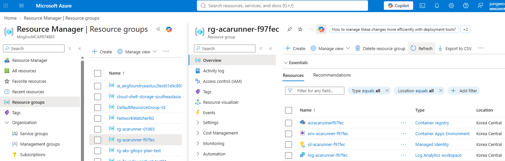

# 02. Azure 기반 리소스 준비

> Azure Cloud Shell Bash에서 리소스 그룹, Log Analytics workspace, Virtual Network, External Azure Container Apps Environment, locked-down Blob Storage, Blob Private Endpoint, Private DNS, Azure Monitor diagnostic settings, Azure Container Registry, User-Assigned Managed Identity를 만들고 least-privilege RBAC를 연결합니다.

## 목표

이 모듈을 완료하면 다음을 할 수 있습니다.

- `koreacentral`에 실습용 리소스 그룹과 공통 이름 변수를 만든다.
- External ACA Environment용 custom VNet, delegated ACA subnet, non-delegated Private Endpoint subnet을 각각 준비한다.
- Azure Monitor 로그 대상으로 ACA Environment를 연결하고, Blob 전용 Private DNS를 구성한다.
- ACR을 관리자 계정 없이 만들고 ARM authentication을 활성화한다.
- Storage Account를 `publicNetworkAccess=Enabled`, `defaultAction=Deny`, `allowSharedKeyAccess=false` 상태로 만들고 Blob container를 management plane으로 생성한다.
- UAMI를 만들고 ACR 범위에 `AcrPull`, Storage 범위에 `Storage Blob Data Contributor`, Key Vault 범위에 `Key Vault Secrets User` 역할을 부여한다.
- 다음 모듈에서 사용할 `SUBSCRIPTION_ID`, `RG_ID`, `LOG_ID`, `LOG_RID`, `VNET_ID`, `SUBNET_ID`, `PE_SUBNET_ID`, `ENV_ID`, `ACR_SERVER`, `ACR_ID`, `STORAGE`, `STORAGE_ID`, `STORAGE_CONTAINER`, `STORAGE_PE`, `STORAGE_DNS_ZONE`, `UAMI_RID`, `UAMI_PID`, `UAMI_CLIENT_ID`, `KEY_VAULT`, `KEY_VAULT_ID`, `KEY_VAULT_SECRET_URI`를 확보한다.
- 이후 세션 재연결이 필요할 때 사용할 수 있도록 `SUFFIX`, 실제 `ACR` 이름, 원래 `SUBSCRIPTION_ID`를 각각 별도 값으로 저장한다. Storage 이름은 충돌 복구가 있었을 때만 실제 값을 추가로 저장한다.

## 태그 범례

| 태그 | 의미 |
|------|------|
| 🟢 **실행** | 참가자가 직접 입력하거나 수행해야 하는 단계 |
| 👁️ **설명** | 개념 설명 또는 읽기 전용 안내 |
| 📋 **예상 출력** | 실행 결과와 비교할 기준 출력 |
| ⚠️ **주의** | 보안, 비용, 제약 사항 안내 |

## 1. 공통 변수 재설정

👁️ **설명**

각 참가자가 충돌 없이 리소스를 만들 수 있도록 6자리 소문자 16진수 `SUFFIX`를 붙입니다. `ACR`과 `STORAGE` 이름은 전역 고유해야 하므로 기본값은 `SUFFIX`에서 만들되, 이름 충돌 복구가 발생하면 실제 이름이 `SUFFIX`와 달라질 수 있습니다. 반면 `RG`, `LOG`, `ENV`, `VNET`, `INFRA_SUBNET`, `PE_SUBNET`, `UAMI`, `JOB`, `STORAGE_PE`, `STORAGE_DNS_LINK`는 항상 같은 규칙으로 계산됩니다.

`INFRA_SUBNET`은 ACA infrastructure를 위한 delegated subnet이고, `PE_SUBNET`은 Blob Private Endpoint만 넣는 **non-delegated subnet**입니다. delegated ACA subnet과 Private Endpoint subnet을 분리해야 하며, Storage service endpoint나 storage firewall 예외 추가 같은 우회 규칙은 이 워크숍에 포함하지 않습니다.

🟢 **실행**

```bash
# 참가자마다 충돌하지 않는 6자리 suffix를 만들고 모든 실습 리소스 이름의 기준으로 사용합니다.
SUFFIX="$(openssl rand -hex 3)"
LOC=koreacentral

# 뒤 모듈이 같은 리소스를 찾을 수 있도록 suffix에서 일관된 이름을 파생합니다.
# ACR과 Storage는 전역 고유 이름 충돌 시 별도로 바꿀 수 있으므로 SUFFIX와 독립된 값으로 관리합니다.
RG="rg-acarunner-$SUFFIX"
LOG="log-acarunner-$SUFFIX"
ENV="env-acarunner-$SUFFIX"
VNET="vnet-acarunner-$SUFFIX"
INFRA_SUBNET="snet-aca-infra"
PE_SUBNET="snet-private-endpoints"
ACR="acracarunner$SUFFIX"
STORAGE="stacarunner$SUFFIX"
STORAGE_CONTAINER="runner-artifacts"
STORAGE_PE="pe-blob-$SUFFIX"
STORAGE_DNS_ZONE="privatelink.blob.core.windows.net"
STORAGE_DNS_LINK="link-blob-$SUFFIX"
KEY_VAULT="kvacarunner$SUFFIX"
KEY_VAULT_PE="pe-kv-$SUFFIX"
KEY_VAULT_DNS_ZONE="privatelink.vaultcore.azure.net"
KEY_VAULT_DNS_LINK="link-kv-$SUFFIX"
GITHUB_APP_KEY_SECRET="github-app-private-key"
PRIVATE_ENDPOINT_CIDR="10.20.1.0/24"
UAMI="id-acarunner-$SUFFIX"
JOB="job-ghrunner-$SUFFIX"
IMAGE="github-actions-runner:2.336.0"

# 재접속 시 복원해야 할 핵심 이름이 올바르게 만들어졌는지 먼저 확인합니다.
printf 'SUFFIX=%s RG=%s ACR=%s STORAGE=%s KEY_VAULT=%s\n' "$SUFFIX" "$RG" "$ACR" "$STORAGE" "$KEY_VAULT"
```

📋 **예상 출력**

```text
SUFFIX=a1b2c3 RG=rg-acarunner-a1b2c3 ACR=acracarunnera1b2c3 STORAGE=stacarunnera1b2c3 KEY_VAULT=kvacarunnera1b2c3
```

⚠️ **주의**

- `SUFFIX`와 함께 위 출력의 실제 `ACR` 값을 지금 별도로 저장하세요.
- `STORAGE`는 기본적으로 `stacarunner$SUFFIX`를 그대로 사용합니다. Storage 이름 충돌 복구가 발생한 경우에만 실제 `STORAGE` 값을 추가로 저장하세요.
- `KEY_VAULT`는 기본적으로 `kvacarunner$SUFFIX`를 그대로 사용합니다. Key Vault 이름 충돌 복구가 발생한 경우에만 실제 `KEY_VAULT` 값을 추가로 저장하세요.

## 2. Resource group과 Log Analytics workspace 만들기

👁️ **설명**

Log Analytics는 runner 등록/실행/정리 로그를 한곳에서 확인하는 기준이 됩니다. `LOG_ID`는 workspace customer ID이고, `LOG_RID`는 Azure Monitor diagnostic setting에서 사용할 resource ID입니다.

🟢 **실행**

```bash
# 모든 Azure 리소스를 같은 위치와 수명 주기로 관리할 실습용 Resource Group을 만듭니다.
az group create --name "$RG" --location "$LOC" --output none

# 현재 구독과 Resource Group의 전체 ID를 저장해 이후 조회와 RBAC scope에 재사용합니다.
SUBSCRIPTION_ID=$(az account show --query id --output tsv)
RG_ID=$(az group show   --name "$RG"   --query id   --output tsv)

# ACA environment의 시스템 로그를 수집할 Log Analytics workspace를 만듭니다.
az monitor log-analytics workspace create   --resource-group "$RG"   --workspace-name "$LOG"   --location "$LOC"   --output none

# customer ID는 workspace 식별에, resource ID는 diagnostic setting 연결에 사용합니다.
LOG_ID=$(az monitor log-analytics workspace show   --resource-group "$RG"   --workspace-name "$LOG"   --query customerId   --output tsv)
LOG_RID=$(az monitor log-analytics workspace show   --resource-group "$RG"   --workspace-name "$LOG"   --query id   --output tsv)

# 다음 Cloud Shell 세션에서도 같은 workshop 리소스를 복원할 수 있도록 세 값을 기록합니다.
printf '다음 값을 저장하세요: SUFFIX=%s ACR=%s SUBSCRIPTION_ID=%s\n' \
  "$SUFFIX" "$ACR" "$SUBSCRIPTION_ID"
```

📋 **예상 출력**

- 명령은 출력 없이 끝나고, `LOG_ID`와 `LOG_RID`가 셸 변수에 저장됩니다.
- `LOG_RID`는 `/subscriptions/.../resourceGroups/.../providers/Microsoft.OperationalInsights/workspaces/...` 형식입니다.
- `다음 값을 저장하세요: SUFFIX=a1b2c3 ACR=acracarunnera1b2c3 SUBSCRIPTION_ID=00000000-0000-0000-0000-000000000000`처럼 현재 workshop 기준 값을 바로 기록할 수 있어야 합니다.

Module 03~06을 Cloud Shell 재접속 후 이어가려면 위에서 출력한 `SUBSCRIPTION_ID`를 `SUFFIX`, 실제 `ACR` 이름과 함께 저장해 둡니다. Storage 이름은 기본값이면 다시 계산되므로 여기서는 저장하지 않습니다.

## 3. VNet과 분리된 subnet 만들기

👁️ **설명**

custom VNet 기반 ACA Environment는 environment 전용 infrastructure subnet이 필요합니다. 이 subnet을 `Microsoft.App/environments`에 위임하면 ACA가 사용자 VNet 안에 environment infrastructure를 배치하고 관리합니다. 반대로 Private Endpoint는 delegated subnet에 둘 수 없으므로 Blob용 `PE_SUBNET`을 별도로 만들고 **non-delegated** 상태로 유지해야 합니다.

subnet delegation 자체가 대상 리소스의 Private Endpoint, Private DNS, NSG, UDR 또는 firewall을 자동으로 구성하는 것은 아닙니다. 호출 대상에 맞는 private 연결과 이름 해석, 트래픽 제어는 별도로 구성해야 합니다. 이 워크숍은 Workload profiles environment의 minimum 크기인 `/27` ACA subnet과, Blob Private Endpoint 전용 `/24` subnet을 사용합니다. 아래 `--address-prefixes "$PRIVATE_ENDPOINT_CIDR"`는 `--address-prefixes 10.20.1.0/24`와 같은 값입니다.

🟢 **실행**

```bash
# ACA Environment와 Blob Private Endpoint가 함께 사용할 전용 주소 공간을 가진 VNet을 만듭니다.
az network vnet create   --resource-group "$RG"   --name "$VNET"   --location "$LOC"   --address-prefixes 10.20.0.0/16   --output none

# ACA infrastructure 전용 subnet을 Workload profiles 최소 크기인 /27로 분리합니다.
az network vnet subnet create   --resource-group "$RG"   --vnet-name "$VNET"   --name "$INFRA_SUBNET"   --address-prefixes 10.20.0.0/27   --output none

# ACA Environment가 subnet을 관리할 수 있도록 Microsoft.App/environments에 위임합니다.
az network vnet subnet update   --resource-group "$RG"   --vnet-name "$VNET"   --name "$INFRA_SUBNET"   --delegations Microsoft.App/environments   --output none

# Blob Private Endpoint 전용 subnet은 delegated하지 않고 network policy만 비활성화합니다.
az network vnet subnet create   --resource-group "$RG"   --vnet-name "$VNET"   --name "$PE_SUBNET"   --address-prefixes "$PRIVATE_ENDPOINT_CIDR"   --disable-private-endpoint-network-policies true   --output none

# 생성된 network resource ID를 저장해 Environment와 Private Endpoint 생성에 전달합니다.
VNET_ID=$(az network vnet show   --resource-group "$RG"   --name "$VNET"   --query id   --output tsv)
SUBNET_ID=$(az network vnet subnet show   --resource-group "$RG"   --vnet-name "$VNET"   --name "$INFRA_SUBNET"   --query id   --output tsv)
PE_SUBNET_ID=$(az network vnet subnet show   --resource-group "$RG"   --vnet-name "$VNET"   --name "$PE_SUBNET"   --query id   --output tsv)
```

📋 **예상 출력**

- 명령은 출력 없이 끝나고, `VNET_ID`, `SUBNET_ID`, `PE_SUBNET_ID`가 셸 변수에 저장됩니다.
- `SUBNET_ID`는 `/subscriptions/.../subnets/snet-aca-infra` 형식이고 `PE_SUBNET_ID`는 `/subscriptions/.../subnets/snet-private-endpoints` 형식입니다.
- `az network vnet subnet show --resource-group "$RG" --vnet-name "$VNET" --name "$INFRA_SUBNET" --query delegations[].serviceName --output tsv` 결과에 `Microsoft.App/environments`가 보여야 합니다.
- `delegated ACA subnet과 Private Endpoint subnet을 분리`했다는 점이 핵심입니다. `PE_SUBNET`은 delegated 상태가 아니어야 합니다.

## 4. External Custom VNet ACA Environment 만들기

👁️ **설명**

이 워크숍은 Log Analytics Shared Key를 쓰지 않고, ACA Environment 자체를 Azure Monitor에 연결한 뒤 resource-based diagnostic setting으로 로그를 보냅니다. Task 2의 foundation은 `internal=false`인 **External custom VNet Environment**로 바뀌므로, Environment 기본 도메인에 대한 Private DNS wildcard record는 더 이상 만들지 않습니다.

이 워크숍을 처음 실행하는 경우에는 아래 명령으로 새 External custom VNet Environment를 만듭니다.
이전 버전의 워크숍에서 만든 기본 네트워크 또는 internal environment가 있는 경우에만 해당합니다. 해당 Environment는 현재 External custom VNet foundation으로 변환할 수 없으므로, 이전 버전에서 이어오는 경우에는 새 workshop suffix로 다시 만듭니다.

🟢 **실행**

```bash
# delegated subnet을 연결한 External ACA Environment를 만듭니다.
# 로그는 Shared Key 대신 Azure Monitor diagnostic setting으로 보낼 수 있게 구성합니다.
az containerapp env create   --resource-group "$RG"   --name "$ENV"   --location "$LOC"   --infrastructure-subnet-resource-id "$SUBNET_ID"   --logs-destination azure-monitor   --output none

# environment resource ID를 조회하고, Azure Monitor diagnostic setting 연결에 사용합니다.
ENV_ID=$(az containerapp env show   --resource-group "$RG"   --name "$ENV"   --query id   --output tsv)

# ACA Environment의 모든 로그 범주를 앞서 만든 Log Analytics workspace로 전송합니다.
az monitor diagnostic-settings create   --name aca-runner-logs   --resource "$ENV_ID"   --workspace "$LOG_RID"   --logs '[{"categoryGroup":"allLogs","enabled":true}]'   --output none
```

다음 CLI 검증으로 Environment의 external flag, infrastructure subnet, generated default domain을 확인합니다.

```bash
# Environment가 external mode와 올바른 delegated subnet으로 생성되었는지 핵심 속성을 한 번에 확인합니다.
az containerapp env show   --resource-group "$RG"   --name "$ENV"   --query "{internal:properties.vnetConfiguration.internal,infrastructureSubnetId:properties.vnetConfiguration.infrastructureSubnetId,defaultDomain:properties.defaultDomain}"   --output json
```

📋 **예상 출력**

- `ENV_ID`가 ACA Environment의 전체 resource ID로 저장됩니다.
- diagnostic setting은 `aca-runner-logs` 이름으로 생성되고 `"categoryGroup":"allLogs"`가 포함됩니다.

실제 실행에서는 다음과 같은 형식으로 출력됩니다.

```text
{
  "defaultDomain": "mangocoast-bfd3b7a6.koreacentral.azurecontainerapps.io",
  "infrastructureSubnetId": "/subscriptions/00000000-0000-0000-0000-000000000000/resourceGroups/rg-acarunner-a1b2c3/providers/Microsoft.Network/virtualNetworks/vnet-acarunner-a1b2c3/subnets/snet-aca-infra",
  "internal": false
}
```

`defaultDomain`, subscription ID, resource 이름의 suffix는 참가자의 Environment마다 달라집니다. 다만 `internal`은 `false`여야 하고, `infrastructureSubnetId`는 방금 만든 `snet-aca-infra`를 가리켜야 합니다.

## 5. ACR 만들기와 ARM authentication 활성화

👁️ **설명**

runner image는 ACR에 저장하고, Job은 관리자 계정이 아니라 UAMI + RBAC로 이미지를 pull합니다. 따라서 `--admin-enabled false`를 유지하고 ARM authentication을 켭니다.

🟢 **실행**

```bash
# runner image를 저장할 ACR을 만들되 장기 관리자 자격 증명은 생성하지 않습니다.
az acr create   --resource-group "$RG"   --name "$ACR"   --location "$LOC"   --sku Basic   --admin-enabled false   --output none

# ACA의 managed identity가 ARM 토큰으로 ACR 인증을 수행할 수 있게 활성화합니다.
az acr config authentication-as-arm update   --registry "$ACR"   --status enabled   --output none

# image 주소 구성과 최소 범위 RBAC 할당에 사용할 ACR endpoint와 resource ID를 저장합니다.
ACR_SERVER=$(az acr show --name "$ACR" --query loginServer --output tsv)
ACR_ID=$(az acr show --name "$ACR" --query id --output tsv)
```

ACR의 관리자 계정과 ARM authentication 상태를 확인합니다.

```bash
# ACR login server와 관리자 계정 비활성화 상태를 확인합니다.
az acr show   --name "$ACR"   --query "{loginServer:loginServer,adminUserEnabled:adminUserEnabled}"   --output json

# managed identity 기반 image pull에 필요한 ARM authentication이 활성화되었는지 확인합니다.
az acr config authentication-as-arm show   --registry "$ACR"   --query status   --output tsv
```

📋 **예상 출력**

- `ACR_SERVER`는 `<registry>.azurecr.io` 형식입니다.

실제 실행에서는 다음과 같은 형식으로 두 명령의 결과가 연속 출력됩니다.

```text
{
  "adminUserEnabled": false,
  "loginServer": "acracarunner09fa08.azurecr.io"
}
Command group 'acr config authentication-as-arm' is in preview and under development. Reference and support levels: https://aka.ms/CLI_refstatus
enabled
```

`loginServer`의 ACR 이름은 참가자마다 달라집니다. `adminUserEnabled`는 `false`, ARM authentication 조회의 마지막 결과는 `enabled`여야 합니다. 중간의 preview 안내는 오류가 아니며 Azure CLI 버전에 따라 표시되지 않을 수도 있습니다.

## 6. Storage Account, Blob container, Private Endpoint, Private DNS 만들기

👁️ **설명**

Task 2의 핵심 변화는 runner artifact 보관소를 private Blob path로 전환하는 것입니다. Storage Account는 public endpoint 자체를 제거하지 않고 `publicNetworkAccess=Enabled` 상태를 유지하되, `defaultAction=Deny`와 `allowSharedKeyAccess=false`로 잠그고 Blob 서브리소스에만 Private Endpoint를 연결합니다.

Blob container는 shared key가 꺼져 있고 나중에 public network path도 data plane에서 막힐 수 있으므로, `az storage container create` 대신 Microsoft.Storage management plane 명령인 `az storage container-rm create`로 만듭니다. 이 방법은 shared-key-disabled, public-network-denied Storage에도 호환됩니다.

🟢 **실행**

```bash
# Blob artifact를 저장할 locked-down Storage Account를 만듭니다.
az storage account create   --resource-group "$RG"   --name "$STORAGE"   --location "$LOC"   --sku Standard_LRS   --kind StorageV2   --min-tls-version TLS1_2   --allow-blob-public-access false   --allow-shared-key-access false   --public-network-access Enabled   --default-action Deny   --output none

# 이후 RBAC와 Private Endpoint에 사용할 Storage resource ID를 저장합니다.
STORAGE_ID=$(az storage account show   --resource-group "$RG"   --name "$STORAGE"   --query id   --output tsv)

# shared key 없이도 동작하는 management plane 경로로 Blob container를 만듭니다.
az storage container-rm create   --resource-group "$RG"   --storage-account "$STORAGE"   --name "$STORAGE_CONTAINER"   --public-access off   --output none

# Blob 서브리소스에만 연결되는 Private Endpoint를 별도 PE subnet에 만듭니다.
az network private-endpoint create   --resource-group "$RG"   --name "$STORAGE_PE"   --location "$LOC"   --subnet "$PE_SUBNET_ID"   --private-connection-resource-id "$STORAGE_ID"   --group-id blob   --connection-name "conn-$STORAGE_PE"   --output none

# Blob Private Endpoint 전용 Private DNS zone과 VNet link를 만듭니다.
az network private-dns zone create   --resource-group "$RG"   --name "$STORAGE_DNS_ZONE"   --output none

az network private-dns link vnet create   --resource-group "$RG"   --zone-name "$STORAGE_DNS_ZONE"   --name "$STORAGE_DNS_LINK"   --virtual-network "$VNET_ID"   --registration-enabled false   --output none

az network private-endpoint dns-zone-group create   --resource-group "$RG"   --endpoint-name "$STORAGE_PE"   --name "blob-zone-group"   --private-dns-zone "$STORAGE_DNS_ZONE"   --zone-name "blob"   --output none

# customDnsConfigs가 채워지면 그 값을 우선 사용합니다.
STORAGE_PE_IP=$(az network private-endpoint show   --resource-group "$RG"   --name "$STORAGE_PE"   --query "customDnsConfigs[0].ipAddresses[0]"   --output tsv)

# 일부 CLI/region 조합에서 customDnsConfigs가 비어 있으면 NIC의 첫 private IP를 fallback으로 사용합니다.
if [[ -z "$STORAGE_PE_IP" ]]; then
  STORAGE_PE_NIC_ID=$(az network private-endpoint show     --resource-group "$RG"     --name "$STORAGE_PE"     --query "networkInterfaces[0].id"     --output tsv)
  STORAGE_PE_IP=$(az network nic show     --ids "$STORAGE_PE_NIC_ID"     --query "ipConfigurations[0].privateIPAddress"     --output tsv)
fi
```

다음 CLI 검증으로 Storage와 Blob Private Endpoint가 의도한 private foundation을 충족하는지 확인합니다.

```bash
# Storage 방화벽과 key/public access 제한 상태를 확인합니다.
az storage account show   --resource-group "$RG"   --name "$STORAGE"   --query "{publicNetworkAccess:publicNetworkAccess,defaultAction:networkRuleSet.defaultAction,allowSharedKeyAccess:allowSharedKeyAccess,allowBlobPublicAccess:allowBlobPublicAccess,minimumTlsVersion:minimumTlsVersion}"   --output json

# Blob Private Endpoint가 Approved 상태이고 올바른 subnet에 있는지 확인합니다.
az network private-endpoint show   --resource-group "$RG"   --name "$STORAGE_PE"   --query "{status:privateLinkServiceConnections[0].privateLinkServiceConnectionState.status,subnet:subnet.id}"   --output json

# Private DNS zone의 A record가 Blob Private Endpoint IP를 반환하는지 확인합니다.
az network private-dns record-set a show   --resource-group "$RG"   --zone-name "$STORAGE_DNS_ZONE"   --name "$STORAGE"   --query "aRecords[].ipv4Address"   --output tsv
```

📋 **예상 출력**

- `STORAGE_ID`는 `/subscriptions/.../providers/Microsoft.Storage/storageAccounts/...` 형식입니다.
- `STORAGE_PE_IP`는 `customDnsConfigs`가 채워진 경우 그 값을, 비어 있으면 PE NIC의 첫 private IP를 사용합니다.
- Blob container는 `runner-artifacts` 이름으로 management plane에 생성됩니다.

실제 검증에서는 아래 항목이 보여야 합니다.

```text
allowBlobPublicAccess: false
allowSharedKeyAccess: false
defaultAction: Deny
minimumTlsVersion: TLS1_2
publicNetworkAccess: Enabled
status: Approved
10.20.1.x
```

## 7. UAMI 만들기와 `AcrPull` + Storage RBAC 연결

👁️ **설명**

Azure Container Apps Job은 이 UAMI를 통해 ACR 이미지를 pull하고, 이후 workflow는 같은 identity의 client ID로 Azure 로그인 대상을 식별합니다. Task 2에서는 foundation 단계에서 Resource Group 범위 앱 관리 역할을 주지 않고, Storage artifact 경로에 필요한 최소 권한만 추가합니다.

🟢 **실행**

```bash
# runner Job과 workflow가 함께 사용할 User-Assigned Managed Identity를 만듭니다.
az identity create   --resource-group "$RG"   --name "$UAMI"   --output none

# resource ID는 Job 연결, principal ID는 RBAC, client ID는 Azure login 식별에 각각 사용합니다.
UAMI_RID=$(az identity show   --resource-group "$RG"   --name "$UAMI"   --query id   --output tsv)
UAMI_PID=$(az identity show   --resource-group "$RG"   --name "$UAMI"   --query principalId   --output tsv)
UAMI_CLIENT_ID=$(az identity show   --resource-group "$RG"   --name "$UAMI"   --query clientId   --output tsv)
```

⚠️ **주의**

Contributor만으로는 Azure RBAC 역할을 할당할 수 없습니다. 아래 `az role assignment create`를 실행하려면 대상 scope 이상에서 `Microsoft.Authorization/roleAssignments/write`가 필요합니다. 일반적으로 `Role Based Access Control Administrator`, `User Access Administrator`, `Owner` 중 하나가 해당합니다.

```bash
# image pull에 필요한 AcrPull만 ACR resource 범위로 제한해 부여합니다.
az role assignment create \
  --assignee-object-id "$UAMI_PID" \
  --assignee-principal-type ServicePrincipal \
  --role AcrPull \
  --scope "$ACR_ID" \
  --output none

# Blob artifact 읽기/쓰기에는 Storage account 범위의 Storage Blob Data Contributor만 부여합니다.
az role assignment create \
  --assignee-object-id "$UAMI_PID" \
  --assignee-principal-type ServicePrincipal \
  --role "Storage Blob Data Contributor" \
  --scope "$STORAGE_ID" \
  --output none

# 두 역할이 의도한 각 scope에 ServicePrincipal 대상으로 할당되었는지 함께 확인합니다.
az role assignment list \
  --assignee "$UAMI_PID" \
  --all \
  --query "[?scope=='$ACR_ID' || scope=='$STORAGE_ID'].{role:roleDefinitionName,principalType:principalType,scope:scope}" \
  --output table
```

📋 **예상 출력**

- `UAMI_RID`는 `/subscriptions/.../resourceGroups/.../providers/Microsoft.ManagedIdentity/userAssignedIdentities/...` 형식입니다.
- `UAMI_PID`와 `UAMI_CLIENT_ID`는 GUID 형식입니다.
- `AcrPull`, `Storage Blob Data Contributor`, `ServicePrincipal`이 보이는 표가 출력됩니다.

⚠️ **주의**

RBAC 전파에는 몇 분이 걸릴 수 있습니다. 다음 모듈에서 image pull이나 Blob access 오류가 보이면 즉시 다시 만들지 말고 역할 할당 조회를 먼저 확인하세요.

## 8. Key Vault 만들기와 GitHub App private key 업로드

👁️ **설명**

GitHub App private key는 runner container가 GitHub API와 통신할 때 필요합니다. 이 워크숍은 PEM 파일을 Cloud Shell에 업로드하거나 셸 변수로 전달하는 대신, RBAC 기반 Key Vault에 secret으로 저장하고 UAMI를 통해 런타임에 읽는 방식을 사용합니다.

Key Vault는 먼저 public network access를 일시적으로 허용해 로컬 workstation에서 PEM을 업로드한 뒤, Private Endpoint가 준비되면 public access를 닫습니다. 그 사이에 로컬 workstation IP 대역을 firewall 예외로 추가하고, 현재 사용자에게 `Key Vault Secrets Officer`를 임시로 부여해 secret을 업로드합니다.

⚠️ **주의**

아래 CIDR 프롬프트에는 PEM 파일이 있는 **로컬 workstation**의 공인 IP를 입력해야 합니다. Cloud Shell IP를 입력하면 다음 local 단계에서 secret 업로드가 실패합니다. `curl -s https://ifconfig.me`를 로컬 터미널에서 실행하면 현재 공인 IP를 확인할 수 있습니다.

🟢 **실행**

```bash
# GitHub App private key를 저장할 RBAC 기반 전용 Key Vault를 만듭니다.
az keyvault create \
  --resource-group "$RG" \
  --name "$KEY_VAULT" \
  --location "$LOC" \
  --enable-rbac-authorization true \
  --retention-days 7 \
  --enable-purge-protection false \
  --public-network-access Enabled \
  --default-action Deny \
  --bypass None \
  --output none

KEY_VAULT_ID=$(az keyvault show \
  --resource-group "$RG" \
  --name "$KEY_VAULT" \
  --query id \
  --output tsv)
CURRENT_USER_OBJECT_ID=$(az ad signed-in-user show --query id --output tsv)
read -rp "Local workstation public IPv4 CIDR (for example 203.0.113.10/32): " \
  KEY_VAULT_BOOTSTRAP_CIDR

az keyvault network-rule add \
  --name "$KEY_VAULT" \
  --ip-address "$KEY_VAULT_BOOTSTRAP_CIDR" \
  --output none

BOOTSTRAP_ROLE_ASSIGNMENT_ID=$(az role assignment create \
  --assignee-object-id "$CURRENT_USER_OBJECT_ID" \
  --assignee-principal-type User \
  --role "Key Vault Secrets Officer" \
  --scope "$KEY_VAULT_ID" \
  --query id \
  --output tsv)
```

📋 **예상 출력**

- `KEY_VAULT_ID`는 `/subscriptions/.../providers/Microsoft.KeyVault/vaults/...` 형식입니다.
- RBAC 전파에 최대 2분이 걸릴 수 있습니다. 다음 local 단계에서 `403 Forbidden`이 나오면 잠시 기다렸다가 다시 시도합니다.

## 8-L. Local workstation: GitHub App PEM 업로드 (로컬 Azure CLI 전용)

👁️ **설명**

이 단계는 **로컬 워크스테이션 Bash**에서 실행합니다. Cloud Shell에서는 실행하지 마세요. PEM 파일 내용을 화면에 출력하지 않고 `--file` 옵션으로 직접 Key Vault에 업로드합니다.

🟢 **실행**

```bash
# 로컬 PEM 파일을 값으로 출력하지 않고 Key Vault secret에 직접 업로드합니다.
set -euo pipefail
az login
read -rp "Azure subscription ID: " SUBSCRIPTION_ID
read -rp "Key Vault name: " KEY_VAULT
read -rp "GitHub App PEM file path: " GITHUB_APP_PRIVATE_KEY_FILE
az account set --subscription "$SUBSCRIPTION_ID"
test -f "$GITHUB_APP_PRIVATE_KEY_FILE"
chmod 600 "$GITHUB_APP_PRIVATE_KEY_FILE"

az keyvault secret set \
  --vault-name "$KEY_VAULT" \
  --name github-app-private-key \
  --file "$GITHUB_APP_PRIVATE_KEY_FILE" \
  --query "{id:id,enabled:attributes.enabled}" \
  --output yaml
```

📋 **예상 출력**

예상 출력에는 secret metadata만 포함되고 PEM 값은 포함되지 않습니다.

```text
enabled: true
id: https://<vault>.vault.azure.net/secrets/github-app-private-key/<version>
```

⚠️ **주의**

- Private Endpoint 전환과 public access 잠금 검증이 성공할 때까지 로컬 PEM 파일을 삭제하지 마세요.
- `az login` 대신 Cloud Shell에서 이 명령을 실행하면 Key Vault firewall이 Cloud Shell IP를 차단합니다.

## 8-C. Cloud Shell: Key Vault Private Endpoint, Private DNS, public access 잠금, UAMI RBAC

👁️ **설명**

PEM이 Key Vault에 저장되면 Cloud Shell로 돌아와 Private Endpoint를 연결하고 public access를 닫습니다. 이 순서를 지켜야 PE 전환 중 secret 접근이 끊기지 않습니다.

🟢 **실행**

```bash
# Key Vault data plane을 기존 Private Endpoint subnet에 연결합니다.
az network private-endpoint create \
  --resource-group "$RG" \
  --name "$KEY_VAULT_PE" \
  --location "$LOC" \
  --subnet "$PE_SUBNET_ID" \
  --private-connection-resource-id "$KEY_VAULT_ID" \
  --group-id vault \
  --connection-name "conn-$KEY_VAULT_PE" \
  --output none

az network private-dns zone create \
  --resource-group "$RG" \
  --name "$KEY_VAULT_DNS_ZONE" \
  --output none

az network private-dns link vnet create \
  --resource-group "$RG" \
  --zone-name "$KEY_VAULT_DNS_ZONE" \
  --name "$KEY_VAULT_DNS_LINK" \
  --virtual-network "$VNET_ID" \
  --registration-enabled false \
  --output none

az network private-endpoint dns-zone-group create \
  --resource-group "$RG" \
  --endpoint-name "$KEY_VAULT_PE" \
  --name vault-zone-group \
  --private-dns-zone "$KEY_VAULT_DNS_ZONE" \
  --zone-name vault \
  --output none

# UAMI가 Private Endpoint 경로로 secret을 읽을 수 있도록 Key Vault 범위에 최소 권한을 부여합니다.
az role assignment create \
  --assignee-object-id "$UAMI_PID" \
  --assignee-principal-type ServicePrincipal \
  --role "Key Vault Secrets User" \
  --scope "$KEY_VAULT_ID" \
  --output none

# Public network access를 비활성화하고 임시 bootstrap 접근 권한과 firewall 예외를 제거합니다.
az keyvault update \
  --resource-group "$RG" \
  --name "$KEY_VAULT" \
  --public-network-access Disabled \
  --output none

az role assignment delete --ids "$BOOTSTRAP_ROLE_ASSIGNMENT_ID"
az keyvault network-rule remove \
  --name "$KEY_VAULT" \
  --ip-address "$KEY_VAULT_BOOTSTRAP_CIDR" \
  --output none
unset BOOTSTRAP_ROLE_ASSIGNMENT_ID KEY_VAULT_BOOTSTRAP_CIDR

# Key Vault URI를 저장해 이후 모듈에서 secret 참조에 사용합니다.
KEY_VAULT_SECRET_URI="https://$KEY_VAULT.vault.azure.net/secrets/$GITHUB_APP_KEY_SECRET"

# Key Vault 제어 plane 상태, Private Endpoint 승인·subnet, UAMI 역할을 control-plane으로 확인합니다.
az keyvault show \
  --resource-group "$RG" \
  --name "$KEY_VAULT" \
  --query "{publicNetworkAccess:properties.publicNetworkAccess,defaultAction:properties.networkAcls.defaultAction}" \
  --output json

az network private-endpoint show \
  --resource-group "$RG" \
  --name "$KEY_VAULT_PE" \
  --query "{status:privateLinkServiceConnections[0].privateLinkServiceConnectionState.status,subnet:subnet.id}" \
  --output json

az role assignment list \
  --assignee "$UAMI_PID" \
  --all \
  --query "[?scope=='$ACR_ID' || scope=='$STORAGE_ID' || scope=='$KEY_VAULT_ID'].{role:roleDefinitionName,principalType:principalType,scope:scope}" \
  --output table
```

📋 **예상 출력**

- `publicNetworkAccess`는 `Disabled`여야 합니다.
- Private Endpoint status는 `Approved`여야 합니다.
- 역할 목록에 `AcrPull`, `Storage Blob Data Contributor`, `Key Vault Secrets User`가 모두 `ServicePrincipal` 유형으로 보여야 합니다.

## 8-L2. Local workstation: 검증 후 PEM 파일 삭제 (로컬 Azure CLI 전용)

👁️ **설명**

위 Cloud Shell 검증에서 `publicNetworkAccess=Disabled`와 Private Endpoint `Approved`가 확인되면 로컬 workstation으로 돌아와 PEM 파일을 삭제합니다.

🟢 **실행**

```bash
# Private Endpoint 전환을 확인한 뒤 로컬 GitHub App PEM 파일을 삭제합니다.
set -euo pipefail
test -f "$GITHUB_APP_PRIVATE_KEY_FILE"
rm -- "$GITHUB_APP_PRIVATE_KEY_FILE"
unset GITHUB_APP_PRIVATE_KEY_FILE
```

👁️ **설명**

이 단계는 **선택 참고**입니다. 워크숍의 필수 명령은 Cloud Shell에서 완료되며, Azure 관리 포털에서는 생성 결과를 시각적으로 확인할 수 있습니다.

Azure Portal에서 **Resource groups → `$RG` → Overview → Resources**로 이동하면 Module 02에서 만든 다음 리소스를 확인할 수 있습니다.

- Azure Container Registry
- Container Apps Environment
- Virtual Network
- Storage account
- Key Vault
- Private Endpoint (Blob)
- Private Endpoint (Key Vault)
- Private DNS zone (blob)
- Private DNS zone (vault)
- Managed Identity
- Log Analytics workspace



화면의 suffix와 리소스 이름은 예시이며 참가자마다 달라집니다. 리소스 정렬 순서와 필터 상태도 다를 수 있으므로, 자신의 `$RG`에서 위 여덟 가지 리소스 유형과 이름 형식을 확인하세요.

## 트러블슈팅

| 증상 | 주요 원인 | 해결 방법 |
|------|-----------|-----------|
| `az containerapp env create`가 provider 등록 오류를 반환함 | `Microsoft.Network` 또는 `Microsoft.ContainerService` provider가 등록되지 않음 | [모듈 01](01-prerequisites-github.md)의 provider 등록 명령을 다시 실행하고 `--wait`가 끝날 때까지 기다린 뒤 4단계 전체를 처음부터 다시 실행합니다. |
| `az containerapp env create`가 subnet 관련 오류를 반환함 | `Microsoft.App/environments` subnet delegation이 없거나, delegated subnet과 PE subnet을 섞으려 함 | 3단계의 `az network vnet subnet update`를 다시 실행한 뒤 `INFRA_SUBNET`에만 delegation이 있는지 확인합니다. Blob Private Endpoint는 반드시 `PE_SUBNET`에 다시 만듭니다. |
| `az containerapp env create`가 address space 또는 capacity 오류를 반환함 | `/27`보다 작은 subnet은 Workload profiles environment에 사용할 수 없음 | ACA subnet을 `/27` 이상으로 다시 만들고, 이미 잘못된 network foundation으로 Environment를 만들었다면 새 workshop suffix로 1단계부터 다시 시작합니다. |
| Storage Account 또는 Private Endpoint 생성에서 MissingSubscriptionRegistration이 발생함 | 현재 구독에 `Microsoft.Storage` provider가 등록되지 않음 | [모듈 01](01-prerequisites-github.md)의 provider 등록 명령을 다시 실행해 `Microsoft.Storage`가 `Registered`인지 확인한 뒤 Storage/Private Endpoint 단계를 다시 실행합니다. |
| Blob container 생성이 data plane 인증 오류로 실패함 | shared key를 끄고 방화벽을 닫은 Storage에서 data plane 명령을 사용함 | `az storage container create`로 우회하지 말고 문서의 `az storage container-rm create --public-access off` management plane 경로를 그대로 다시 실행합니다. |
| `customDnsConfigs[0]`가 비어 있어 `STORAGE_PE_IP`가 빈 값으로 남음 | region 또는 시점에 따라 Private Endpoint show 응답에 DNS config가 늦게 채워짐 | 문서의 NIC fallback 블록을 그대로 실행합니다. `networkInterfaces[0].id`에서 NIC를 찾고 `az network nic show --ids "$STORAGE_PE_NIC_ID" --query "ipConfigurations[0].privateIPAddress" --output tsv` 결과를 사용합니다. |
| Blob 이름이 VNet 내부에서 해석되지 않음 | `privatelink.blob.core.windows.net` zone, VNet link 또는 zone group이 누락됨 | 6단계의 `az network private-dns zone create`, `az network private-dns link vnet create`, `az network private-endpoint dns-zone-group create`를 다시 확인하고 `az network private-dns record-set a show` 검증을 재실행합니다. |
| `az acr create`가 이름 중복 오류를 반환함 | `ACR` 이름은 전역 고유인데 이미 다른 구독에서 사용 중 | 아래 ACR 이름 충돌 복구 절차에 따라 ACR 이름만 바꾸고, 바뀐 실제 `ACR` 이름을 새로 저장한 뒤 다시 시도합니다. |
| `az storage account create`가 이름 중복 오류를 반환함 | `STORAGE` 이름은 전역 고유인데 이미 다른 구독에서 사용 중 | 아래 Storage 이름 충돌 복구 절차에 따라 Storage 이름만 바꾸고, 바뀐 실제 `STORAGE` 이름을 새로 저장한 뒤 6단계를 다시 실행합니다. |
| `az monitor diagnostic-settings create`가 권한 오류를 반환함 | 현재 구독/리소스 그룹에서 diagnostic setting을 만들 권한이 없음 | Contributor 이상 권한인지 확인하고, 잘못된 구독에 배포했다면 `az account show`로 현재 구독을 다시 확인합니다. |
| role assignment는 성공했는데 image pull 또는 Blob access가 아직 실패함 | RBAC propagation 지연 | 몇 분 기다린 뒤 `az role assignment list --assignee "$UAMI_PID" --all --query "[?scope=='$ACR_ID' || scope=='$STORAGE_ID'].roleDefinitionName" --output tsv`로 역할 전파를 확인하고 다음 모듈을 재시도합니다. |
| `az keyvault create`가 이름 중복 오류를 반환함 | `KEY_VAULT` 이름은 전역 고유인데 이미 다른 구독에서 사용 중 | 아래 Key Vault 이름 충돌 복구 절차에 따라 vault 이름만 바꾸고, 바뀐 실제 `KEY_VAULT` 이름을 저장한 뒤 8단계를 다시 실행합니다. |
| local PEM 업로드 단계에서 `403 Forbidden`이 발생함 | bootstrap CIDR이 로컬 workstation IP와 다르거나 RBAC 전파가 아직 완료되지 않음 | `curl -s https://ifconfig.me`로 현재 공인 IP를 확인하고 CIDR을 수정한 뒤 `az keyvault network-rule add` 명령을 다시 실행합니다. RBAC 전파에 최대 2분이 걸릴 수 있습니다. |
| `Key Vault Secrets Officer` role assignment 후 secret set이 `Forbidden`으로 실패함 | RBAC 전파 지연 | 2분 기다린 뒤 `az role assignment list --assignee "$CURRENT_USER_OBJECT_ID" --scope "$KEY_VAULT_ID" --output table`로 역할이 할당됐는지 확인하고 다시 시도합니다. |
| PEM 파일 경로 오류 또는 `--file` 인식 실패 | 경로가 잘못되었거나 파일이 UTF-8이 아닌 인코딩으로 저장됨 | `test -f "$GITHUB_APP_PRIVATE_KEY_FILE"` 명령으로 경로를 확인하고, PEM 파일이 표준 ASCII/UTF-8인지 확인합니다. |
| Key Vault Private Endpoint가 `Pending` 상태로 남음 | auto-approval이 적용되지 않거나 Private Endpoint connection이 아직 승인되지 않음 | `az keyvault private-endpoint-connection approve` 명령으로 수동 승인하거나 잠시 기다린 뒤 상태를 다시 조회합니다. |
| `publicNetworkAccess`가 `Disabled`로 바뀌지 않음 | `az keyvault update` 명령이 실패했거나 실행되지 않음 | `az keyvault update --resource-group "$RG" --name "$KEY_VAULT" --public-network-access Disabled --output none`을 다시 실행하고 상태를 조회합니다. |
| UAMI가 runtime에 secret을 읽지 못함 | `Key Vault Secrets User` role이 UAMI principal ID에 Key Vault scope로 할당되지 않음 | `az role assignment list --assignee "$UAMI_PID" --scope "$KEY_VAULT_ID" --output table`로 역할 할당을 확인하고, 없다면 8-C 단계의 role assignment 명령을 다시 실행합니다. |

### ACR 이름 충돌 복구

이미 앞 단계의 RG, workspace, Environment를 만들었다면 전체 `SUFFIX`를 바꾸지 마세요. ACR 이름만 새 전역 고유 값으로 변경한 뒤 `az acr create`부터 다시 실행합니다.

```bash
# 기존 Azure 리소스는 유지하고 충돌한 ACR 이름만 더 긴 무작위 suffix로 교체합니다.
ACR="acracarunner$(openssl rand -hex 4)"
printf 'ACR=%s\n' "$ACR"
```

⚠️ **주의**

이 시점부터 `ACR`은 더 이상 `SUFFIX`에서 유도되지 않습니다. 방금 출력된 새 `ACR` 값을 지금 바로 저장하고, 이전에 적어 둔 `ACR` 값은 이 새 값으로 교체하세요. 뒤 모듈은 재접속 시 `SUFFIX`와 이 실제 `ACR` 이름을 각각 따로 물어봅니다.

### Storage 이름 충돌 복구

Storage 이름 충돌이 났더라도 RG, Environment, ACR은 그대로 둡니다. Storage 이름만 새 전역 고유 값으로 바꾸고 6단계를 다시 실행합니다.

```bash
# 기존 foundation은 유지하고 충돌한 Storage 이름만 더 긴 무작위 suffix로 교체합니다.
STORAGE="stacarunner$(openssl rand -hex 4)"
printf 'STORAGE=%s\n' "$STORAGE"
```

⚠️ **주의**

이 시점부터 `STORAGE`는 더 이상 `SUFFIX`에서 유도되지 않습니다. 방금 출력된 실제 `STORAGE` 값을 저장하고, 이후 재접속 복구 블록에서는 기본값 대신 이 값을 다시 넣어야 합니다.

### Key Vault 이름 충돌 복구

Key Vault 이름 충돌이 났더라도 RG, Environment, ACR, Storage는 그대로 둡니다. vault 이름만 새 전역 고유 값으로 바꾸고 8단계를 다시 실행합니다.

```bash
# 기존 foundation은 유지하고 충돌한 Key Vault 이름만 더 긴 무작위 suffix로 교체합니다.
KEY_VAULT="kvacarunner$(openssl rand -hex 5)"
printf '새 Key Vault 이름을 저장하세요: %s\n' "$KEY_VAULT"
```

⚠️ **주의**

이 시점부터 `KEY_VAULT`는 더 이상 `SUFFIX`에서 유도되지 않습니다. 방금 출력된 실제 `KEY_VAULT` 값을 저장하고, 이후 재접속 복구 블록에서는 기본값 대신 이 값을 다시 넣어야 합니다.

---

[← 이전: GitHub 사전 준비](01-prerequisites-github.md) | [다음: Runner image 빌드 →](03-runner-image.md)
