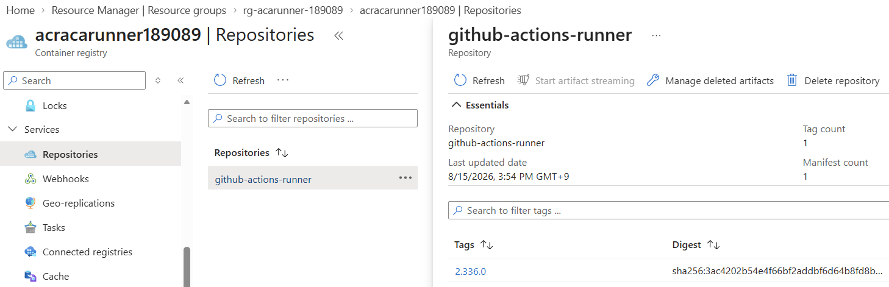

# 03. Runner image 빌드

> Azure Cloud Shell Bash에서 `runner/Dockerfile`과 `runner/entrypoint.sh`를 점검하고, ACR Tasks로 `github-actions-runner:2.336.0` 이미지를 빌드해 다음 모듈의 ACA Job이 pull할 준비를 마칩니다.

## 목표

이 모듈을 완료하면 다음을 할 수 있습니다.

- 저장해 둔 `SUFFIX`와 실제 `ACR` 이름으로 모듈 02의 Azure 변수들을 복구한다.
- `runner/Dockerfile`과 `runner/entrypoint.sh`의 핵심 동작을 이해한다.
- 로컬 정적 검사를 먼저 실행해 runner 스크립트 품질을 확인한다.
- ACR Tasks의 `az acr build`로 cloud build를 수행한다.
- ACR 태그와 보안 설정을 확인해 다음 모듈 입력값을 검증한다.

## 태그 범례

| 태그 | 의미 |
|------|------|
| 🟢 **실행** | 참가자가 직접 입력하거나 수행해야 하는 단계 |
| 👁️ **설명** | 개념 설명 또는 읽기 전용 안내 |
| 📋 **예상 출력** | 실행 결과와 비교할 기준 출력 |
| ⚠️ **주의** | 보안, 비용, 제약 사항 안내 |

## 0. 세션 재연결 시 변수 복구 (선택)

<details>
<summary>세션이 끊겼다면 변수 복구 명령 보기</summary>

👁️ **설명**

Cloud Shell 세션이 끊기면 셸 변수는 사라집니다. 모듈 02에서 기록해 둔 `SUFFIX`와 실제 `ACR` 이름이 있으면 동일한 리소스 이름과 조회형 변수들을 다시 복구할 수 있습니다. `ACR`은 이름 충돌 복구가 있었다면 `SUFFIX`에서 유도되지 않는 별도 값이므로, 모듈 02에서 저장해 둔 실제 `ACR` 값을 그대로 입력하세요.

🟢 **실행**

세션이 그대로라면 건너뛰어도 되지만, 재접속했다면 아래 블록을 그대로 다시 실행합니다.

```bash
read -rp "Saved SUFFIX: " SUFFIX
read -rp "Saved ACR name: " ACR
LOC=koreacentral
RG="rg-acarunner-$SUFFIX"
LOG="log-acarunner-$SUFFIX"
ENV="env-acarunner-$SUFFIX"
UAMI="id-acarunner-$SUFFIX"
JOB="job-ghrunner-$SUFFIX"
IMAGE="github-actions-runner:2.336.0"

LOG_ID=$(az monitor log-analytics workspace show \
  --resource-group "$RG" \
  --workspace-name "$LOG" \
  --query customerId \
  --output tsv)
LOG_RID=$(az monitor log-analytics workspace show \
  --resource-group "$RG" \
  --workspace-name "$LOG" \
  --query id \
  --output tsv)
ENV_ID=$(az containerapp env show \
  --resource-group "$RG" \
  --name "$ENV" \
  --query id \
  --output tsv)
ACR_SERVER=$(az acr show --name "$ACR" --query loginServer --output tsv)
ACR_ID=$(az acr show --name "$ACR" --query id --output tsv)
SUBSCRIPTION_ID=$(az account show --query id --output tsv)
RG_ID=$(az group show \
  --name "$RG" \
  --query id \
  --output tsv)
UAMI_RID=$(az identity show \
  --resource-group "$RG" \
  --name "$UAMI" \
  --query id \
  --output tsv)
UAMI_PID=$(az identity show \
  --resource-group "$RG" \
  --name "$UAMI" \
  --query principalId \
  --output tsv)
UAMI_CLIENT_ID=$(az identity show \
  --resource-group "$RG" \
  --name "$UAMI" \
  --query clientId \
  --output tsv)

export SUFFIX LOC RG LOG ENV ACR UAMI JOB IMAGE LOG_ID LOG_RID ENV_ID ACR_SERVER ACR_ID SUBSCRIPTION_ID RG_ID UAMI_RID UAMI_PID UAMI_CLIENT_ID
printf 'SUFFIX=%s ACR=%s IMAGE=%s\n' "$SUFFIX" "$ACR" "$IMAGE"
```

📋 **예상 출력**

```text
SUFFIX=a1b2c3 ACR=acracarunnera1b2c3 IMAGE=github-actions-runner:2.336.0
```

`ACR` 값은 위 형식이 기본값일 뿐이며, 모듈 02에서 이름 충돌 복구를 했다면 입력한 실제 `ACR` 값이 그대로 출력되어야 합니다.

</details>

## 1. runner 이미지 파일 읽기

👁️ **설명**

이 모듈의 빌드 입력은 아래의 실제 `runner/Dockerfile`과
`runner/entrypoint.sh`입니다. 각 파일의 주석을 따라 이미지 구성, PAT 격리,
일회성 runner 등록과 cleanup 흐름을 확인합니다.

### `runner/Dockerfile`

<!-- BEGIN RUNNER_DOCKERFILE -->
```dockerfile
FROM ghcr.io/actions/actions-runner:2.336.0@sha256:0cfdcc701ce933c6d243c6b0b2da767366dc9f2e99961d4c3754b0b78084cdda

ARG AZURE_CLI_VERSION=2.89.1-1~noble

USER root

# Install the tools required by the runner and Azure deployment workflow.
RUN apt-get update \
    && apt-get install -y --no-install-recommends \
      ca-certificates \
      curl \
      gnupg \
      jq \
      lsb-release \
    && mkdir -p /etc/apt/keyrings \
    && curl --fail --silent --show-error --location \
      https://packages.microsoft.com/keys/microsoft.asc \
      --output /tmp/microsoft.asc \
    && gpg --dearmor \
      --output /etc/apt/keyrings/microsoft.gpg \
      /tmp/microsoft.asc \
    && rm /tmp/microsoft.asc \
    && chmod go+r /etc/apt/keyrings/microsoft.gpg \
    && printf '%s\n' \
      'Types: deb' \
      'URIs: https://packages.microsoft.com/repos/azure-cli/' \
      "Suites: $(lsb_release -cs)" \
      'Components: main' \
      "Architectures: $(dpkg --print-architecture)" \
      'Signed-by: /etc/apt/keyrings/microsoft.gpg' \
      > /etc/apt/sources.list.d/azure-cli.sources \
    && apt-get update \
    && apt-get install -y --no-install-recommends azure-cli="$AZURE_CLI_VERSION" \
    && gpasswd --delete runner sudo \
    && gpasswd --delete runner docker \
    && apt-get clean \
    && rm -rf /var/lib/apt/lists/*

# Copy the registration wrapper without granting write access at runtime.
COPY --chown=root:root entrypoint.sh /home/runner/entrypoint.sh
RUN chmod 0555 /home/runner/entrypoint.sh

# Run the container as the non-root runner user.
USER runner

# Install and verify the Container Apps extension while building the image.
RUN az extension add --name containerapp --upgrade --version 0.3.55 --only-show-errors
RUN az version >/dev/null \
    && az containerapp --help >/dev/null
WORKDIR /home/runner

# Register the ephemeral runner before starting the workflow process.
ENTRYPOINT ["/home/runner/entrypoint.sh"]
```
<!-- END RUNNER_DOCKERFILE -->

### `runner/entrypoint.sh`

<!-- BEGIN RUNNER_ENTRYPOINT -->
```bash
#!/usr/bin/env bash
set -Eeuo pipefail

# Validate required inputs before making any GitHub API request.
required_variables=(
  GITHUB_PAT
  GH_URL
)

for variable_name in "${required_variables[@]}"; do
  if [[ -z "${!variable_name:-}" ]]; then
    printf 'ERROR: %s is required\n' "$variable_name" >&2
    exit 64
  fi
done

# Accept only a canonical GitHub repository URL before deriving API endpoints.
if [[ "$GH_URL" =~ ^https://github\.com/([^/?#]+)/([^/?#]+)$ ]]; then
  github_owner="${BASH_REMATCH[1]}"
  github_repo="${BASH_REMATCH[2]}"
else
  printf 'ERROR: GH_URL must match https://github.com/OWNER/REPO\n' >&2
  exit 64
fi

REGISTRATION_TOKEN_API_URL="https://api.github.com/repos/$github_owner/$github_repo/actions/runners/registration-token"
RUNNER_LABELS="${RUNNER_LABELS:-aca-runner}"
RUNNER_NAME_PREFIX="${RUNNER_NAME_PREFIX:-aca-runner}"
RUNNER_NAME="${RUNNER_NAME_PREFIX}-$(hostname)-${RANDOM}"
REMOVAL_TOKEN_API_URL="${REGISTRATION_TOKEN_API_URL%/registration-token}/remove-token"
CLEANED_UP=0

# Keep the PAT only long enough to prepare short-lived runner tokens.
github_pat="$GITHUB_PAT"
unset GITHUB_PAT
runner_pid=""
removal_token=""

# Exchange the PAT for a short-lived runner registration or removal token.
github_api_token() {
  local url="$1"
  local response
  local authorization_header
  printf -v authorization_header '%s: %s %s' \
    'Authorization' 'Bearer' "$github_pat"
  response="$(
    curl --fail --silent --show-error --request POST \
      --connect-timeout 10 \
      --max-time 30 \
      --header 'Accept: application/vnd.github+json' \
      --header "$authorization_header" \
      --header 'X-GitHub-Api-Version: 2026-03-10' \
      "$url"
  )" || return $?
  jq --exit-status --raw-output \
    '.token | select(type == "string" and length > 0)' <<<"$response"
}

# Deregister the ephemeral runner when the container exits.
cleanup() {
  local cleanup_status=0

  if [[ "$CLEANED_UP" == "1" ]]; then
    return 0
  fi
  CLEANED_UP=1

  if [[ ! -f .runner ]]; then
    return 0
  fi

  set +e
  ./config.sh remove --token "$removal_token"
  cleanup_status=$?
  set -e

  if [[ "$cleanup_status" != "0" ]]; then
    printf 'ERROR: Runner cleanup failed with status %s\n' "$cleanup_status" >&2
  fi
  return 0
}

# Forward termination signals to the runner process and preserve exit semantics.
forward_signal() {
  local signal_name="$1"
  local exit_status="$2"
  if [[ -n "$runner_pid" ]]; then
    kill -s "$signal_name" "$runner_pid" 2>/dev/null || true
    wait "$runner_pid" 2>/dev/null || true
    runner_pid=""
  fi
  exit "$exit_status"
}

trap cleanup EXIT
trap 'forward_signal INT 130' INT
trap 'forward_signal TERM 143' TERM

# Configure a uniquely named, single-use runner with only the custom label.
printf 'Requesting registration token\n'
registration_token="$(github_api_token "$REGISTRATION_TOKEN_API_URL")"
printf 'Requesting removal token\n'
removal_token="$(github_api_token "$REMOVAL_TOKEN_API_URL")"
unset github_pat
unset -f github_api_token

./config.sh \
  --url "$GH_URL" \
  --token "$registration_token" \
  --name "$RUNNER_NAME" \
  --labels "$RUNNER_LABELS" \
  --no-default-labels \
  --unattended \
  --ephemeral \
  --disableupdate

unset registration_token
printf 'Runner configured: %s\n' "$RUNNER_NAME"

# Run one workflow job and return the runner process status to Container Apps.
set +e
./run.sh &
runner_pid=$!
wait "$runner_pid"
runner_status=$?
runner_pid=""
set -e
printf 'Runner process exited with status %s\n' "$runner_status"
exit "$runner_status"
```
<!-- END RUNNER_ENTRYPOINT -->

entrypoint는 workflow runner를 시작하기 전에 PAT를 registration token과
removal token으로 교환한 뒤 PAT와 API helper를 즉시 제거합니다. workflow
프로세스에는 PAT나 두 token을 환경 변수로 전달하지 않으며, cleanup에는
미리 발급한 단기 removal token만 사용합니다.

⚠️ **주의**

base image의 runner version·digest와 문서의 `IMAGE="github-actions-runner:2.336.0"`는 같이 움직여야 합니다. runner version을 올릴 때는 새 manifest digest를 확인하고 ACR image tag도 함께 변경해야 합니다.

## 2. 로컬 정적 검사 먼저 실행

👁️ **설명**

TDD 흐름상 배포 문서를 쓰기 전에 현재 runner artifact가 기대한 상태인지 확인합니다. `entrypoint.sh` 문법, entrypoint 테스트, 문서/샘플 artifact 검사를 순서대로 돌리면 build 원인과 문서 원인을 분리하기 쉽습니다.

🟢 **실행**

```bash
cd ~/aca-github-runner-workshop
bash -n runner/entrypoint.sh
bash tests/runner/test-entrypoint.sh
bash tests/test-artifacts.sh
```

📋 **예상 출력**

- `bash -n runner/entrypoint.sh`는 출력 없이 종료됩니다.
- `bash tests/runner/test-entrypoint.sh`는 `PASS: entrypoint behavior`를 출력합니다.
- `bash tests/test-artifacts.sh`는 `PASS: runner image and workflow artifacts`를 출력합니다.

## 3. ACR Tasks로 runner image 빌드

👁️ **설명**

Cloud Shell에는 Docker daemon이 없어도 됩니다. `az acr build`는 소스 컨텍스트를 ACR Tasks로 보내 Azure 쪽에서 빌드하므로 로컬 Docker 설치나 privileged 권한이 필요 없습니다.

🟢 **실행**

```bash
az acr build \
  --resource-group "$RG" \
  --registry "$ACR" \
  --image "$IMAGE" \
  ./runner
```

📋 **예상 출력**

- 스트리밍 로그가 보이다가 최종적으로 build run ID와 push 완료 메시지가 출력됩니다.
- 빌드가 끝나면 `$ACR_SERVER/github-actions-runner:2.336.0` 이미지가 레지스트리에 존재해야 합니다.

🟢 **실행**

빌드가 끝나면 태그와 보안 설정을 같은 흐름에서 바로 확인합니다.

```bash
az acr repository show-tags \
  --name "$ACR" \
  --repository github-actions-runner \
  --output table

az acr show \
  --name "$ACR" \
  --query "{loginServer:loginServer,adminUserEnabled:adminUserEnabled}" \
  --output table
```

📋 **예상 출력**

- tag 목록에 `2.336.0`이 보여야 합니다.
- `az acr show` 표에는 `loginServer`가 `<registry>.azurecr.io` 형식으로 보이고 `adminUserEnabled`는 반드시 `False`여야 합니다.
- `adminUserEnabled`가 `False`라는 것은 다음 모듈에서 registry admin password 대신 UAMI + `AcrPull`을 사용한다는 뜻입니다.

참고로 Azure Portal 관리 콘솔에서 **Container Registry → Repositories → github-actions-runner**로 이동하면 실제로 push된 image tag와 digest를 확인할 수 있습니다.



## 4. 왜 이 구성을 유지하나요?

👁️ **설명**

| 항목 | 이유 |
|------|------|
| base image pinning | `ghcr.io/actions/actions-runner:2.336.0@sha256:...`처럼 version과 manifest digest를 함께 고정해야 upstream tag 변경에도 워크숍 결과와 트러블슈팅 기준이 흔들리지 않습니다. |
| Azure CLI pinning | image 안의 Azure CLI `2.89.1`과 Container Apps extension `0.3.55`를 함께 고정해 workflow 명령 동작이 build 시점마다 달라지지 않게 합니다. |
| `--disableupdate` | ephemeral runner가 시작될 때마다 self-update를 시도하면 실행 시간이 늘고 재현성이 떨어집니다. 워크숍은 검증된 tag를 새로 빌드해 배포하는 방식을 사용합니다. |
| ACR cloud build | Cloud Shell 로컬 Docker에 의존하지 않고 Azure 쪽에서 build/push를 끝내므로 참가자 환경 편차가 작습니다. |
| non-root 실행 | base image의 `sudo`와 `docker` 그룹에서 `runner`를 제거한 뒤 `USER runner`로 실행합니다. workflow는 container 내부 root 권한으로 상승할 수 없으며 entrypoint도 `root:root`, `0555`로 보호됩니다. |
| Docker CLI 포함, daemon 미포함 | base image에는 Docker CLI와 buildx가 포함되지만 ACA Jobs에는 Docker daemon이나 socket이 없습니다. 따라서 Docker build와 Docker-in-Docker는 동작하지 않으며 이 runner는 일반 workflow job 실행용입니다. |

## 트러블슈팅

| 증상 | 주요 원인 | 해결 방법 |
|------|-----------|-----------|
| `az acr build`가 `unauthorized` 또는 upstream pull 오류로 실패함 | pinned `ghcr.io/actions/actions-runner:2.336.0@sha256:...` pull 과정의 일시적 네트워크 문제 또는 upstream rate/availability 이슈 | 잠시 후 같은 명령을 다시 실행합니다. 장시간 지속되면 `runner/Dockerfile`의 version과 digest가 현재 함께 유효한지 확인합니다. |
| build는 성공했는데 다음 모듈에서 image pull 실패 | `AcrPull` RBAC 전파가 아직 끝나지 않음 | 몇 분 기다린 뒤 `az role assignment list --assignee "$UAMI_PID" --scope "$ACR_ID" --query "[].roleDefinitionName" --output tsv`로 `AcrPull`을 확인하고 Job 생성/업데이트를 다시 시도합니다. |
| `COPY entrypoint.sh` 관련 오류가 남 | 잘못된 build context에서 `az acr build`를 실행함 | 명령 끝 인자가 반드시 `./runner`인지 확인합니다. 루트(`.`)나 다른 경로로 실행하면 Dockerfile 옆 파일 기준이 달라질 수 있습니다. |
| `runner/entrypoint.sh` 또는 테스트 파일을 못 찾음 | 워크숍 저장소 루트가 아닌 위치에서 검사 명령을 실행함 | `cd ~/aca-github-runner-workshop` 후 `ls`로 `runner`, `tests`, `docs`가 보이는지 확인한 다음 다시 실행합니다. |
| runner 버전을 올리고 싶음 | base image tag와 image tag가 서로 안 맞을 수 있음 | `runner/Dockerfile`의 `FROM ghcr.io/actions/actions-runner:<new-version>`과 셸 변수 `IMAGE="github-actions-runner:<new-version>"`를 함께 바꾸고, `bash -n runner/entrypoint.sh`, `bash tests/runner/test-entrypoint.sh`, `bash tests/test-artifacts.sh`, `az acr build ...` 순서로 다시 검증합니다. |

---

[← 이전: Azure 기반 리소스 준비](02-azure-foundation.md) | [다음: Event Job + KEDA 구성 →](04-event-job-keda.md)
