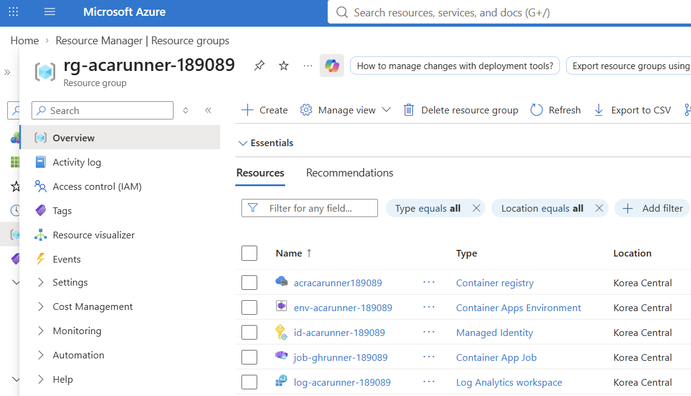

# 04. Event Job + KEDA 구성

> Azure Cloud Shell Bash에서 ACR image, Fine-grained PAT, User-Assigned Managed Identity, KEDA `github-runner` scaler를 연결해 repository-scoped Azure Container Apps Event Job을 배포합니다.

## 목표

이 모듈을 완료하면 다음을 할 수 있습니다.

- 저장해 둔 `SUFFIX`와 실제 `ACR` 이름으로 Azure 변수들을 복구한다.
- 세션이 재시작되었더라도 GitHub owner/repo/Fine-grained PAT를 안전하게 다시 입력한다.
- `github-actions-runner`라는 container name으로 ACA Event Job을 만든다.
- `github-runner` scaler의 execution/scale/auth/metadata 값을 이해한다.
- secret 값을 노출하지 않고 Job 설정과 초기 상태를 검증한다.

## 태그 범례

| 태그 | 의미 |
|------|------|
| 🟢 **실행** | 참가자가 직접 입력하거나 수행해야 하는 단계 |
| 👁️ **설명** | 개념 설명 또는 읽기 전용 안내 |
| 📋 **예상 출력** | 실행 결과와 비교할 기준 출력 |
| ⚠️ **주의** | 보안, 비용, 제약 사항 안내 |

## 0. 세션 재연결 시 변수 복구 (선택)

<details>
<summary>세션이 끊겼다면 변수 복구 명령 보기</summary>

### Azure 리소스 변수

👁️ **설명**

이 모듈은 모듈 02와 03의 출력값을 모두 사용합니다. Cloud Shell을 다시 열었다면 `SUFFIX`를 기준으로 Azure 리소스 이름과 조회형 변수들을 다시 채웁니다. `ACR`은 이름 충돌 복구가 있었다면 `SUFFIX`에서 유도되지 않는 별도 값이므로, 모듈 02에서 저장해 둔 실제 `ACR` 값을 그대로 입력하세요.

🟢 **실행**

```bash
read -rp "Saved SUFFIX: " SUFFIX
read -rp "Saved ACR name: " ACR
LOC=koreacentral
RG="rg-acarunner-$SUFFIX"
LOG="log-acarunner-$SUFFIX"
ENV="env-acarunner-$SUFFIX"
UAMI="id-acarunner-$SUFFIX"
JOB="job-ghrunner-$SUFFIX"
IMAGE="github-actions-runner:2.336.0"

LOG_ID=$(az monitor log-analytics workspace show \
  --resource-group "$RG" \
  --workspace-name "$LOG" \
  --query customerId \
  --output tsv)
LOG_RID=$(az monitor log-analytics workspace show \
  --resource-group "$RG" \
  --workspace-name "$LOG" \
  --query id \
  --output tsv)
ENV_ID=$(az containerapp env show \
  --resource-group "$RG" \
  --name "$ENV" \
  --query id \
  --output tsv)
ACR_SERVER=$(az acr show --name "$ACR" --query loginServer --output tsv)
ACR_ID=$(az acr show --name "$ACR" --query id --output tsv)
SUBSCRIPTION_ID=$(az account show --query id --output tsv)
RG_ID=$(az group show \
  --name "$RG" \
  --query id \
  --output tsv)
UAMI_RID=$(az identity show \
  --resource-group "$RG" \
  --name "$UAMI" \
  --query id \
  --output tsv)
UAMI_PID=$(az identity show \
  --resource-group "$RG" \
  --name "$UAMI" \
  --query principalId \
  --output tsv)
UAMI_CLIENT_ID=$(az identity show \
  --resource-group "$RG" \
  --name "$UAMI" \
  --query clientId \
  --output tsv)

export SUFFIX LOC RG LOG ENV ACR UAMI JOB IMAGE LOG_ID LOG_RID ENV_ID ACR_SERVER ACR_ID SUBSCRIPTION_ID RG_ID UAMI_RID UAMI_PID UAMI_CLIENT_ID
printf 'JOB=%s ENV=%s ACR_SERVER=%s\n' "$JOB" "$ENV" "$ACR_SERVER"
```

📋 **예상 출력**

```text
JOB=job-ghrunner-a1b2c3 ENV=env-acarunner-a1b2c3 ACR_SERVER=acracarunnera1b2c3.azurecr.io
```

`ACR_SERVER`는 입력한 `ACR` 값을 그대로 조회한 결과이므로, 모듈 02에서 이름 충돌 복구를 했다면 다른 registry 이름으로 출력되어야 정상입니다.

### GitHub 인증 변수

👁️ **설명**

Cloud Shell 세션이 재시작되면 GitHub 변수도 사라집니다. 모듈 01에서 승인받고 아직 만료되지 않은 Fine-grained PAT를 다시 읽어 와야 하며, 이 토큰은 `aca-runner-lab` private repository 하나에만 접근 권한이 있어야 합니다.

🟢 **실행**

```bash
read -rp "GitHub owner: " GITHUB_OWNER
read -rp "Private repository name: " GITHUB_REPO

GITHUB_PAT=
until [[ -n "$GITHUB_PAT" ]]; do
  read -rsp "Fine-grained PAT: " GITHUB_PAT
  printf '\n'
  [[ -n "$GITHUB_PAT" ]] ||
    printf 'ERROR: Fine-grained PAT cannot be empty. Try again.\n' >&2
done
```

📋 **예상 출력**

- 프롬프트는 owner, repository, Fine-grained PAT를 순서대로 요청합니다.
- 입력하는 PAT는 모듈 01에서 검증한 approved, unexpired 토큰이어야 하며, lab repository 하나에만 접근할 수 있어야 합니다.

</details>

## 1. 기존 Job과 중복 queue watcher 확인

👁️ **설명**

같은 GitHub repository와 `aca-runner` label을 감시하는 이전 Event Job이 남아
있으면, 새 Job과 동시에 runner를 만들고 queued workflow를 먼저 가져갈 수
있습니다. 그러면 새 execution은 Job을 받지 못한 채 대기하다가
`--replica-timeout 900`에 도달해 `Failed`로 끝날 수 있습니다.

먼저 현재 구독의 Container Apps Job 중 동일한 repository와 label을 감시하는
Job을 찾습니다.

🟢 **실행**

```bash
az containerapp job list \
  --query "[?properties.configuration.eventTriggerConfig.scale.rules[?metadata.owner=='$GITHUB_OWNER' && metadata.repos=='$GITHUB_REPO' && metadata.labels=='aca-runner']].{Name:name,ResourceGroup:resourceGroup}" \
  --output table
```

📋 **예상 출력**

- 처음 실습하는 repository라면 행이 없어야 합니다.
- 다른 이름 또는 다른 Resource Group의 Job이 보이면 **여기서 중단**합니다.
  동일한 repository와 label을 감시하는 이전 Job을 정리하거나, 새 private
  lab repository를 준비한 뒤 진행하세요.

같은 `$RG`에 현재 `$JOB`이 이미 있다면 새로 만들기 전에 이 워크숍 Job만
삭제합니다.

```bash
if az containerapp job show --name "$JOB" --resource-group "$RG" --output none 2>/dev/null; then
  az containerapp job delete \
    --name "$JOB" \
    --resource-group "$RG" \
    --yes
fi
```

⚠️ **주의**

Job 설정 오류를 복구할 때는 Resource Group 전체를 다시 만들지 말고 이 워크숍 Job만 삭제 후 재생성합니다.

## 2. ACA Event Job 생성

👁️ **설명**

이 워크숍은 queued workflow가 생겼을 때만 runner를 띄우는 Event Job을 사용합니다. runner container 이름은 문서, 검증, 로그 해석을 통일하기 위해 반드시 `github-actions-runner`로 고정합니다. 아래 `AZURE_*` 값은 Azure 리소스를 식별하는 환경 변수이며 credential이 아닙니다. 실제 인증은 workflow가 실행 중 managed-identity endpoint에서 short-lived Azure token을 받아 처리합니다.

🟢 **실행**

```bash
JOB_CREATE_ARGS=(
  # Job 이름과 배포할 Resource Group, Container Apps Environment를 지정합니다.
  --name "$JOB"
  --resource-group "$RG"
  --environment "$ENV"

  # schedule이 아니라 queued workflow 이벤트를 감시하는 Event Job을 만듭니다.
  --trigger-type Event

  # runner는 최대 900초 실행하며, 실패 시 ACA가 replica를 자동 재시도하지 않습니다.
  --replica-timeout 900
  --replica-retry-limit 0

  # replica 1개가 완료되면 execution을 완료하고, execution마다 runner 1개만 실행합니다.
  --replica-completion-count 1
  --parallelism 1

  # 로그와 상태에서 확인할 container 이름과 모듈 03에서 만든 ACR image를 지정합니다.
  --container-name github-actions-runner
  --image "$ACR_SERVER/$IMAGE"

  # queue가 비어 있으면 execution을 0개로 유지합니다.
  --min-executions 0

  # 동시에 최대 5개 execution까지 scale-out하고 GitHub queue를 30초마다 확인합니다.
  --max-executions 5
  --polling-interval 30

  # GitHub Actions queue 전용 KEDA scaler와 식별 이름을 지정합니다.
  --scale-rule-name github-runner
  --scale-rule-type github-runner

  # GitHub.com API에서 지정한 private repository와 aca-runner custom label만 감시합니다.
  --scale-rule-metadata \
  "githubApiURL=https://api.github.com"
  "owner=$GITHUB_OWNER"
  "runnerScope=repo"
  "repos=$GITHUB_REPO"
  "labels=aca-runner"
  "noDefaultLabels=true"

  # queued workflow job 1개당 execution 1개가 필요하다고 계산합니다.
  "targetWorkflowQueueLength=1"

  # scaler는 Job secret에 저장된 Fine-grained PAT로 GitHub queue를 조회합니다.
  --scale-rule-auth "personalAccessToken=personal-access-token"
  --secrets "personal-access-token=$GITHUB_PAT"

  # entrypoint는 같은 secret으로 short-lived runner token을 발급한 뒤
  # workflow process를 시작하기 전에 exported GITHUB_PAT를 제거합니다.
  --env-vars
  "GITHUB_PAT=secretref:personal-access-token"
  "AZURE_CLIENT_ID=$UAMI_CLIENT_ID"
  "AZURE_SUBSCRIPTION_ID=$SUBSCRIPTION_ID"
  "AZURE_RESOURCE_GROUP=$RG"
  "AZURE_CONTAINERAPPS_ENVIRONMENT=$ENV"
  "AZURE_SAMPLE_APP=hello-aca-$SUFFIX"
  "GH_URL=https://github.com/$GITHUB_OWNER/$GITHUB_REPO"
  "RUNNER_LABELS=aca-runner"
  "RUNNER_NAME_PREFIX=aca"

  # Job에 UAMI를 연결하고 같은 identity의 AcrPull 권한으로 ACR image를 가져옵니다.
  --registry-server "$ACR_SERVER"
  --mi-user-assigned "$UAMI_RID"
  --registry-identity "$UAMI_RID"

  # execution 하나가 사용할 고정 CPU와 memory 크기입니다.
  --cpu 2.0
  --memory 4Gi

  # 성공 시 별도 JSON을 출력하지 않습니다.
  --output none
)

az containerapp job create "${JOB_CREATE_ARGS[@]}"
unset JOB_CREATE_ARGS GITHUB_PAT
```

📋 **예상 출력**

- 명령은 `--output none` 때문에 정상 시 별도 JSON 없이 종료됩니다.
- 실패 없이 반환되면 Event Job 정의가 저장된 것입니다. 실제 execution은 workflow가 queued 되기 전까지 생성되지 않을 수 있습니다.

🟢 **실행**

배포 직후 Job configuration과 초기 execution 상태를 같은 흐름에서 확인합니다. `job show`는 secret 값을 조회하지 않으므로 PAT가 다시 출력되지 않습니다.

```bash
az containerapp job show \
  --name "$JOB" \
  --resource-group "$RG" \
  --query "{
    triggerType:properties.configuration.triggerType,
    replicaTimeout:properties.configuration.replicaTimeout,
    minExecutions:properties.configuration.eventTriggerConfig.scale.minExecutions,
    maxExecutions:properties.configuration.eventTriggerConfig.scale.maxExecutions,
    pollingInterval:properties.configuration.eventTriggerConfig.scale.pollingInterval,
    rules:properties.configuration.eventTriggerConfig.scale.rules,
    image:properties.template.containers[0].image
  }" \
  --output yaml

az containerapp job execution list \
  --name "$JOB" \
  --resource-group "$RG" \
  --output table
```

📋 **예상 출력**

`az containerapp job show` 결과에는 최소한 아래 성격이 보여야 합니다.

```yaml
triggerType: Event
replicaTimeout: 900
minExecutions: 0
maxExecutions: 5
pollingInterval: 30
image: <registry>.azurecr.io/github-actions-runner:2.336.0
rules:
  - name: github-runner
    type: github-runner
```

`az containerapp job execution list`는 workflow를 아직 queue에 넣지 않았다면 표 헤더만 나오거나 행이 0개일 수 있습니다. **배포 직후 active execution이 없는 것이 정상**입니다.

참고로 Azure Portal 관리 콘솔에서 해당 Resource Group의 **Overview**를 열면 `job-ghrunner-<suffix>` 리소스가 **Container App Job** 유형으로 생성된 것을 확인할 수 있습니다.



## 3. GitHub 쪽에서 미리 확인할 것

👁️ **설명**

GitHub 저장소의 **Settings → Actions → Runners**를 열어보면, workflow를 아직 queue에 넣기 전에는 permanently online runner가 없어도 정상입니다. 이 워크숍의 runner는 Event Job이 queued workflow를 감지했을 때만 잠깐 생성되고, job이 끝나면 ephemeral runner도 사라집니다.

⚠️ **주의**

워크숍 시작 전에 runner를 수동으로 미리 등록해 둘 필요가 없습니다. 항상 queue를 트리거로 생성되는지 확인해야 `0 → N → 0` 검증이 가능합니다.

## 트러블슈팅

| 증상 | 주요 원인 | 해결 방법 |
|------|-----------|-----------|
| workflow가 계속 queued이고 execution이 안 생김 | 토큰이 만료되었거나 revoked 되었거나 approval 대기 중이거나, 잘못된 selected repository 기준으로 발급됨 | 모듈 01에서 승인받은 Fine-grained PAT를 다시 확인하고, `aca-runner-lab` repository 하나만 선택된 unexpired 토큰인지 점검한 뒤 필요하면 Job을 다시 만듭니다. |
| `job show`의 rule은 보이는데 scale이 안 됨 | scaler metadata 오타 또는 잘못된 auth 매핑 | `githubApiURL=https://api.github.com`, `owner`, `runnerScope=repo`, `repos=$GITHUB_REPO`, `labels=aca-runner`, `noDefaultLabels=true`, `targetWorkflowQueueLength=1`, `personalAccessToken`이 정확한지 `az containerapp job show ... --query "properties.configuration.eventTriggerConfig.scale.rules"`로 다시 확인합니다. |
| execution은 생겼는데 GitHub job이 runner를 못 잡음 | workflow label과 runner label 불일치 | workflow의 `runs-on`에 `aca-runner`가 들어 있는지, Job env가 `RUNNER_LABELS=aca-runner`인지 동시에 확인합니다. |
| workflow는 성공했지만 현재 execution이 900초 뒤 `Failed`가 됨 | 다른 Event Job이 동일한 repository와 `aca-runner` label을 감시하며 workflow Job을 먼저 가져감 | 1단계의 `az containerapp job list` query를 다시 실행합니다. 다른 Job이 보이면 해당 이전 실습 Job을 정리하거나 새 lab repository를 사용한 뒤 현재 Job을 다시 만듭니다. |
| execution이 바로 실패하며 image pull 오류가 남 | UAMI의 `AcrPull` 전파 지연 또는 registry identity 설정 누락 | `az role assignment list --assignee "$UAMI_PID" --scope "$ACR_ID" --query "[].roleDefinitionName" --output tsv`로 `AcrPull`을 확인하고, Job 정의에 `--mi-user-assigned "$UAMI_RID"`와 `--registry-identity "$UAMI_RID"`가 모두 들어갔는지 다시 봅니다. |
| execution이 곧바로 인증 오류로 끝남 | Job secret과 runner env가 오래된 토큰을 가리키거나 잘못된 토큰이 입력됨 | 모듈 01에서 확인한 PAT를 다시 로드하고 이 워크숍 Job만 삭제 후 다시 만들어 secret과 runner env를 함께 갱신합니다. |
| GitHub API에서 403 또는 registration token 발급 실패 | 권한 부족 또는 organization approval 누락 | 토큰 권한이 `Actions: Read-only`, `Administration: Read and write`, `Metadata: Read-only`인지 확인하고, organization 승인 절차가 있다면 승인 상태도 다시 확인합니다. |
| `unrecognized arguments` 또는 help와 문서가 다름 | Cloud Shell의 containerapp extension 버전이 워크숍 기준과 다름 | 모듈 01의 `az extension add --name containerapp --upgrade --version 0.3.55 --only-show-errors`를 다시 실행하고 `az version`으로 버전을 확인한 뒤 명령을 재시도합니다. |
| 방금 토큰을 rotation했는데도 실패가 계속됨 | ACA secret과 runner env가 이전 토큰을 계속 사용 중 | 새 PAT를 다시 로드한 뒤 Job 하나만 삭제 후 이 모듈을 다시 실행해 ACA secret과 두 consumer를 모두 새 토큰으로 맞춥니다. 리소스 그룹 전체를 다시 만들 필요는 없습니다. |

---

[← 이전: Runner image 빌드](03-runner-image.md) | [다음: 병렬 실행과 스케일 검증 →](05-parallel-scale-validation.md)
