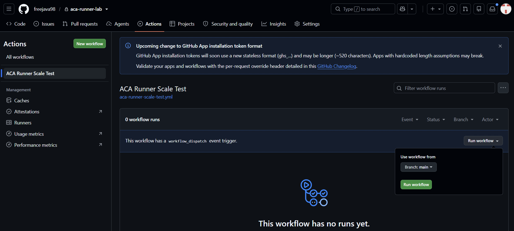

# 05. 병렬 실행과 스케일 검증

> Azure Cloud Shell Bash와 GitHub 웹 UI를 함께 사용해 matrix 4 Job을 큐에 넣고, Azure Container Apps Event Job이 `0 → N → 0`으로 scale-out/scale-in 되는지 확인합니다. 이 모듈은 active execution과 완료 이력을 구분하고, CLI 로그와 Log Analytics KQL 모두에서 ephemeral runner lifecycle marker를 검증하는 데 초점을 둡니다.

## 목표

이 모듈을 완료하면 다음을 할 수 있습니다.

- `samples/parallel-runner-workflow.yml` 전체를 확인한 뒤 GitHub 웹 UI로 workflow를 만든다.
- 브라우저 기반 workflow 작성과 GitHub App installation runner 인증 경로를 분리하는 이유를 설명할 수 있다.
- execution 이력과 현재 active execution을 구분해 `0 → N → 0` 상태를 읽는다.
- `az containerapp job logs show`와 `ContainerAppConsoleLogs` KQL로 runner lifecycle marker를 확인한다.
- GitHub Actions와 **Settings → Actions → Runners**에서 ephemeral runner가 영구 온라인 상태로 남지 않았는지 검증한다.

## 0. 세션 재연결 시 변수 복구 (선택)

<details>
<summary>세션이 끊겼다면 변수 복구 명령 보기</summary>

👁️ **설명**

같은 Cloud Shell 세션을 계속 사용 중이라면 이 절은 건너뛰어도 됩니다. 세션이 끊겼거나 다른 브라우저/탭으로 다시 들어왔다면, Module 01에서 저장한 `SUFFIX`를 그대로 다시 넣어 scale validation에 필요한 Job과 Log Analytics 값만 복원합니다. 여기서는 새 suffix를 만들지 말고, 처음 실습에 사용한 값을 다시 넣어야 기존 Job/Log Analytics 조회가 정확히 이어집니다.

🟢 **실행**

```bash
# 저장한 suffix로 scale validation에 필요한 Job과 Log Analytics 값을 복원합니다.
read -rp "Saved SUFFIX: " SUFFIX
RG="rg-acarunner-$SUFFIX"
LOG="log-acarunner-$SUFFIX"
JOB="job-ghrunner-$SUFFIX"
LOG_ID=$(az monitor log-analytics workspace show \
  --resource-group "$RG" \
  --workspace-name "$LOG" \
  --query customerId \
  --output tsv)

export SUFFIX RG LOG JOB LOG_ID
printf 'RG=%s\nLOG=%s\nJOB=%s\nLOG_ID=%s\n' \
  "$RG" "$LOG" "$JOB" "$LOG_ID"
```

📋 **예상 출력**

- `RG`, `LOG`, `JOB`는 원래 만든 리소스 이름으로 다시 채워집니다.
- `LOG_ID`에는 Log Analytics workspace customer ID가 들어갑니다.
- 값이 비어 있거나 조회가 실패하면 SUFFIX 오타 여부와 원래 실습에서 사용한 suffix 기록을 다시 확인합니다.

</details>

## 1. 샘플 workflow를 Cloud Shell에서 열고 GitHub 웹 UI로 생성

👁️ **설명**

이 워크숍은 로컬 편집기나 `git push` 대신 GitHub 웹 UI로 workflow 파일을 만듭니다. 이렇게 하면 browser-based workflow creation이 repository-write activity를 처리하고, 모듈 04에서 준비한 GitHub App installation과 Key Vault-backed private key는 queue monitoring과 runner bootstrap 용도로만 남겨 둘 수 있습니다. 즉 Cloud Shell에 별도의 repository write credential을 둘 필요가 없습니다.

모듈 04의 Event Job은 `GITHUB_APP_ID`, `GITHUB_APP_INSTALLATION_ID`, `applicationID`, `installationID`, `appKey`를 KEDA queue monitoring과 runner bootstrap에 연결합니다. 이 모듈은 그 foundation 위에서 queue-driven scale만 검증합니다.

Module 04의 Event Job에는 이미 `AZURE_STORAGE_ACCOUNT`, `AZURE_STORAGE_CONTAINER`가 설정되어 있습니다. Storage와 Key Vault는 `Microsoft.Storage`, `Microsoft.KeyVault` service endpoint와 ACA subnet rule로 제한되며, DNS는 계속 public service IP를 가리킵니다. 이 모듈은 그 foundation 위에서 queue-driven scale만 검증합니다. Jobs do not support ingress 이므로 이번 검증 대상은 public inbound endpoint가 아니라 queued workflow를 처리하는 ephemeral runner lifecycle입니다.

🟢 **실행**

```bash
# reviewed scale-test workflow를 Cloud Shell에서 확인한 뒤 GitHub 웹 UI에 복사합니다.
cd ~/aca-github-runner-workshop
sed -n '1,200p' samples/parallel-runner-workflow.yml
```

이제 private lab repository의 GitHub 웹 UI에서 다음 순서로 진행합니다.

1. `.github/workflows/aca-runner-scale-test.yml`이 없으면 **Add file → Create new file**을 선택하고 해당 파일 이름을 입력합니다.
2. 기존 workflow가 이미 있으면 파일을 연 뒤 **Edit this file**을 선택합니다.
3. 두 경우 모두 기존 내용을 일부만 수정하지 말고, 방금 Cloud Shell에 출력한 `samples/parallel-runner-workflow.yml` 전체 내용으로 교체합니다.
4. `runs-on: [aca-runner]`인지 다시 확인하고 기본 브랜치에 commit합니다.

⚠️ **주의**

CLI에서 workflow를 commit/push하려고 Cloud Shell에 별도의 repository write credential을 추가하지 마세요. 이 모듈은 **웹 UI로만 workflow를 생성**해 browser session의 repository-write 활동과 GitHub App installation 기반 queue monitoring/runner bootstrap 경로를 분리합니다.

이전 실습처럼 `self-hosted`, `linux`, `x64` default label을 `aca-runner`와
함께 요구하는 `runs-on` 배열을 그대로 두면 `noDefaultLabels=true`인 현재
KEDA scaler가 해당 queued Job을 세지 않습니다. 이 경우 workflow는 queued
상태로 남고 ACA execution도 생성되지 않으므로 반드시 최신 sample 전체로
교체하세요.

📋 **예상 출력**

- Cloud Shell에는 workflow YAML 전체가 출력됩니다.
- GitHub에는 `.github/workflows/aca-runner-scale-test.yml`가 새로 생기고 workflow 이름이 **ACA Runner Scale Test**로 보입니다.

## 2. 실행 전 baseline 이력과 active execution 0 상태 확인

👁️ **설명**

`az containerapp job execution list`는 **완료 이력**도 함께 보여 줍니다. 따라서 표에 완료된 record가 남아 있어도 이상이 아닙니다. 중요한 것은 지금 이 순간 `properties.status=='Running'`인 active execution 수가 0인지입니다.

🟢 **실행**

```bash
# workflow 실행 전 최근 이력과 Running execution이 0개인 baseline을 확인합니다.
az containerapp job execution list \
  --name "$JOB" \
  --resource-group "$RG" \
  --query "[].{Name:name,Status:properties.status,Start:properties.startTime,End:properties.endTime}" \
  --output table
```

📋 **예상 출력**

- 최초 실행처럼 execution 이력이 없다면 명령 출력 없이 다음 프롬프트로
  돌아올 수 있습니다.
- 이전 실행 이력이 있다면 끝난 execution이 `Succeeded`/`Failed` 상태로
  남아 있을 수 있습니다.
- 이 단계에서는 **active execution이 0인 상태가 정상**입니다.
- 즉, history는 남을 수 있지만 현재 처리 중인 execution이 없다는 점을 먼저 구분해야 합니다.

## 3. GitHub Actions에서 `ACA Runner Scale Test`를 수동 실행

👁️ **설명**

이 워크숍은 `workflow_dispatch`를 사용합니다. GitHub Actions 화면에서 직접 큐를 만들어야 KEDA scaler가 queued workflow를 감지합니다.

🟢 **실행**

GitHub repository에서 **Actions → ACA Runner Scale Test → Run workflow**를 선택하고 기본 브랜치에서 실행합니다.

> **참고 화면:** **Run workflow** 메뉴에서 기본 브랜치를 선택하고 실행 버튼을 누르기 직전의 GitHub Actions 화면입니다.



📋 **예상 출력**

- GitHub Actions 실행 목록에 `ACA Runner Scale Test`가 새로 생성됩니다.
- 잠시 후 matrix로 분기된 `Worker 1`부터 `Worker 4`까지 네 개의 GitHub job이 queued/running 상태로 보이기 시작합니다.

> **참고 화면:** workflow를 수동 실행한 직후 네 개의 matrix Job이 `Queued` 상태로 생성된 모습입니다.


## 4. 첫 30~90초 동안 Running execution만 반복 조회

👁️ **설명**

KEDA polling 간격은 30초이고, runner가 시작되는 데도 약간의 시간이 필요합니다. 따라서 polling 순간에 따라 1개만 보일 수도 있고, 4개까지 보일 수도 있습니다. **항상 네 개가 동시에 화면에 보여야 한다고 약속하면 안 됩니다.**

🟢 **실행**

처음 30~90초 동안 아래 명령을 몇 번 반복합니다.

```bash
# scale-out 구간의 상태 변화를 보기 위해 Running execution만 시간순으로 반복 조회합니다.
az containerapp job execution list \
  --name "$JOB" \
  --resource-group "$RG" \
  --query "[?properties.status=='Running'].{Name:name,Status:properties.status,Start:properties.startTime}" \
  --output table
```

📋 **예상 출력**

실제 실행에서 네 execution이 같은 시각에 시작되면 다음과 같이 보일 수 있습니다.

```text
Name                       Status    Start
-------------------------  --------  -------------------------
job-ghrunner-717094-c5jhk  Running   2026-08-22T14:40:22+00:00
job-ghrunner-717094-db6km  Running   2026-08-22T14:40:22+00:00
job-ghrunner-717094-jkjx4  Running   2026-08-22T14:40:22+00:00
job-ghrunner-717094-v2rz4  Running   2026-08-22T14:40:22+00:00
```

- execution 이름의 suffix와 시작 시각은 실행할 때마다 달라집니다.
- 조회 시점에 따라 `Running` execution이 **1개에서 4개 사이**로 보일 수 있습니다.
- polling 타이밍과 startup timing 때문에 네 execution이 동시에 보이지 않아도 정상입니다.
- 중요한 검증 포인트는 queued GitHub job에 맞춰 active execution이 늘어났다가 나중에 다시 0으로 돌아오는지입니다.

## 5. 가장 최근 execution을 잡아 CLI 로그 확인

👁️ **설명**

`az containerapp job logs show`는 execution 하나의 컨테이너 로그를 바로 확인할 때 가장 빠릅니다. 이 모듈에서는 컨테이너 이름을 **반드시** `github-actions-runner`로 지정합니다.

🟢 **실행**

```bash
# 가장 최근 execution 이름을 조회해 뒤의 CLI·Log Analytics 필터 기준으로 저장합니다.
EXECUTION=$(az containerapp job execution list \
  --name "$JOB" \
  --resource-group "$RG" \
  --query "sort_by([], &properties.startTime)[-1].name" \
  --output tsv)

# execution을 찾지 못하면 잘못된 이름으로 로그를 조회하지 않고 명확히 중단합니다.
if [[ -z "$EXECUTION" ]]; then
  printf 'ERROR: Container Apps Job execution이 없습니다.\n' >&2
  printf 'GitHub workflow가 queued라면 runs-on이 [aca-runner]인지 확인하고 최신 sample로 교체한 뒤 다시 실행하세요.\n' >&2
else
  # 선택한 execution의 runner container stdout·stderr를 최근 100줄까지 확인합니다.
  az containerapp job logs show \
    --name "$JOB" \
    --resource-group "$RG" \
    --execution "$EXECUTION" \
    --container github-actions-runner \
    --tail 100 \
    --format text
fi
```

📋 **예상 출력**

- 최신 execution 이름이 `job-ghrunner-<suffix>-...` 같은 형식으로 `EXECUTION` 변수에 들어갑니다.
- `ERROR: Container Apps Job execution이 없습니다.`가 보이면 6단계로 진행하지 말고 GitHub workflow가 `runs-on: [aca-runner]`인지 수정한 뒤 workflow를 다시 실행합니다.
- 조회 시점에 따라 GitHub Actions worker가 bash step을 준비하고 실행하는 내부
  로그가 다음과 같이 보일 수 있습니다.

```text
2026-08-19T05:11:29.3957554Z stdout F [WORKER 2026-08-19 05:11:29Z INFO HostContext] Well known directory 'Root': '/home/runner'
2026-08-19T05:11:29.3969009Z stdout F [WORKER 2026-08-19 05:11:29Z INFO HostContext] Well known directory 'Work': '/home/runner/_work'
2026-08-19T05:11:29.3970193Z stdout F [WORKER 2026-08-19 05:11:29Z INFO HostContext] Well known directory 'Temp': '/home/runner/_work/_temp'
2026-08-19T05:11:29.3971397Z stdout F [WORKER 2026-08-19 05:11:29Z INFO ScriptHandler] Which2: 'bash'
2026-08-19T05:11:29.3973315Z stdout F [WORKER 2026-08-19 05:11:29Z INFO ScriptHandler] Location: '/usr/bin/bash'
2026-08-19T05:11:29.3973409Z stdout F [WORKER 2026-08-19 05:11:29Z INFO ProcessInvokerWrapper] Starting process:
2026-08-19T05:11:29.3973465Z stdout F [WORKER 2026-08-19 05:11:29Z INFO ProcessInvokerWrapper]   File name: '/usr/bin/bash'
2026-08-19T05:11:29.3973489Z stdout F [WORKER 2026-08-19 05:11:29Z INFO ProcessInvokerWrapper]   Arguments: '--noprofile --norc -e -o pipefail /home/runner/_work/_temp/7ae4b711-8656-450a-ad26-701e69261ce5.sh'
2026-08-19T05:11:29.3973511Z stdout F [WORKER 2026-08-19 05:11:29Z INFO ProcessInvokerWrapper]   Working directory: '/home/runner/_work/aca-runner-lab/aca-runner-lab'
2026-08-19T05:11:29.4002129Z stdout F [WORKER 2026-08-19 05:11:29Z INFO ProcessInvokerWrapper] Process started with process id 108, waiting for process exit.
2026-08-19T05:11:30.6453925Z stdout F [WORKER 2026-08-19 05:11:30Z INFO JobServerQueue] Got a step log file to send to results service.
2026-08-19T05:11:30.6712836Z stdout F [WORKER 2026-08-19 05:11:30Z INFO JobServerQueue] Try to upload 2 log files or attachments, success rate: 2/2.
```

- timestamp, 임시 script UUID, PID와 repository 작업 경로는 실행마다 달라집니다.
- `--tail 100` 구간에 따라 `Runner configured`, `Runner process exited`가
  보이지 않을 수 있습니다. lifecycle marker는 6단계의
  Log Analytics 조회로 다시 확인합니다.

## 6. Log Analytics에서 resource-specific `ContainerAppConsoleLogs`를 KQL로 확인

👁️ **설명**

CLI 로그가 한 execution을 빠르게 보는 용도라면, Log Analytics는 시간순으로
누적 로그를 검토하는 데 적합합니다. 이 워크숍은 legacy 테이블이 아니라
resource-specific `ContainerAppConsoleLogs`를 사용합니다.

Log Analytics ingestion은 즉시 완료되지 않을 수 있습니다. execution 직후
상세 query가 비어 있으면 먼저 최대 10분 동안 30초 간격으로 실제 로그 유입을
확인합니다. 실제 테스트에서도 마지막 로그가 Log Analytics에 나타나기까지
약 6분이 걸릴 수 있었습니다.

resource-specific `ContainerAppConsoleLogs`의 `JobName` 열로 현재 ACA Job 로그만 조회합니다. workspace 전체 로그를 세거나 오래된 `$EXECUTION` prefix에 의존하면 다른 Container Apps 로그를 현재 실행 로그로 잘못 판단할 수 있습니다.

대기 중 `Ctrl+C`를 눌러도 Cloud Shell 전체가 종료되지 않도록 polling을 함수로
격리하고 조건문 안에서 호출합니다. 이전 모듈에서 `set -e`가 활성화된 세션도
중단 상태를 함수의 반환값으로만 처리합니다.

🟢 **실행**

```bash
# Ctrl+C나 timeout이 현재 Cloud Shell을 종료하지 않도록 대기와 조회를 함수로 격리합니다.
wait_for_containerapp_console_logs() {
  local log_wait_timeout_seconds=600
  local log_wait_interval_seconds=30
  local log_wait_deadline=$((SECONDS + log_wait_timeout_seconds))
  local log_count=0
  local log_wait_interrupted=0

  trap 'log_wait_interrupted=1' INT

  while (( SECONDS <= log_wait_deadline )); do
    if ! log_count=$(az monitor log-analytics query \
      --workspace "$LOG_ID" \
      --analytics-query "
        ContainerAppConsoleLogs
        | where TimeGenerated > ago(2h)
        | where JobName == '$JOB'
        | summarize Count=count()
      " \
      --query "[0].Count" \
      --output tsv); then
      if (( log_wait_interrupted )); then
        trap - INT
        return 130
      fi
      printf 'ERROR: Log Analytics ingestion 확인 query가 실패했습니다.\n' >&2
      trap - INT
      return 1
    fi

    if (( log_wait_interrupted )); then
      trap - INT
      return 130
    fi

    if [[ "$log_count" =~ ^[0-9]+$ ]] && (( log_count > 0 )); then
      printf 'Log Analytics ingestion ready: %s rows\n' "$log_count"
      break
    fi

    if (( SECONDS >= log_wait_deadline )); then
      break
    fi

    printf 'Log Analytics ingestion pending; %s초 후 다시 확인합니다.\n' \
      "$log_wait_interval_seconds"
    if ! sleep "$log_wait_interval_seconds"; then
      if (( log_wait_interrupted )); then
        trap - INT
        return 130
      fi
      printf 'ERROR: Log Analytics ingestion 대기 중 sleep이 실패했습니다.\n' >&2
      trap - INT
      return 1
    fi
  done

  if [[ ! "$log_count" =~ ^[0-9]+$ ]] || (( log_count == 0 )); then
    printf '%s\n' \
      'ERROR: ContainerAppConsoleLogs가 10분 안에 수집되지 않았습니다.' \
      'LOG_ID와 Module 02의 aca-runner-logs diagnostic setting을 확인하세요.' >&2
    trap - INT
    return 1
  fi

  # 로그 유입이 확인되면 replica별 건수와 마지막 수집 시각을 출력합니다.
  if ! az monitor log-analytics query \
    --workspace "$LOG_ID" \
    --analytics-query "
      ContainerAppConsoleLogs
      | where TimeGenerated > ago(2h)
      | where JobName == '$JOB'
      | summarize Count=count(), LastSeen=max(TimeGenerated)
          by ContainerGroupName
      | order by LastSeen desc
    " \
    --output table; then
    printf 'ERROR: replica별 Log Analytics 집계 query가 실패했습니다.\n' >&2
    trap - INT
    return 1
  fi

  trap - INT
  return 0
}

if wait_for_containerapp_console_logs; then
  true
else
  LOG_WAIT_STATUS=$?
  if (( LOG_WAIT_STATUS == 130 )); then
    printf 'INFO: Log Analytics 대기를 중단했습니다. Cloud Shell 세션은 유지됩니다.\n'
  else
    printf 'ERROR: 문제를 해결한 뒤 6단계의 첫 번째 실행 블록만 다시 실행하세요.\n' >&2
  fi
  unset LOG_WAIT_STATUS
fi

unset -f wait_for_containerapp_console_logs
```

⚠️ **주의**

- 대기 중 중단하려면 `Ctrl+C`를 한 번 누르세요. 함수만 종료되고 Cloud Shell prompt로 돌아옵니다.
- Cloud Shell에 직접 붙여 넣는 실행 블록에서는 `exit`를 사용하면 현재 셸 세션까지 종료되므로 `return`으로 함수만 끝냅니다.

📋 **예상 출력**

```text
Log Analytics ingestion pending; 30초 후 다시 확인합니다.
Log Analytics ingestion ready: 8212 rows

ContainerGroupName               Count    LastSeen                      TableName
-------------------------------  -------  ----------------------------  -------------
job-ghrunner-145945-xh6w5-phfkj  2058     2026-08-19T05:12:18.2470166Z  PrimaryResult
job-ghrunner-145945-bbqc9-m97mq  1867     2026-08-19T05:12:17.8271544Z  PrimaryResult
```

- replica suffix, `Count`, `LastSeen`은 실행과 수집 시점마다 달라집니다.
- 로그가 이미 수집되었다면 `pending` 줄 없이 바로 `ready`와 집계 표가 출력됩니다.
- 현재 `$JOB`에서 생성된 replica별 `ContainerGroupName`과 수집 시각을 확인한
  다음 상세 로그를 조회합니다.

🟢 **실행**

```bash
# 현재 ACA Job의 최근 2시간 상세 console log를 시간순으로 조회합니다.
az monitor log-analytics query \
  --workspace "$LOG_ID" \
  --analytics-query "
    ContainerAppConsoleLogs
    | where TimeGenerated > ago(2h)
    | where JobName == '$JOB'
    | project TimeGenerated, ContainerGroupName, Log
    | order by TimeGenerated asc
  " \
  --output table
```

📋 **예상 출력**

- `ContainerAppConsoleLogs` 표에서 현재 `$JOB`에 속한 최근 2시간의 replica 로그가 시간순으로 출력됩니다.
- CLI에서 확인한 execution을 포함해 같은 ACA Job에서 생성된 메시지를 Azure Monitor 쪽에서도 재확인할 수 있습니다.
- GitHub Actions는 성공했지만 결과가 비어 있으면 `LOG_ID`, diagnostic setting, `JobName` 값을 다시 확인하고 몇 분 뒤 같은 query를 재실행합니다.

## 7. GitHub에서 네 개 Job 성공과 runner hostname 차이 확인

👁️ **설명**

workflow 샘플의 `Show runner identity` 단계는 각 job이 어떤 hostname에서 실행되었는지 남깁니다. concurrency가 허용된 구간에서는 서로 다른 runner hostname이 보여야 scale-out evidence로 쓰기 좋습니다.

🟢 **실행**

GitHub Actions 실행 화면에서 `Worker 1` ~ `Worker 4` 로그를 열고 `Show runner identity` 단계의 출력값을 확인합니다.

📋 **예상 출력**

- 네 개 GitHub job이 모두 `Success`여야 합니다.
- 각 job 로그에는 `worker=...`, `hostname=...`, `started_at=...`, `completed_at=...`가 출력됩니다.
- 각 `hostname`은 현재 Job에서 유도된 `job-ghrunner-$SUFFIX-...` 형식이어야
  합니다. 다른 suffix가 보이면 다른 Event Job이 같은 repository와
  `aca-runner` label을 감시하며 queue를 가져간 것입니다.
- 실행 타이밍이 겹친 구간에서는 서로 다른 hostname이 관찰됩니다. 다만 조회 타이밍 때문에 네 개가 항상 동시에 보일 것이라고 기대하지는 마세요.

> **참고 화면:** 체크인된 이미지는 **Worker 1은 성공했고 Worker 4는 아직 진행 중인 중간 상태**를 보여 줍니다. 이 화면은 scale-out 진행 상황 예시일 뿐이며, 실제 검증은 `Worker 1`~`Worker 4`가 최종적으로 모두 `Success`인지까지 확인해야 완료입니다.


## 8. Running execution이 다시 0으로 돌아오는지 확인

👁️ **설명**

scale-out 검증의 마지막은 scale-in입니다. queued job 처리가 끝난 뒤에는 `Running` filter가 더 이상 행을 반환하지 않아야 합니다.

🟢 **실행**

아래 명령을 다시 반복해 `Running` 행이 사라질 때까지 확인합니다.

```bash
# workflow 종료 후 Running execution이 다시 0개로 scale-in 되었는지 확인합니다.
az containerapp job execution list \
  --name "$JOB" \
  --resource-group "$RG" \
  --query "[?properties.status=='Running'].{Name:name,Status:properties.status,Start:properties.startTime}" \
  --output table
```

📋 **예상 출력**

- 어느 시점에는 표 헤더만 남거나 행이 0개가 됩니다.
- 이때 아래 문장을 **그대로** 기억해 두세요.

```text
대기 Job 처리가 끝나면 active execution 수는 0이 됩니다. 완료 execution 이력은 남을 수 있습니다.
```

## 트러블슈팅

| 증상 | 주요 원인 | 해결 방법 |
|------|-----------|-----------|
| GitHub job이 계속 queued 상태로 남음 | GitHub App이 `aca-runner-lab` repository에 설치되지 않았거나, `applicationID`/`installationID`가 틀렸거나, workflow label이 다름 | GitHub App installation이 선택한 `aca-runner-lab` repository에 남아 있는지 확인하고, `az containerapp job show --name "$JOB" --resource-group "$RG" --query "properties.configuration.eventTriggerConfig.scale.rules"`에서 `githubApiURL=https://api.github.com`, `owner`, `runnerScope=repo`, `repos=$GITHUB_REPO`, `labels=aca-runner`, `noDefaultLabels=true`, `targetWorkflowQueueLength=1`, `applicationID`, `installationID`, `appKey -> github-app-private-key`가 모두 정확한지 다시 확인합니다. |
| `github-app-private-key`가 resolve되지 않음 | `identityref`가 잘못되었거나 UAMI의 Key Vault 권한 또는 service endpoint/subnet rule 경로가 깨짐 | `az containerapp job show --name "$JOB" --resource-group "$RG" --query "properties.configuration.secrets"`와 Key Vault 설정을 함께 확인해 `github-app-private-key=keyvaultref:...,identityref:$UAMI_RID`가 유지되는지, UAMI에 `Key Vault Secrets User`가 있는지, `snet-aca-infra`에 `Microsoft.KeyVault` service endpoint가 있는지, Key Vault가 `$SUBNET_ID` rule과 `publicNetworkAccess=Enabled`, `defaultAction=Deny`, `bypass=None`를 유지하는지 다시 검증합니다. |
| `ContainerAppJobsExecutionNotFound`와 `execution - replicas`가 표시됨 | `EXECUTION`이 비어 있으며, 흔히 기존 workflow가 default label을 계속 요구해 KEDA가 queued Job을 세지 못한 상태 | GitHub workflow를 최신 sample 전체로 교체해 `runs-on: [aca-runner]`로 만들고, 기존 queued run을 취소한 뒤 다시 실행합니다. ACA execution이 생성된 후 5단계의 `EXECUTION=$(...)` 블록부터 다시 실행합니다. |
| workflow hostname의 suffix가 현재 `$SUFFIX`와 다르거나 현재 execution이 timeout됨 | 다른 Event Job이 같은 repository와 `aca-runner` label을 감시함 | 모듈 04의 중복 watcher query로 이전 Job을 찾습니다. 이전 실습 Job을 정리하거나 새 lab repository를 사용한 뒤 다시 실행합니다. |
| Running execution이 항상 1개만 보임 | polling 타이밍상 동시에 관찰하지 못했거나 Azure quota/시작 지연이 있음 | 먼저 GitHub에서 네 job이 모두 생성되었는지 확인하고, 30~90초 동안 같은 `Running` query를 반복합니다. 네 개가 항상 한 번에 보여야 한다고 가정하지 마세요. |
| `az containerapp job logs show`에 아직 로그가 거의 없음 | execution 시작 직후라 runner bootstrap 로그가 아직 수집되지 않음 | 10~20초 정도 기다렸다가 같은 `EXECUTION`으로 다시 조회하고, 필요하면 가장 최근 execution 이름을 다시 잡아 확인합니다. |
| ACA 쪽 execution은 끝났는데 과거 replica 로그가 안 보이거나 일부만 남음 | 로그 보존/수집 지연 또는 조회 대상을 잘못 잡음 | `EXECUTION=$(...)`로 최신 execution 이름을 다시 구한 뒤 `ContainerAppConsoleLogs | where ContainerGroupName startswith '$EXECUTION'` KQL로 조회 범위를 좁힙니다. |
| GitHub API 또는 scaler 동작이 401/403을 반환함 | JWT clock skew, installation token 실패, 또는 App permission/approval 누락 | `401`이면 private key로 만든 JWT의 시스템 시간이 맞는지 먼저 확인하고, `403`이면 App 권한 변경 후 installation approval이 갱신됐는지 확인합니다. 둘 다 `applicationID`, `installationID`, `GitHub App installation`, `appKey`를 다시 점검해야 합니다. |
| KEDA scaler가 queue를 감시하지 못함 | ACA secret 또는 auth mapping 이름이 맞지 않음 | ACA secret `github-app-private-key`와 scale-rule auth `appKey` 매핑이 그대로 유지됐는지 `az containerapp job show ... --query "properties.configuration.eventTriggerConfig.scale.rules"`로 다시 확인합니다. |
| runner registration이 실패함 | private key가 손상되었거나 disabled/deleted key를 참조하거나 registration token 발급이 실패함 | `github-app-private-key` secret이 현재 GitHub App의 활성 private key와 일치하는지 확인하고, execution log의 GitHub API 오류와 `Runner configured` 출력 여부를 함께 확인합니다. |
| secret rotation 뒤에도 이전 인증처럼 동작함 | 교체 후 기존 Job 정의가 그대로 남아 있거나 옛 Key Vault secretRef를 계속 참조함 | 새 `github-app-private-key` secret으로 바꾼 뒤 이 워크숍 Job만 다시 생성해 `appKey`가 새 Key Vault secret을 resolve하도록 합니다. |
| workflow가 오래 걸리다가 timeout으로 실패함 | execution 기동 지연, GitHub queue 적체, 또는 외부 서비스 일시 지연 | GitHub Actions와 ACA execution 시작 시간을 함께 비교합니다. 필요하면 잠시 후 같은 workflow를 다시 실행해 재현성을 확인합니다. |
| **Settings → Actions → Runners**에 stale offline runner가 남아 보임 | GitHub UI의 기록 반영 지연 또는 cleanup metadata 잔존 | 몇 분 후 새로고침해 사라지는지 확인하고, 계속 남으면 최신 execution 로그에서 `Runner process exited`가 있었는지 먼저 검토합니다. persistent online runner가 남는 경우만 문제로 취급합니다. |

---

[← 이전: Event Job + KEDA 구성](04-event-job-keda.md)
[다음: Private Blob 배포와 결과 확인 →](06-azure-sample-deployment.md)

Module 06은 필수 단계입니다. 위 링크로 이동해 Private Blob 배포와 결과 확인을 계속합니다.
