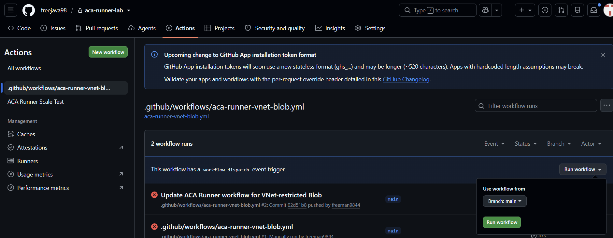
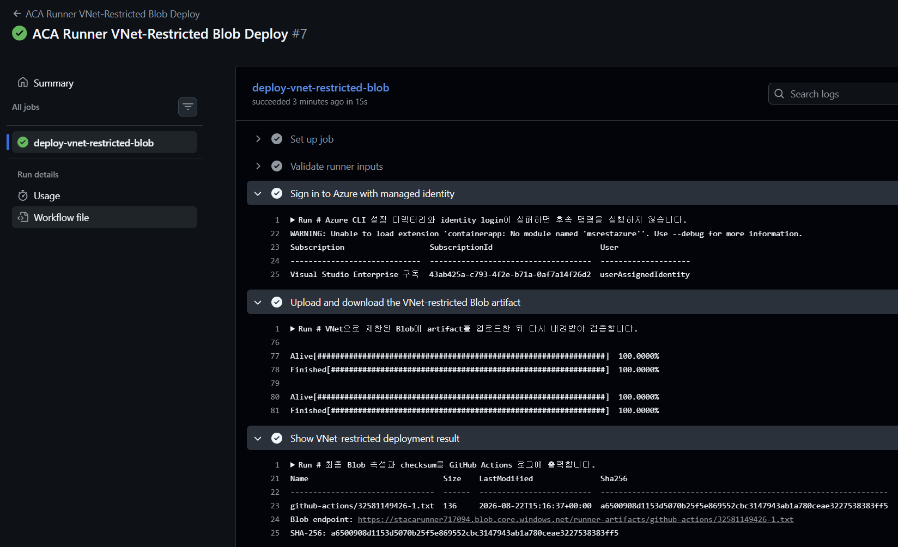

# 06. VNet 제한 Blob 배포와 결과 확인

> 필수 모듈입니다. Azure Cloud Shell Bash, GitHub 웹 UI, Azure Portal을 함께 사용해 trusted single-job workflow로 VNet 제한 Blob artifact를 업로드·다운로드하고, managed identity runtime success와 Storage service endpoint/firewall control-plane을 함께 확인합니다. `private repository`와 `trusted workflow authors` 경계를 유지한 채 runner Job의 public outbound와 Blob data-plane network boundary를 분리해 증명합니다.
> External ACA Job은 ingress를 지원하지 않으며, 이 workflow는 inbound reachability를 증명하지 않습니다.

## 목표

이 모듈을 완료하면 다음을 할 수 있습니다.

- `samples/azure-sample-deploy-workflow.yml`을 Cloud Shell에서 검토한 뒤 GitHub 웹 UI에 workflow를 만든다.
- Event Job이 전달한 `AZURE_CLIENT_ID`, `AZURE_SUBSCRIPTION_ID`, `AZURE_RESOURCE_GROUP`, `AZURE_STORAGE_ACCOUNT`, `AZURE_STORAGE_CONTAINER`의 의미를 설명할 수 있다.
- GitHub Actions에서 managed identity login, `az storage blob upload`, `az storage blob download`, `az storage blob show`, `sha256sum` 검증 흐름을 확인한다.
- `SUBNET_ID`에 연결된 `Microsoft.Storage` service endpoint와 Storage firewall의 `Enabled/Deny/None` 상태를 control-plane 증거로 해석할 수 있다.
- Cloud Shell과 Azure Portal에서 control-plane을 교차 확인하고, Cloud Shell Blob data-plane `403`이 왜 expected인지 설명할 수 있다.

## 0. 세션 재연결 시 변수 복구 (선택)

<details>
<summary>세션이 끊겼다면 변수 복구 명령 보기</summary>

👁️ **설명**

같은 Cloud Shell 세션을 계속 사용 중이라면 이 절은 건너뛰어도 됩니다. 세션이 끊겼다면 Module 01에서 저장한 `SUFFIX`를 그대로 사용하고, Module 02에서 이름 충돌 복구로 변경한 실제 ACR 또는 Storage 이름이 있으면 해당 값을 복원합니다. 원래 subscription ID도 다시 입력해 Blob 검증에 필요한 Azure 식별자를 복구합니다. 여기서 다루는 값은 식별자이며 secret이 아닙니다. 실제 Azure 인증은 이후 GitHub Actions runner 안에서 managed identity로만 수행합니다.

🟢 **실행**

```bash
# 저장한 suffix, 실제 ACR 이름, 원래 workshop subscription ID를 다시 입력합니다.
read -rp "Saved SUFFIX: " SUFFIX
read -rp "Saved ACR name: " ACR
read -rp "Saved subscription ID: " SUBSCRIPTION_ID

# suffix 기반 이름과 VNet 제한 Blob foundation 값을 다시 구성합니다.
LOC=koreacentral
RG="rg-acarunner-$SUFFIX"
ENV="env-acarunner-$SUFFIX"
VNET="vnet-acarunner-$SUFFIX"
INFRA_SUBNET="snet-aca-infra"
STORAGE="stacarunner$SUFFIX"
STORAGE_CONTAINER="runner-artifacts"
KEY_VAULT="kvacarunner$SUFFIX"
GITHUB_APP_KEY_SECRET="github-app-private-key"
UAMI="id-acarunner-$SUFFIX"

# Module 02에서 Storage 이름 충돌 복구가 있었다면 저장해 둔 실제 값을 덮어씁니다.
read -rp "Saved Storage account name if changed (press Enter to keep ${STORAGE}): " SAVED_STORAGE
if [[ -n "$SAVED_STORAGE" ]]; then
  STORAGE="$SAVED_STORAGE"
fi
unset SAVED_STORAGE

# Module 01에서 Key Vault 이름 충돌 복구가 있었다면 저장해 둔 실제 값을 덮어씁니다.
read -rp "Saved Key Vault name if changed (press Enter to keep ${KEY_VAULT}): " SAVED_KEY_VAULT
if [[ -n "$SAVED_KEY_VAULT" ]]; then
  KEY_VAULT="$SAVED_KEY_VAULT"
fi
unset SAVED_KEY_VAULT

# Azure CLI context를 원래 workshop subscription으로 되돌린 뒤 식별자를 조회합니다.
az account set --subscription "$SUBSCRIPTION_ID"
STORAGE_ID=$(az storage account show \
  --resource-group "$RG" \
  --name "$STORAGE" \
  --query id \
  --output tsv)
UAMI_PID=$(az identity show \
  --resource-group "$RG" \
  --name "$UAMI" \
  --query principalId \
  --output tsv)
UAMI_CLIENT_ID=$(az identity show \
  --resource-group "$RG" \
  --name "$UAMI" \
  --query clientId \
  --output tsv)
SUBNET_ID=$(az network vnet subnet show \
  --resource-group "$RG" \
  --vnet-name "$VNET" \
  --name "$INFRA_SUBNET" \
  --query id \
  --output tsv)
KEY_VAULT_ID=$(az keyvault show \
  --resource-group "$RG" \
  --name "$KEY_VAULT" \
  --query id \
  --output tsv)
KEY_VAULT_SECRET_URI="https://$KEY_VAULT.vault.azure.net/secrets/$GITHUB_APP_KEY_SECRET"

export SUFFIX LOC RG ENV VNET INFRA_SUBNET STORAGE STORAGE_CONTAINER KEY_VAULT GITHUB_APP_KEY_SECRET ACR UAMI SUBSCRIPTION_ID STORAGE_ID UAMI_PID UAMI_CLIENT_ID SUBNET_ID KEY_VAULT_ID KEY_VAULT_SECRET_URI
printf 'RG=%s\nENV=%s\nSTORAGE=%s\nSTORAGE_CONTAINER=%s\nUAMI=%s\nUAMI_CLIENT_ID=%s\nSUBNET_ID=%s\nKEY_VAULT=%s\n' \
  "$RG" "$ENV" "$STORAGE" "$STORAGE_CONTAINER" "$UAMI" "$UAMI_CLIENT_ID" "$SUBNET_ID" "$KEY_VAULT"
```

📋 **예상 출력**

- `STORAGE`, `STORAGE_CONTAINER`, `UAMI_CLIENT_ID`, `SUBNET_ID`가 비어 있지 않아야 합니다.
- `STORAGE`가 Module 02에서 실제로 만든 Storage account 이름과 같아야 합니다. 이름 충돌 복구를 했다면 저장해 둔 실제 값이 출력되어야 합니다.
- `SUBNET_ID`는 `snet-aca-infra` subnet을 가리켜야 합니다.
- `SUBSCRIPTION_ID`는 현재 Cloud Shell 기본값이 아니라 원래 workshop subscription ID여야 합니다.

⚠️ **주의**

- 새 suffix를 만들지 마세요. 기존 Event Job이 전달하는 `AZURE_STORAGE_ACCOUNT`, `AZURE_STORAGE_CONTAINER` 계약과 달라집니다.
- Cloud Shell이나 GitHub secret에 Storage key, SAS, client secret을 추가하지 마세요. 이 모듈의 Blob data 명령은 모두 `--auth-mode login`만 사용합니다.
- 이후 control-plane 조회도 모두 방금 복구한 `SUBSCRIPTION_ID` context를 기준으로 실행합니다.

</details>


## 1. Storage service endpoint, firewall, RBAC 확인

👁️ **설명**

Module 04의 Event Job은 이미 runner에 `AZURE_CLIENT_ID`, `AZURE_SUBSCRIPTION_ID`, `AZURE_RESOURCE_GROUP`, `AZURE_STORAGE_ACCOUNT`, `AZURE_STORAGE_CONTAINER`를 전달합니다. 이 모듈은 그 입력을 그대로 사용해 runner 안에서 Blob data-plane proof를 수행하고, Cloud Shell과 Portal에서는 control-plane evidence만 확인합니다. 따라서 여기서 확인할 핵심은 세 가지입니다.

External ACA Job은 ingress를 지원하지 않으며, 이 workflow는 inbound reachability를 증명하지 않습니다. 대신 VNet 제한 Blob data-plane으로의 outbound access만 증명합니다.

1. `SUBNET_ID`가 가리키는 `snet-aca-infra` subnet에 `Microsoft.Storage` service endpoint가 있는지,
2. Storage account가 `publicNetworkAccess=Enabled`, `defaultAction=Deny`, `bypass=None`이며 `virtualNetworkRules`에 같은 `SUBNET_ID`가 `Succeeded` 상태로 들어 있는지,
3. runner UAMI가 Storage account scope의 `Storage Blob Data Contributor`를 가지고 있는지입니다.

🟢 **실행**

```bash
# Cloud Shell 재시작 여부와 관계없이 Storage ID와 runner UAMI principal ID를 다시 조회합니다.
UAMI="${UAMI:-id-acarunner-$SUFFIX}"
STORAGE_ID=$(az storage account show \
  --resource-group "$RG" \
  --name "$STORAGE" \
  --query id \
  --output tsv)
# runner UAMI principal ID를 현재 Azure identity에서 다시 조회합니다.
UAMI_PID=$(az identity show \
  --resource-group "$RG" \
  --name "$UAMI" \
  --query principalId \
  --output tsv)

# subnet의 Microsoft.Storage service endpoint를 확인합니다.
az network vnet subnet show \
  --resource-group "$RG" \
  --vnet-name "$VNET" \
  --name "$INFRA_SUBNET" \
  --query "{id:id,delegation:delegations[].serviceName,serviceEndpoints:serviceEndpoints[].service}" \
  --output json

# Storage firewall, bypass, virtual network rules, public/shared-key 차단 상태를 확인합니다.
az storage account show \
  --resource-group "$RG" \
  --name "$STORAGE" \
  --query "{name:name,publicNetworkAccess:publicNetworkAccess,defaultAction:networkRuleSet.defaultAction,bypass:networkRuleSet.bypass,vnetRules:networkRuleSet.virtualNetworkRules[].{id:virtualNetworkResourceId,state:state},allowBlobPublicAccess:allowBlobPublicAccess,allowSharedKeyAccess:allowSharedKeyAccess}" \
  --output json

# runner UAMI가 Storage Blob Data Contributor를 정확히 Storage account scope에서 갖는지 확인합니다.
if [[ -z "$UAMI_PID" ]]; then
  printf 'ERROR: runner UAMI principal ID를 조회하지 못했습니다: %s\n' "$UAMI" >&2
else
  az role assignment list \
    --assignee "$UAMI_PID" \
    --scope "$STORAGE_ID" \
    --query "[?roleDefinitionName=='Storage Blob Data Contributor'].{role:roleDefinitionName,scope:scope}" \
    --output table
fi
```

📋 **예상 출력**

- subnet 조회 결과에는 `Microsoft.Storage`가 포함되어야 합니다.
- `publicNetworkAccess`는 `Enabled`여야 합니다.
- `defaultAction`은 `Deny`, `bypass`는 `None`이어야 합니다.
- `virtualNetworkRules` 안의 `id`가 `SUBNET_ID`와 같고 `state`는 `Succeeded`여야 합니다.
- `allowBlobPublicAccess`와 `allowSharedKeyAccess`는 모두 `false`여야 합니다.
- `UAMI_PID`는 현재 `id-acarunner-<suffix>` identity의 principal ID로 다시 채워져야 합니다.
- role assignment 표에는 `Storage Blob Data Contributor`가 정확히 `$STORAGE_ID` scope로 표시되어야 합니다.

⚠️ **주의**

- 여기서 `publicNetworkAccess=Enabled`인 이유는 service endpoint가 public DNS 이름을 그대로 사용하면서 subnet 기반 firewall rule로만 접근을 허용하기 때문입니다. DNS를 network proof로 사용하지 마세요.
- role이 보이지 않으면 Module 02 foundation이 incomplete한 상태입니다. 범위를 넓히지 말고 Storage account scope assignment만 복구하세요.

## 2. VNet 제한 Blob workflow를 GitHub에 생성

👁️ **설명**

이 단계는 reviewed sample을 그대로 GitHub 기본 브랜치 workflow로 반영하는 단계입니다. repository write는 GitHub 브라우저 세션에서만 수행하고, Cloud Shell에는 추가 git push credential을 두지 않습니다. 저장 경로는 반드시 `.github/workflows/aca-runner-vnet-blob.yml`이어야 하며, 이 파일을 수정할 사람은 `trusted workflow authors`로 제한해야 합니다.

🟢 **실행**

먼저 Cloud Shell에서 checked-in sample을 그대로 출력합니다.

```bash
# checked-in VNet 제한 Blob workflow sample 전체를 Cloud Shell에서 출력합니다.
cd ~/aca-github-runner-workshop
sed -n '1,220p' samples/azure-sample-deploy-workflow.yml
```

이제 GitHub 웹 UI에서 아래 순서로 진행합니다.

1. `.github/workflows/aca-runner-vnet-blob.yml`이 없으면 **Add file → Create new file**를 선택합니다.
2. 이미 있으면 파일을 연 뒤 **Edit this file**를 선택합니다.
3. 기존 내용을 일부만 수정하지 말고, 방금 Cloud Shell에 출력한 `samples/azure-sample-deploy-workflow.yml` 전체 내용으로 교체합니다.
4. workflow name이 **ACA Runner VNet-Restricted Blob Deploy**인지 확인하고 기본 브랜치에 commit합니다.
5. 이 repository가 `private repository`인지, 그리고 workflow 편집 권한이 `trusted workflow authors`에게만 있는지 다시 확인합니다.

`Validate runner inputs` step은 Azure 변수 확인보다 먼저 `GITHUB_APP_ID`, `GITHUB_APP_INSTALLATION_ID`, `GITHUB_APP_PRIVATE_KEY`가 workflow environment로 전달되지 않았는지 검사합니다. 하나라도 보이면 `ERROR: GitHub App bootstrap variable reached the workflow environment:` prefix와 함께 즉시 실패해야 합니다.

GitHub Actions의 job-level `env`에서는 `${{ runner.temp }}`를 사용할 수 없으므로 Azure CLI 설정 경로는 `Sign in to Azure with managed identity` step 안에서 `RUNNER_TEMP` shell 변수로 구성합니다. 이 값을 `$GITHUB_ENV`에 기록해 뒤의 Blob step도 같은 managed identity login 상태를 사용합니다.

<details>
<summary>aca-runner-vnet-blob.yml 전체 내용 보기</summary>

```yaml
# GitHub Actions 화면에 표시할 workflow 이름입니다.
name: ACA Runner VNet-Restricted Blob Deploy

# 수동 실행으로 VNet 제한 Blob 배포 검증을 시작합니다.
on:
  workflow_dispatch:

# repository 내용은 읽기만 허용합니다.
permissions:
  contents: read

jobs:
  deploy-vnet-restricted-blob:
    # Module 04에서 등록한 ephemeral runner label을 사용합니다.
    runs-on: [aca-runner]
    timeout-minutes: 10
    steps:
      - name: Validate runner inputs
        shell: bash
        run: |
          # 필수 값 누락과 예상하지 않은 secret 노출이 있으면 즉시 실패합니다.
          set -euo pipefail
          # GitHub App bootstrap 값이 workflow 환경으로 노출되지 않았는지 확인합니다.
          for variable_name in \
            GITHUB_APP_ID \
            GITHUB_APP_INSTALLATION_ID \
            GITHUB_APP_PRIVATE_KEY; do
            if [[ -n "${!variable_name:-}" ]]; then
              printf 'ERROR: GitHub App bootstrap variable reached the workflow environment: %s\n' \
                "$variable_name" >&2
              exit 1
            fi
          done

          # ACA Event Job이 managed identity와 Blob 대상 식별자를 전달했는지 확인합니다.
          for variable in \
            AZURE_CLIENT_ID \
            AZURE_SUBSCRIPTION_ID \
            AZURE_RESOURCE_GROUP \
            AZURE_STORAGE_ACCOUNT \
            AZURE_STORAGE_CONTAINER; do
            if [[ -z "${!variable:-}" ]]; then
              printf 'ERROR: %s is required.\n' "$variable" >&2
              exit 1
            fi
          done

      - name: Sign in to Azure with managed identity
        shell: bash
        run: |
          # Azure CLI 설정 디렉터리와 identity login이 실패하면 후속 명령을 실행하지 않습니다.
          set -euo pipefail
          # non-root runner가 Azure CLI 설정을 기록할 임시 경로를 shell에서 구성합니다.
          export AZURE_CONFIG_DIR="${RUNNER_TEMP:?RUNNER_TEMP is required}/.azure"
          # non-root runner가 Azure CLI token과 설정을 기록할 디렉터리를 만듭니다.
          mkdir -p "$AZURE_CONFIG_DIR"
          # 이후 step도 같은 Azure CLI login 상태를 사용하도록 환경 변수를 전달합니다.
          printf 'AZURE_CONFIG_DIR=%s\n' "$AZURE_CONFIG_DIR" >> "$GITHUB_ENV"
          # User-Assigned Managed Identity로 Azure에 로그인합니다.
          az login --identity \
            --client-id "$AZURE_CLIENT_ID" \
            --allow-no-subscriptions \
            --output none
          # Event Job이 전달한 workshop subscription을 현재 context로 선택합니다.
          az account set --subscription "$AZURE_SUBSCRIPTION_ID"
          # secret 없이 managed identity로 로그인된 subscription과 principal 유형을 확인합니다.
          az account show \
            --query "{subscription:name,subscriptionId:id,user:user.name,type:user.type}" \
            --output table

      - name: Upload and download the VNet-restricted Blob artifact
        shell: bash
        run: |
          # VNet으로 제한된 Blob에 artifact를 업로드한 뒤 다시 내려받아 검증합니다.
          # Blob 업로드·다운로드 또는 checksum 검증이 실패하면 즉시 중단합니다.
          set -euo pipefail
          # runner 임시 디렉터리 아래에 원본 파일과 다운로드 파일 경로를 준비합니다.
          ARTIFACT_ROOT="${RUNNER_TEMP:-${GITHUB_WORKSPACE:-$PWD}/.runner-temp}"
          ARTIFACT_DIR="$ARTIFACT_ROOT/vnet-restricted-blob-deploy"
          SOURCE_FILE="$ARTIFACT_DIR/source.txt"
          DOWNLOADED_FILE="$ARTIFACT_DIR/downloaded.txt"
          # 실행을 추적할 repository, commit, run 식별자를 안전한 기본값과 함께 수집합니다.
          REPOSITORY_VALUE="${GITHUB_REPOSITORY:-unknown/repository}"
          COMMIT_VALUE="${GITHUB_SHA:-unknown-commit}"
          RUN_ID_VALUE="${GITHUB_RUN_ID:-0}"
          RUN_ATTEMPT_VALUE="${GITHUB_RUN_ATTEMPT:-0}"
          ACTOR_VALUE="${GITHUB_ACTOR:-unknown-actor}"
          BLOB_NAME="github-actions/${RUN_ID_VALUE}-${RUN_ATTEMPT_VALUE}.txt"
          mkdir -p "$ARTIFACT_DIR"

          # 업로드할 artifact에 현재 GitHub Actions 실행 정보를 기록합니다.
          cat > "$SOURCE_FILE" <<EOF2
          repository=$REPOSITORY_VALUE
          commit=$COMMIT_VALUE
          run_id=$RUN_ID_VALUE
          run_attempt=$RUN_ATTEMPT_VALUE
          actor=$ACTOR_VALUE
          EOF2

          # 업로드 전 원본 파일의 SHA-256을 계산합니다.
          SOURCE_SHA256="$(sha256sum "$SOURCE_FILE" | awk '{print $1}')"

          # managed identity와 service endpoint 경로로 Blob을 업로드합니다.
          az storage blob upload \
            --account-name "$AZURE_STORAGE_ACCOUNT" \
            --container-name "$AZURE_STORAGE_CONTAINER" \
            --name "$BLOB_NAME" \
            --file "$SOURCE_FILE" \
            --metadata sha256="$SOURCE_SHA256" \
            --auth-mode login \
            --overwrite true \
            --output none

          # 같은 Blob을 다시 내려받아 실제 data-plane 읽기 권한도 확인합니다.
          az storage blob download \
            --account-name "$AZURE_STORAGE_ACCOUNT" \
            --container-name "$AZURE_STORAGE_CONTAINER" \
            --name "$BLOB_NAME" \
            --file "$DOWNLOADED_FILE" \
            --auth-mode login \
            --overwrite true \
            --output none

          # 원본, 다운로드 파일, Blob metadata의 SHA-256이 모두 같은지 비교합니다.
          DOWNLOADED_SHA256="$(sha256sum "$DOWNLOADED_FILE" | awk '{print $1}')"
          BLOB_SHA256="$(az storage blob show \
            --account-name "$AZURE_STORAGE_ACCOUNT" \
            --container-name "$AZURE_STORAGE_CONTAINER" \
            --name "$BLOB_NAME" \
            --auth-mode login \
            --query metadata.sha256 \
            --output tsv)"
          if [[ "$DOWNLOADED_SHA256" != "$SOURCE_SHA256" || "$BLOB_SHA256" != "$SOURCE_SHA256" ]]; then
            printf 'ERROR: Downloaded Blob checksum does not match the uploaded artifact.\n' >&2
            printf 'source=%s downloaded=%s blob=%s\n' \
              "$SOURCE_SHA256" "$DOWNLOADED_SHA256" "$BLOB_SHA256" >&2
            exit 1
          fi

          # 다음 step에서 같은 Blob과 checksum을 조회하도록 GitHub 환경에 전달합니다.
          printf 'BLOB_NAME=%s\n' "$BLOB_NAME" >> "$GITHUB_ENV"
          printf 'SOURCE_SHA256=%s\n' "$SOURCE_SHA256" >> "$GITHUB_ENV"
          printf 'DOWNLOADED_SHA256=%s\n' "$DOWNLOADED_SHA256" >> "$GITHUB_ENV"
          printf 'BLOB_SHA256=%s\n' "$BLOB_SHA256" >> "$GITHUB_ENV"

      - name: Show VNet-restricted deployment result
        shell: bash
        run: |
          # 최종 Blob 속성과 checksum을 GitHub Actions 로그에 출력합니다.
          set -euo pipefail
          az storage blob show \
            --account-name "$AZURE_STORAGE_ACCOUNT" \
            --container-name "$AZURE_STORAGE_CONTAINER" \
            --name "$BLOB_NAME" \
            --auth-mode login \
            --query "{name:name,size:properties.contentLength,lastModified:properties.lastModified,sha256:metadata.sha256}" \
            --output table
          printf 'Blob endpoint: https://%s.blob.core.windows.net/%s/%s\n' \
            "$AZURE_STORAGE_ACCOUNT" "$AZURE_STORAGE_CONTAINER" "$BLOB_NAME"
          printf 'SHA-256: %s\n' "$SOURCE_SHA256"
```

</details>

📋 **예상 출력**

- GitHub 기본 브랜치의 `.github/workflows/aca-runner-vnet-blob.yml`이 sample과 byte-for-byte로 같아야 합니다.
- workflow는 single job이며 `runs-on: [aca-runner]`만 사용합니다.
- Blob data 명령에는 모두 `--auth-mode login`이 들어 있어야 합니다.

## 3. GitHub Actions에서 Blob artifact 배포 실행

👁️ **설명**

이 workflow는 `workflow_dispatch`만 사용하므로 trusted participant가 GitHub UI에서 직접 실행해야 합니다. runner는 Event Job이 만든 ephemeral self-hosted runner이고, Azure 인증은 managed identity login만 사용합니다. 업로드되는 Blob 경로는 `github-actions/<run-id>-<run-attempt>.txt`입니다.

🟢 **실행**

1. GitHub repository에서 **Actions → ACA Runner VNet-Restricted Blob Deploy**로 이동합니다.
2. **Run workflow**를 눌러 기본 브랜치에서 실행합니다.
3. run summary에서 아래 step 이름이 순서대로 성공하는지 확인합니다.
   - `Validate runner inputs`
   - `Sign in to Azure with managed identity`
   - `Upload and download the VNet-restricted Blob artifact`
   - `Show VNet-restricted deployment result`

> **참고 화면:** **Run workflow** 메뉴에서 기본 브랜치를 선택하고 실행 버튼을 누르는 위치를 보여주는 GitHub Actions 화면입니다. 화면의 기존 실행 성공·실패 표시는 이전 실행 이력이므로 이번 실행 결과와 별도로 판단합니다.



📋 **예상 출력**

다음 값들은 참가자와 실행 시점마다 달라지므로 placeholder로 비교합니다.

```text
Name                                      Size  Last Modified          Sha256
----------------------------------------  ----  ---------------------  ----------------------------------------------------------------
github-actions/<run-id>-<run-attempt>.txt <bytes> <modified-timestamp> <64-hex-sha256>

Blob endpoint: https://stacarunner<suffix>.blob.core.windows.net/runner-artifacts/github-actions/<run-id>-<run-attempt>.txt
SHA-256: <64-hex-sha256>
```

- Blob name은 반드시 `github-actions/<run-id>-<run-attempt>.txt` 형식이어야 합니다.
- `SHA-256`은 source file, downloaded file, blob metadata가 모두 같은 값이어야 합니다.
- GitHub App bootstrap variable leak guard가 먼저 통과한 뒤 Azure login과 Blob data-plane step이 실행되어야 합니다.

### 결과 해석

- service endpoint는 Storage public DNS 이름을 그대로 사용하므로 DNS 해석 결과는 network proof가 아닙니다.
- runner의 Blob data-plane success와 1단계의 control-plane 검증을 함께 확인해야 합니다. 즉 `Microsoft.Storage`, 같은 `SUBNET_ID`의 `virtualNetworkRules`, `publicNetworkAccess=Enabled`, `defaultAction=Deny`, `bypass=None` 상태에서 upload·download·metadata checksum 검증이 모두 성공해야 합니다.
- GitHub App bootstrap variable 검사는 normal child-environment non-inheritance만 확인합니다. malicious code with access to the Job's managed identity/runtime boundary까지 격리한다고 해석하면 안 됩니다.
- Cloud Shell은 control-plane만 확인합니다. Cloud Shell에서 같은 Blob data-plane 명령을 실행하면 403이 expected입니다. Storage key, SAS, public IP rule, `defaultAction=Allow`로 우회하지 마세요.

> **참고 화면:** 모든 workflow step이 성공하고, 마지막 step에서 Blob 경로와 SHA-256 결과가 출력된 GitHub Actions 실행 화면입니다. 화면의 run 번호, Storage account 이름, Blob 이름, checksum은 실행마다 달라집니다.



## 트러블슈팅

다음 순서로만 점검하세요.

1. **`Microsoft.Storage` missing from subnet**
   `az network vnet subnet show` 결과에 `Microsoft.Storage`가 없으면 Module 02의 subnet service endpoint 구성을 다시 적용합니다.
2. **`SUBNET_ID` missing or not `Succeeded` in Storage virtual network rules**
   `az storage account show`의 `virtualNetworkRules`에서 현재 `SUBNET_ID`가 빠졌거나 `Succeeded`가 아니면 subnet rule을 복구하고 잠시 기다린 뒤 재시도합니다.
3. **Storage firewall이 `Enabled/Deny/None`이 아님**
   `publicNetworkAccess=Enabled`, `defaultAction=Deny`, `bypass=None` 조합이 아니면 service endpoint boundary 증거가 성립하지 않습니다.
4. **UAMI role absent or not propagated**
   `Storage Blob Data Contributor`가 `$STORAGE_ID` scope에 없거나 아직 전파 중이면 1~5분 기다린 뒤 workflow를 다시 실행합니다. scope를 Resource Group으로 넓히지 마세요.
5. **Public outbound prevents Azure login**
   `az login` 또는 `az account show` 전에 workflow가 실패하면 runner의 public outbound가 Entra ID 또는 ARM을 막고 있는지 확인합니다.

⚠️ **주의**

- Cloud Shell Blob data-plane `403`은 expected입니다. Storage key, SAS, public IP rule, `defaultAction=Allow`로 우회하지 마세요.
- Blob network proof는 runner runtime success와 control-plane evidence를 함께 해석해야 합니다.

---

[← 이전: 병렬 실행과 스케일 검증](05-parallel-scale-validation.md)
[다음: 보안·제약·정리 →](07-security-limitations-cleanup.md)

Module 06은 필수 단계입니다. 위 링크로 이동해 VNet 제한 Blob 배포와 결과 확인을 계속 진행하세요.
