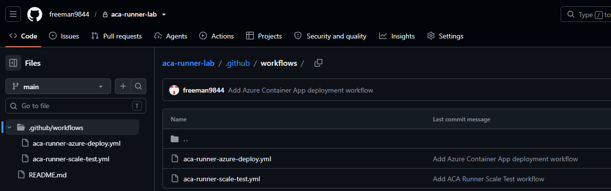
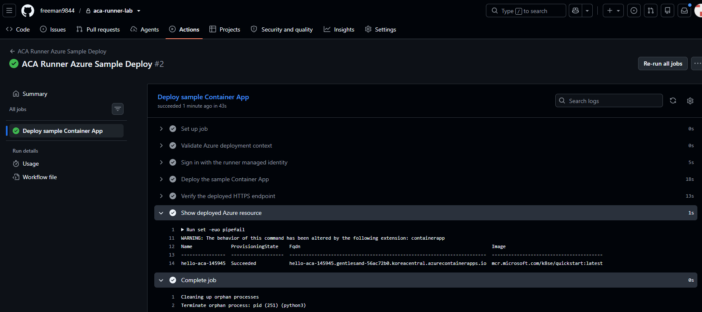
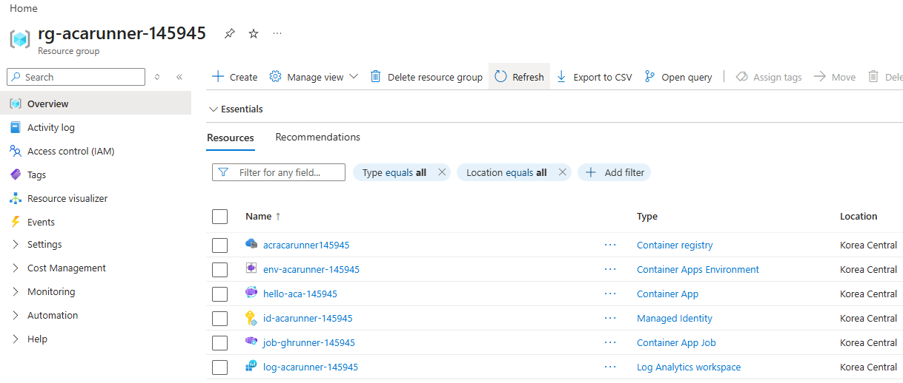
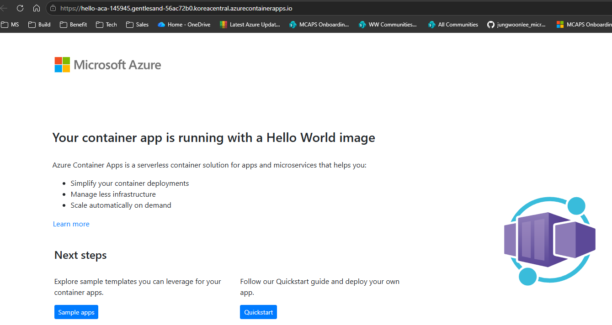

# 06. Azure 샘플 배포와 결과 확인

> 필수 모듈입니다. Azure Cloud Shell Bash, GitHub 웹 UI, 브라우저, Azure Portal을 함께 사용해 trusted single-job workflow로 샘플 Container App을 배포하고 결과를 교차 확인합니다. `private repository`와 `trusted workflow authors` 경계를 유지한 채, 기존 ACA runner trusted-workflow boundary 안에서만 Azure 배포 검증을 추가합니다.

## 목표

이 모듈을 완료하면 다음을 할 수 있습니다.

- `samples/azure-sample-deploy-workflow.yml`을 Cloud Shell에서 확인한 뒤 GitHub 웹 UI로 workflow를 만든다.
- `UAMI_CLIENT_ID`와 `SUBSCRIPTION_ID`가 식별자이며, runner 환경에서는 각각 `AZURE_CLIENT_ID`와 `AZURE_SUBSCRIPTION_ID`로 전달된다는 점을 설명할 수 있다.
- GitHub Actions, 브라우저, Cloud Shell, Azure Portal에서 같은 배포 결과를 교차 확인한다.
- managed identity login, RBAC assignment 확인과 권한 전파 지연, HTTP warm-up failure 시 안전한 복구 경로를 적용한다.

## 0. 세션 재연결 시 변수 복구 (선택)

<details>
<summary>세션이 끊겼다면 변수 복구 명령 보기</summary>

👁️ **설명**

같은 Cloud Shell 세션을 계속 사용 중이라면 이 절은 건너뛰어도 됩니다. 세션이 끊겼다면 **원래 저장해 둔 SUFFIX와 subscription ID**를 다시 입력해 Module 02~04에서 사용한 변수명 그대로 Event Job 환경과 이 모듈의 샘플 앱 이름을 복구하세요. Cloud Shell이 다른 subscription을 기본값으로 잡고 돌아올 수 있으므로, Azure resource query 전에 workshop subscription context를 먼저 되돌려야 합니다. 새 suffix를 만들면 기존 trusted runner와 다른 리소스를 보게 됩니다.

🟢 **실행**

```bash
read -rp "Saved SUFFIX: " SUFFIX
read -rp "Saved subscription ID: " SUBSCRIPTION_ID

RG="rg-acarunner-$SUFFIX"
ENV="env-acarunner-$SUFFIX"
UAMI="id-acarunner-$SUFFIX"
SAMPLE_APP="hello-aca-$SUFFIX"

az account set --subscription "$SUBSCRIPTION_ID"
UAMI_CLIENT_ID=$(az identity show \
  --resource-group "$RG" \
  --name "$UAMI" \
  --query clientId \
  --output tsv)

printf 'RG=%s\nENV=%s\nUAMI=%s\nSAMPLE_APP=%s\nUAMI_CLIENT_ID=%s\nSUBSCRIPTION_ID=%s\n' \
  "$RG" "$ENV" "$UAMI" "$SAMPLE_APP" "$UAMI_CLIENT_ID" "$SUBSCRIPTION_ID"
```

📋 **예상 출력**

- `RG`, `ENV`, `UAMI`, `SAMPLE_APP`은 원래 실습에서 만든 이름으로 다시 채워집니다.
- `SUBSCRIPTION_ID`는 현재 Cloud Shell 기본값이 아니라, **원래 저장해 둔 workshop subscription ID** 그대로 유지됩니다.
- `UAMI_CLIENT_ID`, `SUBSCRIPTION_ID`는 Module 02~04와 같은 Cloud Shell 변수명입니다.
- `az identity show`가 실패하면 SUFFIX 오타, 저장한 subscription ID 오타, 또는 Module 02/04 리소스 이름 기록 오류를 먼저 확인합니다.

⚠️ **주의**

- 여기서 복구하는 값은 식별자이며 secret이 아닙니다. 그래도 화면 공유 중이라면 불필요한 노출을 줄이기 위해 현재 탭만 사용하세요.
- 이후 `az containerapp show` 같은 Azure resource query도 모두 방금 복구한 `SUBSCRIPTION_ID` context를 기준으로 실행해야 합니다.
- Cloud Shell에 새로운 repository write credential이나 Azure client secret을 추가하지 마세요.

</details>

## 태그 범례

| 태그 | 의미 |
|------|------|
| 🟢 **실행** | 참가자가 직접 입력하거나 수행해야 하는 단계 |
| 👁️ **설명** | 개념 설명 또는 읽기 전용 안내 |
| 📋 **예상 출력** | 실행 결과와 비교할 기준 출력 |
| ⚠️ **주의** | 보안, 권한, 복구 관련 안내 |

## 1. 배포 권한 확인과 Container Apps Contributor 부여

👁️ **설명**

이 모듈은 Module 04의 Event Job과 user-assigned managed identity를 그대로 재사용합니다. Cloud Shell의 공통 값은 Module 02~04와 동일하게 `UAMI_CLIENT_ID`, `SUBSCRIPTION_ID`, `RG`, `ENV`를 사용하고, 이 모듈에서만 조회할 샘플 앱 이름은 `SAMPLE_APP`으로 둡니다. Module 04에서 Event Job을 만들 때 대응 값들은 runner 환경 변수 `AZURE_CLIENT_ID`, `AZURE_SUBSCRIPTION_ID`, `AZURE_RESOURCE_GROUP`, `AZURE_CONTAINERAPPS_ENVIRONMENT`, `AZURE_SAMPLE_APP`으로 전달되었습니다. Azure에 실제로 인증하는 credentials는 runner에 연결된 managed identity뿐이므로 GitHub secret이나 Cloud Shell 환경 변수에 client secret을 추가하지 않습니다.

샘플 배포를 위해 runner managed identity에는 workshop resource group 범위의 `Container Apps Contributor`가 필요합니다. 이 role은 샘플 `Container App` 생성·조회·삭제에 충분하며, **Container Apps Job 권한은 포함하지 않습니다.** Event Job 생성/수정 권한을 넓히지 않는 이유는 기존 trusted runner 경계를 유지하기 위해서입니다.

또한 이 모듈은 `private repository`에서만 진행하고, `.github/workflows/aca-runner-azure-deploy.yml`을 저장할 사람은 `trusted workflow authors`로 제한해야 합니다. repository write는 GitHub 브라우저 세션에서만 수행하고, Cloud Shell에는 추가 git push credential을 두지 않습니다.

🟢 **실행**

복구한 값이 현재 실습 대상과 맞는지 다시 출력해 확인합니다.

```bash
SAMPLE_APP="hello-aca-$SUFFIX"
UAMI_PID=$(az identity show \
  --resource-group "$RG" \
  --name "$UAMI" \
  --query principalId \
  --output tsv)
RG_ID=$(az group show \
  --name "$RG" \
  --query id \
  --output tsv)
ENV_STATE=$(az containerapp env show \
  --resource-group "$RG" \
  --name "$ENV" \
  --query properties.provisioningState \
  --output tsv)
CONTAINER_APPS_ROLE=$(az role assignment list \
  --assignee "$UAMI_PID" \
  --scope "$RG_ID" \
  --query "[?roleDefinitionName=='Container Apps Contributor' && scope=='$RG_ID'].roleDefinitionName | [0]" \
  --output tsv)

printf 'RG=%s\nENV=%s\nUAMI=%s\nSAMPLE_APP=%s\nUAMI_CLIENT_ID=%s\nSUBSCRIPTION_ID=%s\n' \
  "$RG" "$ENV" "$UAMI" "$SAMPLE_APP" "$UAMI_CLIENT_ID" "$SUBSCRIPTION_ID"
printf 'ENV_STATE=%s\nCONTAINER_APPS_ROLE=%s\n' \
  "$ENV_STATE" "${CONTAINER_APPS_ROLE:-MISSING}"
```

📋 **예상 출력**

- 모든 값이 비어 있지 않아야 합니다.
- `UAMI_CLIENT_ID`와 `SUBSCRIPTION_ID`는 표시되어도 되는 식별자지만, PAT나 client secret 같은 credentials는 출력하지 않습니다.
- `ENV_STATE=Succeeded`가 보여야 실제 ACA Environment가 현재 subscription/RG에 존재하는 것입니다.
- `CONTAINER_APPS_ROLE=Container Apps Contributor`가 보이면 runner UAMI가 샘플 Container App을 배포할 준비가 된 상태입니다.
- `CONTAINER_APPS_ROLE=MISSING`이면 아래 권한 부여 절차를 실행해야 합니다.
- 이후 GitHub Actions에서 사용하는 Azure 로그인 명령은 `az login --identity --client-id` 한 줄뿐이어야 합니다.

### Container Apps Contributor 권한 부여

👁️ **설명**

`CONTAINER_APPS_ROLE=MISSING`일 때만 아래 블록이 Module 02와 동일하게 runner UAMI에 workshop resource group 범위의 `Container Apps Contributor`를 할당합니다. 이미 역할이 있으면 새 역할을 만들지 않고 현재 상태만 출력합니다.

⚠️ **주의**

`az role assignment create`에는 `Microsoft.Authorization/roleAssignments/write` 권한이 필요합니다. `AuthorizationFailed`가 발생하면 `Role Based Access Control Administrator`, `User Access Administrator`, `Owner` 중 하나를 가진 계정으로 역할을 할당해야 합니다. 권한 범위를 넓히지 말고 workshop resource group의 `Container Apps Contributor`만 복구하세요.

🟢 **실행**

```bash
if [[ "$CONTAINER_APPS_ROLE" != "Container Apps Contributor" ]]; then
  az role assignment create \
    --assignee-object-id "$UAMI_PID" \
    --assignee-principal-type ServicePrincipal \
    --role "Container Apps Contributor" \
    --scope "$RG_ID" \
    --output none
  printf '역할 할당 요청 완료. Azure control plane 조회에 표시될 때까지 확인합니다.\n'
else
  printf 'Container Apps Contributor 역할이 이미 할당되어 있습니다.\n'
fi

for role_attempt in $(seq 1 30); do
  CONTAINER_APPS_ROLE=$(az role assignment list \
    --assignee "$UAMI_PID" \
    --scope "$RG_ID" \
    --query "[?roleDefinitionName=='Container Apps Contributor' && scope=='$RG_ID'].roleDefinitionName | [0]" \
    --output tsv)

  if [[ "$CONTAINER_APPS_ROLE" == "Container Apps Contributor" ]]; then
    break
  fi

  printf 'Waiting for Container Apps Contributor assignment visibility (attempt %s/30).\n' \
    "$role_attempt" >&2
  sleep 10
done

if [[ "$CONTAINER_APPS_ROLE" != "Container Apps Contributor" ]]; then
  printf 'ERROR: Container Apps Contributor was not visible after 30 checks.\n' >&2
  exit 1
fi

printf 'CONTAINER_APPS_ROLE=%s\n' "${CONTAINER_APPS_ROLE:-MISSING}"
```

📋 **예상 출력**

- 기존 역할이 있으면 `Container Apps Contributor 역할이 이미 할당되어 있습니다.`가 출력됩니다.
- 새 역할을 할당했다면 역할 assignment가 Azure control plane 조회에 표시될 때까지 최대 5분 동안 자동으로 재조회합니다.
- 이 조회는 role assignment 존재 여부를 확인하며 실제 managed identity 권한 전파 완료를 보장하지 않습니다.
- 최종적으로 `CONTAINER_APPS_ROLE=Container Apps Contributor`가 확인되면 2단계로 이동합니다. 이후 workflow에서 `AuthorizationFailed`가 발생하면 역할 범위를 넓히지 말고 1~5분 기다린 뒤 다시 실행합니다.

## 2. 샘플 workflow를 GitHub에 생성

👁️ **설명**

이 단계는 배포용 sample을 그대로 읽고 GitHub 웹 UI에 반영하는 단계입니다. 브라우저 기반 workflow 생성으로 repository-write activity를 분리하면, Module 04에서 만든 runner secret/PAT 흐름을 Azure queue 감시와 runner bootstrap 용도로만 유지할 수 있습니다.

🟢 **실행**

먼저 Cloud Shell에서 reviewed sample을 그대로 출력합니다.

```bash
cd ~/aca-github-runner-workshop
sed -n '1,220p' samples/azure-sample-deploy-workflow.yml
```

이제 GitHub 웹 UI에서 아래 순서로 진행합니다.

1. `.github/workflows/aca-runner-azure-deploy.yml`이 없으면 **Add file → Create new file**을 선택합니다.
2. 이미 있으면 파일을 연 뒤 **Edit this file**을 선택합니다.
3. 두 경우 모두 기존 내용을 일부만 수정하지 말고, 방금 Cloud Shell에 출력한 `samples/azure-sample-deploy-workflow.yml` 전체 내용으로 교체합니다.
4. 아래 `aca-runner-azure-deploy.yml` 전체 내용을 펼쳐 다시 확인한 뒤 기본 브랜치에 commit합니다.

<details>
<summary>aca-runner-azure-deploy.yml 전체 내용 보기</summary>

```yaml
name: ACA Runner Azure Sample Deploy

# 신뢰할 수 있는 워크숍 참가자가 수동으로 실행할 때만 시작합니다.
on:
  workflow_dispatch:

jobs:
  deploy-sample:
    name: Deploy sample Container App
    # 임시 ACA runner에 설정한 사용자 지정 label을 사용합니다.
    runs-on: [aca-runner]
    timeout-minutes: 15
    steps:
      # Azure 작업 전에 runner 환경 변수 계약이 완전한지 확인합니다.
      - name: Validate Azure deployment context
        shell: bash
        run: |
          set -euo pipefail
          for variable in \
            AZURE_CLIENT_ID \
            AZURE_SUBSCRIPTION_ID \
            AZURE_RESOURCE_GROUP \
            AZURE_CONTAINERAPPS_ENVIRONMENT \
            AZURE_SAMPLE_APP; do
            if [[ -z "${!variable:-}" ]]; then
              printf 'ERROR: %s is required.\n' "$variable" >&2
              exit 1
            fi
          done

      # client secret 없이 runner managed identity로 Azure에 로그인합니다.
      - name: Sign in with the runner managed identity
        shell: bash
        run: |
          set -euo pipefail
          az login --identity --client-id "$AZURE_CLIENT_ID" --output none
          az account set --subscription "$AZURE_SUBSCRIPTION_ID"
          az account show \
            --query "{subscription:name,subscriptionId:id,tenantId:tenantId}" \
            --output table

      # 반복 실습도 동일한 상태에서 시작하도록 샘플 앱을 다시 생성합니다.
      - name: Deploy the sample Container App
        shell: bash
        run: |
          set -euo pipefail
          APP_SHOW_ERROR="$(mktemp)"
          trap 'rm -f "$APP_SHOW_ERROR"' EXIT

          container_app_exists() {
            : > "$APP_SHOW_ERROR"
            if az containerapp show \
              --name "$AZURE_SAMPLE_APP" \
              --resource-group "$AZURE_RESOURCE_GROUP" \
              --output none 2>"$APP_SHOW_ERROR"; then
              return 0
            fi

            if grep -Eq 'ResourceNotFound|ContainerAppNotFound' "$APP_SHOW_ERROR"; then
              return 1
            fi

            cat "$APP_SHOW_ERROR" >&2
            printf 'ERROR: Failed to inspect Container App %s.\n' \
              "$AZURE_SAMPLE_APP" >&2
            return 2
          }

          if container_app_exists; then
            printf 'Existing Container App found; deleting %s.\n' "$AZURE_SAMPLE_APP"
            az containerapp delete \
              --name "$AZURE_SAMPLE_APP" \
              --resource-group "$AZURE_RESOURCE_GROUP" \
              --yes \
              --output none

            deleted=false
            for delete_attempt in $(seq 1 24); do
              if container_app_exists; then
                printf 'Waiting for Container App deletion (attempt %s/24).\n' \
                  "$delete_attempt" >&2
                sleep 5
                continue
              else
                inspect_status=$?
              fi

              if [[ "$inspect_status" == "1" ]]; then
                printf 'Confirmed existing Container App deletion after %s checks.\n' \
                  "$delete_attempt"
                deleted=true
                break
              fi

              exit "$inspect_status"
            done

            if [[ "$deleted" != "true" ]]; then
              printf 'ERROR: Timed out waiting for Container App deletion after 24 checks.\n' \
                >&2
              exit 1
            fi
          else
            inspect_status=$?
            if [[ "$inspect_status" == "1" ]]; then
              printf 'No existing Container App named %s found.\n' "$AZURE_SAMPLE_APP"
            else
              exit "$inspect_status"
            fi
          fi

          FQDN="$(az containerapp create \
            --name "$AZURE_SAMPLE_APP" \
            --resource-group "$AZURE_RESOURCE_GROUP" \
            --environment "$AZURE_CONTAINERAPPS_ENVIRONMENT" \
            --image mcr.microsoft.com/k8se/quickstart@sha256:9f41c026ef51e985a271eed474995ea08c0d6a5a4939e65622ed03c3fcc9fb2c \
            --ingress external \
            --target-port 80 \
            --min-replicas 0 \
            --max-replicas 1 \
            --query properties.configuration.ingress.fqdn \
            --output tsv)"

          if [[ -z "$FQDN" ]]; then
            printf 'ERROR: Azure did not return a Container App FQDN.\n' >&2
            exit 1
          fi

          # 생성된 endpoint를 이후 workflow step과 공유합니다.
          APP_URL="https://$FQDN"
          printf 'APP_URL=%s\n' "$APP_URL" >> "$GITHUB_ENV"

      # 프로비저닝 후 ACA ingress가 준비될 때까지 시간이 걸릴 수 있습니다.
      - name: Verify the deployed HTTPS endpoint
        shell: bash
        run: |
          set -euo pipefail
          for attempt in $(seq 1 18); do
            if response="$(curl --fail --silent --show-error "$APP_URL")"; then
              printf 'Verified %s\n' "$APP_URL"
              printf '%s\n' "$response" | sed -n '1,12p'
              exit 0
            fi
            printf 'Endpoint not ready (attempt %s/18); retrying in 5 seconds.\n' \
              "$attempt" >&2
            sleep 5
          done
          printf 'ERROR: HTTP verification failed after 18 attempts: %s\n' \
            "$APP_URL" >&2
          exit 1

      # Azure Portal과 비교할 수 있도록 최종 resource 정보를 출력합니다.
      - name: Show deployed Azure resource
        shell: bash
        run: |
          set -euo pipefail
          az containerapp show \
            --name "$AZURE_SAMPLE_APP" \
            --resource-group "$AZURE_RESOURCE_GROUP" \
            --query "{name:name,provisioningState:properties.provisioningState,fqdn:properties.configuration.ingress.fqdn,image:properties.template.containers[0].image}" \
            --output table
```

</details>

⚠️ **주의**

- 배포 workflow는 **one `runs-on: [aca-runner]` job**만 유지해야 합니다. `self-hosted`, `linux`, `x64` 같은 default label을 다시 넣지 마세요.
- `push`, `pull_request`, reusable workflow call trigger를 추가하지 말고 `workflow_dispatch:`만 유지하세요.
- `azure/login`, client secret, repository PAT를 YAML에 새로 넣지 마세요.

📋 **예상 출력**

- GitHub Actions 목록에 workflow 이름이 **ACA Runner Azure Sample Deploy**로 보입니다.
- 파일 경로는 `.github/workflows/aca-runner-azure-deploy.yml`이어야 합니다.
- reviewed sample과 같은 single-job workflow가 저장됩니다.

> **참고 화면:** GitHub 기본 브랜치의 `.github/workflows` 폴더에 Module 05의 `aca-runner-scale-test.yml`과 Module 06의 `aca-runner-azure-deploy.yml`이 함께 보이면 두 검증 workflow 파일이 모두 준비된 상태입니다.



## 3. GitHub Actions에서 배포 실행

👁️ **설명**

이 workflow는 기존 ACA runner가 GitHub queued job을 가져와 Azure에 샘플 앱을 배포하는지 검증합니다. 내부적으로 `APP_URL=https://<fqdn>` 값을 구성한 뒤 다음 step의 HTTP 확인에 사용합니다. 브라우저에서 직접 수동 실행해야 trusted workflow author가 승인한 YAML만 동작합니다.

🟢 **실행**

GitHub repository에서 **Actions → ACA Runner Azure Sample Deploy → Run workflow**를 선택하고 기본 브랜치에서 실행합니다.

실행이 시작되면 아래 step을 순서대로 확인합니다.

1. **Validate Azure deployment context**
2. **Sign in with the runner managed identity**
3. **Deploy the sample Container App**
4. **Verify the deployed HTTPS endpoint**
5. **Show deployed Azure resource**

📋 **예상 출력**

- 전체 workflow가 `Success`로 끝나야 합니다.
- `Sign in with the runner managed identity` step은 subscription table을 출력하고, 추가 secret 없이 로그인해야 합니다.
- `Verify the deployed HTTPS endpoint` step에는 `Verified https://...`가 보이며, 실패 시 끝부분에 `HTTP verification failed after` 메시지가 남습니다.
- `Show deployed Azure resource` step에는 새 `Container App` 이름, image, FQDN이 출력됩니다.

> **참고 화면:** 아래 화면처럼 `Deploy sample Container App` Job과 모든 step이 성공하고, `Show deployed Azure resource` 출력에 앱 이름, `Succeeded`, FQDN, pinned `mcr.microsoft.com/k8se/quickstart@sha256:...` image가 보이면 GitHub Actions 배포가 완료된 것입니다. 앱 suffix와 FQDN은 참가자와 실행마다 달라집니다.



⚠️ **주의**

- workflow가 queued 상태로 오래 머물면 먼저 오래된 queued run이나 `stale runner workflow`가 같은 `aca-runner` label을 붙잡고 있지 않은지 확인하세요.
- GitHub Actions 로그에 PAT, client secret, access token을 출력하도록 workflow를 수정하지 마세요.
- 첫 배포의 `No existing Container App named ... found.`는 기존 샘플 앱이 없다는 정상 안내입니다.
- `WARNING: The behavior of this command has been altered by the following extension: containerapp`도 extension 사용 안내이며 배포 실패 원인이 아닙니다. 그 다음에 출력되는 `ERROR:` 행을 기준으로 문제를 판단하세요.

## 4. 배포 URL과 HTTP 결과 확인

👁️ **설명**

GitHub Actions 성공만으로 끝내지 말고 브라우저와 Cloud Shell에서 같은 HTTPS endpoint를 다시 확인합니다. 브라우저는 사람이 보는 결과를, Cloud Shell은 CLI 기반 재현 결과를 제공합니다.

🟢 **실행**

먼저 GitHub workflow에서 확인한 URL과 같은 endpoint를 Cloud Shell에서 다시 조회합니다.

```bash
FQDN=$(az containerapp show \
  --name "$SAMPLE_APP" \
  --resource-group "$RG" \
  --query properties.configuration.ingress.fqdn \
  --output tsv)
APP_URL="https://$FQDN"

printf 'https://%s\n' "$FQDN"
printf 'APP_URL=%s\n' "$APP_URL"
curl --fail --silent --show-error "https://$FQDN" | sed -n '1,12p'
```

이제 브라우저에서 `APP_URL` 또는 `https://$FQDN`을 새 탭으로 열어 pinned `mcr.microsoft.com/k8se/quickstart@sha256:...` image의 기본 quickstart page가 보이는지 확인합니다.

📋 **예상 출력**

- Cloud Shell에는 `https://...azurecontainerapps.io` 형식의 URL이 출력됩니다.
- `curl` 결과 앞부분에 HTML이 보이거나 quickstart page 텍스트가 출력됩니다.
- 브라우저에서는 sample page가 열리고, 새로고침 직후 잠깐 지연되더라도 결국 HTTP 200 응답으로 표시되어야 합니다.

⚠️ **주의**

- 직후 몇 초 동안은 temporary HTTP cold start 때문에 첫 요청이 늦거나 실패할 수 있습니다.
- 이 경우 workflow를 바로 수정하지 말고, 동일 URL을 브라우저에서 한 번 더 열거나 Cloud Shell `curl`을 잠시 후 다시 실행하세요.

## 5. Cloud Shell과 Azure Portal에서 확인

👁️ **설명**

마지막으로 Azure control plane과 Portal UI 양쪽에서 같은 리소스를 확인합니다. 이렇게 하면 GitHub Actions output만 맞고 실제 Azure resource가 다른 subscription/RG에 생긴 경우를 걸러낼 수 있습니다.

🟢 **실행**

Cloud Shell에서 deployed resource summary를 다시 조회합니다.

```bash
az containerapp show \
  --name "$SAMPLE_APP" \
  --resource-group "$RG" \
  --query "{name:name,provisioningState:properties.provisioningState,externalIngress:properties.configuration.ingress.external,fqdn:properties.configuration.ingress.fqdn,image:properties.template.containers[0].image}" \
  --output table
```

이후 `Azure Portal`에서 다음 순서로 확인합니다.

1. **Resource groups**에서 `$RG`를 엽니다.
2. `hello-aca-<suffix>` 리소스를 찾고 type이 `Container App`인지 확인합니다.
3. **Overview** 또는 **Ingress**에서 external ingress가 켜져 있고 Application Url이 Cloud Shell의 `https://$FQDN`과 같은지 확인합니다.
4. Container image가 `mcr.microsoft.com/k8se/quickstart@sha256:9f41c026ef51e985a271eed474995ea08c0d6a5a4939e65622ed03c3fcc9fb2c`인지 확인합니다.

📋 **예상 출력**

- Cloud Shell table에는 `Succeeded`, `true`, FQDN, quickstart image가 표시됩니다.
- `Azure Portal`에서도 같은 이름의 `Container App`이 보이고 외부 ingress가 활성화되어 있어야 합니다.
- GitHub Actions, 브라우저, Cloud Shell, Portal 네 곳에서 같은 앱 이름과 URL을 가리키면 검증 완료입니다.

> **관리 콘솔 참고 화면:** Azure Portal의 workshop Resource Group에 ACR, Container Apps Environment, `hello-aca-<suffix>` Container App, managed identity, runner Job, Log Analytics workspace가 함께 보이는지 확인합니다. 화면의 suffix는 참가자마다 다릅니다.



> **실제 결과 참고 화면:** 브라우저에서 Application URL을 열었을 때 Azure Container Apps의 **Your container app is running with a Hello World image** 페이지가 표시되면 외부 ingress와 quickstart image가 정상 동작하는 것입니다. 주소의 앱 이름과 FQDN은 실행마다 달라집니다.



## 트러블슈팅

| 증상 | 주요 원인 | 해결 방법 |
|------|-----------|-----------|
| `az: command not found` | Azure Cloud Shell 세션이 Bash가 아니거나 CLI 초기화가 끝나지 않음 | Cloud Shell Bash를 다시 열고 `az version`이 동작할 때까지 기다립니다. 로컬 터미널에서 따라 하고 있다면 이 워크숍과 동일한 Cloud Shell Bash로 돌아옵니다. |
| `az containerapp` 명령이 없거나 일부 subcommand가 보이지 않음 | `containerapp` extension이 없거나 워크숍 기준 버전과 다름 | Cloud Shell에서 `az extension add --name containerapp --version 0.3.55 --only-show-errors`를 실행한 뒤 `az containerapp show --help`로 다시 확인합니다. |
| `az login --identity --client-id` step이 실패함 | runner managed identity 연결이 끊겼거나 `AZURE_CLIENT_ID`가 현재 Job 환경과 맞지 않음 | GitHub Actions의 **Sign in with the runner managed identity** step 로그를 확인하고, Module 04의 Event Job 정의에서 user-assigned identity와 `AZURE_CLIENT_ID` env 값을 다시 검토합니다. client secret을 추가하지 말고 managed identity 경로만 복구하세요. |
| `The environment '.../managedEnvironments/...' does not exist. Specify a valid environment` | ACA Environment가 실제로 존재해도 runner UAMI에 ACR 범위 `AcrPull`만 있고 RG 범위 `Container Apps Contributor`가 없으면 Environment를 읽거나 샘플 앱을 만들 수 없어 not-found 형태로 보일 수 있음 | 1단계의 `ENV_STATE`와 `CONTAINER_APPS_ROLE`을 다시 확인합니다. 역할이 `MISSING`이면 안내된 `az role assignment create`를 실행하고 1~5분 기다린 뒤 workflow를 다시 실행합니다. Environment나 Event Job을 다시 만들 필요는 없습니다. |
| `AuthorizationFailed`가 발생함 | `Container Apps Contributor` role assignment 직후라 RBAC propagation이 아직 끝나지 않음 | 1~5분 정도 기다린 뒤 같은 workflow를 다시 실행합니다. role을 더 넓히지 말고 기존 resource-group scope assignment가 전파될 시간을 먼저 줍니다. |
| `ERROR: Failed to inspect Container App`이 발생함 | 기존 앱 조회 중 인증, 네트워크 또는 Azure CLI 오류가 발생해 리소스 존재 여부를 안전하게 판단할 수 없음 | 바로 새 앱을 만들거나 삭제 완료로 간주하지 마세요. 바로 앞에 출력된 Azure CLI 오류를 기준으로 subscription, RBAC, 네트워크 상태를 복구한 뒤 workflow를 다시 실행합니다. |
| `ERROR: AZURE_CLIENT_ID is required.` 같은 missing Job environment variables 오류가 남 | Event Job에 `AZURE_CLIENT_ID`, `AZURE_SUBSCRIPTION_ID`, `AZURE_RESOURCE_GROUP`, `AZURE_CONTAINERAPPS_ENVIRONMENT`, `AZURE_SAMPLE_APP`가 빠졌음 | GitHub secret을 새로 만들지 말고 Module 04의 Job 환경 변수 정의를 다시 확인합니다. 필요한 경우 Event Job을 같은 값으로 다시 생성한 뒤 workflow를 재실행합니다. |
| GitHub run은 배포를 끝냈지만 첫 HTTP 확인이 실패하거나 `HTTP verification failed after`로 끝남 | sample app revision은 만들어졌지만 temporary HTTP cold start로 첫 HTTPS 응답이 늦음 | 20~60초 정도 기다린 뒤 브라우저에서 URL을 새로고침하고, Cloud Shell `curl --fail --silent --show-error "https://$FQDN"`를 다시 실행합니다. FQDN이 정상이라면 코드 수정 없이 회복될 수 있습니다. |
| deployment workflow가 계속 queued 상태이며 이전 실습 run이 섞여 보임 | 같은 `aca-runner` label을 쓰는 `stale runner workflow`가 아직 queued/running 상태이거나 최신 YAML이 아닌 오래된 workflow가 남아 있음 | GitHub Actions에서 오래된 queued run을 취소하고, `.github/workflows/aca-runner-azure-deploy.yml`과 scale test workflow가 모두 최신 sample인지 확인합니다. 특히 배포 workflow는 single job + `runs-on: [aca-runner]`만 유지한 뒤 다시 실행합니다. |

---

[← 이전: 병렬 실행과 스케일 검증](05-parallel-scale-validation.md) | [다음: 보안·제약·정리 →](07-security-limitations-cleanup.md)
