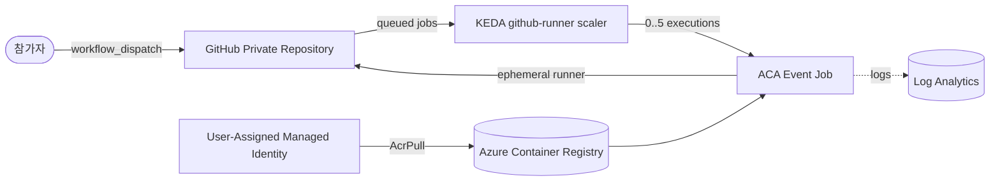

# Azure Container Apps GitHub Actions Runner Workshop Implementation Plan

> **For agentic workers:** REQUIRED SUB-SKILL: Use superpowers:subagent-driven-development (recommended) or superpowers:executing-plans to implement this plan task-by-task. Steps use checkbox (`- [ ]`) syntax for tracking.

**Goal:** Build a Korean, 90-minute hands-on workshop that creates ephemeral GitHub Actions self-hosted runners as event-driven Azure Container Apps Jobs and demonstrates KEDA-driven 0-to-N-to-0 execution scaling.

**Architecture:** A private GitHub repository queues workflow jobs labeled `aca-runner`. The managed KEDA `github-runner` scaler starts one Azure Container Apps Job execution per queued job, and each execution registers one ephemeral runner, processes one workflow job, and exits. Azure Container Registry stores the pinned runner image, a user-assigned managed identity performs image pulls, an ACA secret holds the fine-grained PAT, and Azure Monitor diagnostic settings route logs to Log Analytics.

**Tech Stack:** Markdown, Bash, GitHub Actions YAML, `ghcr.io/actions/actions-runner:2.336.0`, Azure CLI `containerapp` extension, Azure Container Apps Jobs, KEDA `github-runner` scaler, Azure Container Registry Tasks, Azure Monitor, Log Analytics.

## Global Constraints

- Write participant-facing content in Korean and preserve product names, CLI flags, environment variables, and code identifiers in English.
- Target 90 minutes: 85 minutes of modules plus 5 minutes of buffer.
- Use Azure Cloud Shell Bash for every required Azure step; do not require local Docker, PowerShell, `kubectl`, or Terraform/Bicep.
- Run the lab only against a private GitHub repository.
- Use a 30-day fine-grained PAT with repository permissions `Actions: Read-only`, `Administration: Read and write`, and `Metadata: Read-only`.
- Never print, commit, or place the PAT in expected output; capture it with `read -rsp`.
- Disable the ACR administrator account and pull the runner image through a user-assigned managed identity with `AcrPull`.
- Configure the ACA environment with `--logs-destination azure-monitor` and a resource-based diagnostic setting; do not use a Log Analytics Shared Key.
- Pin the runner base image to `ghcr.io/actions/actions-runner:2.336.0`.
- Register runners with `--ephemeral --unattended --disableupdate` and the custom label `aca-runner`.
- Use KEDA values `min-executions=0`, `max-executions=5`, `polling-interval=30`, `targetWorkflowQueueLength=1`, repository scope, and one explicit repository.
- Use a four-item GitHub Actions matrix to demonstrate active executions changing from 0 to N and back to 0.
- Do not use Docker commands, service containers, or Docker-in-Docker in the sample workflow.
- Explain GitHub App, Key Vault, VNet integration, organization runners, egress controls, and dedicated runner groups only as production extensions.
- Put the workflow sample in `samples/parallel-runner-workflow.yml`, not `.github/workflows/`, to prevent this workshop repository from starting jobs.
- Every module must contain goals, executable steps, expected output, validation, troubleshooting, and previous/next navigation.
- Use the tags `🟢 실행`, `👁️ 설명`, `📋 예상 출력`, and `⚠️ 주의` consistently.
- Make failures explicit: no broad catches, silent defaults, or success-shaped fallbacks.

---

## File Structure

| Path | Responsibility |
|---|---|
| `.gitignore` | Exclude visual-companion state, local environment files, and accidental secret files. |
| `README.md` | Workshop overview, architecture, learning goals, prerequisites, timing, costs, module index, tag legend, troubleshooting index, and references. |
| `runner/Dockerfile` | Build the pinned GitHub Actions runner image with only `curl`, `jq`, and CA certificates added. |
| `runner/entrypoint.sh` | Validate inputs, request short-lived registration/removal tokens, register one ephemeral runner, run one job, and clean up without hiding failures. |
| `samples/parallel-runner-workflow.yml` | Four-way matrix workflow that targets `[self-hosted, linux, x64, aca-runner]` and holds each job long enough to observe scaling. |
| `docs/01-prerequisites-github.md` | Prepare Cloud Shell, Azure providers, a private repository, and the fine-grained PAT. |
| `docs/02-azure-foundation.md` | Create the resource group, workspace, ACA environment, diagnostics, ACR, UAMI, and RBAC. |
| `docs/03-runner-image.md` | Explain and build the runner image with ACR Tasks, then verify the image and security settings. |
| `docs/04-event-job-keda.md` | Create the ACA Event Job and exact KEDA GitHub runner scale rule. |
| `docs/05-parallel-scale-validation.md` | Install the sample workflow, run four jobs, observe active executions, and query logs. |
| `docs/06-security-limitations-cleanup.md` | Explain production hardening, document unsupported scenarios, delete resources, and verify deletion. |
| `tests/runner/test-entrypoint.sh` | Dependency-free behavioral tests for runner input validation, registration, execution, cleanup, and secret redaction. |
| `tests/test-artifacts.sh` | Static assertions for the Dockerfile and sample workflow. |
| `tests/docs/test-overview.sh` | Assert README sections, timing, module links, architecture, and warnings. |
| `tests/docs/test-prerequisites-foundation.sh` | Assert the exact PAT, provider, Azure Monitor, ACR, UAMI, and RBAC instructions. |
| `tests/docs/test-build-deploy.sh` | Assert the image-build and Event Job/KEDA commands and values. |
| `tests/docs/test-scale-validation.sh` | Assert matrix, execution, runner, CLI log, and Log Analytics verification steps. |
| `tests/docs/test-security-cleanup.sh` | Assert production extensions, limitations, safe cleanup, and deletion verification. |
| `tests/validate-workshop.sh` | Run every static test, syntax-check Bash files, reject secret-shaped strings/placeholders, and verify navigation links. |

### Shared interfaces

- `runner/entrypoint.sh` consumes `GITHUB_PAT`, `GH_URL`, and `REGISTRATION_TOKEN_API_URL`.
- `runner/entrypoint.sh` optionally consumes `RUNNER_LABELS` (default `aca-runner`) and `RUNNER_NAME_PREFIX` (default `aca-runner`).
- `docs/04-event-job-keda.md` must pass those exact names through ACA Job `--env-vars`.
- `samples/parallel-runner-workflow.yml` must request the exact label produced by `RUNNER_LABELS`.
- All Azure modules reuse `SUFFIX`, `LOC`, `RG`, `LOG`, `ENV`, `ACR`, `UAMI`, `JOB`, `IMAGE`, `ACR_SERVER`, `UAMI_RID`, `GITHUB_OWNER`, and `GITHUB_REPO`.

---

### Task 1: Implement the Ephemeral Runner Entrypoint

**Files:**
- Create: `tests/runner/test-entrypoint.sh`
- Create: `runner/entrypoint.sh`

**Interfaces:**
- Consumes: `GITHUB_PAT`, `GH_URL`, `REGISTRATION_TOKEN_API_URL`, optional `RUNNER_LABELS`, optional `RUNNER_NAME_PREFIX`.
- Produces: executable `runner/entrypoint.sh`; runner configuration with `--ephemeral --unattended --disableupdate`; the log markers `Requesting registration token`, `Runner configured`, `Runner process exited`, and `Runner cleanup`.

- [ ] **Step 1: Write the failing entrypoint behavior test**

Create `tests/runner/test-entrypoint.sh` with a temporary runner directory and mock `curl`, `jq`, `config.sh`, and `run.sh`. Cover these exact cases:

```bash
#!/usr/bin/env bash
set -euo pipefail

ROOT="$(cd "$(dirname "${BASH_SOURCE[0]}")/../.." && pwd)"
ENTRYPOINT="$ROOT/runner/entrypoint.sh"

fail() {
  printf 'FAIL: %s\n' "$*" >&2
  exit 1
}

make_fixture() {
  FIXTURE="$(mktemp -d)"
  mkdir -p "$FIXTURE/bin" "$FIXTURE/runner"
  cp "$ENTRYPOINT" "$FIXTURE/runner/entrypoint.sh"

  cat >"$FIXTURE/bin/curl" <<'EOF'
#!/usr/bin/env bash
set -euo pipefail
printf '%s\n' "$*" >>"$MOCK_CALLS/curl.log"
if [[ "${MOCK_CURL_FAIL:-0}" == "1" ]]; then
  printf 'mock GitHub API failure\n' >&2
  exit 22
fi
if [[ "$*" == *"/remove-token"* ]]; then
  printf '{"token":"remove-token-value"}\n'
else
  printf '{"token":"registration-token-value"}\n'
fi
EOF

  cat >"$FIXTURE/bin/jq" <<'EOF'
#!/usr/bin/env bash
set -euo pipefail
sed -n 's/.*"token":"\([^"]*\)".*/\1/p'
EOF

  cat >"$FIXTURE/runner/config.sh" <<'EOF'
#!/usr/bin/env bash
set -euo pipefail
printf '%s\n' "$*" >>"$MOCK_CALLS/config.log"
if [[ "${1:-}" != "remove" ]]; then
  touch .runner
fi
EOF

  cat >"$FIXTURE/runner/run.sh" <<'EOF'
#!/usr/bin/env bash
set -euo pipefail
printf 'run\n' >>"$MOCK_CALLS/run.log"
exit "${MOCK_RUN_EXIT:-0}"
EOF

  chmod +x "$FIXTURE/bin/curl" "$FIXTURE/bin/jq" \
    "$FIXTURE/runner/entrypoint.sh" "$FIXTURE/runner/config.sh" "$FIXTURE/runner/run.sh"
  export MOCK_CALLS="$FIXTURE/calls"
  mkdir -p "$MOCK_CALLS"
}

run_entrypoint() {
  (
    cd "$FIXTURE/runner"
    PATH="$FIXTURE/bin:$PATH" \
      GITHUB_PAT="${GITHUB_PAT-}" \
      GH_URL="${GH_URL-}" \
      REGISTRATION_TOKEN_API_URL="${REGISTRATION_TOKEN_API_URL-}" \
      RUNNER_LABELS="${RUNNER_LABELS-}" \
      RUNNER_NAME_PREFIX="${RUNNER_NAME_PREFIX-}" \
      ./entrypoint.sh
  )
}

[[ -f "$ENTRYPOINT" ]] || fail "runner/entrypoint.sh is missing"

make_fixture
if output="$(run_entrypoint 2>&1)"; then
  fail "missing variables should fail"
fi
[[ "$output" == *"GITHUB_PAT is required"* ]] || fail "missing-variable error is unclear"
rm -rf "$FIXTURE"

make_fixture
export GITHUB_PAT="test-secret-value"
export GH_URL="https://github.com/example/private-repo"
export REGISTRATION_TOKEN_API_URL="https://api.github.com/repos/example/private-repo/actions/runners/registration-token"
export RUNNER_LABELS="aca-runner"
export RUNNER_NAME_PREFIX="aca"
output="$(run_entrypoint 2>&1)"
grep -F -- "--ephemeral" "$MOCK_CALLS/config.log" >/dev/null || fail "ephemeral flag missing"
grep -F -- "--unattended" "$MOCK_CALLS/config.log" >/dev/null || fail "unattended flag missing"
grep -F -- "--disableupdate" "$MOCK_CALLS/config.log" >/dev/null || fail "disableupdate flag missing"
grep -F -- "--labels aca-runner" "$MOCK_CALLS/config.log" >/dev/null || fail "runner label missing"
grep -F -- "remove --token remove-token-value" "$MOCK_CALLS/config.log" >/dev/null || fail "cleanup missing"
[[ -f "$MOCK_CALLS/run.log" ]] || fail "runner process was not started"
[[ "$output" != *"test-secret-value"* ]] || fail "PAT leaked to output"
rm -rf "$FIXTURE"

make_fixture
export MOCK_CURL_FAIL=1
if output="$(run_entrypoint 2>&1)"; then
  fail "GitHub API failure should fail"
fi
[[ ! -f "$MOCK_CALLS/config.log" ]] || fail "runner configured after API failure"
unset MOCK_CURL_FAIL
rm -rf "$FIXTURE"

make_fixture
export MOCK_RUN_EXIT=17
set +e
run_entrypoint >/tmp/aca-runner-entrypoint-test.log 2>&1
status=$?
set -e
[[ "$status" == "17" ]] || fail "runner exit status was not preserved"
grep -F -- "remove --token remove-token-value" "$MOCK_CALLS/config.log" >/dev/null || fail "failed run was not cleaned up"
rm -rf "$FIXTURE" /tmp/aca-runner-entrypoint-test.log

printf 'PASS: entrypoint behavior\n'
```

- [ ] **Step 2: Run the test to verify it fails**

Run:

```bash
bash tests/runner/test-entrypoint.sh
```

Expected: `FAIL: runner/entrypoint.sh is missing`.

- [ ] **Step 3: Implement the minimal robust entrypoint**

Create `runner/entrypoint.sh`:

```bash
#!/usr/bin/env bash
set -Eeuo pipefail

required_variables=(GITHUB_PAT GH_URL REGISTRATION_TOKEN_API_URL)
for variable_name in "${required_variables[@]}"; do
  if [[ -z "${!variable_name:-}" ]]; then
    printf 'ERROR: %s is required\n' "$variable_name" >&2
    exit 64
  fi
done

if [[ "$REGISTRATION_TOKEN_API_URL" != */registration-token ]]; then
  printf 'ERROR: REGISTRATION_TOKEN_API_URL must end with /registration-token\n' >&2
  exit 64
fi

RUNNER_LABELS="${RUNNER_LABELS:-aca-runner}"
RUNNER_NAME_PREFIX="${RUNNER_NAME_PREFIX:-aca-runner}"
RUNNER_NAME="${RUNNER_NAME_PREFIX}-$(hostname)-${RANDOM}"
REMOVAL_TOKEN_API_URL="${REGISTRATION_TOKEN_API_URL%/registration-token}/remove-token"
CLEANED_UP=0

github_token() {
  local url="$1"
  curl --fail --silent --show-error --request POST \
    --header 'Accept: application/vnd.github+json' \
    --header "Authorization: Bearer $GITHUB_PAT" \
    --header 'X-GitHub-Api-Version: 2022-11-28' \
    "$url" |
    jq --exit-status --raw-output '.token'
}

cleanup() {
  local cleanup_status=0

  if [[ "$CLEANED_UP" == "1" ]]; then
    return 0
  fi
  CLEANED_UP=1

  if [[ ! -f .runner ]]; then
    return 0
  fi

  printf 'Runner cleanup: requesting removal token\n'
  set +e
  removal_token="$(github_token "$REMOVAL_TOKEN_API_URL")"
  cleanup_status=$?
  if [[ "$cleanup_status" == "0" && -n "$removal_token" ]]; then
    ./config.sh remove --token "$removal_token"
    cleanup_status=$?
  fi
  set -e

  if [[ "$cleanup_status" != "0" ]]; then
    printf 'ERROR: Runner cleanup failed with status %s\n' "$cleanup_status" >&2
  fi
  return 0
}

trap cleanup EXIT
trap 'exit 130' INT
trap 'exit 143' TERM

printf 'Requesting registration token\n'
registration_token="$(github_token "$REGISTRATION_TOKEN_API_URL")"

./config.sh \
  --url "$GH_URL" \
  --token "$registration_token" \
  --name "$RUNNER_NAME" \
  --labels "$RUNNER_LABELS" \
  --unattended \
  --ephemeral \
  --disableupdate

printf 'Runner configured: %s\n' "$RUNNER_NAME"
set +e
./run.sh
runner_status=$?
set -e
printf 'Runner process exited with status %s\n' "$runner_status"
exit "$runner_status"
```

- [ ] **Step 4: Run the focused tests**

Run:

```bash
bash -n runner/entrypoint.sh
bash tests/runner/test-entrypoint.sh
```

Expected: both commands exit 0 and the test prints `PASS: entrypoint behavior`.

- [ ] **Step 5: Commit the entrypoint**

```bash
git add runner/entrypoint.sh tests/runner/test-entrypoint.sh
git commit -m "feat: add ephemeral GitHub runner entrypoint" \
  -m "Co-authored-by: Copilot <223556219+Copilot@users.noreply.github.com>"
```

---

### Task 2: Add the Runner Image and Parallel Workflow

**Files:**
- Create: `tests/test-artifacts.sh`
- Create: `runner/Dockerfile`
- Create: `samples/parallel-runner-workflow.yml`

**Interfaces:**
- Consumes: `runner/entrypoint.sh` from Task 1.
- Produces: image tag `github-actions-runner:2.336.0`; workflow label contract `[self-hosted, linux, x64, aca-runner]`; matrix workers `[1, 2, 3, 4]`.

- [ ] **Step 1: Write the failing artifact test**

Create `tests/test-artifacts.sh`:

```bash
#!/usr/bin/env bash
set -euo pipefail

ROOT="$(cd "$(dirname "${BASH_SOURCE[0]}")/.." && pwd)"
DOCKERFILE="$ROOT/runner/Dockerfile"
WORKFLOW="$ROOT/samples/parallel-runner-workflow.yml"

[[ -f "$DOCKERFILE" ]] || { echo "FAIL: runner/Dockerfile missing" >&2; exit 1; }
[[ -f "$WORKFLOW" ]] || { echo "FAIL: workflow sample missing" >&2; exit 1; }

grep -F 'FROM ghcr.io/actions/actions-runner:2.336.0' "$DOCKERFILE" >/dev/null
grep -F 'apt-get install -y --no-install-recommends ca-certificates curl jq' "$DOCKERFILE" >/dev/null
grep -F 'USER runner' "$DOCKERFILE" >/dev/null
grep -F 'ENTRYPOINT ["/home/runner/entrypoint.sh"]' "$DOCKERFILE" >/dev/null

grep -F 'workflow_dispatch:' "$WORKFLOW" >/dev/null
grep -F 'worker: [1, 2, 3, 4]' "$WORKFLOW" >/dev/null
grep -F 'runs-on: [self-hosted, linux, x64, aca-runner]' "$WORKFLOW" >/dev/null
grep -F 'fail-fast: false' "$WORKFLOW" >/dev/null
grep -F 'sleep 45' "$WORKFLOW" >/dev/null

if grep -E '(^|[[:space:]])docker([[:space:]]|$)|services:' "$WORKFLOW" >/dev/null; then
  echo "FAIL: workflow must not depend on Docker" >&2
  exit 1
fi

printf 'PASS: runner image and workflow artifacts\n'
```

- [ ] **Step 2: Run the test to verify it fails**

Run:

```bash
bash tests/test-artifacts.sh
```

Expected: `FAIL: runner/Dockerfile missing`.

- [ ] **Step 3: Create the pinned runner Dockerfile**

Create `runner/Dockerfile`:

```dockerfile
FROM ghcr.io/actions/actions-runner:2.336.0

USER root

RUN apt-get update \
    && apt-get install -y --no-install-recommends ca-certificates curl jq \
    && apt-get clean \
    && rm -rf /var/lib/apt/lists/*

COPY --chown=runner:runner entrypoint.sh /home/runner/entrypoint.sh
RUN chmod 0555 /home/runner/entrypoint.sh

USER runner
WORKDIR /home/runner

ENTRYPOINT ["/home/runner/entrypoint.sh"]
```

- [ ] **Step 4: Create the four-way scale test workflow**

Create `samples/parallel-runner-workflow.yml`:

```yaml
name: ACA Runner Scale Test

on:
  workflow_dispatch:

jobs:
  parallel-runner:
    name: Worker ${{ matrix.worker }}
    runs-on: [self-hosted, linux, x64, aca-runner]
    timeout-minutes: 10
    strategy:
      fail-fast: false
      matrix:
        worker: [1, 2, 3, 4]
    steps:
      - name: Show runner identity
        shell: bash
        run: |
          set -euo pipefail
          echo "worker=${{ matrix.worker }}"
          echo "hostname=$(hostname)"
          echo "started_at=$(date --utc --iso-8601=seconds)"

      - name: Hold the runner for scale observation
        shell: bash
        run: |
          set -euo pipefail
          sleep 45
          echo "completed_at=$(date --utc --iso-8601=seconds)"
```

- [ ] **Step 5: Run focused validation**

Run:

```bash
bash tests/test-artifacts.sh
```

Expected: `PASS: runner image and workflow artifacts`.

- [ ] **Step 6: Commit the image and workflow**

```bash
git add runner/Dockerfile samples/parallel-runner-workflow.yml tests/test-artifacts.sh
git commit -m "feat: add runner image and scale workflow" \
  -m "Co-authored-by: Copilot <223556219+Copilot@users.noreply.github.com>"
```

---

### Task 3: Write the Workshop Overview

**Files:**
- Create: `tests/docs/test-overview.sh`
- Create: `README.md`

**Interfaces:**
- Consumes: final module paths and the exact architecture/scaling values from the design.
- Produces: the workshop entry point and navigation to all six modules.

- [ ] **Step 1: Write the failing README contract test**

Create `tests/docs/test-overview.sh`:

```bash
#!/usr/bin/env bash
set -euo pipefail

ROOT="$(cd "$(dirname "${BASH_SOURCE[0]}")/../.." && pwd)"
README="$ROOT/README.md"
[[ -f "$README" ]] || { echo "FAIL: README.md missing" >&2; exit 1; }

for heading in \
  '# Azure Container Apps GitHub Actions Runner 워크숍' \
  '## 아키텍처' \
  '## 학습 목표' \
  '## 사전 요구사항' \
  '## 모듈 목차' \
  '## 시간표' \
  '## 비용 개요' \
  '## 태깅 범례' \
  '## 트러블슈팅 색인' \
  '## 참고 자료'; do
  grep -F "$heading" "$README" >/dev/null || { echo "FAIL: missing $heading" >&2; exit 1; }
done

for module in \
  'docs/01-prerequisites-github.md' \
  'docs/02-azure-foundation.md' \
  'docs/03-runner-image.md' \
  'docs/04-event-job-keda.md' \
  'docs/05-parallel-scale-validation.md' \
  'docs/06-security-limitations-cleanup.md'; do
  grep -F "$module" "$README" >/dev/null || { echo "FAIL: missing link $module" >&2; exit 1; }
done

grep -F '약 90분' "$README" >/dev/null
grep -F 'Private repository' "$README" >/dev/null
grep -F 'Docker-in-Docker' "$README" >/dev/null
grep -F '0 → N → 0' "$README" >/dev/null
grep -F '🟢 **실행**' "$README" >/dev/null
grep -F '📋 **예상 출력**' "$README" >/dev/null

printf 'PASS: README contract\n'
```

- [ ] **Step 2: Run the test to verify it fails**

Run:

```bash
bash tests/docs/test-overview.sh
```

Expected: `FAIL: README.md missing`.

- [ ] **Step 3: Write `README.md`**

Write the README in the same style as the reference workshop. Include:

1. A blockquote summary stating that the core workshop takes about 90 minutes, uses Cloud Shell only, creates repository-scoped ephemeral runners, and demonstrates KEDA 0 → N → 0 active executions.
2. This Mermaid architecture:



3. Seven learning goals: prepare GitHub/Azure, build the runner image, deploy the Event Job, configure KEDA, run four parallel jobs, inspect logs/troubleshoot, and clean up.
4. A prerequisites table with Azure Contributor, Cloud Shell Bash, GitHub account, private repository permission, fine-grained PAT permission, and basic Azure/GitHub Actions knowledge.
5. A prominent warning that public repositories can execute untrusted code and that Docker-in-Docker is unsupported.
6. A module table with exact times `5, 10, 15, 10, 15, 20, 10` minutes plus a 5-minute buffer.
7. A cost table covering ACA Consumption job execution time, ACR Basic storage/build time, and Log Analytics ingestion, with a mandatory cleanup reminder and no unsupported exact currency estimate.
8. The tag legend from Global Constraints.
9. A troubleshooting index mapping queued workflow, GitHub 401/403, image pull, no execution, timeout, Docker failure, lingering runner, and deletion problems to modules.
10. References to the Microsoft Community Hub article, Microsoft Learn runner tutorial, ACA Jobs docs, KEDA scaler docs, GitHub self-hosted runner security docs, and the style reference repository.

- [ ] **Step 4: Run the README test**

Run:

```bash
bash tests/docs/test-overview.sh
```

Expected: `PASS: README contract`.

- [ ] **Step 5: Commit the overview**

```bash
git add README.md tests/docs/test-overview.sh
git commit -m "docs: add workshop overview" \
  -m "Co-authored-by: Copilot <223556219+Copilot@users.noreply.github.com>"
```

---

### Task 4: Document GitHub Prerequisites and Azure Foundation

**Files:**
- Create: `tests/docs/test-prerequisites-foundation.sh`
- Create: `docs/01-prerequisites-github.md`
- Create: `docs/02-azure-foundation.md`

**Interfaces:**
- Consumes: repository layout and variable names from File Structure.
- Produces: validated `GITHUB_OWNER`, `GITHUB_REPO`, `GITHUB_PAT`, Azure resource variables, `LOG_ID`, `LOG_RID`, `ENV_ID`, `ACR_SERVER`, `ACR_ID`, `UAMI_RID`, and `UAMI_PID`.

- [ ] **Step 1: Write the failing documentation test**

Create `tests/docs/test-prerequisites-foundation.sh` that asserts:

```bash
#!/usr/bin/env bash
set -euo pipefail

ROOT="$(cd "$(dirname "${BASH_SOURCE[0]}")/../.." && pwd)"
PREREQ="$ROOT/docs/01-prerequisites-github.md"
FOUNDATION="$ROOT/docs/02-azure-foundation.md"

[[ -f "$PREREQ" ]] || { echo "FAIL: module 01 missing" >&2; exit 1; }
[[ -f "$FOUNDATION" ]] || { echo "FAIL: module 02 missing" >&2; exit 1; }

for text in \
  'Visibility | **Private**' \
  'Actions | Read-only' \
  'Administration | Read and write' \
  'Metadata | Read-only' \
  'read -rsp "GitHub PAT: " GITHUB_PAT' \
  'read -rp "Workshop repository URL: " WORKSHOP_REPO_URL' \
  'git clone "$WORKSHOP_REPO_URL" ~/aca-github-runner-workshop' \
  'az extension add --name containerapp --upgrade --only-show-errors' \
  'az provider register -n Microsoft.App --wait' \
  'az provider register -n Microsoft.OperationalInsights --wait' \
  'az provider register -n Microsoft.Insights --wait'; do
  grep -F "$text" "$PREREQ" >/dev/null || { echo "FAIL: module 01 missing $text" >&2; exit 1; }
done

for text in \
  'LOC=koreacentral' \
  'az containerapp env create' \
  '--logs-destination azure-monitor' \
  'az monitor diagnostic-settings create' \
  '"categoryGroup":"allLogs"' \
  'az acr create' \
  '--admin-enabled false' \
  'az acr config authentication-as-arm update' \
  'az identity create' \
  '--role AcrPull' \
  '--assignee-principal-type ServicePrincipal'; do
  grep -F -- "$text" "$FOUNDATION" >/dev/null || { echo "FAIL: module 02 missing $text" >&2; exit 1; }
done

printf 'PASS: prerequisites and foundation docs\n'
```

- [ ] **Step 2: Run the test to verify it fails**

Run:

```bash
bash tests/docs/test-prerequisites-foundation.sh
```

Expected: `FAIL: module 01 missing`.

- [ ] **Step 3: Write module 01**

Create `docs/01-prerequisites-github.md` with:

- The standard tag legend and a goal section.
- Cloud Shell subscription selection:

```bash
az account list --query "[].{Name:name,SubscriptionId:id,State:state}" -o table
read -rp "Azure subscription ID: " SUBSCRIPTION_ID
az account set --subscription "$SUBSCRIPTION_ID"
az account show --query "{Name:name,SubscriptionId:id,State:state}" -o table
```

- Extension/provider setup:

```bash
az extension add --name containerapp --upgrade --only-show-errors
az provider register -n Microsoft.App --wait
az provider register -n Microsoft.OperationalInsights --wait
az provider register -n Microsoft.Insights --wait
```

- GitHub web steps for a new repository named `aca-runner-lab`, with `Visibility | **Private**` and an initialized README.
- Workshop source clone steps that do not assume a specific final GitHub owner:

```bash
read -rp "Workshop repository URL: " WORKSHOP_REPO_URL
git clone "$WORKSHOP_REPO_URL" ~/aca-github-runner-workshop
cd ~/aca-github-runner-workshop
ls
```

Expected files: `README.md`, `docs`, `runner`, `samples`, and `tests`.
- Fine-grained PAT instructions with 30-day expiration, only the lab repository selected, and the exact three permissions.
- Secret-safe shell input and repository variables:

```bash
read -rp "GitHub owner: " GITHUB_OWNER
read -rp "Private repository name: " GITHUB_REPO
read -rsp "GitHub PAT: " GITHUB_PAT
echo
export GITHUB_OWNER GITHUB_REPO GITHUB_PAT
```

- A GitHub API validation that does not print the token:

```bash
curl --fail --silent --show-error \
  --header 'Accept: application/vnd.github+json' \
  --header "Authorization: Bearer $GITHUB_PAT" \
  --header 'X-GitHub-Api-Version: 2022-11-28' \
  "https://api.github.com/repos/$GITHUB_OWNER/$GITHUB_REPO" \
  | jq '{full_name, private, visibility}'
```

- Expected output with `"private": true`.
- Troubleshooting for wrong visibility, 401, 403, organization token policy, missing `jq`, and expired PAT.
- Next link to module 02.

- [ ] **Step 4: Write module 02**

Create `docs/02-azure-foundation.md` with this reusable variable block:

```bash
SUFFIX=$(printf "%05d" $((RANDOM % 100000)))
LOC=koreacentral
RG="rg-acarunner-$SUFFIX"
LOG="log-acarunner-$SUFFIX"
ENV="env-acarunner-$SUFFIX"
ACR="acracarunner$SUFFIX"
UAMI="id-acarunner-$SUFFIX"
JOB="job-ghrunner-$SUFFIX"
IMAGE="github-actions-runner:2.336.0"
printf 'SUFFIX=%s RG=%s\n' "$SUFFIX" "$RG"
```

Then document and explain these commands in order:

```bash
az group create --name "$RG" --location "$LOC" --output none

az monitor log-analytics workspace create \
  --resource-group "$RG" \
  --workspace-name "$LOG" \
  --location "$LOC" \
  --output none

LOG_ID=$(az monitor log-analytics workspace show \
  --resource-group "$RG" \
  --workspace-name "$LOG" \
  --query customerId \
  --output tsv)
LOG_RID=$(az monitor log-analytics workspace show \
  --resource-group "$RG" \
  --workspace-name "$LOG" \
  --query id \
  --output tsv)

az containerapp env create \
  --resource-group "$RG" \
  --name "$ENV" \
  --location "$LOC" \
  --logs-destination azure-monitor \
  --output none

ENV_ID=$(az containerapp env show \
  --resource-group "$RG" \
  --name "$ENV" \
  --query id \
  --output tsv)

az monitor diagnostic-settings create \
  --name aca-runner-logs \
  --resource "$ENV_ID" \
  --workspace "$LOG_RID" \
  --logs '[{"categoryGroup":"allLogs","enabled":true}]' \
  --output none

az acr create \
  --resource-group "$RG" \
  --name "$ACR" \
  --location "$LOC" \
  --sku Basic \
  --admin-enabled false \
  --output none

az acr config authentication-as-arm update \
  --registry "$ACR" \
  --status enabled \
  --output none

ACR_SERVER=$(az acr show --name "$ACR" --query loginServer --output tsv)
ACR_ID=$(az acr show --name "$ACR" --query id --output tsv)

az identity create \
  --resource-group "$RG" \
  --name "$UAMI" \
  --output none

UAMI_RID=$(az identity show \
  --resource-group "$RG" \
  --name "$UAMI" \
  --query id \
  --output tsv)
UAMI_PID=$(az identity show \
  --resource-group "$RG" \
  --name "$UAMI" \
  --query principalId \
  --output tsv)

az role assignment create \
  --assignee-object-id "$UAMI_PID" \
  --assignee-principal-type ServicePrincipal \
  --role AcrPull \
  --scope "$ACR_ID" \
  --output none
```

Add validation commands for the resource list, diagnostic setting, ACR `adminUserEnabled`, ARM authentication status, and `AcrPull` role. Explain that RBAC propagation can take several minutes. Add troubleshooting for ACR name collision, provider registration, diagnostic permission, and role propagation. Link back to 01 and forward to 03.

- [ ] **Step 5: Run focused documentation tests**

Run:

```bash
bash tests/docs/test-prerequisites-foundation.sh
```

Expected: `PASS: prerequisites and foundation docs`.

- [ ] **Step 6: Commit the setup modules**

```bash
git add docs/01-prerequisites-github.md docs/02-azure-foundation.md \
  tests/docs/test-prerequisites-foundation.sh
git commit -m "docs: add GitHub and Azure setup modules" \
  -m "Co-authored-by: Copilot <223556219+Copilot@users.noreply.github.com>"
```

---

### Task 5: Document Runner Image Build and Event Job Deployment

**Files:**
- Create: `tests/docs/test-build-deploy.sh`
- Create: `docs/03-runner-image.md`
- Create: `docs/04-event-job-keda.md`

**Interfaces:**
- Consumes: `runner/Dockerfile`, `runner/entrypoint.sh`, all variables from module 02, and GitHub variables from module 01.
- Produces: ACR image `$ACR_SERVER/$IMAGE` and ACA Job `$JOB` with container name `github-actions-runner`.

- [ ] **Step 1: Write the failing build/deploy documentation test**

Create `tests/docs/test-build-deploy.sh`:

```bash
#!/usr/bin/env bash
set -euo pipefail

ROOT="$(cd "$(dirname "${BASH_SOURCE[0]}")/../.." && pwd)"
IMAGE_DOC="$ROOT/docs/03-runner-image.md"
JOB_DOC="$ROOT/docs/04-event-job-keda.md"
[[ -f "$IMAGE_DOC" ]] || { echo "FAIL: module 03 missing" >&2; exit 1; }
[[ -f "$JOB_DOC" ]] || { echo "FAIL: module 04 missing" >&2; exit 1; }

for text in \
  'bash -n runner/entrypoint.sh' \
  'bash tests/runner/test-entrypoint.sh' \
  'az acr build' \
  '--image "$IMAGE"' \
  './runner' \
  'ghcr.io/actions/actions-runner:2.336.0'; do
  grep -F -- "$text" "$IMAGE_DOC" >/dev/null || { echo "FAIL: module 03 missing $text" >&2; exit 1; }
done

for text in \
  '--trigger-type Event' \
  '--container-name github-actions-runner' \
  '--replica-retry-limit 0' \
  '--replica-completion-count 1' \
  '--parallelism 1' \
  '--min-executions 0' \
  '--max-executions 5' \
  '--polling-interval 30' \
  '--scale-rule-type github-runner' \
  'runnerScope=repo' \
  'labels=aca-runner' \
  'targetWorkflowQueueLength=1' \
  'personalAccessToken=personal-access-token' \
  'GITHUB_PAT=secretref:personal-access-token' \
  'RUNNER_LABELS=aca-runner' \
  '--registry-identity "$UAMI_RID"'; do
  grep -F -- "$text" "$JOB_DOC" >/dev/null || { echo "FAIL: module 04 missing $text" >&2; exit 1; }
done

printf 'PASS: image build and Event Job docs\n'
```

- [ ] **Step 2: Run the test to verify it fails**

Run:

```bash
bash tests/docs/test-build-deploy.sh
```

Expected: `FAIL: module 03 missing`.

- [ ] **Step 3: Write module 03**

Create `docs/03-runner-image.md` with:

- Variable recovery instructions using the saved `SUFFIX`.
- A short read-only explanation of `runner/Dockerfile` and `runner/entrypoint.sh`.
- Local static checks:

```bash
cd ~/aca-github-runner-workshop
bash -n runner/entrypoint.sh
bash tests/runner/test-entrypoint.sh
bash tests/test-artifacts.sh
```

- ACR Tasks build:

```bash
az acr build \
  --resource-group "$RG" \
  --registry "$ACR" \
  --image "$IMAGE" \
  ./runner
```

- Verification:

```bash
az acr repository show-tags \
  --name "$ACR" \
  --repository github-actions-runner \
  --output table

az acr show \
  --name "$ACR" \
  --query "{loginServer:loginServer,adminUserEnabled:adminUserEnabled}" \
  --output table
```

- Expected tag `2.336.0` and `adminUserEnabled` false.
- Explanations for pinning, `--disableupdate`, ACR cloud build, non-root execution, and why Docker is absent.
- Troubleshooting for upstream image pull failure, RBAC propagation, wrong build context, missing files, and runner version update procedure.

- [ ] **Step 4: Write module 04**

Create `docs/04-event-job-keda.md`. Start with variable recovery and secret-safe PAT input if the Cloud Shell session was restarted:

```bash
read -rp "GitHub owner: " GITHUB_OWNER
read -rp "Private repository name: " GITHUB_REPO
read -rsp "GitHub PAT: " GITHUB_PAT
echo
export GITHUB_OWNER GITHUB_REPO GITHUB_PAT
```

Create the Job with this exact command:

```bash
az containerapp job create \
  --name "$JOB" \
  --resource-group "$RG" \
  --environment "$ENV" \
  --trigger-type Event \
  --replica-timeout 900 \
  --replica-retry-limit 0 \
  --replica-completion-count 1 \
  --parallelism 1 \
  --container-name github-actions-runner \
  --image "$ACR_SERVER/$IMAGE" \
  --min-executions 0 \
  --max-executions 5 \
  --polling-interval 30 \
  --scale-rule-name github-runner \
  --scale-rule-type github-runner \
  --scale-rule-metadata \
    "githubApiURL=https://api.github.com" \
    "owner=$GITHUB_OWNER" \
    "runnerScope=repo" \
    "repos=$GITHUB_REPO" \
    "labels=aca-runner" \
    "targetWorkflowQueueLength=1" \
  --scale-rule-auth "personalAccessToken=personal-access-token" \
  --secrets "personal-access-token=$GITHUB_PAT" \
  --env-vars \
    "GITHUB_PAT=secretref:personal-access-token" \
    "GH_URL=https://github.com/$GITHUB_OWNER/$GITHUB_REPO" \
    "REGISTRATION_TOKEN_API_URL=https://api.github.com/repos/$GITHUB_OWNER/$GITHUB_REPO/actions/runners/registration-token" \
    "RUNNER_LABELS=aca-runner" \
    "RUNNER_NAME_PREFIX=aca" \
  --registry-server "$ACR_SERVER" \
  --mi-user-assigned "$UAMI_RID" \
  --registry-identity "$UAMI_RID" \
  --cpu 2.0 \
  --memory 4Gi \
  --output none
```

Explain every scale, execution, identity, secret, and environment parameter in a table. Validate without exposing the secret:

```bash
az containerapp job show \
  --name "$JOB" \
  --resource-group "$RG" \
  --query "{
    triggerType:properties.configuration.triggerType,
    replicaTimeout:properties.configuration.replicaTimeout,
    minExecutions:properties.configuration.eventTriggerConfig.scale.minExecutions,
    maxExecutions:properties.configuration.eventTriggerConfig.scale.maxExecutions,
    pollingInterval:properties.configuration.eventTriggerConfig.scale.pollingInterval,
    rules:properties.configuration.eventTriggerConfig.scale.rules,
    image:properties.template.containers[0].image
  }" \
  --output yaml

az containerapp job execution list \
  --name "$JOB" \
  --resource-group "$RG" \
  --output table
```

Expected before triggering: correct config and no active executions. Add a GitHub Settings check showing no permanently online runner is required before a workflow is queued. Troubleshoot PAT auth, scaler metadata, label mismatch, ACR pull, extension version, and RBAC propagation.

- [ ] **Step 5: Run focused documentation tests**

Run:

```bash
bash tests/docs/test-build-deploy.sh
```

Expected: `PASS: image build and Event Job docs`.

- [ ] **Step 6: Commit the build and deployment modules**

```bash
git add docs/03-runner-image.md docs/04-event-job-keda.md tests/docs/test-build-deploy.sh
git commit -m "docs: add runner build and KEDA deployment modules" \
  -m "Co-authored-by: Copilot <223556219+Copilot@users.noreply.github.com>"
```

---

### Task 6: Document Parallel Scaling and Log Validation

**Files:**
- Create: `tests/docs/test-scale-validation.sh`
- Create: `docs/05-parallel-scale-validation.md`

**Interfaces:**
- Consumes: `samples/parallel-runner-workflow.yml`, `$JOB`, `$RG`, `$LOG_ID`, `$GITHUB_OWNER`, and `$GITHUB_REPO`.
- Produces: participant evidence that four jobs ran on ephemeral runners, active executions returned to zero, and logs contain the runner lifecycle markers.

- [ ] **Step 1: Write the failing scale-validation documentation test**

Create `tests/docs/test-scale-validation.sh`:

```bash
#!/usr/bin/env bash
set -euo pipefail

ROOT="$(cd "$(dirname "${BASH_SOURCE[0]}")/../.." && pwd)"
DOC="$ROOT/docs/05-parallel-scale-validation.md"
[[ -f "$DOC" ]] || { echo "FAIL: module 05 missing" >&2; exit 1; }

for text in \
  'samples/parallel-runner-workflow.yml' \
  '.github/workflows/aca-runner-scale-test.yml' \
  'runs-on: [self-hosted, linux, x64, aca-runner]' \
  'worker: [1, 2, 3, 4]' \
  'az containerapp job execution list' \
  'properties.status' \
  'az containerapp job logs show' \
  '--container github-actions-runner' \
  'ContainerAppConsoleLogs' \
  'ContainerGroupName startswith' \
  'Runner configured' \
  'Runner process exited' \
  'active execution 수는 0'; do
  grep -F -- "$text" "$DOC" >/dev/null || { echo "FAIL: module 05 missing $text" >&2; exit 1; }
done

printf 'PASS: parallel scale validation doc\n'
```

- [ ] **Step 2: Run the test to verify it fails**

Run:

```bash
bash tests/docs/test-scale-validation.sh
```

Expected: `FAIL: module 05 missing`.

- [ ] **Step 3: Write module 05**

Create `docs/05-parallel-scale-validation.md` with these stages:

1. In Cloud Shell, display the complete sample:

```bash
cd ~/aca-github-runner-workshop
sed -n '1,200p' samples/parallel-runner-workflow.yml
```

Then use the GitHub web UI in the private lab repository: **Add file → Create new file**, enter `.github/workflows/aca-runner-scale-test.yml`, paste the displayed sample unchanged, and commit it to the default branch. Use the web UI so the PAT can retain the documented least-privilege permissions without `Contents: Read and write`.

2. Show the relevant YAML excerpt containing:

```yaml
worker: [1, 2, 3, 4]
runs-on: [self-hosted, linux, x64, aca-runner]
```

3. Verify baseline execution history and explain that history may contain completed records while active execution count is zero:

```bash
az containerapp job execution list \
  --name "$JOB" \
  --resource-group "$RG" \
  --query "[].{Name:name,Status:properties.status,Start:properties.startTime,End:properties.endTime}" \
  --output table
```

4. Trigger `ACA Runner Scale Test` from GitHub Actions with `workflow_dispatch`.
5. During the first 30-90 seconds, repeat:

```bash
az containerapp job execution list \
  --name "$JOB" \
  --resource-group "$RG" \
  --query "[?properties.status=='Running'].{Name:name,Status:properties.status,Start:properties.startTime}" \
  --output table
```

Expected: between one and four running executions depending on polling and startup timing. Do not promise all four are visible simultaneously.
6. Capture the newest execution and stream logs:

```bash
EXECUTION=$(az containerapp job execution list \
  --name "$JOB" \
  --resource-group "$RG" \
  --query "sort_by([], &properties.startTime)[-1].name" \
  --output tsv)

az containerapp job logs show \
  --name "$JOB" \
  --resource-group "$RG" \
  --execution "$EXECUTION" \
  --container github-actions-runner \
  --tail 100 \
  --format text
```

7. Query resource-specific Azure Monitor logs:

```bash
az monitor log-analytics query \
  --workspace "$LOG_ID" \
  --analytics-query "
    ContainerAppConsoleLogs
    | where TimeGenerated > ago(30m)
    | where ContainerGroupName startswith '$EXECUTION'
    | project TimeGenerated, ContainerGroupName, Log
    | order by TimeGenerated asc
  " \
  --output table
```

8. Confirm the log markers `Requesting registration token`, `Runner configured`, and `Runner process exited`.
9. Confirm all four GitHub jobs succeeded and show different runner hostnames where concurrency allowed.
10. Re-run the `Running` filter until it returns no rows, then state exactly: `대기 Job 처리가 끝나면 active execution 수는 0이 됩니다. 완료 execution 이력은 남을 수 있습니다.`
11. Open GitHub repository **Settings → Actions → Runners** and verify no runner remains permanently online.
12. Troubleshoot queued jobs, only one runner, no logs yet, removed replica logs, 401/403, timeout, and stale offline runners.

- [ ] **Step 4: Run focused documentation tests**

Run:

```bash
bash tests/docs/test-scale-validation.sh
```

Expected: `PASS: parallel scale validation doc`.

- [ ] **Step 5: Commit the validation module**

```bash
git add docs/05-parallel-scale-validation.md tests/docs/test-scale-validation.sh
git commit -m "docs: add parallel scaling validation module" \
  -m "Co-authored-by: Copilot <223556219+Copilot@users.noreply.github.com>"
```

---

### Task 7: Document Security, Limitations, and Cleanup

**Files:**
- Create: `tests/docs/test-security-cleanup.sh`
- Create: `docs/06-security-limitations-cleanup.md`
- Create: `.gitignore`

**Interfaces:**
- Consumes: `$RG`, `$JOB`, and the complete workshop architecture.
- Produces: explicit production-hardening guidance and verified removal of all Azure resources.

- [ ] **Step 1: Write the failing security/cleanup documentation test**

Create `tests/docs/test-security-cleanup.sh`:

```bash
#!/usr/bin/env bash
set -euo pipefail

ROOT="$(cd "$(dirname "${BASH_SOURCE[0]}")/../.." && pwd)"
DOC="$ROOT/docs/06-security-limitations-cleanup.md"
IGNORE="$ROOT/.gitignore"
[[ -f "$DOC" ]] || { echo "FAIL: module 06 missing" >&2; exit 1; }
[[ -f "$IGNORE" ]] || { echo "FAIL: .gitignore missing" >&2; exit 1; }

for text in \
  'GitHub App' \
  'Azure Key Vault' \
  'VNet' \
  'egress' \
  'organization' \
  'Docker-in-Docker' \
  'public repository' \
  'PAT 만료' \
  'az group delete' \
  '--yes --no-wait' \
  'az group show' \
  'ResourceGroupNotFound'; do
  grep -F -- "$text" "$DOC" >/dev/null || { echo "FAIL: module 06 missing $text" >&2; exit 1; }
done

grep -F '.superpowers/' "$IGNORE" >/dev/null
grep -F '.env' "$IGNORE" >/dev/null
grep -F '*.local' "$IGNORE" >/dev/null

printf 'PASS: security and cleanup doc\n'
```

- [ ] **Step 2: Run the test to verify it fails**

Run:

```bash
bash tests/docs/test-security-cleanup.sh
```

Expected: `FAIL: module 06 missing`.

- [ ] **Step 3: Write `.gitignore`**

Create:

```gitignore
.superpowers/
.env
*.local
```

- [ ] **Step 4: Write module 06**

Create `docs/06-security-limitations-cleanup.md` with:

- A comparison table:

| Workshop choice | Production extension | Reason |
|---|---|---|
| Fine-grained PAT | GitHub App | higher rate limit and centralized lifecycle |
| ACA secret | Azure Key Vault secret reference | centralized rotation and audit |
| Public egress | VNet, firewall, restricted egress | control reachable destinations |
| Repository runner | organization runner group | controlled reuse across repositories |
| Consumption profile | workload profiles when required | predictable dedicated capacity |

- Security rules: private repository only, trusted workflow authors, least-privilege PAT, 30-day expiration, no token output, pinned runner image, regular image rebuild/scanning, and deletion of stale runners.
- Limitations: no Docker-in-Docker, no service containers requiring a Docker daemon, no persistent workspace across executions, cold-start/polling delay, GitHub API rate limits, managed KEDA version, maximum five lab executions, and execution history limited to recent records.
- Cleanup:

```bash
az group delete \
  --name "$RG" \
  --yes \
  --no-wait
printf '리소스 그룹 삭제 요청됨: %s\n' "$RG"
```

- Deletion verification:

```bash
az group show --name "$RG" --output table
```

- Expected final result: `(ResourceGroupNotFound)` after asynchronous deletion completes.
- A GitHub-side cleanup checklist: remove the lab workflow if desired, remove stale offline runners, and revoke/delete the fine-grained PAT.
- Troubleshooting for `AuthorizationFailed`, asynchronous deletion, resource locks, stale runners, PAT revocation, and unexpected charges.
- A completion table mapping all modules to learned outcomes.
- Previous link to module 05 and no next-module link.

- [ ] **Step 5: Run focused documentation tests**

Run:

```bash
bash tests/docs/test-security-cleanup.sh
```

Expected: `PASS: security and cleanup doc`.

- [ ] **Step 6: Commit security and cleanup**

```bash
git add .gitignore docs/06-security-limitations-cleanup.md tests/docs/test-security-cleanup.sh
git commit -m "docs: add security and cleanup module" \
  -m "Co-authored-by: Copilot <223556219+Copilot@users.noreply.github.com>"
```

---

### Task 8: Add Integrated Validation and Rehearse the Workshop

**Files:**
- Create: `tests/validate-workshop.sh`
- Modify: `README.md`
- Modify: `docs/01-prerequisites-github.md`
- Modify: `docs/02-azure-foundation.md`
- Modify: `docs/03-runner-image.md`
- Modify: `docs/04-event-job-keda.md`
- Modify: `docs/05-parallel-scale-validation.md`
- Modify: `docs/06-security-limitations-cleanup.md`

**Interfaces:**
- Consumes: all repository artifacts from Tasks 1-7.
- Produces: one command, `bash tests/validate-workshop.sh`, that validates the complete workshop; a recorded rehearsal result in the README without secrets.

- [ ] **Step 1: Write the integrated validator**

Create `tests/validate-workshop.sh`:

```bash
#!/usr/bin/env bash
set -euo pipefail

ROOT="$(cd "$(dirname "${BASH_SOURCE[0]}")/.." && pwd)"
cd "$ROOT"

bash -n runner/entrypoint.sh
bash tests/runner/test-entrypoint.sh
bash tests/test-artifacts.sh
bash tests/docs/test-overview.sh
bash tests/docs/test-prerequisites-foundation.sh
bash tests/docs/test-build-deploy.sh
bash tests/docs/test-scale-validation.sh
bash tests/docs/test-security-cleanup.sh

required_files=(
  README.md
  runner/Dockerfile
  runner/entrypoint.sh
  samples/parallel-runner-workflow.yml
  docs/01-prerequisites-github.md
  docs/02-azure-foundation.md
  docs/03-runner-image.md
  docs/04-event-job-keda.md
  docs/05-parallel-scale-validation.md
  docs/06-security-limitations-cleanup.md
)

for file in "${required_files[@]}"; do
  [[ -s "$file" ]] || { printf 'FAIL: missing or empty %s\n' "$file" >&2; exit 1; }
done

placeholder_pattern='T''BD|T''ODO|F''IXME|implement la''ter|fill in deta''ils'
if grep -RInE "$placeholder_pattern" \
  README.md docs runner samples tests; then
  echo 'FAIL: placeholder text found' >&2
  exit 1
fi

secret_pattern='github_''pat_[A-Za-z0-9_]+|g''hp_[A-Za-z0-9]{20,}'
if grep -RInE "$secret_pattern" \
  README.md docs runner samples tests; then
  echo 'FAIL: secret-shaped string found' >&2
  exit 1
fi

navigation_checks=(
  'docs/01-prerequisites-github.md:docs/02-azure-foundation.md'
  'docs/02-azure-foundation.md:docs/01-prerequisites-github.md'
  'docs/02-azure-foundation.md:docs/03-runner-image.md'
  'docs/03-runner-image.md:docs/02-azure-foundation.md'
  'docs/03-runner-image.md:docs/04-event-job-keda.md'
  'docs/04-event-job-keda.md:docs/03-runner-image.md'
  'docs/04-event-job-keda.md:docs/05-parallel-scale-validation.md'
  'docs/05-parallel-scale-validation.md:docs/04-event-job-keda.md'
  'docs/05-parallel-scale-validation.md:docs/06-security-limitations-cleanup.md'
  'docs/06-security-limitations-cleanup.md:docs/05-parallel-scale-validation.md'
)

for check in "${navigation_checks[@]}"; do
  file="${check%%:*}"
  link="${check#*:}"
  grep -F "$(basename "$link")" "$file" >/dev/null ||
    { printf 'FAIL: %s does not link to %s\n' "$file" "$link" >&2; exit 1; }
done

printf 'PASS: complete workshop validation\n'
```

- [ ] **Step 2: Run the complete static suite**

Run:

```bash
chmod +x runner/entrypoint.sh tests/runner/test-entrypoint.sh tests/test-artifacts.sh \
  tests/docs/*.sh tests/validate-workshop.sh
bash tests/validate-workshop.sh
```

Expected: all focused tests pass and the last line is `PASS: complete workshop validation`.

- [ ] **Step 3: Perform an end-to-end rehearsal in disposable resources**

Use a disposable private GitHub repository and Azure subscription. Follow modules 01-05 without skipping commands. Record only non-secret evidence:

```bash
az acr repository show-tags \
  --name "$ACR" \
  --repository github-actions-runner \
  --output table

az containerapp job show \
  --name "$JOB" \
  --resource-group "$RG" \
  --query "{
    min:properties.configuration.eventTriggerConfig.scale.minExecutions,
    max:properties.configuration.eventTriggerConfig.scale.maxExecutions,
    polling:properties.configuration.eventTriggerConfig.scale.pollingInterval,
    image:properties.template.containers[0].image
  }" \
  --output yaml

az containerapp job execution list \
  --name "$JOB" \
  --resource-group "$RG" \
  --query "[].{Name:name,Status:properties.status,Start:properties.startTime,End:properties.endTime}" \
  --output table
```

Success requires:

- ACR tag `2.336.0`.
- Job scale values `0`, `5`, and `30`.
- Four GitHub matrix jobs succeed.
- At least one running execution is observed while the workflow is active.
- No running execution remains after completion.
- CLI or Log Analytics logs contain `Runner configured` and `Runner process exited`.
- No runner remains permanently online in GitHub.

If any condition fails, fix the implementation or exact workshop command, rerun the focused static test for the touched file, and repeat the affected rehearsal stage.

- [ ] **Step 4: Rehearse cleanup**

Run module 06:

```bash
az group delete --name "$RG" --yes --no-wait
```

Wait until:

```bash
az group show --name "$RG" --output table
```

returns `ResourceGroupNotFound`. Revoke the disposable PAT and remove stale offline runners.

- [ ] **Step 5: Add a factual rehearsal note**

In `README.md`, add a short `리허설 검증` block beneath the time table. State the date, runner image version, region, matrix size, and observed outcome. Do not claim exact provisioning times unless measured, and do not include subscription IDs, repository names, execution names, PATs, or user identities.

Example shape:

```markdown
> ✅ **리허설 검증** — 2026-08-11 기준 `koreacentral`, runner `2.336.0`,
> matrix 4개 Job으로 이미지 pull, KEDA 확장, ephemeral runner 종료,
> Log Analytics 조회, 리소스 그룹 삭제까지 확인했습니다.
```

- [ ] **Step 6: Re-run all static validation**

Run:

```bash
bash tests/validate-workshop.sh
git diff --check
```

Expected: both commands exit 0.

- [ ] **Step 7: Commit integrated validation and rehearsal corrections**

```bash
git add README.md docs runner samples tests .gitignore
git commit -m "test: validate ACA runner workshop end to end" \
  -m "Co-authored-by: Copilot <223556219+Copilot@users.noreply.github.com>"
```

---

## Final Acceptance Checklist

- [ ] `bash tests/validate-workshop.sh` passes.
- [ ] `git diff --check` passes.
- [ ] The README reports exactly 90 minutes including buffer.
- [ ] All six module links and previous/next links resolve.
- [ ] The runner image is pinned to `2.336.0`.
- [ ] The runner script preserves `run.sh` exit status and never prints the PAT.
- [ ] ACR admin credentials are disabled and UAMI `AcrPull` is documented and rehearsed.
- [ ] ACA logging uses `azure-monitor` plus resource-based diagnostic settings, with no Shared Key.
- [ ] The KEDA rule uses repository scope, explicit repository, `aca-runner`, `0/5/30`, and queue target 1.
- [ ] The four-way workflow contains no Docker dependency.
- [ ] Documentation distinguishes active executions from retained execution history.
- [ ] GitHub App, Key Vault, VNet, organization runner groups, and egress controls remain production guidance, not core lab steps.
- [ ] End-to-end rehearsal confirms workflow success, runner cleanup, log visibility, and Azure resource deletion.
