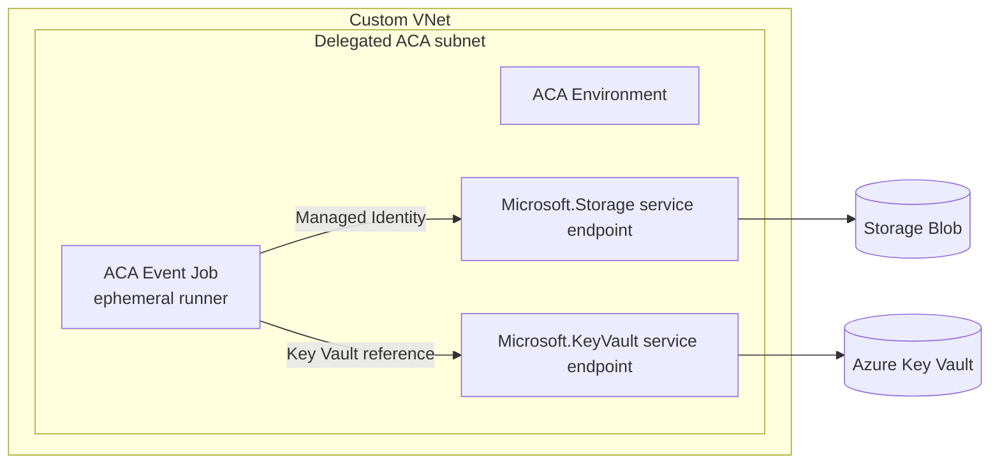

# ACA Service Endpoint Foundation Implementation Plan

> **For agentic workers:** REQUIRED SUB-SKILL: Use superpowers:subagent-driven-development (recommended) or superpowers:executing-plans to implement this plan task-by-task. Steps use checkbox (`- [ ]`) syntax for tracking.

**Goal:** Replace the workshop's Blob and Key Vault Private Endpoint/Private DNS foundation with ACA-subnet service endpoints and resource firewall rules while reducing Module 02 to seven required steps.

**Architecture:** The single delegated `snet-aca-infra` subnet enables `Microsoft.Storage` and `Microsoft.KeyVault` service endpoints. Storage and Key Vault retain their public service endpoints but use `publicNetworkAccess=Enabled`, `defaultAction=Deny`, `bypass=None`, one ACA subnet rule, managed identity authentication, and resource-scoped RBAC.

**Tech Stack:** Markdown, Mermaid, Bash/Azure CLI, GitHub Actions YAML, Python 3 workflow contract tests

**Spec:** `docs/superpowers/specs/2026-08-22-aca-service-endpoint-foundation-design.md`

## Global Constraints

- The custom VNet contains only the delegated `snet-aca-infra` workshop subnet.
- `snet-aca-infra` must enable both `Microsoft.Storage` and `Microsoft.KeyVault` service endpoints.
- Storage and Key Vault must use `publicNetworkAccess=Enabled`, `defaultAction=Deny`, `bypass=None`, and a virtual network rule for `SUBNET_ID`.
- The runtime UAMI keeps only `AcrPull` on ACR, `Storage Blob Data Contributor` on Storage, and `Key Vault Secrets User` on Key Vault.
- Module 02 must have seven numbered Cloud Shell steps and no numbered Step 8.
- Do not create or restore a Private Endpoint subnet, Private Endpoints, Private DNS zones, VNet links, zone groups, private IPs, or Private Endpoint CIDR variables.
- ACR, GitHub, ARM, Microsoft Entra ID, and Azure Monitor continue to use public outbound paths.
- Cloud Shell Storage and Key Vault data-plane `403` responses after firewall lockdown are expected; control-plane inspection remains supported.
- Module 04 Key Vault reference synchronization is the live Key Vault network proof.
- Module 06 managed identity Blob upload, download, metadata read, and checksum comparison are the live Storage network proof.
- The updated curriculum is a fresh-deployment path. Participants with the previous Private Endpoint deployment must clean it up and restart with a fresh workshop suffix.
- Keep all executable examples in Azure Cloud Shell Bash syntax and preserve the repository's Korean workshop prose style.

---

## File Structure

- `README.md`: top-level architecture, learning objectives, module summaries, completion checklist, cost model, and references.
- `docs/01-prerequisites-github.md`: provider and Key Vault bootstrap wording before network lockdown.
- `docs/02-azure-foundation.md`: authoritative service endpoint creation, firewall rules, RBAC, seven-step foundation flow, and troubleshooting.
- `docs/03-runner-image.md`: session recovery contract used before image build.
- `docs/04-event-job-keda.md`: ACA Job environment contract, Key Vault reference path, and network troubleshooting.
- `docs/05-parallel-scale-validation.md`: session recovery and Key Vault resolution diagnostics during scale testing.
- `docs/06-azure-sample-deployment.md`: VNet-restricted Blob runtime exercise and control-plane verification.
- `docs/07-security-limitations-cleanup.md`: security model, service endpoint limitations, rotation, cost implications, and cleanup.
- `samples/azure-sample-deploy-workflow.yml`: managed identity Blob data-plane proof without Private DNS/IP assertions.
- `tests/docs/*.sh`: document contracts for README and Modules 01-07.
- `tests/test-artifacts.sh`: static workflow artifact contract.
- `tests/test-workflow-yaml.py`: executable GitHub Actions YAML behavior checks.
- `tests/validate-workshop.sh`: full workshop validator and cross-file required markers.
- `docs/images/02-azure-portal-resource-group-resources.png`: obsolete resource-list screenshot to delete.

---

### Task 1: Replace the Foundation Architecture Contract

**Files:**
- Modify: `tests/docs/test-overview.sh:54-166`
- Modify: `tests/docs/test-prerequisites-foundation.sh:61-165,596-731`
- Modify: `tests/validate-workshop.sh:74-89`
- Modify: `README.md:1-230,260-285`
- Modify: `docs/01-prerequisites-github.md:90-125,340-355,525-540`
- Modify: `docs/02-azure-foundation.md:1-650`
- Delete: `docs/images/02-azure-portal-resource-group-resources.png`

**Interfaces:**
- Consumes: Module 01 outputs `SUFFIX`, `SUBSCRIPTION_ID`, `KEY_VAULT_BOOTSTRAP_PRINCIPAL_ID`, the actual Key Vault name discovered from `$RG`, and secret name `github-app-private-key`.
- Produces: `VNET_ID`, `SUBNET_ID`, `ENV_ID`, `ACR_ID`, `ACR_SERVER`, `STORAGE_ID`, `UAMI_RID`, `UAMI_PID`, `UAMI_CLIENT_ID`, `KEY_VAULT_ID`, and `KEY_VAULT_SECRET_URI`.
- Produces network contract: one ACA subnet with Storage and Key Vault service endpoints; both destination resources allow only `SUBNET_ID`.

- [ ] **Step 1: Rewrite the README and foundation tests to express the new contract**

In `tests/docs/test-prerequisites-foundation.sh`, replace Private Link markers with service endpoint markers and explicit negative assertions:

```bash
for text in \
  'Delegated ACA subnet' \
  'Microsoft.Storage service endpoint' \
  'Microsoft.KeyVault service endpoint' \
  'Storage Blob Data Contributor' \
  'Key Vault Secrets User' \
  'publicNetworkAccess=Enabled' \
  'defaultAction=Deny' \
  'bypass=None'; do
  assert_contains "$architecture_section" "$text" \
    'module 02 service endpoint architecture marker missing'
done

for text in \
  '--service-endpoints Microsoft.Storage Microsoft.KeyVault' \
  'az storage account network-rule add' \
  '--subnet "$SUBNET_ID"' \
  'az keyvault network-rule add' \
  '--public-network-access Enabled' \
  '--default-action Deny' \
  '--bypass None'; do
  assert_contains "$FOUNDATION_TEXT" "$text" \
    'module 02 service endpoint command missing'
done

numbered_step_count="$(grep -Ec '^## [1-7]\. ' "$FOUNDATION")"
[[ "$numbered_step_count" -eq 7 ]] ||
  fail "module 02 must contain exactly seven numbered steps"

for forbidden in \
  'snet-private-endpoints' \
  'PE_SUBNET' \
  'STORAGE_PE' \
  'KEY_VAULT_PE' \
  'PRIVATE_ENDPOINT_CIDR' \
  'az network private-endpoint' \
  'az network private-dns' \
  'privatelink.blob.core.windows.net' \
  'privatelink.vaultcore.azure.net' \
  '## 8. '; do
  if grep -F -- "$forbidden" "$FOUNDATION" >/dev/null; then
    fail "module 02 still contains obsolete Private Link contract: $forbidden"
  fi
done
```

Add an ordering assertion that verifies the Step 7 network and role checks occur before bootstrap permission removal:

```bash
keyvault_rule_line="$(grep -nF 'az keyvault network-rule add' "$FOUNDATION" | head -n1 | cut -d: -f1)"
role_check_line="$(grep -nF 'az role assignment list' "$FOUNDATION" | tail -n1 | cut -d: -f1)"
bootstrap_delete_line="$(grep -nF 'az role assignment delete' "$FOUNDATION" | tail -n1 | cut -d: -f1)"
[[ "$keyvault_rule_line" -lt "$role_check_line" &&
   "$role_check_line" -lt "$bootstrap_delete_line" ]] ||
  fail 'module 02 must verify runtime access before deleting bootstrap access'
```

In `tests/docs/test-overview.sh`, require these README markers:

```bash
'Microsoft.Storage service endpoint'
'Microsoft.KeyVault service endpoint'
'Storage firewall: default deny'
'Key Vault firewall: default deny'
'standard public DNS'
'Storage Blob Data Contributor'
'Key Vault Secrets User'
'| 02 | [Azure 기반 리소스 준비](docs/02-azure-foundation.md) | Custom VNet ACA Environment, Storage·Key Vault service endpoint와 runtime RBAC | 30분 |'
'| 06 | [VNet 제한 Blob 배포와 결과 확인](docs/06-azure-sample-deployment.md) | Managed Identity 기반 Blob 업로드·다운로드와 checksum 검증 | 20분 |'
```

Remove cost assertions for Blob and Key Vault Private Endpoints. Require a no-extra-charge service endpoint row instead:

```bash
require '| Virtual network service endpoint | 추가 요금 없음 |' \
  'README cost table missing service endpoint row'
```

In `tests/validate-workshop.sh`, replace the required
`privatelink.vaultcore.azure.net` marker with:

```bash
'Microsoft.Storage'
'Microsoft.KeyVault'
'az keyvault network-rule add'
```

- [ ] **Step 2: Run the rewritten foundation tests and confirm they fail against the old documentation**

Run:

```bash
bash tests/docs/test-overview.sh
bash tests/docs/test-prerequisites-foundation.sh
```

Expected: both commands fail because README and Module 02 still describe Private Endpoints, Private DNS, and numbered Step 8.

- [ ] **Step 3: Rewrite Module 02 around one subnet and seven numbered steps**

In Step 1, remove all Private Endpoint and Private DNS names. Keep only the names needed by later modules:

```bash
LOC=koreacentral
RG="rg-acarunner-$SUFFIX"
LOG="log-acarunner-$SUFFIX"
ENV="env-acarunner-$SUFFIX"
VNET="vnet-acarunner-$SUFFIX"
INFRA_SUBNET="snet-aca-infra"
ACR="acracarunner$SUFFIX"
STORAGE="stacarunner$SUFFIX"
STORAGE_CONTAINER="runner-artifacts"
UAMI="id-acarunner-$SUFFIX"
GITHUB_APP_KEY_SECRET="github-app-private-key"
```

In Step 3, create only the ACA subnet and configure its delegation and both service endpoints:

```bash
az network vnet create \
  --resource-group "$RG" \
  --name "$VNET" \
  --location "$LOC" \
  --address-prefixes 10.20.0.0/16 \
  --output none

az network vnet subnet create \
  --resource-group "$RG" \
  --vnet-name "$VNET" \
  --name "$INFRA_SUBNET" \
  --address-prefixes 10.20.0.0/27 \
  --output none

az network vnet subnet update \
  --resource-group "$RG" \
  --vnet-name "$VNET" \
  --name "$INFRA_SUBNET" \
  --delegations Microsoft.App/environments \
  --service-endpoints Microsoft.Storage Microsoft.KeyVault \
  --output none

VNET_ID=$(az network vnet show \
  --resource-group "$RG" \
  --name "$VNET" \
  --query id \
  --output tsv)
SUBNET_ID=$(az network vnet subnet show \
  --resource-group "$RG" \
  --vnet-name "$VNET" \
  --name "$INFRA_SUBNET" \
  --query id \
  --output tsv)
```

Validate the subnet without treating service endpoints as private IP resources:

```bash
az network vnet subnet show \
  --resource-group "$RG" \
  --vnet-name "$VNET" \
  --name "$INFRA_SUBNET" \
  --query "{delegation:delegations[].serviceName,serviceEndpoints:serviceEndpoints[].service,id:id}" \
  --output json
```

In Step 6, create Storage, create the container through the management plane, and add only the ACA subnet:

```bash
az storage account create \
  --resource-group "$RG" \
  --name "$STORAGE" \
  --location "$LOC" \
  --sku Standard_LRS \
  --kind StorageV2 \
  --min-tls-version TLS1_2 \
  --allow-blob-public-access false \
  --allow-shared-key-access false \
  --public-network-access Enabled \
  --default-action Deny \
  --bypass None \
  --output none

STORAGE_ID=$(az storage account show \
  --resource-group "$RG" \
  --name "$STORAGE" \
  --query id \
  --output tsv)

az storage container-rm create \
  --resource-group "$RG" \
  --storage-account "$STORAGE" \
  --name "$STORAGE_CONTAINER" \
  --public-access off \
  --output none

az storage account network-rule add \
  --resource-group "$RG" \
  --account-name "$STORAGE" \
  --subnet "$SUBNET_ID" \
  --output none

az storage account show \
  --resource-group "$RG" \
  --name "$STORAGE" \
  --query "{publicNetworkAccess:publicNetworkAccess,defaultAction:networkRuleSet.defaultAction,bypass:networkRuleSet.bypass,vnetRules:networkRuleSet.virtualNetworkRules[].{id:virtualNetworkResourceId,state:state},allowSharedKeyAccess:allowSharedKeyAccess,allowBlobPublicAccess:allowBlobPublicAccess}" \
  --output json
```

Merge all runtime identity and Key Vault work into Step 7. Assign the three roles, add the Key Vault subnet rule, enforce the firewall, verify, and only then remove bootstrap access:

```bash
az role assignment create \
  --assignee-object-id "$UAMI_PID" \
  --assignee-principal-type ServicePrincipal \
  --role "Key Vault Secrets User" \
  --scope "$KEY_VAULT_ID" \
  --output none

az keyvault network-rule add \
  --resource-group "$RG" \
  --name "$KEY_VAULT" \
  --subnet "$SUBNET_ID"

az keyvault update \
  --resource-group "$RG" \
  --name "$KEY_VAULT" \
  --public-network-access Enabled \
  --default-action Deny \
  --bypass None \
  --output none

KEY_VAULT_SECRET_URI="https://$KEY_VAULT.vault.azure.net/secrets/$GITHUB_APP_KEY_SECRET"

az keyvault show \
  --resource-group "$RG" \
  --name "$KEY_VAULT" \
  --query "{publicNetworkAccess:properties.publicNetworkAccess,defaultAction:properties.networkAcls.defaultAction,bypass:properties.networkAcls.bypass,vnetRules:properties.networkAcls.virtualNetworkRules[].{id:id,ignoreMissingVnetServiceEndpoint:ignoreMissingVnetServiceEndpoint}}" \
  --output json

az role assignment list \
  --assignee "$UAMI_PID" \
  --all \
  --query "[?scope=='$ACR_ID' || scope=='$STORAGE_ID' || scope=='$KEY_VAULT_ID'].{role:roleDefinitionName,principalType:principalType,scope:scope}" \
  --output table

az role assignment delete \
  --assignee "$KEY_VAULT_BOOTSTRAP_PRINCIPAL_ID" \
  --role "Key Vault Secrets Officer" \
  --scope "$KEY_VAULT_ID"
unset KEY_VAULT_BOOTSTRAP_PRINCIPAL_ID
```

End Module 02 after Step 7. Replace `## 8-L` with an unnumbered optional heading such as:

```markdown
## 선택: Local workstation의 원본 PEM 삭제
```

Explain that Cloud Shell data-plane `403` responses are expected after Steps 6 and 7. Remove the stale Portal screenshot and leave a text-only resource list containing ACR, ACA Environment, one VNet/subnet, Storage, Key Vault, managed identity, and Log Analytics.

Add a warning that the revised instructions are for a fresh foundation. A
participant who already created the old PE subnet, Private Endpoints, or
Private DNS links must complete Module 07 cleanup and restart with a fresh
suffix rather than mixing both architectures.

- [ ] **Step 4: Update README and Module 01 to match the new architecture**

Rewrite the README Mermaid diagram so Storage and Key Vault sit outside the VNet and the ACA Job edges are labeled with service endpoint plus managed identity:



State these distinctions explicitly:

```markdown
- Storage와 Key Vault의 표준 DNS 이름은 public service IP로 해석됩니다.
- public service endpoint는 유지되지만 `defaultAction=Deny`, `bypass=None`, ACA subnet rule로 data-plane 접근을 제한합니다.
- service endpoint는 Private Link가 아니며 private IP를 만들지 않습니다.
```

Update the learning objectives, Module 02 and Module 06 rows, completion checklist, live-validation caveat, cost table, troubleshooting index, and Microsoft Learn links. Remove Private Endpoint and Private DNS cost rows. Add a service endpoint row with no additional endpoint charge.

In Module 01, change provider explanations from Private Endpoint/Private DNS provisioning to VNet, subnet delegation, service endpoint, Storage, and Key Vault provisioning. Change the Key Vault bootstrap description so Module 02 later applies an ACA subnet rule and `defaultAction=Deny`; do not claim Module 02 disables public network access.

- [ ] **Step 5: Delete the obsolete Portal screenshot**

Delete only:

```text
docs/images/02-azure-portal-resource-group-resources.png
```

Confirm no remaining reference:

```bash
if rg -n '02-azure-portal-resource-group-resources\.png' README.md docs tests; then
  exit 1
fi
```

Expected: `rg` returns no matches.

- [ ] **Step 6: Run the foundation tests and verify they pass**

Run:

```bash
bash tests/docs/test-overview.sh
bash tests/docs/test-prerequisites-foundation.sh
bash tests/docs/test-module02-keyvault-restore.sh
```

Expected:

```text
PASS: README contract
PASS: prerequisites and foundation docs
PASS: Module 02 resolves the actual Key Vault
```

- [ ] **Step 7: Commit the foundation rewrite**

```bash
git add README.md \
  docs/01-prerequisites-github.md \
  docs/02-azure-foundation.md \
  docs/images/02-azure-portal-resource-group-resources.png \
  tests/docs/test-overview.sh \
  tests/docs/test-prerequisites-foundation.sh \
  tests/validate-workshop.sh
git commit -m "docs: replace Private Link foundation with service endpoints" \
  -m "Co-authored-by: Copilot <223556219+Copilot@users.noreply.github.com>"
```

---

### Task 2: Remove Private Link State from Modules 03-05

**Files:**
- Modify: `tests/docs/test-build-deploy.sh:35-80`
- Modify: `tests/docs/test-scale-validation.sh:30-75`
- Modify: `docs/03-runner-image.md:30-110`
- Modify: `docs/04-event-job-keda.md:1-150,195-275,370-386`
- Modify: `docs/05-parallel-scale-validation.md:25-115,505-570`

**Interfaces:**
- Consumes from Task 1: `INFRA_SUBNET="snet-aca-infra"` and `SUBNET_ID`; no PE subnet or DNS variables exist.
- Produces for Module 06: ACA Job environment variables `AZURE_CLIENT_ID`, `AZURE_SUBSCRIPTION_ID`, `AZURE_RESOURCE_GROUP`, `AZURE_CONTAINERAPPS_ENVIRONMENT`, `AZURE_STORAGE_ACCOUNT`, and `AZURE_STORAGE_CONTAINER`.
- Produces Key Vault runtime contract: `github-app-private-key=keyvaultref:$KEY_VAULT_SECRET_URI,identityref:$UAMI_RID`.

- [ ] **Step 1: Update Module 03-05 tests to reject obsolete variables**

In `tests/docs/test-build-deploy.sh`, require `SUBNET_ID` recovery and remove the CIDR environment contract:

```bash
for text in \
  'INFRA_SUBNET="snet-aca-infra"' \
  'SUBNET_ID=$(az network vnet subnet show' \
  'STORAGE="stacarunner$SUFFIX"' \
  'STORAGE_CONTAINER="runner-artifacts"' \
  'STORAGE_ID=$(az storage account show'; do
  assert_contains "$ALL_TEXT" "$text" \
    'module 03/04 service endpoint recovery marker missing'
done

for text in \
  'AZURE_STORAGE_ACCOUNT' \
  'AZURE_STORAGE_CONTAINER' \
  'Jobs do not support ingress' \
  'Microsoft.Storage' \
  'Microsoft.KeyVault'; do
  assert_contains "$JOB_TEXT" "$text" \
    'module 04 service endpoint marker missing'
done

for forbidden in \
  'PE_SUBNET' \
  'STORAGE_PE' \
  'KEY_VAULT_PE' \
  'STORAGE_DNS_ZONE' \
  'KEY_VAULT_DNS_ZONE' \
  'PRIVATE_ENDPOINT_CIDR' \
  'AZURE_PRIVATE_ENDPOINT_CIDR' \
  'privatelink.'; do
  if grep -F -- "$forbidden" "$IMAGE_DOC" "$JOB_DOC" >/dev/null; then
    fail "module 03/04 still contains obsolete Private Link state: $forbidden"
  fi
done
```

Replace the Key Vault troubleshooting assertion with wording that requires:

```text
Module 02의 `Microsoft.KeyVault` service endpoint, Key Vault ACA subnet rule, `defaultAction=Deny`, `bypass=None`, `Key Vault Secrets User`
```

In `tests/docs/test-scale-validation.sh`, require `SUBNET_ID`, Storage/Key Vault service endpoint wording, and reject the same Private Link variables and `AZURE_PRIVATE_ENDPOINT_CIDR`.

- [ ] **Step 2: Run the Module 03-05 tests and confirm they fail**

Run:

```bash
bash tests/docs/test-build-deploy.sh
bash tests/docs/test-scale-validation.sh
```

Expected: both fail because Modules 03-05 still restore PE/DNS variables and Module 04 still passes `AZURE_PRIVATE_ENDPOINT_CIDR`.

- [ ] **Step 3: Simplify Module 03 recovery**

Replace the Private Link recovery values with the ACA subnet:

```bash
VNET="vnet-acarunner-$SUFFIX"
INFRA_SUBNET="snet-aca-infra"
STORAGE="stacarunner$SUFFIX"
STORAGE_CONTAINER="runner-artifacts"
KEY_VAULT="kvacarunner$SUFFIX"
GITHUB_APP_KEY_SECRET="github-app-private-key"
UAMI="id-acarunner-$SUFFIX"
JOB="job-ghrunner-$SUFFIX"
```

Restore and export `SUBNET_ID` instead of `PE_SUBNET_ID`:

```bash
SUBNET_ID=$(az network vnet subnet show \
  --resource-group "$RG" \
  --vnet-name "$VNET" \
  --name "$INFRA_SUBNET" \
  --query id \
  --output tsv)
```

Remove all PE/DNS names and `PRIVATE_ENDPOINT_CIDR` from the `export` command.

- [ ] **Step 4: Update Module 04 network and Job environment contracts**

Describe the network boundary as:

```markdown
Storage와 Key Vault의 표준 public endpoint와 DNS 이름은 유지됩니다. ACA delegated
subnet의 `Microsoft.Storage`·`Microsoft.KeyVault` service endpoint가 Azure backbone
경로와 subnet identity를 제공하고, 각 resource firewall은 ACA subnet rule만 허용합니다.
```

Keep public outbound for GitHub, ACR, identity, ARM, and Monitor. State that service endpoint DNS resolves public service IPs and must not be validated as a private IP.

Use `SUBNET_ID` in recovery and remove all PE/DNS variables.

Remove the Job argument:

```bash
"AZURE_PRIVATE_ENDPOINT_CIDR=$PRIVATE_ENDPOINT_CIDR"
```

The remaining Blob inputs must be:

```bash
"AZURE_STORAGE_ACCOUNT=$STORAGE"
"AZURE_STORAGE_CONTAINER=$STORAGE_CONTAINER"
```

Rewrite Key Vault reference troubleshooting in this order:

1. `identityref:$UAMI_RID` is attached to the Job.
2. UAMI has `Key Vault Secrets User` at `$KEY_VAULT_ID`.
3. `snet-aca-infra` has `Microsoft.KeyVault`.
4. Key Vault has the `$SUBNET_ID` rule.
5. Key Vault reports `publicNetworkAccess=Enabled`, `defaultAction=Deny`, and `bypass=None`.
6. `KEY_VAULT_SECRET_URI` points to the existing secret.

- [ ] **Step 5: Update Module 05 recovery and failure diagnostics**

Restore `SUBNET_ID`, Storage, and Key Vault IDs without any PE/DNS variables. Replace:

```text
AZURE_STORAGE_ACCOUNT, AZURE_STORAGE_CONTAINER, AZURE_PRIVATE_ENDPOINT_CIDR
```

with:

```text
AZURE_STORAGE_ACCOUNT, AZURE_STORAGE_CONTAINER
```

Rewrite the Key Vault resolution memo and troubleshooting table to check the service endpoint, Key Vault subnet rule, `publicNetworkAccess=Enabled`, `defaultAction=Deny`, `bypass=None`, and `Key Vault Secrets User`. Preserve the existing `401`/`403`, App ID, installation ID, KEDA auth, and runner lifecycle diagnostics.

- [ ] **Step 6: Run the Module 03-05 tests and verify they pass**

Run:

```bash
bash tests/docs/test-build-deploy.sh
bash tests/docs/test-scale-validation.sh
bash tests/docs/test-runner-image.sh
```

Expected:

```text
PASS: build and deploy docs
PASS: scale validation doc
PASS: runner image doc
```

- [ ] **Step 7: Commit the downstream variable contract**

```bash
git add docs/03-runner-image.md \
  docs/04-event-job-keda.md \
  docs/05-parallel-scale-validation.md \
  tests/docs/test-build-deploy.sh \
  tests/docs/test-scale-validation.sh
git commit -m "docs: simplify runner modules for service endpoints" \
  -m "Co-authored-by: Copilot <223556219+Copilot@users.noreply.github.com>"
```

---

### Task 3: Replace Private DNS Proof with VNet-Restricted Blob Runtime Proof

**Files:**
- Modify: `tests/test-artifacts.sh:12-36`
- Modify: `tests/test-workflow-yaml.py:42-260`
- Modify: `tests/docs/test-azure-sample-deployment.sh:20-105`
- Modify: `samples/azure-sample-deploy-workflow.yml:1-165`
- Modify: `docs/06-azure-sample-deployment.md:1-530`

**Interfaces:**
- Consumes from Task 2: `AZURE_CLIENT_ID`, `AZURE_SUBSCRIPTION_ID`, `AZURE_RESOURCE_GROUP`, `AZURE_STORAGE_ACCOUNT`, and `AZURE_STORAGE_CONTAINER`.
- Produces runtime evidence: successful managed identity login, Blob upload, Blob download, metadata read, and matching source/downloaded/metadata SHA-256 values.
- Produces control-plane evidence: `SUBNET_ID` has `Microsoft.Storage`; Storage firewall allows `SUBNET_ID` and reports `Enabled/Deny/None`.

- [ ] **Step 1: Rewrite the workflow and Module 06 tests**

In `tests/test-artifacts.sh`, require:

```bash
'name: ACA Runner VNet-Restricted Blob Deploy'
'deploy-vnet-restricted-blob:'
'AZURE_STORAGE_ACCOUNT'
'AZURE_STORAGE_CONTAINER'
'az storage blob upload'
'az storage blob download'
'--auth-mode login'
'sha256sum'
```

Reject:

```bash
'AZURE_PRIVATE_ENDPOINT_CIDR'
'privatelink.blob.core.windows.net'
'private IP'
'Verify Blob DNS resolves to the private endpoint subnet'
```

In `tests/test-workflow-yaml.py`:

- Load `jobs["deploy-vnet-restricted-blob"]`.
- Require only these steps:

```python
required_step_names = {
    "Validate runner inputs",
    "Sign in to Azure with managed identity",
    "Upload and download the VNet-restricted Blob artifact",
    "Show VNet-restricted deployment result",
}
```

- Remove the `getent` mock, `ipaddress` assertion, DNS script extraction, `AZURE_PRIVATE_ENDPOINT_CIDR`, and all private/public/unresolved DNS cases.
- Keep the leaked GitHub App environment failure test.
- Keep the checksum mismatch test and the requirement that every Blob command includes `--auth-mode login`.
- Add a static rejection:

```python
workflow_text = WORKFLOW.read_text(encoding="utf-8")
for obsolete in (
    "AZURE_PRIVATE_ENDPOINT_CIDR",
    "privatelink.blob.core.windows.net",
    "Verify Blob DNS resolves to the private endpoint subnet",
):
    if obsolete in workflow_text:
        fail(f"workflow contains obsolete Private DNS contract: {obsolete}")
```

In `tests/docs/test-azure-sample-deployment.sh`, require the revised headings:

```text
# 06. VNet 제한 Blob 배포와 결과 확인
## 1. Storage service endpoint, firewall, RBAC 확인
## 2. VNet 제한 Blob workflow를 GitHub에 생성
## 3. GitHub Actions에서 Blob artifact 배포 실행
## 4. Blob checksum과 network boundary 결과 해석
## 5. Cloud Shell과 Azure Portal에서 control-plane 확인
```

Require `Microsoft.Storage`, `SUBNET_ID`, `virtualNetworkRules`, `bypass`, and Cloud Shell `403` guidance. Reject the Private Link variables, DNS zone, CIDR, and private IP language.

- [ ] **Step 2: Run the workflow tests and confirm they fail**

Run:

```bash
bash tests/test-artifacts.sh
python3 tests/test-workflow-yaml.py
bash tests/docs/test-azure-sample-deployment.sh
```

Expected: all three fail because the checked-in workflow and Module 06 still require Private DNS and `AZURE_PRIVATE_ENDPOINT_CIDR`.

- [ ] **Step 3: Simplify the sample workflow**

Rename the workflow and job:

```yaml
name: ACA Runner VNet-Restricted Blob Deploy

jobs:
  deploy-vnet-restricted-blob:
    runs-on: [aca-runner]
    timeout-minutes: 10
```

Validate only the remaining Azure inputs:

```bash
for variable in \
  AZURE_CLIENT_ID \
  AZURE_SUBSCRIPTION_ID \
  AZURE_RESOURCE_GROUP \
  AZURE_STORAGE_ACCOUNT \
  AZURE_STORAGE_CONTAINER; do
  if [[ -z "${!variable:-}" ]]; then
    printf 'ERROR: %s is required.\n' "$variable" >&2
    exit 1
  fi
done
```

Delete the complete DNS step. Rename the Blob step to:

```yaml
- name: Upload and download the VNet-restricted Blob artifact
```

Keep the existing file creation, Blob path, metadata, upload, download, and three-way checksum comparison. Rename the final step and print a standard endpoint without claiming a private IP:

```bash
printf 'Blob endpoint: https://%s.blob.core.windows.net/%s/%s\n' \
  "$AZURE_STORAGE_ACCOUNT" "$AZURE_STORAGE_CONTAINER" "$BLOB_NAME"
printf 'SHA-256: %s\n' "$SOURCE_SHA256"
```

- [ ] **Step 4: Rewrite Module 06 around service endpoint control-plane checks**

Restore `INFRA_SUBNET` and `SUBNET_ID`; remove every PE/DNS/CIDR variable.

In Section 1, validate the subnet and Storage account:

```bash
az network vnet subnet show \
  --resource-group "$RG" \
  --vnet-name "$VNET" \
  --name "$INFRA_SUBNET" \
  --query "{id:id,delegation:delegations[].serviceName,serviceEndpoints:serviceEndpoints[].service}" \
  --output json

az storage account show \
  --resource-group "$RG" \
  --name "$STORAGE" \
  --query "{name:name,publicNetworkAccess:publicNetworkAccess,defaultAction:networkRuleSet.defaultAction,bypass:networkRuleSet.bypass,vnetRules:networkRuleSet.virtualNetworkRules[].{id:virtualNetworkResourceId,state:state},allowBlobPublicAccess:allowBlobPublicAccess,allowSharedKeyAccess:allowSharedKeyAccess}" \
  --output json

az role assignment list \
  --assignee "$UAMI_PID" \
  --scope "$STORAGE_ID" \
  --query "[?roleDefinitionName=='Storage Blob Data Contributor'].{role:roleDefinitionName,scope:scope}" \
  --output table
```

Expected interpretation:

- subnet contains `Microsoft.Storage`
- Storage reports `publicNetworkAccess=Enabled`
- Storage reports `defaultAction=Deny`
- Storage reports `bypass=None`
- virtual network rule ID equals `SUBNET_ID` and state is `Succeeded`
- shared key and public Blob access are both false

Rename the suggested lab workflow path to:

```text
.github/workflows/aca-runner-vnet-blob.yml
```

Keep the embedded YAML disclosure byte-for-byte identical to
`samples/azure-sample-deploy-workflow.yml`.

Explain that Blob data-plane success from the ACA runner, combined with the
control-plane firewall/subnet checks, is the network proof. Do not use DNS
resolution as proof because service endpoint DNS remains public.

In Portal guidance, use:

1. **Virtual network → Subnets → snet-aca-infra → Service endpoints**
2. **Storage account → Networking → Selected virtual networks and IP addresses**
3. **Storage account → Access control (IAM)**

Troubleshooting order:

1. `Microsoft.Storage` missing from the subnet.
2. `$SUBNET_ID` missing or not `Succeeded` in Storage virtual network rules.
3. Storage not `Enabled/Deny/None`.
4. UAMI role absent or not propagated.
5. Public outbound prevents Azure login.

State that Cloud Shell Blob data-plane `403` is expected and must not be worked around with Storage keys, SAS, public IP rules, or `defaultAction=Allow`.

- [ ] **Step 5: Run the workflow and Module 06 tests and verify they pass**

Run:

```bash
bash tests/test-artifacts.sh
python3 tests/test-workflow-yaml.py
bash tests/docs/test-azure-sample-deployment.sh
```

Expected:

```text
PASS: workflow artifacts contract
PASS: workflow YAML syntax and VNet-restricted Blob behavior
PASS: VNet-restricted Blob deployment doc and workflow disclosure
```

- [ ] **Step 6: Confirm the workflow disclosure is still byte-identical**

Run:

```bash
workflow_block="$(
  awk '
    /<summary>.*yml 전체 내용 보기<\/summary>/ { in_summary=1; next }
    in_summary && /^```yaml$/ { in_yaml=1; next }
    in_yaml && /^```$/ { exit }
    in_yaml { print }
  ' docs/06-azure-sample-deployment.md
)"
[[ "$workflow_block" == "$(<samples/azure-sample-deploy-workflow.yml)" ]]
```

Expected: exit code `0`.

- [ ] **Step 7: Commit the runtime proof rewrite**

```bash
git add docs/06-azure-sample-deployment.md \
  samples/azure-sample-deploy-workflow.yml \
  tests/test-artifacts.sh \
  tests/test-workflow-yaml.py \
  tests/docs/test-azure-sample-deployment.sh
git commit -m "docs: validate Blob access through ACA subnet" \
  -m "Co-authored-by: Copilot <223556219+Copilot@users.noreply.github.com>"
```

---

### Task 4: Update Security, Rotation, Cleanup, and Full Validation

**Files:**
- Modify: `tests/docs/test-security-cleanup.sh:15-76`
- Modify: `docs/07-security-limitations-cleanup.md:1-295`
- Modify if required by full validation: `tests/validate-workshop.sh`

**Interfaces:**
- Consumes from Tasks 1-3: public service endpoints with ACA subnet firewall rules, live Key Vault proof in Module 04, and live Blob proof in Module 06.
- Produces final security statement: service endpoints are simpler than Private Link but do not create private IPs; firewall and RBAC enforce the workshop boundary.
- Produces rotation contract: temporarily add the operator IP rule and temporary Key Vault role without changing the permanent ACA subnet rule or weakening default deny.

- [ ] **Step 1: Rewrite the Module 07 test for the service endpoint security model**

Require:

```bash
for text in \
  'Microsoft.Storage' \
  'Microsoft.KeyVault' \
  'service endpoint' \
  'publicNetworkAccess=Enabled' \
  'defaultAction=Deny' \
  'bypass=None' \
  'standard public DNS' \
  'private IP를 만들지 않습니다' \
  'Private Link' \
  'Key Vault Secrets User' \
  'Storage Blob Data Contributor' \
  'Cloud Shell' \
  '403' \
  'ResourceGroupNotFound'; do
  assert_contains "$DOC_TEXT" "$text" \
    'module 07 service endpoint security marker missing'
done
```

Reject operational Private Link state:

```bash
for obsolete in \
  'snet-private-endpoints' \
  'privatelink.blob.core.windows.net' \
  'privatelink.vaultcore.azure.net' \
  'PE_SUBNET' \
  'STORAGE_PE' \
  'KEY_VAULT_PE' \
  'public access remains disabled'; do
  if grep -F -- "$obsolete" "$DOC" >/dev/null; then
    fail "module 07 contains obsolete Private Link operation: $obsolete"
  fi
done
```

Update the rotation ordering assertion to require:

```text
새 GitHub App private key
Key Vault Secrets Officer
현재 참가자 IP
새 Key Vault secret version
App JWT
installation token
exact new version URI
successful KEDA/runner execution
remove the IP rule
기존 GitHub App private key
unversioned URI
local PEM file
```

- [ ] **Step 2: Run the security test and confirm it fails**

Run:

```bash
bash tests/docs/test-security-cleanup.sh
```

Expected: FAIL because Module 07 still instructs participants to maintain Private Endpoint/Private DNS paths and disabled Key Vault public access.

- [ ] **Step 3: Rewrite Module 07 security and limitations**

Replace the production comparison rows with:

```markdown
| ACA subnet service endpoints + resource firewall | Private Link, private endpoint, private DNS, centralized egress | service endpoint는 단순하지만 private IP를 만들지 않고 public service endpoint를 유지합니다. |
| Storage/Key Vault `defaultAction=Deny`, `bypass=None` | Azure Policy, access review, diagnostic automation | workshop은 ACA subnet rule 하나만 허용합니다. |
```

State these permanent rules:

```markdown
- Storage와 Key Vault는 `publicNetworkAccess=Enabled`를 유지합니다.
- `defaultAction=Deny`와 `bypass=None`을 유지합니다.
- 허용된 virtual network rule은 `snet-aca-infra` 하나여야 합니다.
- standard DNS는 public service IP를 반환하며, service endpoint는 private IP를 만들지 않습니다.
- data-plane 접근에는 subnet firewall rule과 managed identity RBAC가 모두 필요합니다.
```

Explain the lower isolation level: service endpoints keep traffic on the Azure backbone and identify the source subnet, but they do not provide a dedicated private NIC/IP. Private Link remains the production extension when private-IP-only connectivity is required.

Update Cloud Shell limitations: data-plane `403` is expected because Cloud Shell is outside the ACA subnet; Module 04 and Module 06 are the runtime proofs.

- [ ] **Step 4: Rewrite Key Vault rotation without toggling public network access**

Keep the permanent Key Vault state at `Enabled/Deny/None`. Ask for the
operator's current public IPv4 CIDR and use a temporary IP rule:

```bash
read -rp "Current public IPv4 CIDR for rotation (for example 203.0.113.10/32): " \
  ROTATION_CIDR
[[ "$ROTATION_CIDR" == */32 ]]

az keyvault network-rule add \
  --resource-group "$RG" \
  --name "$KEY_VAULT" \
  --ip-address "$ROTATION_CIDR"
```

After the new secret version, App JWT, installation token, exact version URI, and canary execution succeed, remove only the temporary IP rule:

```bash
az keyvault network-rule remove \
  --resource-group "$RG" \
  --name "$KEY_VAULT" \
  --ip-address "$ROTATION_CIDR"
unset ROTATION_CIDR
```

Then delete the exact temporary `Key Vault Secrets Officer` assignment. Do not remove the ACA subnet rule and do not set `defaultAction=Allow`.

- [ ] **Step 5: Simplify cleanup and troubleshooting**

The Resource Group cleanup inventory must list only:

```text
ACR
ACA Job and Environment
managed identity
Log Analytics workspace
VNet and delegated ACA subnet
Storage account
Key Vault
provider-managed ACA infrastructure
```

Remove Private Endpoint, Private DNS, PE subnet, and related asynchronous deletion wording. Keep the final `ResourceGroupNotFound`, Key Vault purge, GitHub App deletion, stale runner cleanup, and local PEM deletion contracts.

- [ ] **Step 6: Run targeted and full validation**

Run:

```bash
bash tests/docs/test-security-cleanup.sh
bash tests/validate-workshop.sh
```

Expected final lines:

```text
PASS: security cleanup doc
PASS: complete workshop validation
```

Then reject stale operational markers across the active workshop:

```bash
if rg -n \
  'snet-private-endpoints|PE_SUBNET|STORAGE_PE|KEY_VAULT_PE|AZURE_PRIVATE_ENDPOINT_CIDR|PRIVATE_ENDPOINT_CIDR|privatelink\.blob\.core\.windows\.net|privatelink\.vaultcore\.azure\.net|az network private-endpoint|az network private-dns' \
  README.md docs/01-prerequisites-github.md docs/02-azure-foundation.md \
  docs/03-runner-image.md docs/04-event-job-keda.md \
  docs/05-parallel-scale-validation.md docs/06-azure-sample-deployment.md \
  docs/07-security-limitations-cleanup.md samples tests; then
  exit 1
fi
```

Expected: no matches.

Private Link may remain only as explanatory production guidance, not as an operational command, variable, DNS zone, or current-workshop resource.

- [ ] **Step 7: Review the final diff for architecture consistency**

Run:

```bash
git --no-pager diff --check
git --no-pager diff --stat
git --no-pager diff -- \
  README.md docs/01-prerequisites-github.md docs/02-azure-foundation.md \
  docs/03-runner-image.md docs/04-event-job-keda.md \
  docs/05-parallel-scale-validation.md docs/06-azure-sample-deployment.md \
  docs/07-security-limitations-cleanup.md samples tests
```

Confirm:

- Module 02 has exactly seven numbered steps.
- All later modules restore `SUBNET_ID`, not `PE_SUBNET_ID`.
- The ACA Job no longer exports `AZURE_PRIVATE_ENDPOINT_CIDR`.
- Module 06 does not claim DNS/private-IP evidence.
- Module 07 explicitly distinguishes service endpoints from Private Link.
- The deleted Portal screenshot has no reference.

- [ ] **Step 8: Commit the security and cleanup rewrite**

```bash
git add docs/07-security-limitations-cleanup.md \
  tests/docs/test-security-cleanup.sh \
  tests/validate-workshop.sh
git commit -m "docs: align security guidance with service endpoints" \
  -m "Co-authored-by: Copilot <223556219+Copilot@users.noreply.github.com>"
```
