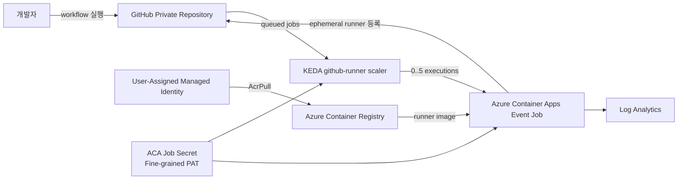

# Azure Container Apps GitHub Actions Runner 워크숍 설계

## 1. 목적

Azure와 GitHub Actions의 기본 사용 경험이 있는 참가자가 Azure Cloud Shell만 사용해 다음 구성을 약 90분 안에 직접 완성한다.

- Private GitHub repository용 self-hosted runner 컨테이너 이미지를 만든다.
- runner를 Azure Container Apps의 event-driven Job으로 배포한다.
- KEDA `github-runner` scaler로 대기 중인 workflow Job 수에 따라 실행 수를 0에서 N까지 자동 조절한다.
- 병렬 workflow로 확장과 실행 종료를 관찰한다.
- CLI와 Log Analytics로 실행 상태 및 로그를 확인한다.
- 실습 리소스를 모두 삭제한다.

워크숍은 Microsoft Community Hub의 "Running GitHub Actions Runners on Azure Container Apps with KEDA Autoscaling" 구성과 최신 Microsoft Learn의 Container Apps Jobs 자습서를 기술 근거로 사용한다. 문서 형식과 학습 흐름은 `freeman9844/ms-aca-basic-workshop01`의 단계별 한국어 핸즈온 스타일을 따른다.

## 2. 대상과 전제

### 대상

- Azure 리소스 그룹, Azure CLI, 컨테이너 이미지의 기본 개념을 아는 참가자
- GitHub repository와 GitHub Actions workflow를 사용해 본 참가자
- 서버나 Kubernetes 클러스터를 직접 운영하지 않고 필요할 때만 실행되는 self-hosted runner를 경험하려는 참가자

### 사전 요구사항

- Contributor 이상 권한이 있는 Azure 구독
- Azure Cloud Shell Bash
- GitHub 계정
- 새 Private GitHub repository를 만들 수 있는 권한
- Fine-grained personal access token을 만들 수 있는 권한

### 명시적 제약

- 실습은 Private repository에서만 수행한다.
- Azure Container Apps Jobs는 Docker-in-Docker를 지원하지 않으므로 workflow에서 `docker build`, Docker service container, Docker daemon 의존 단계를 사용하지 않는다.
- GitHub App, Azure Key Vault, VNet 통합, organization 범위 runner는 운영 환경 확장 항목에서 개념만 설명한다.
- Azure Portal 화면은 보조 확인 수단이며 모든 필수 단계는 Cloud Shell과 GitHub 웹 UI로 완료할 수 있어야 한다.

## 3. 아키텍처



### 구성요소와 책임

| 구성요소 | 책임 | 의존성 |
|---|---|---|
| GitHub Private Repository | workflow, 대기열, runner 등록 상태 관리 | Fine-grained PAT |
| Runner 이미지 | 시작 시 registration token을 받고 Job 하나를 처리한 뒤 종료 | GitHub API, runner 바이너리 |
| Azure Container Registry | runner 이미지 저장 | ACR Tasks, UAMI |
| User-Assigned Managed Identity | 암호 없이 ACR 이미지 pull | `AcrPull` 역할 |
| Azure Container Apps Environment | Job의 보안·네트워크·로그 경계 제공 | Log Analytics |
| Azure Container Apps Event Job | 필요할 때 ephemeral runner execution 실행 | ACR 이미지, ACA secret |
| KEDA `github-runner` scaler | 특정 repository와 label의 queued Job 수 감시 | GitHub PAT |
| Log Analytics | Job 시스템 및 컨테이너 로그 조회 | ACA 환경 진단 설정 |

각 구성요소는 한 가지 책임만 가지며 CLI 조회 명령으로 독립 검증할 수 있게 한다.

## 4. 실행 흐름

1. 참가자가 Private repository와 Fine-grained PAT를 만든다.
2. Azure 리소스 그룹, Log Analytics workspace, Container Apps environment, ACR, UAMI를 만든다.
3. UAMI에 ACR 범위의 `AcrPull` 역할을 할당하고 ACR 관리자 계정이 비활성화된 상태인지 확인한다.
4. ACR Tasks로 runner 이미지를 빌드한다.
5. ACA Event Job을 `min-executions=0`, `max-executions=5`, `polling-interval=30`, `targetWorkflowQueueLength=1`로 만든다.
6. scaler는 하나의 명시적 repository와 `aca-runner` label만 감시한다.
7. runner entrypoint는 PAT로 repository registration token을 발급받고 `--ephemeral --unattended --disableupdate` 옵션과 `aca-runner` label로 runner를 등록한다.
8. GitHub Actions matrix가 네 개의 독립 Job을 `runs-on: [self-hosted, aca-runner]`로 대기시킨다.
9. KEDA가 대기열을 감지해 최대 네 개의 ACA Job execution을 시작한다.
10. 각 execution은 workflow Job 하나를 처리한 뒤 종료한다.
11. 참가자는 GitHub Actions, ACA execution 목록, 컨테이너 로그를 교차 확인한다.
12. 대기 Job이 없어지면 새 execution이 더 생성되지 않으며 active execution 수는 0이 된다. 완료 execution 기록은 조회 이력으로 남을 수 있다.
13. 리소스 그룹을 삭제하고 삭제 완료를 확인한다.

## 5. 인증과 보안

### GitHub 인증

코어 실습은 교육 시간과 설정 복잡도를 줄이기 위해 30일 만료 Fine-grained PAT를 사용한다.

| 권한 | 수준 | 용도 |
|---|---|---|
| Actions | Read-only | workflow run과 queued Job 조회 |
| Administration | Read and write | self-hosted runner registration token 발급 및 runner 관리 |
| Metadata | Read-only | repository 기본 정보 조회 |

PAT는 셸 출력이나 파일에 저장하지 않는다. 참가자가 변수를 설정한 뒤 ACA Job secret로 전달하며, 문서의 예상 출력에도 실제 값이 노출되지 않도록 한다. PAT 만료와 회전 필요성을 명시한다.

### Azure 인증

- ACR 관리자 계정은 비활성화한다.
- UAMI를 runner Job에 연결하고 ACR 범위에만 `AcrPull`을 부여한다.
- ACA 환경의 로그 대상은 `azure-monitor`로 설정하고, 리소스 기반 진단 설정으로 Log Analytics workspace에 연결한다. Shared Key는 사용하지 않는다.
- 워크숍 리소스는 전용 리소스 그룹에 모아 일괄 삭제한다.

### 운영 환경 확장

GitHub App은 PAT보다 높은 API rate limit과 조직 차원의 수명 주기 관리에 유리하다. Key Vault secret reference, VNet 통합, egress 제한, 전용 runner group은 본 실습 이후의 운영 강화 항목으로 설명하되 직접 구성하지 않는다.

## 6. 워크숍 구조

루트 `README.md`는 전체 개요, 아키텍처, 학습 목표, 사전 요구사항, 모듈 목차, 시간표, 비용, 태깅 범례, 트러블슈팅 색인을 제공한다.

각 모듈은 다음 순서를 따른다.

1. 목표
2. 필요 시 변수 재설정
3. 개념 설명
4. 🟢 실행 단계
5. 📋 예상 출력
6. 검증
7. 트러블슈팅
8. 이전/다음 모듈 링크

태그는 다음 의미로 통일한다.

| 태그 | 의미 |
|---|---|
| 🟢 실행 | 참가자가 직접 입력하거나 수행 |
| 👁️ 설명 | 개념 또는 읽기 전용 예시 |
| 📋 예상 출력 | 실제 출력과 비교할 기준 |
| ⚠️ 주의 | 보안, 비용, 제약 사항 |

### 모듈과 시간

| 번호 | 문서 | 내용 | 시간 |
|---|---|---|---:|
| 00 | `README.md` | 전체 개요, 아키텍처, 목표, 시간표 | 5분 |
| 01 | `docs/01-prerequisites-github.md` | Cloud Shell, Azure 구독, Private repo, Fine-grained PAT | 10분 |
| 02 | `docs/02-azure-foundation.md` | RG, Log Analytics, ACA 환경, ACR, UAMI, RBAC | 15분 |
| 03 | `docs/03-runner-image.md` | Dockerfile와 entrypoint 이해, ACR Tasks 빌드 | 10분 |
| 04 | `docs/04-event-job-keda.md` | ACA Event Job, secret, KEDA `github-runner` rule | 15분 |
| 05 | `docs/05-parallel-scale-validation.md` | matrix 4 Job, 0→N→0, GitHub·CLI·로그 검증 | 20분 |
| 06 | `docs/06-security-limitations-cleanup.md` | 보안 확장, 제약, 리소스 삭제 및 검증 | 10분 |
|  |  | 진행 버퍼 | 5분 |
|  |  | **합계** | **90분** |

## 7. 저장소 산출물

```text
.
├── README.md
├── .gitignore
├── docs/
│   ├── 01-prerequisites-github.md
│   ├── 02-azure-foundation.md
│   ├── 03-runner-image.md
│   ├── 04-event-job-keda.md
│   ├── 05-parallel-scale-validation.md
│   └── 06-security-limitations-cleanup.md
├── runner/
│   ├── Dockerfile
│   └── entrypoint.sh
└── samples/
    └── parallel-runner-workflow.yml
```

`.github/workflows/`에 예제를 직접 넣으면 워크숍 저장소 자체에서 불필요한 workflow가 실행될 수 있으므로 배포용 예제는 `samples/parallel-runner-workflow.yml`에 둔다. 참가자는 해당 파일을 자신의 실습 repository의 `.github/workflows/`로 복사한다.

## 8. Runner 이미지 동작

`runner/entrypoint.sh`는 다음 책임만 가진다.

1. 필수 환경 변수와 secret이 존재하는지 검사하고 누락 시 명확한 오류로 종료한다.
2. GitHub REST API로 단기 registration token을 요청한다.
3. 고유 runner 이름을 생성한다.
4. runner를 repository 범위, `aca-runner` label, ephemeral 모드로 등록한다.
5. runner 프로세스를 실행하고 workflow Job의 종료 코드를 반환한다.
6. 정상 종료 또는 종료 신호 시 best-effort로 runner 등록을 정리한다. 정리 실패를 성공으로 위장하지 않고 stderr에 남긴다.

이미지는 Linux x64 runner와 기본적인 shell workflow 실행에 필요한 도구만 포함한다. Docker CLI와 daemon은 포함하지 않는다.

## 9. KEDA와 Job 설정

코어 설정은 다음 의미를 가진다.

| 설정 | 값 | 의미 |
|---|---:|---|
| Trigger type | Event | GitHub 대기열 이벤트 기반 실행 |
| Minimum executions | 0 | 대기 Job이 없으면 active execution 없음 |
| Maximum executions | 5 | 실습 중 과도한 동시 실행과 비용 방지 |
| Polling interval | 30초 | 반응 속도와 GitHub API 호출량의 균형 |
| Target workflow queue length | 1 | 대기 Job 하나당 runner 하나 |
| Runner scope | repo | 실습 repository에만 등록 |
| Repositories | 단일 repo 명시 | organization 전체 탐색과 API 호출 방지 |
| Labels | `aca-runner` | 해당 runner용 workflow만 확장 |
| Replica retry limit | 0 | 실패 원인을 재시도로 숨기지 않음 |
| Replica completion count | 1 | execution 하나가 runner 하나를 완료 |
| Parallelism | 1 | execution과 workflow Job의 1:1 관계 유지 |

## 10. 실패 처리와 트러블슈팅

문서는 다음 실패를 반드시 다룬다.

| 증상 | 주요 원인 | 검증 방향 |
|---|---|---|
| workflow가 계속 queued | label 불일치, scaler repo 설정 오류, PAT 권한 오류 | workflow `runs-on`, Job scale rule, secret 확인 |
| GitHub API 401/403 | PAT 오입력, 만료, 권한 부족 | token 재발급과 최소 권한 확인 |
| Job execution이 생성되지 않음 | KEDA metadata 또는 auth reference 오류 | Job scale configuration 조회 |
| Image pull 실패 | UAMI 미연결, `AcrPull` 누락, 이미지 tag 오류 | identity, role assignment, ACR repository 조회 |
| runner 설정 단계 실패 | registration token URL 또는 repository URL 오류 | execution console log 확인 |
| execution timeout | workflow가 제한 시간보다 오래 실행 | workflow와 `replica-timeout` 비교 |
| Docker 단계 실패 | ACA Jobs의 Docker-in-Docker 미지원 | workflow에서 Docker 의존 단계 제거 |
| runner가 GitHub에 남음 | 비정상 종료 중 정리 실패 | ephemeral runner 상태 확인 후 수동 제거 |
| 예상보다 API 호출이 많음 | owner 전체 조회, 짧은 polling interval | 단일 repo 지정, 30초 유지, GitHub App 검토 |

명령은 잘못된 입력을 성공처럼 처리하지 않는다. 필수 값이 없으면 즉시 실패하고, 참가자가 확인할 다음 조회 명령을 함께 제공한다.

## 11. 검증 계획

### 정적 검증

- `bash -n runner/entrypoint.sh`
- Markdown 링크와 모듈 이전/다음 연결 확인
- 모든 셸 변수가 최초 정의 또는 재설정 블록에서 제공되는지 확인
- 예제 출력에 실제 PAT나 subscription 정보가 포함되지 않았는지 확인

### Azure 빌드 검증

- `az acr build`로 runner 이미지가 성공적으로 빌드되는지 확인
- ACR repository에 기대한 image tag가 존재하는지 확인
- ACR 관리자 계정이 비활성화되어 있는지 확인
- UAMI의 `AcrPull` 역할을 확인

### End-to-end 리허설

1. 배포 직후 active Job execution이 없는지 확인한다.
2. matrix 크기 4의 workflow를 실행한다.
3. 네 workflow Job이 모두 `aca-runner` label의 self-hosted runner에서 성공하는지 확인한다.
4. 실행 중 active ACA Job execution 수가 증가하는지 확인한다.
5. 완료 뒤 active execution 수가 0이며 완료 이력이 남는지 확인한다.
6. runner 로그에서 등록, Job 수신, 완료, 종료 순서를 확인한다.
7. GitHub runner 목록에 지속적으로 online인 runner가 남지 않는지 확인한다.
8. 리소스 그룹 삭제 후 `ResourceGroupNotFound`를 확인한다.

## 12. 성공 기준

워크숍은 다음 조건을 모두 만족할 때 완료된다.

- 참가자가 별도 로컬 Docker 또는 Kubernetes 도구 없이 Cloud Shell에서 전체 구성을 완료한다.
- GitHub Actions matrix의 네 Job이 ACA의 ephemeral self-hosted runner에서 성공한다.
- KEDA가 대기열에 따라 active execution 수를 0에서 N으로 늘리고, 처리 완료 뒤 새 execution 생성을 멈춘다.
- ACR 접근은 UAMI와 `AcrPull`을 사용하며 관리자 자격증명을 사용하지 않는다.
- PAT가 출력이나 저장소 파일에 노출되지 않는다.
- 참가자가 실패 원인을 CLI와 로그로 진단할 수 있다.
- 정리 모듈에서 모든 Azure 리소스의 삭제를 확인한다.

## 13. 참고 자료

- [Running GitHub Actions Runners on Azure Container Apps with KEDA Autoscaling](https://techcommunity.microsoft.com/blog/azureinfrastructureblog/running-github-actions-runners-on-azure-container-apps-with-keda-autoscaling/4512980)
- [Tutorial: Run GitHub Actions runners with Azure Container Apps jobs](https://learn.microsoft.com/azure/container-apps/tutorial-ci-cd-runners-jobs?pivots=container-apps-jobs-self-hosted-ci-cd-github-actions)
- [Jobs in Azure Container Apps](https://learn.microsoft.com/azure/container-apps/jobs)
- [KEDA GitHub Runner scaler](https://keda.sh/docs/latest/scalers/github-runner/)
- [참고 문서 스타일: ms-aca-basic-workshop01](https://github.com/freeman9844/ms-aca-basic-workshop01)
